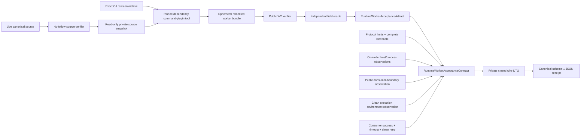

# RuntimeWorker Acceptance Contract

## Purpose and Scope

`Acceptance/RuntimeWorker` is the RT4 host-process/protocol acceptance package
for ADR-0015. It is a separate Swift package under that directory; it is not a
target or product of the parent `swift-mojo` package. The package has two
explicit boundaries: the side-effect-free schema authority
`RuntimeWorkerAcceptanceContract`, and the RT4.B host controller/runner that
exercises a separately built public-only consumer target.

The contract side owns one closed schema-1 receipt. The RT4.B side owns the
source fixture, a lightweight source-authority bootstrap, pinned authoring
orchestration, public verifier-to-contract projection check, relocated
consumer process, and temporary-directory/process observations. The bootstrap
is a separate executable over the standalone SourceIdentity module and cannot
import or compile the worker, command, or SwiftSyntax graph. RT4.B deliberately
produces a non-receipt run report: the
controller holds it in memory and the runner emits it as ephemeral sorted JSON;
receipt encoding/persistence is a later evidence step owned by the receipt
authority's caller. The public receipt is intentionally not `Codable`: a private
closed wire DTO is used so `encoded()` and `decodeCanonical(_:)` remain the only
receipt codec authority.

`RuntimeWorkerAcceptanceRunReport` is the lossless material handoff for that
later step. It contains the canonical source-identity algorithm and digest,
one canonical `Artifact`, `ProtocolRecord`, `ConsumerBoundary`,
`ExecutionEnvironment`, and `Lifecycle`, plus only the derived projection
count, exact Float32 bit-pattern diagnostics, typed forced failure code, and
stage/process leak counts. The report is `Codable` for the ephemeral handoff;
it is not a receipt and does not add a second codec or persistence authority.

## Responsibilities and Boundaries

The contract boundary owns:

- the exact top-level receipt key set and schema/status/evidence-scope rules;
- strict decoding, canonical encoding, and nested closed-record validation;
- lossless typed projection of all public W2 worker-verification fields;
- the fixed protocol-v1 limit and ten-message-kind record;
- typed host, consumer-boundary, execution-environment, and lifecycle evidence;
- the rule that a passed receipt requires observed host process/protocol
  evidence and complete lifecycle evidence.

The RT4.B boundary owns:

- the canonical Swift binding and Mojo source fixture, with no checked-in
  generated binaries or bundles;
- the public acceptance-source identity, including its versioned algorithm and
  closed repository-relative inventory;
- a verified read-only private snapshot as the only RT4.B source input;
- an exact Git-revision archive as the only parent `swift-mojo` build input;
- a live-only bootstrap build arena that is never reused by evidence builds;
- one initially empty, verified-only build arena and one Acceptance SwiftPM
  graph reused in fixed order by the execution runner, model command-plugin
  tool, and public-only consumer builds;
- exact pinned compiler activation and runtime-library selection for authoring;
- public `verifyWorkerBundle(at:)` projection and an independent field oracle;
- the clean-environment consumer launch, typed lifecycle exercise, and report;
- acceptance-owned temporary staging/process observations and leak rejection.

Neither boundary owns:

- worker transport, its POSIX operations, or private worker lifecycle (these
  belong to `MojoRuntimeWorker`; acceptance-owned filesystem/process evidence
  uses a separate internal adapter);
- arbitrary process launching outside the one fixed consumer executable;
- MAX device or kernel execution, training, performance, or physical HIL
  claims;
- Manas or Kuyu policy.

The package uses public `MojoRuntime` and `MojoRuntimeWorker` as its only
parent-runtime products and uses `Crypto` only for incremental SHA-256. The
parent package does not depend on this acceptance package, so no acceptance
API leaks into a `swift-mojo` product.

## Related Designs

| Design | Relationship | Contract Used | Summary | Cautions |
|---|---|---|---|---|
| [`Swift Mojo`](../../DESIGN.md) | parent index | Package boundary and public W2 products | The acceptance package is a separate consumer-side evidence authority. | The RT4.B controller consumes only parent public products; the canonical-record portability fix is part of this sprint and preserves the parent public contract. |
| [`MojoCommandPlugin`](../../Plugins/MojoCommandPlugin/DESIGN.md) | depends on for authoring | Worker-only explicit binding inventory | Selects the exact build-excluded binding declaration instead of the model marker target's normal SwiftPM source inventory only for `runtime-worker-prepare`. | It does not turn that declaration into a compiled Swift API. |
| [`MojoRuntime`](../../Sources/MojoRuntime/DESIGN.md) | depends on | `MojoRuntimeWorkerBundleVerification` public fields | Supplies the freshly verified immutable W2 projection. | Projection is artifact evidence, not host execution evidence. |
| [`MojoRuntimeWorker`](../../Sources/MojoRuntimeWorker/DESIGN.md) | used by RT4.B consumer | Public generic worker lifecycle | Its typed operations are exercised by the external consumer fixture. | Acceptance imports no worker internals or POSIX support. |
| [`SourceIdentity`](Sources/RuntimeWorkerAcceptanceSourceIdentity/DESIGN.md) | child module | Versioned source inventory and incremental digest | Supplies the only acceptance-source identity authority used before authoring and around execution. | C/D consume the public value; they do not define an inventory or framing variant. |
| [`Source Runner`](Sources/RuntimeWorkerAcceptanceSourceRunner/DESIGN.md) | child module | Snapshot and exact-script process replacement | Builds the small live bootstrap without the runtime/compiler graph and hands execution to verified script bytes. | Its live-only scratch and products never enter the evidence build arena. |
| [ADR-0015](../../docs/ADR-0015-DIRECT-LINKED-PERSISTENT-WORKERS.md) | implements evidence schema | W1/W2/W3 process/protocol boundary | Fixes the distinction between verified artifacts and actual-host receipts. | Device, kernel, training, performance, and HIL remain outside this scope. |

## Architecture



The data flow is intentionally one-way:

```text
live checkout
    -> isolated lightweight source runner build GB
    -> verified private source snapshot S + exact production revision T
    -> fresh verified-only build arena GP
        -> execution runner from S + T
        -> model target command-plugin tool from S + T, reusing only GP
        -> public-only consumer target from S + T, reusing only GP
    -> pinned authoring -> ephemeral bundle + public verifier
    -> field-by-field projection oracle
    -> clean external consumer process
    -> typed lifecycle run report
    -> caller-owned receipt construction/encoding
```

The controller never fabricates a verifier projection. It maps the actual
filesystem verifier result; the consumer creates the worker only from its own
freshly verified public projection, and no receipt field can cause a worker
launch.

The source identity flow is a separate, read-only authority:

```text
repository root (explicit input)
    -> descriptor-relative no-follow closed inventory expansion
    -> normalized relative UTF-8 paths, byte sorted
    -> incremental SHA-256(path + NUL + bytes + NUL)
    -> public AcceptanceSourceIdentity
    -> source A == read-only snapshot B == source C
    -> descriptor-read script bytes == B script record
    -> bash -c receives those exact bytes; no script path is reopened
    -> snapshot digest == fresh-runner digest
    -> execution-start identity == execution-end identity
```

## Contracts and Invariants

### Top-level schema

The only top-level keys are:

```text
schemaVersion
status
evidenceScope
claims
swiftMojoRevision
acceptanceSourceDigest
host
artifact
protocol
consumerBoundary
executionEnvironment
lifecycle
failure
```

Schema version is `1`. Status is `passed` or `failed`. Evidence scope is the
literal `actualHostProcessProtocol`. A passed receipt has `failure: null`; a
failed receipt has one typed failure record. Unknown, missing, duplicate, or
noncanonical keys are rejected at every nested record.

`RuntimeWorkerAcceptanceContract` does not conform to `Codable` or expose
`init(from:)`/`encode(to:)`. The private wire DTO is the only type passed to
`JSONEncoder` or `JSONDecoder`; public callers must use `encoded()` and
`decodeCanonical(_:)`, which validate the contract and compare canonical bytes.

Claims are closed and contain exactly:

```text
actualHostProcess
protocolLifecycle
maxDevice
kernel
training
performance
physicalHIL
```

The last five claims are always `false`. A passed receipt requires
`actualHostProcess == true` and `protocolLifecycle == true`; these values must
agree with the host observations and cannot be supplied by a worker or CLI
self-report without the corresponding host/lifecycle evidence.

### Artifact projection

`artifact` is a complete value projection of the public W2 verification. It
contains `schemaVersion`, `bundleDigest`, and `executionContractDigest`, then
the following closed records:

| Record | Required evidence |
|---|---|
| `semanticIdentity` | worker ABI, protocol version, source/input graph digests and identifiers, generation-pipeline digest, binding-table digest, and every binding record |
| `generatedInputs` | compiler version, generated Mojo/C-worker source digests, source-map digest, and both object digests |
| `runtimeBundle` | RuntimeBundle manifest and receipt digests, executable, every library, loader search path, system dependencies, and interpreter |
| `targetClosure` | target triple/CPU/accelerator, artifact identity, and target-closure digest |

All digest fields are lowercase SHA-256 strings. Relative files are normalized
and bounded; libraries and string lists are unique and in canonical order.
Bindings are unique and in W2 binding-ID order. The artifact schema version is
the W2 worker-bundle schema version and must be `1`. Decoding is bounded to a
16 MiB receipt, 1,024 bindings, 256 runtime libraries, 256 system
dependencies, 256 environment-variable names, and 4,096-byte path/string
values where the record defines a path bound.

### Protocol record

`protocol` contains the W2-projected version, descriptor, 32-byte header,
little-endian byte order, positive bounded payload limit, exactly one
in-flight request, and the complete ordered v1 message-kind table:

```text
ready, createSession, sessionCreated, invokeFloat32, invocationResult,
shutdownSession, sessionShutdown, shutdownWorker, workerShutdown, failure
```

No kind may be omitted, duplicated, renamed, or reordered. The semantic
identity protocol version and wire protocol version must agree. The receipt
does not add private protocol schema or raw frame data.

### Host and boundary evidence

`host` records the actual platform, native architecture, target triple, CPU,
and explicit observations for native target, process launch, and protocol
exchange. The accepted host set is macOS/arm64 with an `arm64-*-apple-macosx`
triple or Linux/aarch64 with an `aarch64-*-linux` triple; observations must
follow native target, process launch, then protocol exchange. Target-specific
receipts are never generalized to the other host.

`consumerBoundary` records that the public `MojoRuntime` projection and
`MojoRuntimeWorker` API were used while filesystem, process-launch, loader,
POSIX, raw-protocol, and worker-SPI authority remained absent from the
consumer. A passed receipt requires exactly that boolean pattern.

`executionEnvironment` records that compiler and Python were unavailable
during the relocated execution phase, the ambient loader-variable name set
was empty, and a clean environment was observed. Compilation identity remains
artifact evidence under `generatedInputs.compilerVersion` and is not silently
inferred from the execution environment.

### Lifecycle evidence

`lifecycle` records private staging verification, ready admission, session
creation, positive input/output element counts for a Float32 invocation,
graceful shutdown, forced timeout/failure, exact process-group reaping,
zero partial output, zero cleanup failures, and a clean next attempt. A passed
receipt requires all positive observations and the two zero counts. No Float32
values are serialized; if a later comparator needs cross-target output
identity, it must use raw-byte digest or bit-pattern fields rather than
platform-dependent floating-point text.

### Failure and construction

Failure codes are a closed `String` enum with bounded nonempty messages. A
failed receipt may preserve partial observations, but it cannot set any of the
five forbidden claims to true. Construction validates all cross-record
invariants before a receipt can be encoded. It never turns missing evidence
into a passed result.

### Acceptance-source identity

`SourceIdentity` is the sole authority for the source material used to produce
RT4.B evidence. Its public value contains the literal algorithm
`sha256-path-nul-bytes-nul-v1`, the closed sorted relative file inventory,
per-file byte counts and digests, the total byte count, and the aggregate
digest. The inventory is exactly these repository-relative files:

```text
Acceptance/RuntimeWorker/DESIGN.md
Acceptance/RuntimeWorker/Fixtures/Consumer/Sources/RuntimeWorkerAcceptanceConsumer/RuntimeWorkerAcceptanceConsumer.swift
Acceptance/RuntimeWorker/Fixtures/RuntimeWorkerAcceptanceModel/Sources/RuntimeWorkerAcceptanceModel/Bindings.swift
Acceptance/RuntimeWorker/Fixtures/RuntimeWorkerAcceptanceModel/Sources/RuntimeWorkerAcceptanceModel/RuntimeWorkerAcceptanceModelInventory.swift
Acceptance/RuntimeWorker/Mojo/RuntimeWorkerAcceptanceModel/__init__.mojo
Acceptance/RuntimeWorker/Package.resolved
Acceptance/RuntimeWorker/Package.swift
Acceptance/RuntimeWorker/Sources/RuntimeWorkerAcceptance/RuntimeWorkerAcceptanceContract.swift
Acceptance/RuntimeWorker/Sources/RuntimeWorkerAcceptance/RuntimeWorkerAcceptanceController.swift
Acceptance/RuntimeWorker/Sources/RuntimeWorkerAcceptance/RuntimeWorkerAcceptanceError.swift
Acceptance/RuntimeWorker/Sources/RuntimeWorkerAcceptance/RuntimeWorkerAcceptanceProjectionOracle.swift
Acceptance/RuntimeWorker/Sources/RuntimeWorkerAcceptance/RuntimeWorkerAcceptanceRunConfiguration.swift
Acceptance/RuntimeWorker/Sources/RuntimeWorkerAcceptance/RuntimeWorkerAcceptanceRunReport.swift
Acceptance/RuntimeWorker/Sources/RuntimeWorkerAcceptance/RuntimeWorkerAcceptanceRunnerError.swift
Acceptance/RuntimeWorker/Sources/RuntimeWorkerAcceptanceRunner/RuntimeWorkerAcceptanceRunner.swift
Acceptance/RuntimeWorker/Sources/RuntimeWorkerAcceptanceSourceIdentity/DESIGN.md
Acceptance/RuntimeWorker/Sources/RuntimeWorkerAcceptanceSourceIdentity/FileSystemRuntimeWorkerAcceptanceSourceIdentityVerifier.swift
Acceptance/RuntimeWorker/Sources/RuntimeWorkerAcceptanceSourceIdentity/FileSystemRuntimeWorkerAcceptanceSourceSnapshotter.swift
Acceptance/RuntimeWorker/Sources/RuntimeWorkerAcceptanceSourceIdentity/RuntimeWorkerAcceptancePOSIX.swift
Acceptance/RuntimeWorker/Sources/RuntimeWorkerAcceptanceSourceIdentity/RuntimeWorkerAcceptanceSourceIdentity.swift
Acceptance/RuntimeWorker/Sources/RuntimeWorkerAcceptanceSourceIdentity/RuntimeWorkerAcceptanceSourceIdentityError.swift
Acceptance/RuntimeWorker/Sources/RuntimeWorkerAcceptanceSourceIdentity/RuntimeWorkerAcceptanceSourceIdentityVerifying.swift
Acceptance/RuntimeWorker/Sources/RuntimeWorkerAcceptanceSourceIdentity/RuntimeWorkerAcceptanceSourceSnapshot.swift
Acceptance/RuntimeWorker/Sources/RuntimeWorkerAcceptanceSourceIdentity/RuntimeWorkerAcceptanceSourceSnapshotting.swift
Acceptance/RuntimeWorker/Sources/RuntimeWorkerAcceptanceSourceRunner/DESIGN.md
Acceptance/RuntimeWorker/Sources/RuntimeWorkerAcceptanceSourceRunner/RuntimeWorkerAcceptanceSourceRunner.swift
Acceptance/RuntimeWorker/Sources/RuntimeWorkerAcceptanceSourceRunner/RuntimeWorkerAcceptanceSourceRunnerError.swift
Acceptance/RuntimeWorker/SwiftMojo.json
Acceptance/RuntimeWorker/Tests/RuntimeWorkerAcceptanceTests/RuntimeWorkerAcceptanceSnapshotPackageLayout.swift
scripts/command-timeout.sh
scripts/runtime-worker-acceptance.sh
```

The verifier accepts an explicit repository root only. Every inventory file
must exist and be a regular non-symlink file. Every entry below the seven owned
fixture/source directories must be either an inventory file or one of its
ancestor directories; any other file or directory is rejected. Paths are
normalized to root-relative ASCII/UTF-8 slash-separated form and sorted by
their UTF-8 bytes.
The aggregate hasher updates incrementally for each sorted entry with the
entry path bytes, one zero byte, raw file bytes, and one zero byte. Invalid,
missing, extra, symlinked, unreadable, non-regular, over-bound, or otherwise
unrepresentable input fails with a typed error.

The lightweight source runner receives the live repository root and materializes one
verified, read-only private snapshot by copying only descriptor-opened,
no-follow, bounded inventory files. It also captures the verified execution
script through a retained snapshot descriptor and replaces itself with
`/bin/bash -c` over those exact bytes; no post-verification script pathname is
executed. Its build arena and all live-derived products remain outside the
evidence phase. The live tree is never again a build, authoring, or execution input.
The verified script archives one captured Git revision into a separate
read-only production tree. The execution runner, model, and consumer are built
only from the source snapshot and resolve their parent package only from that
production tree. They are targets of the same Acceptance SwiftPM package and
their sequential builds use one initially empty verified-only scratch without
copying or relocating it. Authoring invokes the parent command plugin from that
same package graph rather than rebuilding the parent package as a root package,
so every shared parent target has one dependency-package identity and one set
of build settings. The model target compiles only its marker source;
`Bindings.swift` is build-excluded and the command plugin selects it as the
exact source inventory only for `runtime-worker-prepare`. No generated
registry stub or false runtime implementation is compiled. The execution
runner recomputes the snapshot identity before
authoring and the controller recomputes the full identity immediately before
and after consumer execution. A changed value is a typed failure; the consumer
receives no repository-root or verifier authority. The lossless
`RuntimeWorkerAcceptanceRunReport` carries the revision, canonical digest, and
algorithm so later receipt mappers cannot substitute an independent source or
parent implementation identity.

## Runtime Flows

```text
authoring script
  -> supervisor creates and exclusively owns one exact private work root W
  -> build lightweight source runner in isolated live-only scratch GB
  -> bootstrap only: materialize verified read-only source snapshot D
  -> descriptor-read D's script and exec bash -c with those exact bytes
  -> require D to occupy the supervisor-owned fixed layout under W
  -> ignore caller phase/source/work-directory environment claims
  -> archive exact Git revision P as read-only production dependency tree
  -> create one fresh verified-only build scratch GP
  -> build execution runner from D with dependency root P; require identity D
  -> invoke the model target's parent command-plugin tool and build the
     public-only consumer target sequentially in the same Acceptance graph/GP
  -> prepare pinned bundle
  -> verify bundle through public verifier
  -> relocate into acceptance-owned TMPDIR
  -> source identity before execution
  -> launch consumer with empty PATH and no compiler/Python/loader variables
  -> consumer: success -> typed timeout -> clean success
  -> controller: compare projection fields and inspect stage/process cleanup
  -> source identity after execution; reject mutation
  -> aborted run: reject any worker left without its W3 owner; never infer
     signal authority from a process-list PID/PGID snapshot
  -> return lossless non-receipt run report and emit it as sorted JSON on stdout
  -> supervisor reaps the verified body after every bounded leaf's cooperative
     inherited process witness reaches EOF, then vetoes any visible W-bound
     process
  -> remove exact W synchronously and prove it is absent
  -> caller may construct/encode the closed receipt
```

The bootstrap scratch GB and verified scratch GP are distinct directories;
neither a compiled product nor a compiler build cache crosses from GB into GP.
The contract value and codec remain synchronous and side-effect free. The
controller is the sole owner of pass/fail process and filesystem observations
in RT4.B. The live shell is the dedicated supervisor and sole work-root owner;
the verified workload has no work-root deletion authority. The supervisor
installs TERM, INT, and HUP traps before creating the work root, latches only
the first requested status, and publishes it through one exact marker inside
that root. Marker publication and child release share one atomic directory-lock
gate: whichever acquires it first defines whether cancellation precedes launch
or applies to an already launched command. Every bounded-command wrapper
receives the marker and gate paths before it forks, creates a child session,
waits for its ready byte, then masks direct signals while it performs the final
marker/pending-signal check and one-byte release commit. It polls cancellation
together with its own deadline and terminates only its exact unreaped child
session. The live shell never signals a job-table PID. It waits
for the bounded child to be completely reaped and refuses to start another
child after cancellation. The verified body itself is one direct child without
an ancestor destructive deadline: direct signals publish the shared marker and
the live owner waits while the active leaf wrapper performs TERM/KILL/reap.
Each bounded-command wrapper creates an anonymous process witness before fork,
clears close-on-exec only for the child-side writer, and retains the read side.
Ordinary fork/exec and `setsid` descendants inherit that writer. The wrapper
returns success only after the exact leader is reaped and the lease reaches
EOF. A writer that remains open after the bounded grace interval is observed
fixed-toolchain activity: the wrapper returns status 70 and the outer
supervisor preserves W without signaling an observed PID. The witness is not a
close-resistant sandbox: a descendant can intentionally close inherited file
descriptors and escape this observation. RT4.B therefore proves exact leader
reap, initial process-group termination, inherited-writer EOF, and absence of
visible W-bound commands for its fixed synchronous SwiftPM/Mojo/consumer
toolchain. It does not claim arbitrary-descendant containment. Foundation `Process` boundaries
inside the acceptance controller are separately typed owners that wait and
reap their exact children before their lease-holding controller exits. After a
successful inherited-witness observation, command-line W observation is an additional cleanup
veto, not lifetime authority. The official entrypoint is this supervisor
itself; a timeout wrapper that can KILL the cleanup owner or an inner leaf owner
is not part of the contract.

Nested timeout supervisors record signal/deadline reasons in handlers without
performing `kill`, sleep, wait, or cleanup there. Their main loop uses
`waitpid(WNOHANG)` and a monotonic deadline. TERM/KILL authority is exercised
only after observing the exact child session leader as unreaped; the leader
remains unreaped through the TERM grace period and unconditional group KILL,
preventing PID/PGID reuse and ensuring a TERM-ignoring same-session descendant
cannot outlive a TERM-exiting leader. After reap, no signal is sent to the
former identifier. Neither layer writes a receipt.

## State, Ownership, and Lifecycle

Contract values are immutable `struct`s. The controller owns the launched
consumer process for one bounded run and observes only its acceptance-owned
temporary root. The consumer owns each `MojoRuntimeWorker.withAttempt` scope;
the worker owns private staging, transport, and child reaping. The controller
captures child output through two nonblocking pipes, bounded to 4 MiB per
stream, and closes every descriptor before returning. It retains no process,
descriptor, bundle, output file, or task after `run` returns. The bootstrap
shell alone owns cleanup of the exact work root returned by its own `mktemp`;
the verified script cannot replace that authority through an environment
variable. The lossless report is caller-owned material; the encoded receipt
`Data`, when requested by a caller, remains caller-owned.

```text
workRootCreated
    -> childRunning
        -> childExited -> childReaped
        -> terminationRequested -> cancellationGateWon
            -> cancellationMarkerPublished
            -> childSessionTerminated -> childReaped
    -> workerObservation
        -> zeroObservedWorkers -> workRootAbsent -> supervisorExit
        -> unownedWorker -> workRootPreserved -> supervisorExit70
```

## Failure, Concurrency, and Constraints

Contract validation is synchronous and side-effect free. Controller execution
is asynchronous only while polling child processes and nonblocking output
descriptors against one fixed hard deadline. The deadline reserves bounded TERM
and KILL phases before it expires; success requires both direct-process exit and
EOF from stdout and stderr. Process inspection uses the same dual-pipe primitive
and per-stream 4 MiB bound. Output overflow, missing EOF, termination uncertainty,
and descriptor cleanup failure are typed failures. An aborted run removes new
stage roots only after reaping its exact owned worker and observing no
acceptance-worker command. A PID or PGID
found by process-list inspection is never signaled because the original W3
owner is gone and numeric identity may already be reusable. An observed
unowned worker is a typed cleanup failure and its work root is preserved.
Failure to establish exact owned-process reap, descriptor closure, or safe
stage removal is a typed cleanup failure. The process-list check is an
additional veto and is not proof that a process which hides its command line is
absent. The package has no shared mutable state.
JSON parsing is bounded by
caller-provided `Data`; all decoded text, arrays, and diagnostic messages have
explicit size limits. There are no floating-point fields in the receipt; the
run report uses Float32 bit patterns.

The supervisor assigns hard deadlines to bootstrap and verified workload
processes, including bounded TERM-to-KILL escalation and exact reap. Once the
workload is reaped, the supervisor requires inherited-witness EOF and no
visible W-bound command, then synchronously removes only its exact work root
and verifies the root's filesystem absence. These observations are scoped to
the fixed synchronous toolchain and do not prove that an arbitrary process
which closed the witness is absent. A detected unowned worker preserves the
root and exits 70; other cleanup failures also exit 70 rather than pass,
timeout, or forwarded-signal status. Physical tree
removal is not raced by a supervisor KILL deadline; SIGKILL, host failure, and
power loss are outside this process contract.

## Verification and Change Impact

Focused tests must prove:

- exact round-trip bytes for a valid passed and failed receipt;
- rejection of every unknown/missing top-level and nested key;
- rejection of reordered/pretty-printed/duplicate-key noncanonical JSON;
- rejection of altered fixed claims, protocol kinds/limits, artifact fields,
  consumer boundary, clean environment, and lifecycle evidence;
- rejection of a passed receipt without host/process/protocol observations;
- the canonical codec is the only public receipt serialization path;
- projection mapping from every public W2 field. The one-to-one integration
  proof uses a filesystem verifier-produced public W2 projection and is
  executed by the RT4.B controller during the bounded script run. Package
  tests cover only the source boundary; no fake, witness, environment-optional
  test, or `@testable` parent access is accepted;
- lossless `RuntimeWorkerAcceptanceRunReport` round-trip with field equality and
  exactly one copy of each canonical artifact/protocol/boundary/environment/
  lifecycle record;
- bounded consumer timeout and process-inspection failure paths, including
  concurrent stdout/stderr drain beyond pipe capacity, TERM-to-KILL exit
  confirmation, per-stream overflow rejection, inherited-writer EOF rejection,
  descriptor cleanup, and no unbounded `waitUntilExit` or pipe-drain dependency;
- absence of public imports from `MojoRuntimeWorker` internals or POSIX support.

RT4.B additionally requires a bounded actual Mac authoring-and-consumer run,
a source-boundary test, exact typed timeout/zero-partial-output/zero-
cleanup evidence, an empty PATH that makes compiler and Python resolution
impossible, and zero worker stage/process entries under the configured TMPDIR.
The clean bootstrap build log must contain no `Mojo*`, SwiftSyntax/parser, or
SwiftCrypto/BoringSSL target compilation on macOS. A fixed-toolchain build-log
gate must also prove the verified runner, model command-plugin tool, and
consumer use one Acceptance package graph and one fresh scratch. It extracts
actual compile-job module names from each phase and rejects any parent module
that is compiled in more than one phase; multiple frontend jobs for one module
inside its owning phase are normal and are collapsed before comparison. Normal,
own-timeout, and
externally terminated nested timeout paths for the fixed synchronous toolchain
must leave no observed child process or acceptance work root. An outer cancellation while a leaf command is active must
wait for the leaf owner to reap its separate session; the outer owner must never
destroy that leaf owner. A delayed writer that retains the inherited witness
must either exit before cleanup or cause status 70 with the exact work root
preserved. A characterization fixture must also prove that explicit witness-FD
closure plus `setsid()` is outside this evidence scope; it is test-owned and
must never be reported as arbitrary-descendant containment. Direct TERM,
INT, and HUP to the supervisor must return 143, 130, and 129 respectively only
after its active child is reaped and exact work root is absent. A cleanup taking
longer than the former two-second escalation window must still complete, while
an injected cleanup failure must return 70. The official acceptance invocation
must not be wrapped by another KILL deadline. Tests must also prove that a
preexisting cancellation marker prevents command execution, an execution-time
marker terminates the child session, a TERM-exiting leader cannot strand a
TERM-ignoring descendant, and cancellation prevents every subsequent bounded
command launch. A held startup gate must let cancellation publish first and
prove that the gated command never executes. A synthetic unowned worker must
be reported without receiving
a signal; the supervisor must return 70 and preserve its exact work root until
the test-owned unreaped process handle performs cleanup.
Native Linux Swift type-check/build evidence is recorded separately when the
available Swift/SDK container can complete it; a host unavailable for execution
does not become a simulated pass.

Changes to this schema require ADR-0015, the parent design index, and all host
fixture/comparator consumers to be reviewed before their receipts remain
valid.
