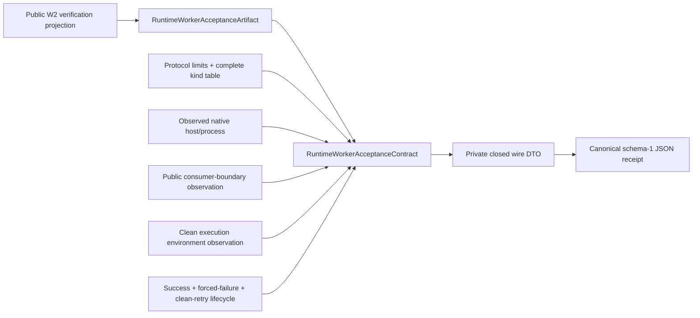

# RuntimeWorker Acceptance Contract

## Purpose and Scope

`RuntimeWorkerAcceptanceContract` is the acceptance-evidence authority for
the actual-host process and protocol gate of ADR-0015. It is a separate Swift
package under `Acceptance/RuntimeWorker`; it is not a target or product of the
parent `swift-mojo` package.

This component owns one closed schema-1 receipt. The receipt canonicalizes a
public W2 `MojoRuntimeWorkerBundleVerification`, the protocol limits and
message-kind table, host/process observations, consumer-boundary observations,
the clean execution environment, and the required success/failure lifecycle.
The public receipt is intentionally not `Codable`: a private closed wire DTO
is used so `encoded()` and `decodeCanonical(_:)` remain the only receipt codec
authority.
It does not launch a worker, read an artifact, run a compiler, inspect a
device, or decide model/training/performance/HIL readiness.

## Responsibilities and Boundaries

The component owns:

- the exact top-level receipt key set and schema/status/evidence-scope rules;
- strict decoding, canonical encoding, and nested closed-record validation;
- lossless typed projection of all public W2 worker-verification fields;
- the fixed protocol-v1 limit and ten-message-kind record;
- typed host, consumer-boundary, execution-environment, and lifecycle evidence;
- the rule that a passed receipt requires observed host process/protocol
  evidence and complete lifecycle evidence.

The component does not own:

- worker construction, staging, transport, POSIX operations, or process
  control;
- acceptance fixtures, controllers, host runners, or host-generated receipt
  files;
- MAX device or kernel execution, training, performance, or physical HIL
  claims;
- Manas or Kuyu policy.

The package may depend on the public `MojoRuntime` product only to provide a
lossless projection initializer. The parent package does not depend on this
acceptance package, so no acceptance API leaks into a `swift-mojo` product.

## Related Designs

| Design | Relationship | Contract Used | Summary | Cautions |
|---|---|---|---|---|
| [`Swift Mojo`](../../DESIGN.md) | parent index | Package boundary and public W2 products | The acceptance package is a separate consumer-side evidence authority. | Parent source and products remain unchanged. |
| [`MojoRuntime`](../../Sources/MojoRuntime/DESIGN.md) | depends on | `MojoRuntimeWorkerBundleVerification` public fields | Supplies the freshly verified immutable W2 projection. | Projection is artifact evidence, not host execution evidence. |
| [`MojoRuntimeWorker`](../../Sources/MojoRuntimeWorker/DESIGN.md) | observes | Public generic worker lifecycle | Its typed operations are exercised by a later host fixture. | This component never imports worker internals or POSIX support. |
| [ADR-0015](../../docs/ADR-0015-DIRECT-LINKED-PERSISTENT-WORKERS.md) | implements evidence schema | W1/W2/W3 process/protocol boundary | Fixes the distinction between verified artifacts and actual-host receipts. | Device, kernel, training, performance, and HIL remain outside this scope. |

## Architecture



The data flow is intentionally one-way:

```text
W2 projection + observed host evidence
    -> typed receipt construction
    -> semantic validation
    -> sorted-key canonical JSON
    -> strict canonical decode for later comparison
```

No receipt field can create an artifact projection or cause a worker launch.

## Contracts and Invariants

### Top-level schema

The only top-level keys are:

```text
schemaVersion
status
evidenceScope
claims
swiftMojoRevision
acceptanceSourceDigest
host
artifact
protocol
consumerBoundary
executionEnvironment
lifecycle
failure
```

Schema version is `1`. Status is `passed` or `failed`. Evidence scope is the
literal `actualHostProcessProtocol`. A passed receipt has `failure: null`; a
failed receipt has one typed failure record. Unknown, missing, duplicate, or
noncanonical keys are rejected at every nested record.

`RuntimeWorkerAcceptanceContract` does not conform to `Codable` or expose
`init(from:)`/`encode(to:)`. The private wire DTO is the only type passed to
`JSONEncoder` or `JSONDecoder`; public callers must use `encoded()` and
`decodeCanonical(_:)`, which validate the contract and compare canonical bytes.

Claims are closed and contain exactly:

```text
actualHostProcess
protocolLifecycle
maxDevice
kernel
training
performance
physicalHIL
```

The last five claims are always `false`. A passed receipt requires
`actualHostProcess == true` and `protocolLifecycle == true`; these values must
agree with the host observations and cannot be supplied by a worker or CLI
self-report without the corresponding host/lifecycle evidence.

### Artifact projection

`artifact` is a complete value projection of the public W2 verification. It
contains `schemaVersion`, `bundleDigest`, and `executionContractDigest`, then
the following closed records:

| Record | Required evidence |
|---|---|
| `semanticIdentity` | worker ABI, protocol version, source/input graph digests and identifiers, generation-pipeline digest, binding-table digest, and every binding record |
| `generatedInputs` | compiler version, generated Mojo/C-worker source digests, source-map digest, and both object digests |
| `runtimeBundle` | RuntimeBundle manifest and receipt digests, executable, every library, loader search path, system dependencies, and interpreter |
| `targetClosure` | target triple/CPU/accelerator, artifact identity, and target-closure digest |

All digest fields are lowercase SHA-256 strings. Relative files are normalized
and bounded; libraries and string lists are unique and in canonical order.
Bindings are unique and in W2 binding-ID order. The artifact schema version is
the W2 worker-bundle schema version and must be `1`. Decoding is bounded to a
16 MiB receipt, 1,024 bindings, 256 runtime libraries, 256 system
dependencies, 256 environment-variable names, and 4,096-byte path/string
values where the record defines a path bound.

### Protocol record

`protocol` contains the W2-projected version, descriptor, 32-byte header,
little-endian byte order, positive bounded payload limit, exactly one
in-flight request, and the complete ordered v1 message-kind table:

```text
ready, createSession, sessionCreated, invokeFloat32, invocationResult,
shutdownSession, sessionShutdown, shutdownWorker, workerShutdown, failure
```

No kind may be omitted, duplicated, renamed, or reordered. The semantic
identity protocol version and wire protocol version must agree. The receipt
does not add private protocol schema or raw frame data.

### Host and boundary evidence

`host` records the actual platform, native architecture, target triple, CPU,
and explicit observations for native target, process launch, and protocol
exchange. The accepted host set is macOS/arm64 with an `arm64-*-apple-macosx`
triple or Linux/aarch64 with an `aarch64-*-linux` triple; observations must
follow native target, process launch, then protocol exchange. Target-specific
receipts are never generalized to the other host.

`consumerBoundary` records that the public `MojoRuntime` projection and
`MojoRuntimeWorker` API were used while filesystem, process-launch, loader,
POSIX, raw-protocol, and worker-SPI authority remained absent from the
consumer. A passed receipt requires exactly that boolean pattern.

`executionEnvironment` records that compiler and Python were unavailable
during the relocated execution phase, the ambient loader-variable name set
was empty, and a clean environment was observed. Compilation identity remains
artifact evidence under `generatedInputs.compilerVersion` and is not silently
inferred from the execution environment.

### Lifecycle evidence

`lifecycle` records private staging verification, ready admission, session
creation, positive input/output element counts for a Float32 invocation,
graceful shutdown, forced timeout/failure, exact process-group reaping,
zero partial output, zero cleanup failures, and a clean next attempt. A passed
receipt requires all positive observations and the two zero counts. No Float32
values are serialized; if a later comparator needs cross-target output
identity, it must use raw-byte digest or bit-pattern fields rather than
platform-dependent floating-point text.

### Failure and construction

Failure codes are a closed `String` enum with bounded nonempty messages. A
failed receipt may preserve partial observations, but it cannot set any of the
five forbidden claims to true. Construction validates all cross-record
invariants before a receipt can be encoded. It never turns missing evidence
into a passed result.

## Runtime Flows

```text
verify W2 projection
  -> collect actual-host observations
  -> construct typed receipt
  -> validate pass/fail invariants
  -> encode canonical JSON
  -> decodeCanonical() for persisted-receipt verification
```

The contract package performs no I/O. Host fixture/controller code in a later
work item owns observation collection and persistence.

## State, Ownership, and Lifecycle

Receipt values are immutable `struct`s. The caller owns source and observation
inputs; the contract owns no process, path, descriptor, buffer, or task. The
encoded `Data` is an output value whose lifetime belongs to the caller.

## Failure, Concurrency, and Constraints

Validation is synchronous and side-effect free. The package has no shared
mutable state and no asynchronous operation. JSON parsing is bounded by the
caller-provided `Data`; all decoded text, arrays, and diagnostic messages have
explicit size limits. There are no floating-point fields in the receipt.

## Verification and Change Impact

Focused tests must prove:

- exact round-trip bytes for a valid passed and failed receipt;
- rejection of every unknown/missing top-level and nested key;
- rejection of reordered/pretty-printed/duplicate-key noncanonical JSON;
- rejection of altered fixed claims, protocol kinds/limits, artifact fields,
  consumer boundary, clean environment, and lifecycle evidence;
- rejection of a passed receipt without host/process/protocol observations;
- the canonical codec is the only public receipt serialization path;
- projection mapping from every public W2 field. The one-to-one integration
  proof using a filesystem verifier-produced public W2 projection is owned by
  RT4.B; this package does not fabricate a verifier projection or use
  `@testable` access to parent internals;
- absence of public imports from `MojoRuntimeWorker` internals or POSIX support.

Changes to this schema require ADR-0015, the parent design index, and all host
fixture/comparator consumers to be reviewed before their receipts remain
valid.
