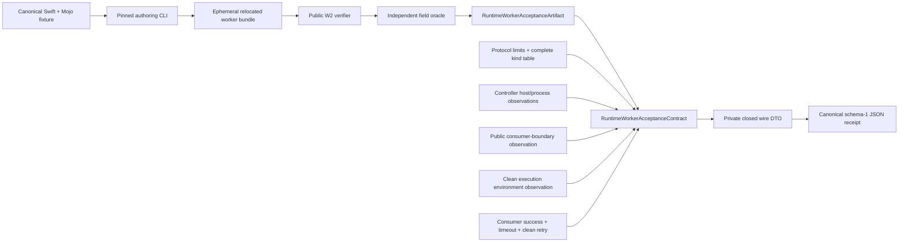

# RuntimeWorker Acceptance Contract

## Purpose and Scope

`Acceptance/RuntimeWorker` is the RT4 host-process/protocol acceptance package
for ADR-0015. It is a separate Swift package under that directory; it is not a
target or product of the parent `swift-mojo` package. The package has two
explicit boundaries: the side-effect-free schema authority
`RuntimeWorkerAcceptanceContract`, and the RT4.B host controller/runner that
exercises a separately built public consumer.

The contract side owns one closed schema-1 receipt. The RT4.B side owns the
source fixture, pinned authoring orchestration, public verifier-to-contract
projection check, relocated consumer process, and temporary-directory/process
observations. RT4.B deliberately produces a non-receipt run report: the
controller holds it in memory and the runner emits it as ephemeral sorted JSON;
receipt encoding/persistence is a later evidence step owned by the receipt
authority's caller. The public receipt is intentionally not `Codable`: a private
closed wire DTO is used so `encoded()` and `decodeCanonical(_:)` remain the only
receipt codec authority.

`RuntimeWorkerAcceptanceRunReport` is the lossless material handoff for that
later step. It contains one canonical `Artifact`, `ProtocolRecord`,
`ConsumerBoundary`, `ExecutionEnvironment`, and `Lifecycle`, plus only the
derived projection count, exact Float32 bit-pattern diagnostics, typed forced
failure code, and stage/process leak counts. The report is `Codable` for the
ephemeral handoff; it is not a receipt and does not add a second codec or
persistence authority.

## Responsibilities and Boundaries

The contract boundary owns:

- the exact top-level receipt key set and schema/status/evidence-scope rules;
- strict decoding, canonical encoding, and nested closed-record validation;
- lossless typed projection of all public W2 worker-verification fields;
- the fixed protocol-v1 limit and ten-message-kind record;
- typed host, consumer-boundary, execution-environment, and lifecycle evidence;
- the rule that a passed receipt requires observed host process/protocol
  evidence and complete lifecycle evidence.

The RT4.B boundary owns:

- the canonical Swift binding and Mojo source fixture, with no checked-in
  generated binaries or bundles;
- exact pinned compiler activation and runtime-library selection for authoring;
- public `verifyWorkerBundle(at:)` projection and an independent field oracle;
- the clean-environment consumer launch, typed lifecycle exercise, and report;
- acceptance-owned temporary staging/process observations and leak rejection.

Neither boundary owns:

- worker transport, POSIX operations, or private worker lifecycle (these belong
  to `MojoRuntimeWorker`);
- arbitrary process launching outside the one fixed consumer executable;
- MAX device or kernel execution, training, performance, or physical HIL
  claims;
- Manas or Kuyu policy.

The package depends only on public `MojoRuntime` and `MojoRuntimeWorker` for
the RT4.B implementation. The parent package does not depend on this
acceptance package, so no acceptance API leaks into a `swift-mojo` product.

## Related Designs

| Design | Relationship | Contract Used | Summary | Cautions |
|---|---|---|---|---|
| [`Swift Mojo`](../../DESIGN.md) | parent index | Package boundary and public W2 products | The acceptance package is a separate consumer-side evidence authority. | The RT4.B controller consumes only parent public products; the canonical-record portability fix is part of this sprint and preserves the parent public contract. |
| [`MojoRuntime`](../../Sources/MojoRuntime/DESIGN.md) | depends on | `MojoRuntimeWorkerBundleVerification` public fields | Supplies the freshly verified immutable W2 projection. | Projection is artifact evidence, not host execution evidence. |
| [`MojoRuntimeWorker`](../../Sources/MojoRuntimeWorker/DESIGN.md) | used by RT4.B consumer | Public generic worker lifecycle | Its typed operations are exercised by the external consumer fixture. | Acceptance imports no worker internals or POSIX support. |
| [ADR-0015](../../docs/ADR-0015-DIRECT-LINKED-PERSISTENT-WORKERS.md) | implements evidence schema | W1/W2/W3 process/protocol boundary | Fixes the distinction between verified artifacts and actual-host receipts. | Device, kernel, training, performance, and HIL remain outside this scope. |

## Architecture



The data flow is intentionally one-way:

```text
source fixture + pinned authoring
    -> ephemeral bundle + public verifier
    -> field-by-field projection oracle
    -> clean external consumer process
    -> typed lifecycle run report
    -> caller-owned receipt construction/encoding
```

The controller never fabricates a verifier projection. It maps the actual
filesystem verifier result; the consumer creates the worker only from its own
freshly verified public projection, and no receipt field can cause a worker
launch.

## Contracts and Invariants

### Top-level schema

The only top-level keys are:

```text
schemaVersion
status
evidenceScope
claims
swiftMojoRevision
acceptanceSourceDigest
host
artifact
protocol
consumerBoundary
executionEnvironment
lifecycle
failure
```

Schema version is `1`. Status is `passed` or `failed`. Evidence scope is the
literal `actualHostProcessProtocol`. A passed receipt has `failure: null`; a
failed receipt has one typed failure record. Unknown, missing, duplicate, or
noncanonical keys are rejected at every nested record.

`RuntimeWorkerAcceptanceContract` does not conform to `Codable` or expose
`init(from:)`/`encode(to:)`. The private wire DTO is the only type passed to
`JSONEncoder` or `JSONDecoder`; public callers must use `encoded()` and
`decodeCanonical(_:)`, which validate the contract and compare canonical bytes.

Claims are closed and contain exactly:

```text
actualHostProcess
protocolLifecycle
maxDevice
kernel
training
performance
physicalHIL
```

The last five claims are always `false`. A passed receipt requires
`actualHostProcess == true` and `protocolLifecycle == true`; these values must
agree with the host observations and cannot be supplied by a worker or CLI
self-report without the corresponding host/lifecycle evidence.

### Artifact projection

`artifact` is a complete value projection of the public W2 verification. It
contains `schemaVersion`, `bundleDigest`, and `executionContractDigest`, then
the following closed records:

| Record | Required evidence |
|---|---|
| `semanticIdentity` | worker ABI, protocol version, source/input graph digests and identifiers, generation-pipeline digest, binding-table digest, and every binding record |
| `generatedInputs` | compiler version, generated Mojo/C-worker source digests, source-map digest, and both object digests |
| `runtimeBundle` | RuntimeBundle manifest and receipt digests, executable, every library, loader search path, system dependencies, and interpreter |
| `targetClosure` | target triple/CPU/accelerator, artifact identity, and target-closure digest |

All digest fields are lowercase SHA-256 strings. Relative files are normalized
and bounded; libraries and string lists are unique and in canonical order.
Bindings are unique and in W2 binding-ID order. The artifact schema version is
the W2 worker-bundle schema version and must be `1`. Decoding is bounded to a
16 MiB receipt, 1,024 bindings, 256 runtime libraries, 256 system
dependencies, 256 environment-variable names, and 4,096-byte path/string
values where the record defines a path bound.

### Protocol record

`protocol` contains the W2-projected version, descriptor, 32-byte header,
little-endian byte order, positive bounded payload limit, exactly one
in-flight request, and the complete ordered v1 message-kind table:

```text
ready, createSession, sessionCreated, invokeFloat32, invocationResult,
shutdownSession, sessionShutdown, shutdownWorker, workerShutdown, failure
```

No kind may be omitted, duplicated, renamed, or reordered. The semantic
identity protocol version and wire protocol version must agree. The receipt
does not add private protocol schema or raw frame data.

### Host and boundary evidence

`host` records the actual platform, native architecture, target triple, CPU,
and explicit observations for native target, process launch, and protocol
exchange. The accepted host set is macOS/arm64 with an `arm64-*-apple-macosx`
triple or Linux/aarch64 with an `aarch64-*-linux` triple; observations must
follow native target, process launch, then protocol exchange. Target-specific
receipts are never generalized to the other host.

`consumerBoundary` records that the public `MojoRuntime` projection and
`MojoRuntimeWorker` API were used while filesystem, process-launch, loader,
POSIX, raw-protocol, and worker-SPI authority remained absent from the
consumer. A passed receipt requires exactly that boolean pattern.

`executionEnvironment` records that compiler and Python were unavailable
during the relocated execution phase, the ambient loader-variable name set
was empty, and a clean environment was observed. Compilation identity remains
artifact evidence under `generatedInputs.compilerVersion` and is not silently
inferred from the execution environment.

### Lifecycle evidence

`lifecycle` records private staging verification, ready admission, session
creation, positive input/output element counts for a Float32 invocation,
graceful shutdown, forced timeout/failure, exact process-group reaping,
zero partial output, zero cleanup failures, and a clean next attempt. A passed
receipt requires all positive observations and the two zero counts. No Float32
values are serialized; if a later comparator needs cross-target output
identity, it must use raw-byte digest or bit-pattern fields rather than
platform-dependent floating-point text.

### Failure and construction

Failure codes are a closed `String` enum with bounded nonempty messages. A
failed receipt may preserve partial observations, but it cannot set any of the
five forbidden claims to true. Construction validates all cross-record
invariants before a receipt can be encoded. It never turns missing evidence
into a passed result.

## Runtime Flows

```text
authoring script
  -> prepare pinned bundle
  -> verify bundle through public verifier
  -> relocate into acceptance-owned TMPDIR
  -> launch consumer with empty PATH and no compiler/Python/loader variables
  -> consumer: success -> typed timeout -> clean success
  -> controller: compare projection fields and inspect stage/process cleanup
  -> aborted run: TERM/KILL exact TMPDIR worker groups, wait boundedly, then
     remove only newly-created stage roots or return typed cleanup failure
  -> return lossless non-receipt run report and emit it as sorted JSON on stdout
  -> caller may construct/encode the closed receipt
```

The contract value and codec remain synchronous and side-effect free. The
controller is the sole owner of pass/fail process and filesystem observations
in RT4.B. The shell script owns authoring/build orchestration and performs only
fail-closed emergency cleanup for an outer abort (including work-directory
removal); that cleanup is not acceptance evidence and cannot turn a failed run
into a pass. Neither layer writes a receipt.

## State, Ownership, and Lifecycle

Contract values are immutable `struct`s. The controller owns the launched
consumer process for one bounded run and observes only its acceptance-owned
temporary root. The consumer owns each `MojoRuntimeWorker.withAttempt` scope;
the worker owns private staging, transport, and child reaping. The controller
captures child output through two nonblocking pipes, bounded to 4 MiB per
stream, and closes every descriptor before returning. It retains no process,
descriptor, bundle, output file, or task after `run` returns. The lossless
report is caller-owned material; the encoded receipt `Data`, when requested by
a caller, remains caller-owned.

## Failure, Concurrency, and Constraints

Contract validation is synchronous and side-effect free. Controller execution
is asynchronous only while polling child processes and nonblocking output
descriptors against one fixed hard deadline. The deadline reserves bounded TERM
and KILL phases before it expires; success requires both direct-process exit and
EOF from stdout and stderr. Process inspection uses the same dual-pipe primitive
and per-stream 4 MiB bound. Output overflow, missing EOF, termination uncertainty,
and descriptor cleanup failure are typed failures. An aborted run
cleans up exact worker process groups found under the acceptance-owned
temporary root before removing new stage roots. Failure to prove process
disappearance, descriptor closure, or stage removal is a typed cleanup
failure. The package has no shared mutable state. JSON parsing is bounded by
caller-provided `Data`; all decoded text, arrays, and diagnostic messages have
explicit size limits. There are no floating-point fields in the receipt; the
run report uses Float32 bit patterns.

## Verification and Change Impact

Focused tests must prove:

- exact round-trip bytes for a valid passed and failed receipt;
- rejection of every unknown/missing top-level and nested key;
- rejection of reordered/pretty-printed/duplicate-key noncanonical JSON;
- rejection of altered fixed claims, protocol kinds/limits, artifact fields,
  consumer boundary, clean environment, and lifecycle evidence;
- rejection of a passed receipt without host/process/protocol observations;
- the canonical codec is the only public receipt serialization path;
- projection mapping from every public W2 field. The one-to-one integration
  proof uses a filesystem verifier-produced public W2 projection and is
  executed by the RT4.B controller during the bounded script run. Package
  tests cover only the source boundary; no fake, witness, environment-optional
  test, or `@testable` parent access is accepted;
- lossless `RuntimeWorkerAcceptanceRunReport` round-trip with field equality and
  exactly one copy of each canonical artifact/protocol/boundary/environment/
  lifecycle record;
- bounded consumer timeout and process-inspection failure paths, including
  concurrent stdout/stderr drain beyond pipe capacity, TERM-to-KILL exit
  confirmation, per-stream overflow rejection, inherited-writer EOF rejection,
  descriptor cleanup, and no unbounded `waitUntilExit` or pipe-drain dependency;
- absence of public imports from `MojoRuntimeWorker` internals or POSIX support.

RT4.B additionally requires a bounded actual Mac authoring-and-consumer run,
a source-boundary test, exact typed timeout/zero-partial-output/zero-
cleanup evidence, an empty PATH that makes compiler and Python resolution
impossible, and zero worker stage/process entries under the configured TMPDIR.
Native Linux Swift type-check/build evidence is recorded separately when the
available Swift/SDK container can complete it; a host unavailable for execution
does not become a simulated pass.

Changes to this schema require ADR-0015, the parent design index, and all host
fixture/comparator consumers to be reviewed before their receipts remain
valid.
