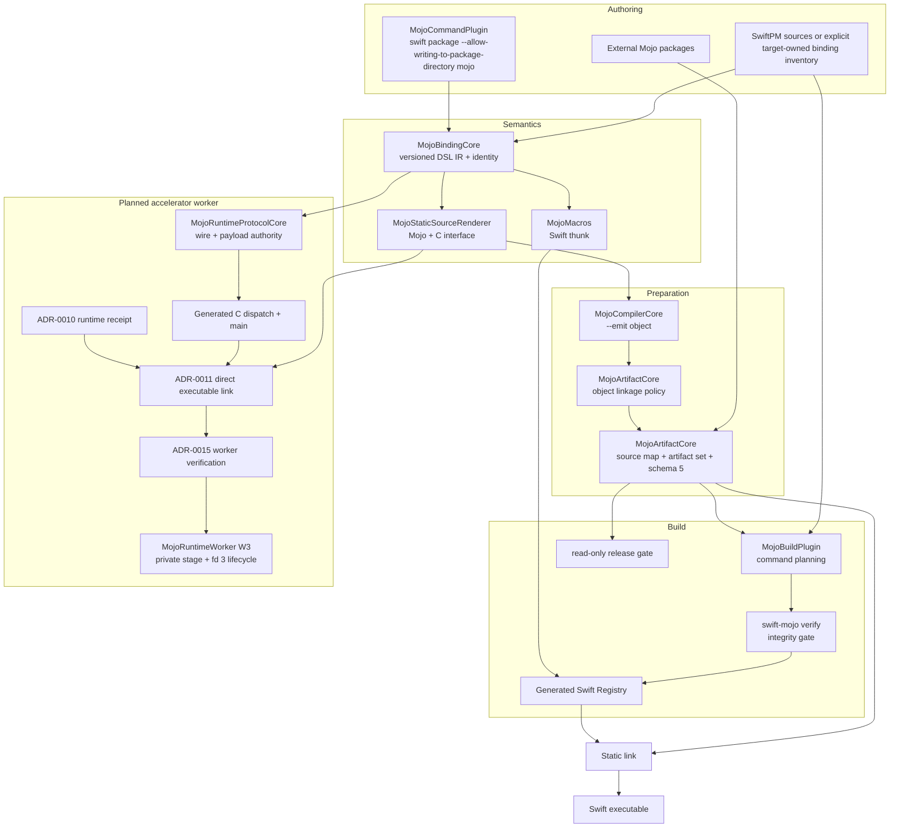
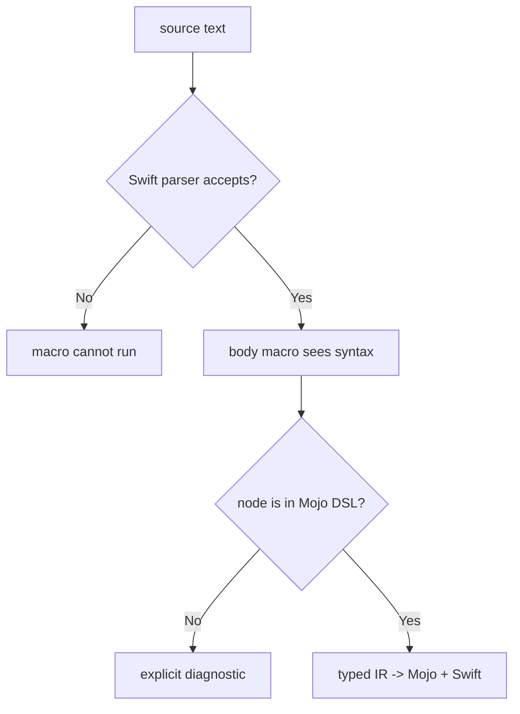
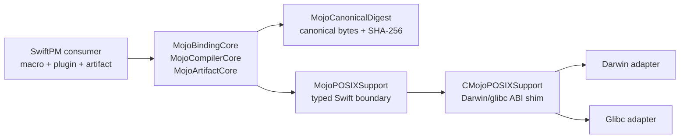
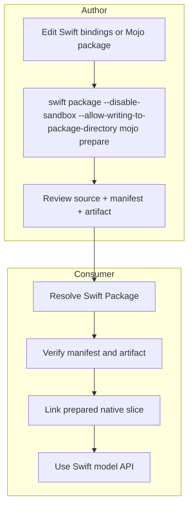

# Swift Mojo

## Active completion order

Release the qualified generic direct-call public API before resuming Lume
integration. [Mojo's direct-call contract](Sources/Mojo/DESIGN.md#direct-call-completion-work-2026-09-12)
owns the scoped buffer/resource boundary. BindingCore owns admitted source
signatures; ArtifactCore owns generated C ABI and native artifacts. Reuse the
existing RuntimeBridge benchmark for public-wrapper versus direct-dispatcher
measurements, adding native size sweeps and measured allocation/copy evidence.
The task order and outstanding gates are in `PROGRESS.md` (DIRECT items).
Consumer-specific MAX feasibility does not satisfy these generic gates.

## Current execution decision

[ADR-0016](docs/ADR-0016-DIRECT-SWIFT-MOJO-EXECUTION.md) supersedes the worker-first
resource migration below. Swift calls Mojo directly through C ABI; process
isolation belongs to consumers. The direct Jetson detector lifecycle is qualified
by ADR-0016; generic public API and full Lume qualification remain pending.
MAX inference orchestration belongs to its consumer through the official MAX C
API; swift-mojo is only needed for custom Mojo calls, not model/tensor management.
The following worker migration sections describe the superseded target and do
not authorize additional IPC work for the active Lume integration.

## In-development protocol replacement

The user requested a single current worker contract on 2026-09-12. Replace the
Float32 worker format directly with resource invocation. Do not maintain v1/v2
routes, version selection, compatibility overloads or numeric protocol migration.
Generated contract digests identify matching clients/workers. Existing references
to a versioned resource migration below and in linked implementation plans are
superseded by this decision; final acceptance requires their removal. This does
not change the independent synchronous static-call product.

## Generic resource invocation revision (2026-09-12)

This target design responds to streaming numerical workloads without adding
application semantics to swift-mojo. Protocol codecs and native input ownership
are implemented; resource worker invocation and performance qualification are pending. The authoritative
contracts are [Worker](Sources/MojoRuntimeWorker/DESIGN.md#resource-invocation-revision-2026-09-12),
[Resource protocol](Sources/MojoRuntimeProtocolCore/DESIGN.md#resource-invocation-protocol-target-design-2026-09-12)
and the child [WorkerPOSIX](Sources/MojoRuntimeWorkerPOSIX/DESIGN.md).
WorkerPOSIX is a native resource ingress product; its narrowly scoped descriptor
import supersedes the earlier blanket public-descriptor prohibition only there.

The package owns type/layout validation, generated bindings, transfer/ownership,
completion and failure. Consumers own algorithms, data meaning, compute
composition, backend selection, scheduling and performance budgets.
No camera, image, pose, MAX, CUDA or Metal types enter the generic worker API.
Existing synchronous static-call and session-buffer contracts remain separate;
do not route every scalar call through IPC.

```text
consumer domain operation
 -> verified generated Swift binding
 -> portable worker input/value + lifetime contract
 -> generated Mojo operation
 -> user-selected computation/runtime
native producer -> optional WorkerPOSIX ingress -> portable worker input
```

### Change authority and rollout

This revision explicitly replaces v1 worker invocation for migrated bundles.
It is not a compatibility layer. ADR-0015 remains authoritative for direct-linked
isolated execution, verification, sequencing and process lifetime; its v1 wire
schema/Float32-only surface are superseded by ProtocolCore. Static artifact
ABIs are not changed. Parent/child revisions are target contracts; existing
code is v1 and cannot claim the revision's guarantees.

Implement lower contracts in Worker V1-V5 order, regenerate worker bindings and
bundles, then migrate consumers. Old bundle/schema mismatch fails before factory,
never falls back. Each library owns its own correctness/performance acceptance;
a consumer workaround cannot substitute for bridge qualification.

A zero-input-copy claim covers only the specifically measured bridge boundary.
GPU transfer, kernel layout conversion, model runtime allocations and network
delivery are separate owner measurements. The shared-input bridge must meet
a consumer-supplied positive overhead budget, zero bulk IPC input bytes and
zero input-sized bridge materialization. There is no universal millisecond
promise independent of hardware, load, data layout and completion semantics.


## Purpose and Scope

This file is the system and Swift package master design for `swift-mojo`.
The repository root is both the system root and the SwiftPM package root, so
this design has no parent design. Its direct child component designs are listed
under [Related Designs](#related-designs).

The package owns a generic Swift-to-Mojo authoring, prepared-artifact, build
verification, and runtime-ownership boundary. It supports Darwin authoring and
Darwin/glibc consumers without embedding downstream model, application, device,
or deployment policy.

### Swift authoring surface

利用者が設計する最終surfaceを先に固定します。

```swift
@mojo
func add(_ a: Int32, _ b: Int32) -> Int32 {
    return a + b
}
```

このsourceの意味は「Swift関数の公開契約を保ち、bodyのcompute semanticsをMojoで実装する」です。C ABI、binding ID、generated module、artifact pathは利用者が手で同期しません。

current sourceではこのsurfaceとexternal package bindingを実装していますが、inline semanticsは `(Int32, Int32) -> Int32` の加算だけです。external packageにはimmutable/mutable `Float` borrow、synchronous opaque-session create/use/shutdown、およびsession-owned Float32-buffer create/synchronous host copy/shutdownを実装しています。構文の見た目と対応言語範囲、caller-owned borrowとowned resource、capability representationと実device実装、generic sessionとmodel inference、実装済みと実行検証済みを混同しません。

## Confirmed Current Facts

| Fact | Evidence in repository |
|---|---|
| `@mojo` is a body macro with inline and package/function forms | `Sources/Mojo/MojoMacro.swift`、macro expansion tests |
| Macro and scanner share one IR | `MojoBindingCore` is used by `MojoMacros` and `MojoArtifactCore` |
| Original DSL body is replaced | `MojoBodyMacro` emits only a Registry invocation |
| Real Mojo emits the implementation object | `MojoCompiler.compileObject` and real Mojo 1.0 acceptance |
| Runtime uses static linking | generated Apple XCFramework / Linux static-library artifact bundle and final Mach-O/archive inspection |
| Plugin does not compile Mojo | plugin invokes only `swift-mojo verify` |
| Build verifier covers stale/missing/corrupt/config/source-map/slice state | verifier/release failure tests and the committed plugin integration target pass under `xcodebuild test` |
| No application-level dynamic legacy path remains | public product has no symbol registry or invocation loader; accelerator runtime closures and callable libraries are explicit receipt-bound artifacts |
| External Mojo package files are current author inputs | `MojoExternalPackage`、`MojoInputGraph`、generated package imports、compiler `-I`、plugin tree inputs |
| Release configuration is explicit | `SwiftMojo.json` pins compiler、external packages、all required slices |
| Borrowed Float lowering is additive and external-only | signature-aware `MojoBinding`、buffer dispatcher、generated Registry、`MojoInvocationError`、real compile/link/runtime acceptance。allocation/copy and sanitizer evidenceはpending |
| Mutable Float output lowering is additive and external-only | input/output signature IR、nested scoped borrows、generated status dispatcher、typed nonzero/empty failures、real Mojo 1.0 universal compile/static-link/runtime and immutable-revision acceptance。allocation/copy and standalone-buffer sanitizer evidenceはpending |
| Opaque session lowering is external-only | factory/use metadata、versioned flat C ABI、factory-domain-bound owner、capability/lifecycle typed errors、real Mojo CPU runtime acceptance |
| Session resource lowering is external-only | buffer factory/create/destroy/copy/synchronize metadata、generated post-copy synchronization、versioned C ABI、typed `MojoFloat32BufferOwner`、capability/size/count validation、child-before-parent lifecycle tests、real Mojo host-buffer round-trip acceptance |
| Device execution is a separate runtime capability | Compiler target support does not establish a usable device runtime; concrete device implementations and hardware qualification belong to consuming packages |
| Static artifacts reject undeclared Mojo runtime dependencies | `MojoObjectLinkageInspector` normalizes `nm -u` output and rejects unresolved `AsyncRT_*`、`KGEN_CompilerRT_*`、`MGP_RT_*` before archiving |
| Accelerator dependencies have a separate verified identity | schema-1 runtime receipts bind object/library digests、target architecture、exact symbol providers、Mach-O/ELF transitive dependencies、and observed system dependencies without weakening the static adapter |
| Accelerator deployment is an exact managed bundle | schema-1 bundle manifests bind the linked executable、receipt、copied closure、relative loader root、direct system dependencies、and Linux interpreter; final imports are re-derived before atomic commit |
| Runtime-linked generated ABI is a separate exact bundle | schema-3 runtime-library manifests bind compiler/input-graph/generated-source/source-map provenance、typed binding IDs/signatures/session-factory relationships、the primary dylib/shared library、generated header/module map、exact exports、receipt closure、`@loader_path`/`$ORIGIN`、and all file digests; relocation and invocation pass with an empty environment fixture. This callable adapter is not the persistent-worker implementation |
| Direct-linked persistent worker is the selected accelerator design | ADR-0015 W1/W2 generate the Mojo and C worker objects from one input graph, link both directly into an ADR-0011 executable, publish a closed schema-1 worker bundle, and verify an immutable projection. W3 owns the implemented scoped process/session lifecycle; RT4.B verifies the relocated macOS process/protocol path, while persistent macOS receipts and native Linux host execution remain pending |
| Runtime preflight is consumable without the authoring CLI | the public read-only `MojoRuntime` product distinguishes executable, callable-library, and worker bundles through separate verifier contracts. Construction, mutation, loading, launch, and execution remain outside those W2 APIs |
| Generic worker execution is a distinct public boundary | public W3 product `MojoRuntimeWorker` implements W2-only construction, opaque full-binding tokens, private mode-0700 staging/reverification, staged-executable spawn, bounded protocol-v1 create/invoke/shutdown, and graceful/hard terminal lifecycle. Its typed session is valid only inside `withAttempt`; filesystem, POSIX, raw protocol, and process authority remain package-internal |
| Linux packaging is an independent adapter | schema 5 records an SE-0482 `staticLibrary` artifact bundle; real Mojo aarch64 ELF cross-compilation, KGEN-free archive inspection, and a clean native Linux ARM64 Swift 6.2.4 scalar plus owned-session create/use/shutdown consumer pass |

## Responsibilities and Boundaries

`swift-mojo` owns versioned binding semantics, generated C ABI surfaces,
canonical artifact identity, compiler process control, prepared native artifact
packaging, build-time verification, generic synchronous session ownership, and
the generic isolated worker-attempt client/lifecycle.

It does not own model architecture, model weights, learning policy, application
attempt policy, device selection, deployment selection, checkpoint publication,
evidence admission, or product safety policy.
Those concerns consume only the package's public contracts. Platform-specific
POSIX declarations remain internal implementation details and cannot flow into
public Mojo, compiler, artifact, command, or runtime APIs.

## Related Designs

| Design | Relationship | Contract Used | Summary | Cautions |
|---|---|---|---|---|
| [WorkerPOSIX](Sources/MojoRuntimeWorkerPOSIX/DESIGN.md) | child module | Native readonly resource ingress | Platform-specific admission into portable worker buffers | Input ownership implemented; resource worker consumption pending |
| [`Mojo`](Sources/Mojo/DESIGN.md) | child | Public macro, immutable static-artifact attestation, session and buffer ownership | Exposes the safe Swift surface consumed by generated registries and application targets. | Only generated code may construct an attestation; it is provenance evidence, not device-execution evidence. |
| [`MojoBindingCore`](Sources/MojoBindingCore/DESIGN.md) | child | Typed source graph and binding identity | Shared parser for macros and generation | Resource parsing does not imply executable endpoint support |
| [`MojoArtifactCore`](Sources/MojoArtifactCore/DESIGN.md) | child | Canonical graph, render, package, and verification transactions | Owns static and runtime-dependent artifact generation and the ADR-0015 W1 boundary. | It does not launch deployed workers or own application semantics. |
| [`MojoRuntimeProtocolCore`](Sources/MojoRuntimeProtocolCore/DESIGN.md) | child | Package-internal worker protocol semantics and endpoint generation | Owns protocol-v1 constants, payload layouts, validation, C rendering, and Swift codec/types. | It has no public product, transport I/O, or mutable runtime state. |
| [`MojoRuntime`](Sources/MojoRuntime/DESIGN.md) | child | Public read-only bundle verification | Projects freshly verified artifact identity without exposing builders, loaders, or launchers. | A successful projection is artifact evidence, not execution evidence. |
| [`MojoRuntimeWorker`](Sources/MojoRuntimeWorker/DESIGN.md) | child | Public generic worker attempt/session client | Owns private verified staging, fd-3 transport, generic lifecycle, termination, and reap. | It accepts only W2-trusted worker projections and owns no domain policy or hardware claim. |
| [`MojoCommandPlugin`](Plugins/MojoCommandPlugin/DESIGN.md) | child | SwiftPM package/source authoring authority | Resolves a target's normal SwiftPM sources or an explicit target-owned worker binding inventory before invoking the command tool. | Explicit binding sources are authoring schema inputs, not proof of a compiled Swift API. |
| [`RuntimeWorker Acceptance`](Acceptance/RuntimeWorker/DESIGN.md) | consumer-side acceptance component | Closed actual-host process/protocol evidence | Canonicalizes W2 projection and observed host/lifecycle evidence without entering a public parent product. | Its RT4.B controller launches only the bounded public consumer, which exercises the worker; it claims no persistent receipt, device/kernel/training/performance, or HIL readiness. |
| [`CMojoPOSIXSupport`](Sources/CMojoPOSIXSupport/DESIGN.md) | child | Fixed-width C POSIX ABI | Normalizes Darwin and glibc process, descriptor, lock, signal, wait, and exit operations. | Unsupported hosts fail explicitly; C pointers do not escape one call. |
| [`MojoPOSIXSupport`](Sources/MojoPOSIXSupport/DESIGN.md) | child | Typed package-scoped Swift adapter | Owns Swift marshalling, capability checks, status decoding, and typed adapter errors. | It does not own timeouts, artifact policy, or user-facing errors. |

## Architecture



| Owner | Generates/holds | Consumed by | Failure contract |
|---|---|---|---|
| `Mojo` | public macro declaration and invocation errors | application source | unsupported use becomes macro diagnostic; throwing buffer failures remain typed |
| `MojoBindingCore` | ephemeral binding/source graph values | macro、prepare、verify | typed parse/semantic error |
| `MojoMacros` | expanded Swift body | Swift compiler | expansion failure; no fallback body |
| `MojoCompilerCore` | Mojo version and object | preparer | typed locate/launch/status/timeout/no-output failure; process-group cleanup |
| `MojoArtifactCore` | input graph、source map、linkage policy、adapter-specific artifact set、schema 5 manifest | source control、plugin、release CI | interprocess-locked transaction; unmanaged path and undeclared compiler runtime refused |
| `MojoCommandCore` | testable command result and text/JSON projection | executable、Command Plugin | nonzero/machine-readable failure |
| internal `swift-mojo` target | standard streams and process exit status | SwiftPM plugins only | no public executable product、business logic、artifact ownership |
| [`MojoCommandPlugin`](Plugins/MojoCommandPlugin/DESIGN.md) | canonical package root and exact target-owned Swift binding inventory | internal `swift-mojo` tool | invalid explicit inventory fails before tool launch; no fallback to a different source set |
| `MojoBuildPlugin` | verifier command | SwiftPM/Xcode | missing required inputs or verifier failure stops build |
| generated Registry | internal scalar/buffer/session call thunk and exact static-artifact attestation | expanded Swift body and `@mojoStaticArtifactAttestation` | ABI/input-graph/binding mismatch is cached before invocation; buffer/session/attestation failures throw typed errors |
| generated worker artifact | direct-linked Mojo ABI + C protocol endpoint and closed W2 deployment identity | `MojoRuntimeWorker` through bounded fd-3 frames | W2 proves generation/link/closure; W3 separately proves process/session behavior |
| `MojoRuntimeWorker` | W2-trusted projection, bounded typed immutable input-resource set, private staged bundle/resources, process/descriptor owner, bounded generic session client | consuming package through typed operations | arbitrary executable/environment/protocol access and private staged paths are absent; termination signals the process group, reaps the exact child, removes the full private stage, and never reuses a failed worker |

## Runtime Flows

### Prepare flow

```text
SwiftPM-resolved target source inventory
  + SwiftMojo.json
  + Mojo/<Package>/**/*.mojo
  -> SwiftParser
  -> collect inline/external @mojo functions from exactly those files
  -> validate signature family、direct scalar body、external reference
  -> sort canonical binding records
  -> binding + all regular external-package files input graph SHA-256 + runtime identifier
  -> acquire output-scoped interprocess lock
  -> compare generation pipeline identity and complete cache envelope
  -> render allowlisted inline source + external package imports + source map
  -> isolated declared-package import root
  -> mojo build --emit object -I <isolated-root> for every configured slice
  -> inspect undefined symbols and reject undeclared Mojo accelerator/compiler runtime
  -> archive each target object independently
  -> lipo architecture slices that share one Apple platform/variant into a universal archive
  -> wrap each group archive in a target-scoped static framework
  -> xcodebuild -create-xcframework with one framework per platform/variant group
  -> package Linux archives as SE-0482 staticLibrary artifact-bundle variants
  -> canonical tree SHA-256 for every native artifact
  -> schema 5 manifest with target identity、source map、slice/artifact membership
  -> re-read Swift/Mojo input graph and reject concurrent edits
  -> staged directory swap
  -> release output lock
```

Rendererは元のforeign textをpassthroughしません。inline pathは `MojoBinding.Operation` のallowlistからMojo expressionを生成し、P1では `addForward` と `addReversed` だけです。borrowed bufferはfull Mojo packageの関数へだけ接続し、Swift bodyをMojo textへ変換しません。

### Build flow

```text
SwiftPM loads platform-conditioned committed binary target
  -> plugin declares Swift/config/Mojo/source-map/manifest/all artifact trees as required inputs
  -> swift-mojo verify
       schema / ABI
       target-scoped ABI identity + pinned compiler
       complete required slice set + optional explicit destination assertion
       full input graph + binding/package records
       re-rendered generated Mojo/source map + every expected archive
       XCFramework and artifact-bundle metadata/interface membership
       every artifact tree digest + aggregate artifact digest
  -> generate SwiftMojoBindings.generated.swift in plugin work directory
  -> macro-expanded source compiles against generated Registry
  -> destination-selected static archive links into final executable
```

manifestが欠落するとSwiftPMのrequired input checkで停止します。存在するが不正な場合はverifierが停止します。古いgenerated Registryだけを再利用して成功する経路を作りません。

Swift source inventoryの正本はSwiftPM plugin APIが返すtarget-resolved `sourceModule.sourceFiles`のうち、typeが`.source`かつ拡張子が`.swift`のfileです。Command Pluginはそのexact listを `prepare` / `inspect` / `release` / `runtime-library-prepare` に渡し、Build Tool Pluginも同じAPIとfile-type条件から `verify` のinputと引数を作ります。唯一の例外として、worker-only schemaを生成する `runtime-worker-prepare --target` は、selected target directory内のregular/non-symlink `.swift` fileだけをrepeatable `--binding-source`で明示した場合、そのexact listへauthorityを切り替えます。この限定switchはbuild-excluded binding declarationを同一package graphからworker化し、通常sourceへ後から追加されたbindingがclosed worker schemaへ混入することを防ぎます。compiled Swift APIを証明せず、他commandのSwiftPM source authorityを変更しません。core CLIはpackage layoutから `Sources/<Target>` を再走査せず、package root外、非Swift、重複したsource inventoryを拒否します。source file自体のsymlinkを拒否してからpackage rootとparent pathをcanonicalizeし、source-map identityを実体root相対で統一します。これにより通常の`path:`、`sources:`、`exclude:`、custom layout、symlink経由で開いたpackage rootの意味はSwiftPMが所有し、worker-only例外の追加制約はCommand Pluginが所有します。

release gateはprepare/initと同じoutput lockを保持し、`Package.swift` をSwiftSyntaxで読み、target-scoped binary target path、binary dependency、declared remote package由来のMojo product、同一package由来の `MojoBuildPlugin`、local dependencyとmoving branchの不在を確認します。package URL/registry identityとversion/revision requirementはliteralだけを受理し、`revision:` はfull 40/64-character Git object ID、`from:` / `exact:` はvalid semantic versionだけを受理します。package release versionはsource constantへ複製せず、Git tagまたはregistry releaseと、それを解決した `Package.resolved` のversion/revisionだけを正本とします。remote acceptanceはさらにadvertised commitとSwiftPMのresolved pinが同一であることを検証します。公開タグを作る直前には、候補commitを隔離bare Git remoteへ複製し、提案tagをその隔離remoteだけに作成します。fresh consumerが `exact:` requirementでversionと同じcommitを解決し、Mojo productをbuildしてpublic command pluginを実行できることを確認するため、stable releaseからbranch/revision dependencyへ到達するSwiftPM違反は公開前に停止します。変数やhelperから計算されてprovenanceを証明できないdependencyはfail closedします。終了直前にSwift/Mojo input graph、`SwiftMojo.json`、`Package.swift` を再読し、検証中に変わったsnapshotを成功扱いしません。現在は証明可能性を優先し、manifest fragmentをliteral call/arrayとして要求します。変数やhelperで計算されたmanifestを受理するには、PackageDescription評価結果をtoolchain/versionごとに安定して取得・検証する別contractが必要です。

### Runtime flow

```text
add(20, 22)
  -> macro-generated call(bindingID, lhs, rhs)
  -> Swift-compatible checked Int32 overflow guard
  -> thread-safe cached ABI + input graph + complete membership validation
     (C validation calls occur once per generated Registry)
  -> inlinable scalar-family binding guard
  -> <target_prefix>_call_i32_i32_i32
  -> Mojo implementation
  -> 42
```

scalar P1 runtimeにはloader、mutable state、pointer ownershipがありません。唯一のcacheはgenerated Registryのimmutable lazy validation resultで、Swift runtimeのthread-safe static initializationに従います。static artifactはprocess imageのlifetimeに従います。buffer familyはSwift-owned storageを同期borrowし、session familyだけが後述する明示的なforeign handle ownership stateを持ちます。

borrowed buffer runtimeは次の別経路です。

```text
try sum(values)
  -> macro-generated invokeFloatBuffer(bindingID, values)
  -> thread-safe cached ABI + input graph + complete membership validation
     (C validation calls occur once per generated Registry)
  -> inlinable signature-family binding guard
  -> Array.withUnsafeBufferPointer
  -> reject empty storage
  -> <target_prefix>_call_f32_buffer_f32(
         bindingID, const float*, count) -> float
  -> Mojo external implementation synchronously reads the borrow
  -> return Float directly
  -> borrow ends
```

Swiftの`Array`がownerであり、generated Registryのclosureがborrow lifetimeです。Mojoへ渡すpointerは保存、返却、非同期利用、free、mutationを許可しません。現段階では中間配列を生成しない実装ですが、copy/allocationの計測前にzero-copy verifiedとは扱いません。

caller-owned mutable outputはさらに別のsignature familyです。

```text
try scale(input, into: &output)
  -> macro-generated invokeFloatBufferMutation(bindingID, input, &output)
  -> cached ABI + input graph + complete membership validation
  -> signature-family binding guard
  -> input.withUnsafeBufferPointer
  -> output.withUnsafeMutableBufferPointer
  -> reject either empty storage before dispatch
  -> <target_prefix>_call_f32_buffer_f32_buffer_i32(
         bindingID, const float*, inputCount, float*, outputCount) -> int32_t
  -> Mojo external implementation synchronously mutates output
  -> status 0: both borrows end and return Void
  -> status nonzero: both borrows end and throw invocationFailed
```

Swiftがinput/outputのownerで、nested closureが共通borrow lifetimeです。Mojoはoutputを範囲内で変更できますが、pointerの保存、返却、非同期利用、freeはできません。nonzero statusはrollbackを保証せず、failure時のoutput内容は未規定です。このsliceはhost-side buffer更新に必要な最小境界ですが、device allocation、tensor owner、session、accelerator executionの代替ではありません。

opaque runtime sessionは別のsignature familyです。

```text
try openSession(requirements)
  -> generated create_session_v1
  -> Mojo initializes one resource and returns flat capability fields + void*
  -> Registry validates schema/device/ordinal/capability
  -> validation failure: paired shutdown, then typed error
  -> success: MojoSessionOwner owns one factory-domain-bound handle

try scale(session, input, into: &output)
  -> domain check -> begin single synchronous lease
  -> nested Swift buffer borrows -> generated session dispatcher
  -> defer ends handle lease and buffer borrows

try makeBuffer(session, elementCount, memoryKind)
  -> validate Float32 + memory-kind capabilities and byte-count overflow
  -> begin session lease -> generated create_f32_buffer_v1
  -> success: atomically register one opaque child before ending the lease
  -> failure: destroy any returned handle before throwing typed error

try buffer.copy(from: hostValues)
  -> require an exact non-zero element count
  -> borrow session + child under the same single lease
  -> generated copy_host_to_f32_buffer_v1
  -> external implementation completes transfer synchronization before return

try buffer.copy(into: &hostValues)
  -> require the exact element count
  -> borrow session + child under the same single lease
  -> generated copy_f32_buffer_to_host_v1
  -> external implementation completes transfer synchronization before return

try buffer.shutdown()
  -> remove child under Mutex -> paired destroy outside Mutex -> idempotent terminal state

try session.shutdown()
  -> reject while any child is active
  -> clear handle under Mutex -> destroy outside Mutex -> idempotent terminal state
```

session/resourceのcreator/destructorはMojo package、lifecycle ownerはSwiftの
`MojoSessionOwner`と`MojoFloat32BufferOwner`、raw handle pairのconsumerはgenerated
Registryだけです。同時・再入useまたはborrow中shutdownは待機やfallbackを行わず
typed `busy`で失敗し、active childより先のparent shutdownは`activeResources`で
失敗します。host buffer ownershipと同期round-trip transferはreal runtimeで検証済み
ですが、capability enumやhost `malloc` fixtureだけからdevice allocation、DMA、
synchronization、native hardware executionを推測しません。`.hostPinned` はMojo
`DeviceContext.enqueue_create_host_buffer` が表すpage-locked host memoryの契約であり、
vendor固有のmanaged/unified memoryをcross-platform共通機能として公開しません。

## Why a Normal Macro Is Sufficient Only for a Subset

SE-0415のbody macroは、元bodyを受け取り、生成bodyへ全面置換できます。元bodyは意味的に正しいSwiftでなくてもよい一方、Swift grammarとしてparseできなければmacroへ到達しません。

`return a + b` はSwift parserが受理するため、狭いinline subsetは通常のbody macroで成立します。Swift grammar外のMojo syntaxはexternal `.mojo` packageへ置きます。



任意のMojo syntaxを同じ `.swift` bodyへ直接書く最終形は、Swift grammarとの共通部分を越えた時点でmacro単体では不可能です。

## Syntax Strategy Comparison

| Strategy | Swift parser | IDE/source map | Build integration | P1 decision |
|---|---|---|---|---|
| external `.mojo` | 制約なし | file単位で良好 | package source graphとentry-module生成 | scalar external binding、real compile、release、consumer実行をVerified |
| `@mojoSource("...")` literal | Swift stringとしてparse | string内補完が弱い | scanner + source mapが必要 | bootstrap案として評価済み、公開せず |
| Swift-parseable direct body DSL | Swift grammarの部分集合 | SwiftSyntax rangeを維持可能 | shared IRでmacro/generator同期 | current scalar surface |
| `.swiftmojo` custom source | 独自parser可能 | editor supportが必要 | derived Swift + Mojoを生成 | full syntax候補 |
| driver preprocessor | 任意syntaxへ拡張可能 | indexing/build invocationが難しい | Xcode/SwiftPM wrapperが必要 | Research |
| Swift compiler integration | 最高の統合余地 | upstream supportなら最良 | release追従costが高い | demand実証後だけ検討 |

P1では文字列段階を経ず、実現可能な最小DSLを直接実装しました。今後も、Swift-parseable subsetで十分なsyntaxは共有IRを拡張し、full Mojoだけを別source/preprocessor層へ分離します。

## Shared IR and Identity

`MojoBinding` は次を保持します。

- function name、signature family、local parameter names。
- inline allowlisted operationまたはexternal package/function reference。
- package-relative Swift source location。
- ABI digest: name + canonical scalarまたはborrowed-buffer signature。
- implementation digest: ABI + operation。
- ABI keyから導出した63-bit binding ID。

`MojoSourceGraph` はbindingをID順へsortし、versioned canonical records全体からfull SHA-256を作ります。`MojoInputGraph` はこれにexternal package内全regular fileのrelative path/content digestを合成し、artifact/runtime identifierを作ります。compilerへは宣言済みpackageだけを持つstaging import rootを渡すため、graph外の兄弟packageは解決できません。

artifact cacheはsource graphだけでなく、binding IR、Mojo/C renderer、static ABI、artifact packaging、Registry rendererそれぞれのversionを合成したgeneration pipeline digestを保持します。生成責務を変更するときは、そのownerに隣接するversionを更新し、古いmanifestをcache hitとして扱いません。

```text
same formatting, same semantics  -> same identity
same ABI, changed implementation -> same binding ID, new implementation/source graph digest
same name/signature twice        -> duplicate binding failure
hash collision at runtime ID     -> duplicate failure or full build-time digest mismatch
```

人がSwift名、Mojo名、C symbol、cache keyを別々に同期する設計は採用しません。

## Artifact and ABI Design

### 8.1 Stable dispatcher

関数ごとのC symbolをSwift sourceへ生成せず、ABIは3つの共通identity/membership symbolとsignature-familyごとのdispatcherを持ちます。scalar-only artifactは従来の4 symbolsを維持し、borrowed-bufferを含むartifactは `call_f32_buffer_f32` を加算します。bindingの個数や関数名ではC module interfaceを変えません。

dispatcherのunknown ID branchはC ABI上のtotal functionとして値を返しますが、generated Swift Registryはmembershipを確認してからだけ呼びます。build verifierと、`-Ounchecked` でも除去されないruntime guardを通らないIDはSwift成功値として到達できません。

すべてのsignature familyは同じgenerated Registry validation cacheを使います。ABI/input graph/全binding membershipは最初のaccess時に一度だけC ABIで検証され、scalar-only artifactでもbuffer binding追加後でも同じscalar hot pathを維持します。各呼び出しにはinlining可能なsignature-family guardだけを残し、out storage、status分岐、反復C検証を置きません。buffer dispatcherはC ABIを越えてSwift/Mojo errorをunwindせず、`Float32` を直接返し、validation failureはthrowing Swift surfaceで `MojoInvocationError` に写像します。

performance measurementはcorrectness testから分離します。`Benchmarks/RuntimeBridge`だけが明示実行時に同一Release executableのpublic wrapperとdirect dispatcherを比較し、p50/p95、input size、warm-up、sample/call count、host、Swift、Mojoを出力します。通常の `Tests/` とPR CIは時間閾値を持ちません。

### 8.2 Integrity envelope

```text
Swift source full digest
  + binding ABI/implementation digests
  + Mojo compiler version
  + every target triple/CPU/accelerator
  + ABI/schema version
  + adapter-specific artifact records and canonical tree digests
```

schema 5のmanifestはcompiler sliceとartifact recordを独立して保持します。Apple static frameworkはplatform/variantでgroup化し、同じgroupのarchitecture archiveを`lipo`でuniversal binaryへ統合します。Linux sliceはexact target tripleごとのSE-0482 `staticLibrary` variantへ写像します。Swift source targetはApple/Linux binary targetへplatform condition付きで依存し、両artifactは同じgenerated C moduleを公開します。verifierはconfigured slice、adapter集合、archive、metadata、tree digestを双方向に照合します。

tree digestは全archiveだけでなく、header、module map、Info.plist/info.jsonも対象にします。absolute path、mtime、filesystem enumeration orderは含めません。pluginは全artifact rootと既存の全regular file/directoryをbuild inputへ登録するため、内容の上書きとtree entryの増減の双方がverify commandをinvalidateします。

### 8.3 Default static linking choice

P1はdynamic loadingを使いません。理由は次です。

- executable移設後もartifact path/rpath探索を不要にする。
- load、symbol cast、library owner lifetimeをpublic call pathから消す。
- Xcode/SwiftPMのbinary targetとしてlink-timeにarchitectureを検証する。
- build verification後のnonthrowing Swift functionを可能にする。

代償として、artifactをprepareしてcommitするworkflow、platform sliceごとの生成、binary target module名管理が必要です。

### 8.4 Separate callable runtime-linked ABI choice

accelerator objectが`AsyncRT_*`、`KGEN_CompilerRT_*`、または`MGP_RT_*`を必要とする場合、static artifactへ暗黙に混入させません。verified runtime receiptから、exact C exportsだけを公開するprimary dylib/shared libraryと、そのdependency closureを同一managed rootへ構築します。

| Platform | Primary identity | Search root |
|---|---|---|
| Apple | `@rpath/<module>.dylib` | `@loader_path` only |
| Linux | bare `<module>.so` SONAME | `$ORIGIN` only |

export allowlist、header、module mapは同じ`MojoInputGraph`とartifact identityから生成します。verifierはtree、digest、receipt reproduction、architecture、install name/SONAME、RPATH/RUNPATH、direct imports、system boundary、export setを再確認します。このadapterはcallable-library packagingを証明する独立primitiveです。public runtime productはverifyだけを提供し、loading、symbol cast、session生成を提供しません。persistent workerはこのlibraryをloadせず、次節とADR-0015のdirect-linked executableを使います。

### 8.5 Direct-linked persistent worker choice

runtime-dependentなpersistent sessionは、同じ`MojoInputGraph`と
`MojoRuntimeProtocolCore`からgenerated Mojo ABIとC worker dispatch/mainを生成し、
protocol coreのSwift codec/typesをW3 `MojoRuntimeWorker`が共有します。両native objectを
verified receipt closureと
ともにADR-0011 executableへ直接linkします。worker-specific schema 1は共通の
semantic identity、target別closure、protocol v1、fd 3、bounded frame limit、全binding
recordをclosed recordとして固定します。

```text
one canonical input graph
  -> generated Mojo object + generated C worker object
  -> direct executable link + exact target runtime closure
  -> W1 protocol/render authority
  -> W2 closed worker bundle + CLI + fresh read-only verification
  -> W3 MojoRuntimeWorker private staging/reverification + typed fd-3 lifecycle
  -> consumer-owned binding mapping, policy, budget, telemetry, checkpoint/evidence
```

worker内にcallable primary library、`dlopen`、`dlsym`、`dlclose`は存在しません。
W1の`MojoRuntimeProtocolCore`/`MojoArtifactCore` rendererはprotocolと両generated side、
W2の`MojoArtifactCore`/CLI/`MojoRuntime`はbundle transactionとimmutable read-only
projectionを所有し、いずれもpublic launcherを持ちません。W3のpublic
`MojoRuntimeWorker`だけがW2-trusted projectionからgeneric worker attemptを生成し、
private staging、fd-3 I/O、session lifecycle、termination/reapを所有します。これは任意
executable launcherではなく、filesystem/POSIX/raw protocolをconsumerへ公開しません。
consumerが選択したbounded immutable input-resource setは、opaque identifier・source
URL・exact byte count・SHA-256を持つbackend-neutral valueとしてだけ受け取ります。
resource count・aggregate byte countの具体的上限はconsumerが明示し、W3は正数・overflow-safeな検証とadmission中の上限強制を所有します。W3はmodelサイズ由来の既定値を持ちません。
W3はworker bundleとは別にattempt-private stageへ各resourceをbounded copyして再検証し、
`input-resources/<identifier>`としてread-onlyにしたprivate directoryをchildへ渡します。
resource-bearing attemptでは固定`SWIFT_MOJO_INPUT_RESOURCE_DIRECTORY`、`_COUNT`、`_BYTES`、
`_SHA256`の4キーでdirectoryとset identityを通知し、検証済みstaged bundleの`lib`
directoryも固定`SWIFT_MOJO_RUNTIME_LIBRARY_DIRECTORY`で渡します。W3はvendor library名や
resource identifierの意味を解釈せず、model-specific Mojo workerが固定規則で参照します。
resourceがない既存workerは空environmentのままです。任意environment、W2 bundle layout、
fd-3 protocol、factory ABIは変更せず、resourceのmodel意味とbinding/resourceの許可tupleは
consumerが所有します。
AppleとNVIDIA artifactはsource/input graph、ABI、protocol、binding semanticsを共有し、
target/compiler/object/runtime/executable closureを分離します。worker execution契約は
`RuntimeWorkerBundle.json`が一意に所有し、nested `RuntimeBundle.json`と
`RuntimeReceipt.json`のdigestを固定します。MAX backend名は実行時の
target evidenceであり、semantic identityまたはdevice実行成功ではありません。完全な
schema、protocol、TOCTOU、lifecycle、evidence契約は
[ADR-0015](docs/ADR-0015-DIRECT-LINKED-PERSISTENT-WORKERS.md)を正本とします。

## State, Ownership, and Lifecycle

| State | Creator | Owner | Lifetime | Isolation | Failure |
|---|---|---|---|---|---|
| `MojoBinding` / graph | macro/CLI/verifier | stack value | one expansion/command | immutable `Sendable` | typed semantic error |
| output access lease | initializer/preparer/build verifier/release verifier | `MojoOutputTransaction` | one complete output operation | OS-level interprocess file lock | lock/scope failure is typed |
| staging output | preparer/initializer | `MojoOutputTransaction` | one transaction | exclusive output lease | cleanup/restore error is preserved |
| generated directory | CLI | package/source control | until next explicit prepare | lock + versioned marker + directory replacement | unmanaged/incomplete output refused |
| manifest | preparer | generated directory | artifact version | immutable `Codable` value | schema/content mismatch |
| plugin Registry source | verifier | SwiftPM plugin work dir | one build graph | build system ownership | command failure stops compile |
| static artifact | linker/process | executable image | process lifetime | immutable code/data | link failure or invariant trap |
| worker bundle | W2 managed transaction | consuming package selects its trusted projection | one immutable deployment revision | closed tree + fresh W2 verification | schema/tree/closure drift is typed failure |
| worker private stage/process/session | W3 `MojoRuntimeWorker` attempt / generated worker | W3 attempt owner | private-copy verification through graceful exit or hard termination/reap | isolated process boundary + serial protocol-v1 admission | graceful destroys live handles exactly once; hard failure relies on OS reclamation and requires a clean next attempt |
| worker input-resource set and runtime closure paths | consuming package selects resource identities and explicit count/aggregate-byte limits; W3 enforces those limits and stages each admitted copy and verified bundle | W3 attempt owner | source/bundle validation through graceful exit or hard termination/reap | unique safe IDs, count/aggregate-byte limits, per-file byte count/SHA-256, canonical aggregate SHA-256, private read-only directory, exactly five fixed child-only environment keys | missing/non-regular/link/count/digest/copy/permission/limit/deadline/cancellation fails before spawn and removes staging; model-specific worker owns runtime library/resource lookup |
| borrowed `[Float]` storage | Swift caller | Swift `Array` | synchronous `withUnsafeBufferPointer` closure | immutable borrow; no shared mutation | empty buffer is typed failure |
| buffer result value | Swift caller | returned `Float` | value lifetime | immutable value | no separate status channel in the current signature family |
| mutable output `[Float]` storage | Swift caller | Swift `Array` | nested synchronous `withUnsafeMutableBufferPointer` closure | exclusive mutable borrow during call | empty output or nonzero Mojo status is typed failure; content after failure is unspecified |
| mutable call status | Mojo implementation | returned `Int32` value | one dispatcher call | immutable value | `0` succeeds; nonzero maps to `invocationFailed(bindingID:status:)` |
| opaque session handle | Mojo factory | `MojoSessionOwner` | successful create through explicit shutdown/deinit | one `Mutex<State>` and one synchronous lease | create/use/lifecycle failures are typed; destroy is exactly once |
| Float32 resource handle | Mojo buffer factory | `MojoFloat32BufferOwner` retained by the caller and registered by its session | successful create through explicit shutdown/deinit | parent session Mutex + the same synchronous lease | capability/size/create/lifecycle failures are typed; child destroy is exactly once and precedes parent destroy |

scalar/borrowed-buffer runtimeに共有可変ownership stateはありません。session lifecycleとchild-resource registryは全targetで同じ `Mutex<State>` により保護し、foreign callとdestroyはcritical section外で実行します。一方、generated directoryは複数CLI processから到達できる外部可変stateなので、cache readからcommitまでoutput path由来のinterprocess lockで保護します。process-localなMutexでfilesystem transactionの排他を代替しません。将来async operation、callback ownerを追加するときは現在の同期leaseを流用せず、completion ownerを含む別の明示isolationを設計します。

## Failure, Concurrency, and Constraints

| Boundary | Success | Failure |
|---|---|---|
| macro | generated thunk | source-located macro diagnostic |
| scanner | versioned graph | typed unsupported syntax/signature/duplicate/no-binding error |
| compiler/object linkage | produced link-closed object + diagnostic | locate/launch/status/timeout/UTF-8/no-output error; unsupported `AsyncRT_*`、`KGEN_CompilerRT_*`、`MGP_RT_*` dependency; descendants reaped |
| transaction | complete managed directory | lock/scope/primary error; cleanup/restore failureも保持 |
| verifier | generated Registry | missing/invalid/stale/target/digest error |
| scalar runtime | `Int32` result | verified invariant mismatch traps |
| borrowed-buffer runtime | `Float` result | cached `MojoInvocationError` for ABI、graph、binding mismatch; per-call error for empty buffer |
| mutable-output runtime | caller-owned output mutation + `Void` | cached artifact errors; per-call empty input/output errors; nonzero Mojo status with binding ID |
| opaque-session runtime | typed capabilities + factory-domain-bound `MojoSessionOwner` | create/status/schema/capability errors; busy、shutdown、domain mismatch; paired cleanup after rejected creation |
| session-owned Float32 buffer | typed `MojoFloat32BufferOwner` | missing capability、byte-count overflow、status/missing handle、busy/resource shutdown/active-resource errors; paired cleanup after rejected creation |
| persistent worker client | typed generic attempt/session result | untrusted projection、input-resource set identity/copy/permission、private-stage、spawn、protocol、busy、deadline、cancellation、shutdown、signal/reap、cleanup errors; partial output never succeeds |

scalar runtimeで `throws` にしないのは、toolchain/artifact failureをprepare/build gateへ移した静的設計だからです。immutable borrowed-buffer sliceはdirect-return ABIとtyped Swift validation errorの最小形です。mutable-output sliceはrecoverable Mojo-side statusを追加しましたが、owned diagnostic payloadやtransactional output rollbackは持ちません。opaque session/resource sliceはMojo-created stateのlifetimeを跨ぎますが、operationは同期かつsingle-leaseです。Accelerator availability、device execution、async completionはcapability spellingから推測せず、downstream adapterの実行証拠を要求します。

## Verification and Change Impact

| Public/developer surface | Concrete implementation | Behavioral evidence |
|---|---|---|
| `@mojo` | `MojoBodyMacro` + `MojoBinding` | exact expansion、argument rejection、unsupported DSL tests |
| `swift package --allow-writing-to-package-directory mojo init` | `MojoArtifactInitializer` + transaction | preserve prepared、reject unmanaged/incomplete tests |
| command-plugin source admission | SwiftPM source discovery or validated repeated `--binding-source` | normal target discovery plus explicit-inventory target/regular-file/symlink/duplicate/reserved-option rejection |
| `swift package --disable-sandbox --allow-writing-to-package-directory mojo prepare` | source graph + pipeline identity + renderer + compiler + packager | cache invalidation/lock tests、gated real Mojo acceptance |
| borrowed `[Float]` | buffer signature IR + macro + generated Mojo/C/Registry | unit/artifact tests、real Mojo compile、compiler-free link/run、typed empty failure、Mach-O inspection verified; allocation/copy and sanitizers pending |
| mutable `inout [Float]` output | mutable signature IR + macro + nested borrow Registry + generated status ABI | unit/artifact tests、real Mojo 1.0 universal compile/static link/runtime mutation、typed status、empty input/output、immutable-revision release、Mach-O/no-dylib inspection verified; allocation/copy and standalone-buffer sanitizers pending |
| `MojoSessionOwner` / `MojoFloat32BufferOwner` | session/resource factory IR + macro + generated versioned create/use/copy/synchronize/shutdown ABI + `Mutex<State>` owner | unit/artifact tests、real Mojo 1.0 universal macOS session/host-buffer lifecycle and round-trip copy、cleanup、typed copy/synchronize failures、reentrant/concurrent busy、ten-symbol/no-dylib inspection、Swift Address Sanitizer、Mojo Address Sanitizer verified locally; clean native Linux ARM64 verifies the generic session create/use/shutdown subset, while native Linux owned-buffer transfer and downstream device execution remain separate gates |
| build plugin | leaf/directory inputs + `verify` | committed schema-5 mixed fixture verifies and links on macOS/Linux, returns scalar `42`, creates and uses an owned session, shuts it down, and rejects use after shutdown; verifier/release suites cover wrong target、stale、missing/corrupt nested inputs |
| static artifact | Apple XCFramework + Linux static-library artifact bundle + generated Registry | corrupt archive/header/metadata tests、Mach-O and ELF archive inspection |
| relocation | static executable | artifact copy outside build location returns scalar `42` and buffer `10.0` without Mojo installed |
| persistent worker artifact (W1/W2) | generated Mojo+C objects + ADR-0011 direct link + worker schema/protocol 1 + immutable W2 verifier projection | deterministic identity、two-object direct link、closed tree、no callable primary library/loader imports、staged and committed verification rollback、public construction/path/handle absence verified; relocated macOS process/protocol execution is verified by RT4.B, while persistent receipt generation remains pending |
| persistent worker client (W3) | trusted W2 projection + private staging/process/protocol owner | fragmented/oversized/truncated frames、zero-session preflight mismatch、one-in-flight exclusion、graceful exactly-once teardown、hard-kill application survival/group termination/exact-child reap/clean-next-attempt verified on local macOS fixtures; RT4.B verifies relocated production execution on macOS, while persistent macOS receipts and native Linux execution remain pending |
| worker input-resource set | `MojoRuntimeWorkerInputResourceID` + `MojoRuntimeWorkerInputResource` + `MojoRuntimeWorkerInputResources` + W3 private admission | unique ID/duplicate/explicit-limit/aggregate identity checks、exact byte-count/digest success、missing/link/non-regular/mutated/late/second-member failure before spawn、resource directory/count/aggregate bytes/SHA + verified staged runtime-library directoryのfive-fixed-key-only environment、read-only private files、graceful/hard cleanup、nil-set empty environment、resource-required remote create failure |

Changes to canonical identity or generated ABI require the binding, artifact,
plugin, release-verifier, and compiler-free consumer tests. Changes to process,
descriptor, lock, signal, or exit behavior additionally require both child
component contracts, real Darwin process tests, and a clean native glibc
Linux/aarch64 run. Downstream device execution is separate evidence and cannot
be inferred from package build or cross-compilation success.

## Target and Packaging Behavior

schema 5では `SwiftMojo.json` がtargetごとのApple/Linux slice setを所有します。同一Apple platform/architecture/variant、または同一Linux target tripleへcollapseするCPU違いのsliceはSwiftPMが選択できないため、configuration/prepare boundaryで拒否します。

configured buildはhost architectureをdestinationと仮定せず、manifestとconfigurationの全slice/adapter set、native metadata、generated compile-time platform guardを検証したうえでXcode/SwiftPMのlinker selectionへ委ねます。`SWIFT_MOJO_TARGET_TRIPLE` / `CPU` / `ACCELERATOR` が明示された場合だけ、verifierがそのexact prepared targetも要求します。schema-3 compatibility pathはhost macOS defaultを使います。

`Generated/<Target>` はsource-controlled inputです。SwiftPMはlocal binary targetをpackage graph読込時に必要とするため、pluginだけで空のbinary target pathを後から作ることはできません。`init` が最初のbootstrapを担います。

### 12.1 Cross-platform authoring and consumer boundary

The generic package is supported on Darwin and Glibc Linux. Platform-specific
system calls are owned by the internal [`MojoPOSIXSupport`](Sources/MojoPOSIXSupport/DESIGN.md)
Swift adapter and its [`CMojoPOSIXSupport`](Sources/CMojoPOSIXSupport/DESIGN.md)
C shim; no public Mojo, compiler, artifact, or command API
imports `Darwin` or `Glibc` directly. These two implementation targets form one
adapter boundary, not a second semantic implementation:



The following contracts are fixed before implementation:

| Boundary | Owner | Contract | Unsupported case |
|---|---|---|---|
| Canonical digest | `MojoCanonicalDigest` | UTF-8 length framing, digest hex casing, and identifier truncation remain stable. Explicit recursive traversal includes every regular file even when a symlink sorts first; this corrects the former macOS enumerator bug that skipped later entries. Packaging version 9 rejects artifacts produced with the incomplete traversal. The provider is the pinned `swift-crypto` `Crypto` module; no platform-specific fallback is allowed. | Missing digest dependency fails package resolution/compilation; unsupported runtime hosts fail at their typed operation boundary. |
| Compiler process | `FoundationMojoProcessRunner` + `MojoPOSIXSupport` | Spawn receives the explicit executable/argument/environment contract, creates a new session/process group, redirects both standard streams to one owned descriptor, polls and reaps exactly the child PID, and on timeout signals the whole group TERM→grace→KILL before returning the typed timeout. | A target without the required POSIX adapter returns a typed process-control failure; it never silently uses `Process` or drops group cleanup. |
| Output lock | `MojoOutputLock` + `MojoPOSIXSupport` | The lock path is derived from the resolved output path with the unchanged canonical digest. `open`/`flock(LOCK_EX)` owns one descriptor for the complete transaction and unlock/close are attempted exactly once after the body. | Open, lock, unlock, or close failure remains an output-lock failure. |
| CLI termination | `SwiftMojoCommand` + `MojoPOSIXSupport` | `MojoCommandRunner` owns exit codes and text/JSON projections; the executable only writes the two streams and exits with that exact code. | Unsupported host termination is a typed startup failure, not a success exit. |

Linux is a consumer platform, not a reduced authoring mode. A clean
`aarch64-unknown-linux-gnu` consumer must resolve the same package graph,
compile the `Mojo` macro target and `MojoBuildPlugin`, verify the prepared
static-library artifact, link the generated C module, and execute its Swift
entry point without installing or invoking the Mojo compiler. The build plugin
continues to verify only; it does not become a Linux compiler wrapper.

The verification matrix is intentionally split by evidence boundary:

| Invariant | Darwin host | Glibc Linux host | Native ARM64 Linux |
|---|---|---|---|
| Canonical digest bytes/output | focused parity tests | same golden input/output | same golden input/output in consumer fixture |
| Process success/nonzero/timeout/reap | real process runner tests | real process runner tests | consumer/package test or fixture |
| Exclusive output transaction | concurrent lock test | concurrent lock test | clean consumer preparation/verification where applicable |
| Macro/plugin/artifact link and invoke | SwiftPM package test | SwiftPM package build/test | clean `aarch64` container acceptance |
| Unsupported platform/target failure | typed failure test | typed failure test | typed failure test |

Successful cross-compilation or archive inspection is not evidence for native
Linux process execution. Device-runtime qualification remains a downstream
consumer responsibility.

## Mojo Model Package Distribution

### 13.1 Terminology and ownership

「Mojo model packageをSwift Packageへ含める」は、異なる4つのartifactを混同しないことから始めます。

| Term | Owner | Purpose | Runtime shipping |
|---|---|---|---|
| Swift model package | model author | SwiftPM product、公開API、versioning | Yes |
| Mojo source package | model author | modulesとcompute implementation | No; authoring input |
| prepared native artifact | model package release | SwiftからlinkするABI implementation | Yes |
| model weights | application/model distribution | learned parameters | Separate asset |

`swift-mojo` はこれらを保持するmodel repositoryではなく、Mojo sourceとSwift bindingからprepared artifactを生成・検証するtoolingを提供します。model-specific API、tokenizer contract、session execution、KV cacheは各model packageが所有し、samplingや停止条件などのgeneration policyとproduct stateはapplicationが所有します。

### 13.2 Target package layout

```text
<ModelPackage>/
├── Package.swift
├── Sources/<ModelTarget>/
│   ├── Model.swift
│   └── Session.swift
├── Mojo/<MojoPackageName>/
│   ├── __init__.mojo
│   ├── Model.mojo
│   └── Kernels.mojo
├── Generated/<ModelTarget>/
│   ├── <GeneratedModule>.xcframework
│   ├── <GeneratedModule>.artifactbundle
│   ├── Bindings.mojo
│   ├── MojoSourceMap.json
│   └── MojoArtifact.json
├── SwiftMojo.json
└── Tests/<ModelTarget>Tests/
```

Mojo sourceはSwift target resourceではなく、package-root相対のprepare inputです。SwiftPM resourceにするとapplication bundleへsourceをコピーする意味になり、compile/link ownerが曖昧になります。通常consumerはMojo sourceやcompilerへruntime accessしません。

### 13.3 Author and consumer flows



author環境はpinned Mojo compilerを使います。consumer buildはMojo compilerをinstall、download、実行せず、prepared native sliceを検証してlinkします。source distributionが必要でも、このconsumer contractは変えません。

### 13.4 Compilation and identity

Mojo package directoryは `__init__.mojo` を持ちます。prepareはgenerated ABI entry moduleからそのpackageをimportし、Swift binding graphへexportされたoperationだけをnative objectへmaterializeします。

External package/function names use Mojo's current unescaped ASCII identifier grammar and reject the language's reserved keywords. Escaped identifiers are not accepted at this boundary because generated imports, canonical identity, and source-map diagnostics must share one portable spelling.

schema-5 input graphとmanifestは現在、次をidentityへ含めます。

- Mojo package内の全regular source fileのrelative path、length、content。
- package name、entry module、exported binding mapping。
- Swift binding graphとgenerated ABI/lowering version。
- exact Mojo compiler version、target triple、CPU、accelerator features。
- native artifact tree digestとsupported slices。

次は後続のmodel distribution contractで追加します。

- imported source packageまたはprecompiled dependencyのlock identity。
- compiler executable content identity（version outputを越えるpinが必要な場合）。
- model API/ABIとweight format/revision compatibility。

Mojoのprecompiled `.mojoc` はexact compiler versionへ依存し、import後にnative codeへmaterializeされる中間形式です。したがってcache inputにはなり得ますが、SwiftPM binary targetやstable public distribution artifactの代わりにはしません。

### 13.5 Weights boundary

LLM weightsはSwiftPM source packageやXCFrameworkへ同梱しません。model packageのSwift APIはURL、revision、digest、または注入されたresolverからweightsを取得し、load前にidentityとformat compatibilityを検証します。Hugging Face由来のhost-side cacheは `~/.cache/huggingface/hub/` を使い、project-local model directoryや `~/Documents` へ複製しません。app sandboxなど異なるstorage policyはmodel packageではなく明示的なresolverが所有します。

小さなdeterministic test fixtureだけはresourceへ含められますが、production weightsと同じ成功証拠にはしません。

### 13.6 Current implementation boundary

schema-5 sourceはtarget-scoped identity、Swift + external Mojo input graph、generated package import、compiler `-I` roots、multiple Apple/Linux slices、adapter-specific packaging、configuration-aware build verification、read-only release gateを実装しています。real external package、arm64/x86_64 universal Apple artifact、aarch64 Linux cross artifact、compiler-free relocated scalar/borrowed-buffer consumer、two-target static-framework link/runtimeまで実証済みです。残るdistribution gapは次です。

1. imported Mojo dependency lock identityとreproducible dependency acquisition。
2. remote artifact distribution、checksum、signing、release/tag policy。
3. model/session API、weights compatibility、実推論、shutdown/error/cancellation acceptance。

Apple platformはXCFramework、LinuxはSwiftPM SE-0482 `staticLibrary` artifact bundleをnative artifact adapterとして使います。両者を同じlayoutとして偽装せず、schema 5のadapter recordとplatform-conditioned binary dependencyで分離します。Linux ARM64上のclean Swift 6.2.4 consumerはcompilerなしでplugin verification、static link、scalar invoke、opaque session create/use/shutdownまで実行済みです。owned-buffer transfer、runtime-linked bundle、具体的なhardware qualificationはそれぞれ別gateとしてconsumerまたは対応するartifact ownerが所有します。

## `@c`, Callbacks, and Platform Frameworks

P1の方向はSwiftから、MojoがC ABIでexportした静的symbolを呼ぶため、Swift `@c` は不要です。

```text
P1: Swift -> generated C ABI -> Mojo
Future callback: Mojo -> generated C ABI -> Swift export
```

callbackを追加するときは、その時点のSwift compiler capability、generated header、context ownership、actor hop、shutdown、reentryを別gateで検証します。

Platform frameworkのAPI形状は、Swift-facing wrapperと低レイヤー実装を分離する参考になります。ただし、このpackageはUI、render loop、またはvendor resource lifecycleを所有しません。Accelerator対応時も公開するのはcompute invocation、buffer ownership、capability、synchronizationまでです。

## Contracts and Invariants

1. Swift利用コードはraw C symbol、pointer、artifact pathを指定しない。
2. macroはI/Oやcompiler起動を行わない。
3. prepareだけがMojo compilerとpackage sourceの生成物を扱う。
4. pluginはverificationだけを行う。
5. macroとgeneratorは1つのversioned IRを共有する。
6. unsupported syntax/type/platform/capabilityは明示的に失敗する。
7. committed artifactとcurrent sourceが一致しないbuildは成功しない。
8. full digestはruntime IDより上位のcorrectness contractである。
9. copy、ownership transfer、async completion、GPU synchronizationは将来も明示する。
10. 実Mojo compile、link、run、failure behaviorを確認するまでfeature completeとしない。
11. `@mojo` の `+` はchecked `Int32` additionであり、overflow時にdispatcherを呼ばない。
12. P1 scannerはactive build conditionを所有しないため、conditional compilation内のdeclarationを受理しない。
13. model packageのMojo source、Swift binding、configuration、source map、manifest、全native sliceのidentityが一致しないconsumer buildは成功しない。
14. production model weightsをcode artifactへ暗黙に同梱せず、weight identityとstorage ownerをSwift APIで明示する。

## Open Decisions

- compiler executable identityをversion以外にも含めるcache policy。
- compiler diagnostic format変化に耐えるstructured source-map integration。
- DSL type checkerをSwiftSyntax-onlyで保つ範囲。
- external package dependency lock identityをinput graphへ含める方式。
- local committed XCFrameworkからremote artifact distributionへ移行するrelease policy。
- runtime-dependent Mojo standard libraryを使う際のinitialization ABI。
- owned diagnostic payload、async、GPU envelope。
- full Mojo grammarに対するcustom source、preprocessor、upstream compiler integrationの選択。

## References

- [SE-0415: Function Body Macros](https://github.com/swiftlang/swift-evolution/blob/main/proposals/0415-function-body-macros.md)
- [SwiftPM: Writing a build tool plugin](https://docs.swift.org/swiftpm/documentation/packagemanagerdocs/writingbuildtoolplugin/)
- [Mojo: `@export`](https://mojolang.org/docs/reference/decorators/export/)
- [Mojo: Modules and packages](https://mojolang.org/docs/manual/packages/)
- [Mojo: compilation targets](https://mojolang.org/docs/tools/compilation/)
- [ADR-0001](docs/ADR-0001-STATIC-PREPARE-PIPELINE.md)
- [ADR-0002](docs/ADR-0002-MODEL-SWIFT-PACKAGE.md)
- [ADR-0003](docs/ADR-0003-RELEASE-ARTIFACT-SETS.md)
- [ADR-0010](docs/ADR-0010-ACCELERATOR-RUNTIME-RECEIPTS.md)
- [ADR-0011](docs/ADR-0011-ISOLATED-RUNTIME-BUNDLES.md)
- [ADR-0012](docs/ADR-0012-PUBLIC-RUNTIME-VERIFICATION.md)
- [ADR-0013](docs/ADR-0013-CALLABLE-RUNTIME-LIBRARY-BUNDLES.md)
- [ADR-0014](docs/ADR-0014-STATIC-ARTIFACT-ATTESTATION.md)
- [ADR-0015](docs/ADR-0015-DIRECT-LINKED-PERSISTENT-WORKERS.md)
