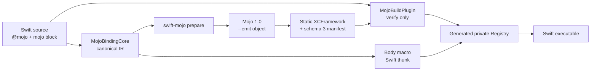
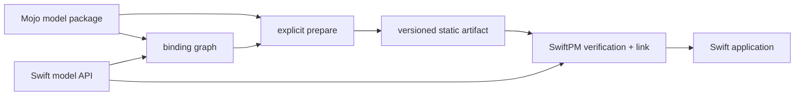
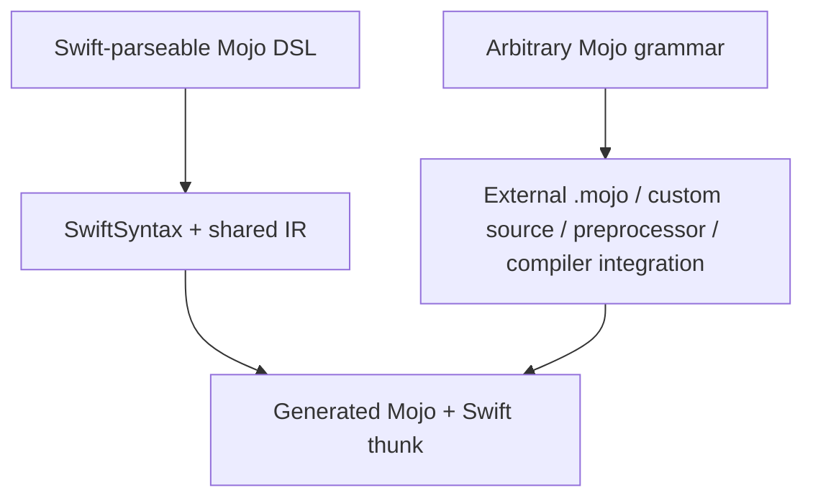

# swift-mojo

`swift-mojo` is an experimental Swift package that aims to make **Mojo feel like a native implementation language for Swift**. Swift owns the API and application structure, while Mojo owns compute and systems implementation. The generated C ABI is private plumbing and does not appear in everyday Swift APIs.

In P1, the following syntax calls an implementation that is compiled with Mojo 1.0 and linked statically:

```swift
import Mojo

@mojo
func add(_ a: Int32, _ b: Int32) -> Int32 {
    mojo {
        return a + b
    }
}
```

This does not mean that arbitrary Mojo syntax can be embedded in Swift. The current DSL deliberately accepts only an expression that adds two `Int32` arguments and returns an `Int32`. Unsupported syntax produces a diagnostic during macro expansion or preparation; it never falls back to a Swift implementation.

## What works now



- The `@attached(body)` macro replaces the original DSL body with a Swift thunk that uses a binding ID.
- The macro and source scanner use the same versioned IR.
- `swift-mojo prepare` generates Mojo source, an object file, a static archive, an XCFramework, and a manifest.
- The build plugin does not invoke the Mojo compiler. It verifies the source graph, target, ABI, and SHA-256 digest of the complete XCFramework.
- The Mojo artifact is linked statically into the final executable. Runtime lookup does not depend on absolute paths, `dlopen`, or Mojo dynamic-library discovery.
- Preparation reuses generated output only when the source, implementation, generation pipeline, compiler version, target, and artifact digest all match.
- Preparation and initialization hold an interprocess lock for each output, serializing the complete operation from cache lookup through directory commit.
- Compiler subprocesses run in a dedicated process group. After a 300-second deadline, the process owner performs TERM, KILL, and reap in sequence.

## P1 setup

P1 supports a Swift package with one Mojo-enabled arm64 target on macOS 14 or later. Build the `swift-mojo` executable product from this repository and place it on `PATH`, or invoke it using an absolute path. CLI distribution is not yet a production-ready contract.

### 1. Bootstrap the generated directory

After creating `Package.swift` and `Sources/<Target>` in the consuming package, run `init` before adding the binary target to the manifest:

```bash
swift-mojo init --package-root /path/to/MyPackage --target MyTarget
```

`init` creates the minimal XCFramework required for SwiftPM to load the package graph. Running it again does not overwrite a prepared artifact. It also refuses to replace an unmanaged or incomplete output directory.

### 2. Wire Package.swift

```swift
// swift-tools-version: 6.2
import PackageDescription

let package = Package(
    name: "MyPackage",
    platforms: [.macOS(.v14)],
    dependencies: [
        .package(
            url: "https://github.com/1amageek/swift-mojo.git",
            branch: "main"
        ),
    ],
    targets: [
        .binaryTarget(
            name: "GeneratedMojoABI",
            path: "Generated/MyTarget/GeneratedMojoABI.xcframework"
        ),
        .target(
            name: "MyTarget",
            dependencies: [
                .product(name: "Mojo", package: "swift-mojo"),
                "GeneratedMojoABI",
            ],
            plugins: [
                .plugin(name: "MojoBuildPlugin", package: "swift-mojo"),
            ]
        ),
    ]
)
```

The generated C module name is fixed in P1, so each package can contain only one Mojo-enabled target. A later artifact-set design will support multiple targets and platform slices.

### 3. Write the Swift API and Mojo implementation DSL

```swift
import Mojo

@mojo
func add(_ a: Int32, _ b: Int32) -> Int32 {
    mojo {
        return a + b
    }
}
```

### 4. Prepare with the real Mojo compiler

```bash
SWIFT_MOJO_EXECUTABLE=/absolute/path/to/mojo \
swift-mojo prepare --package-root /path/to/MyPackage --target MyTarget
```

When `SWIFT_MOJO_EXECUTABLE` is not set, the command searches `PATH` for `mojo`. The plugin never downloads or runs the compiler inside the build sandbox.

P1 `+` follows Swift-compatible checked-addition semantics. `Int32` overflow traps before entering the Mojo dispatcher. P1 also rejects an `@mojo` declaration inside `#if`, because the preparation scanner does not own the Swift compiler's active build conditions.

### 5. Commit and build

`Generated/MyTarget` must be committed. SwiftPM requires a local binary target to exist while it loads the package graph, before any plugin can run. Ignoring this directory would make a fresh clone impossible to resolve. After changing the implementation, run `prepare` again and review the manifest and artifact changes together.

During a normal Xcode or SwiftPM build, the plugin tracks the Swift sources, manifest, XCFramework root, and every regular file and directory inside the XCFramework. It rejects:

- A missing manifest or XCFramework.
- An artifact that is stale relative to its source.
- A target-triple or CPU mismatch.
- Modification of the archive, header, module map, or `Info.plist`.
- An ABI, schema, or binding-graph mismatch.

A complete consumer example is available in [`Examples/ExternalMojo`](Examples/ExternalMojo).

## Components

| Component | Responsibility |
|---|---|
| `Mojo` | Swift-facing module that exposes only `@mojo` |
| `MojoMacros` | Validates the body with the shared IR and replaces it with a static Registry call |
| `MojoBindingCore` | SwiftSyntax scanning, P1 DSL semantics, and canonical binding/source graphs |
| `MojoCompilerCore` | Mojo executable discovery, version inspection, and target-aware object generation |
| `MojoArtifactCore` | Initialization, preparation, transactions, manifests, tree digests, verification, and Registry generation |
| `swift-mojo` | Command adapter for `init`, `prepare`, and `verify` |
| `MojoBuildPlugin` | Creates build-time verification commands; it does not compile Mojo |

The earlier `@mojo(symbol:library:)` API, dynamic loader, and shared-library registry conflicted with the P1 static design and are not retained as public APIs or package targets.

## Mojo model packages

Production-scale implementations such as LLMs should not be forced into the inline DSL. The long-term goal is to distribute them as independent Swift packages that contain a Mojo source package. `swift-mojo` does not become a model framework or model catalog; each model package owns the relationship between its Swift API, Mojo implementation, and prepared artifact.

```text
LlamaMojo/
├── Package.swift
├── Sources/LlamaMojo/            # Public Swift model/session API
├── Mojo/LlamaMojoModel/
│   ├── __init__.mojo             # Mojo package boundary
│   ├── Model.mojo
│   └── Kernels.mojo
├── Generated/LlamaMojo/
│   ├── GeneratedMojoABI.xcframework
│   └── MojoArtifact.json
└── Tests/
```



Responsibilities are separated as follows:

| Layer | Responsibility |
|---|---|
| `swift-mojo` | Source graphs, ABI lowering, compiler orchestration, artifact preparation, build verification, and the runtime bridge |
| Model Swift package | Public Swift API, model/session lifecycle, Mojo source package, model-specific tests, and prepared artifacts |
| Application | Model selection, weight location, generation policy, UI, and product state |

`.mojo` source is an authoring input, not a runtime resource copied into the application bundle. A precompiled Mojo `.mojoc` file is tied to the exact compiler version and is not a native artifact that Swift can link directly, so it is not the public distribution boundary. On Apple platforms, Swift consumers receive an XCFramework and compatibility manifest. Future non-Apple platforms require separate artifact adapters based on the linking capabilities SwiftPM actually provides for those platforms.

Model weights remain separate from code artifacts. Production weights are not stored as SwiftPM resources or committed to the Git repository. The model package's Swift API resolves them from external storage and cache using an immutable revision or digest. Small test fixtures are the only exception.

This is a planned contract. P1 currently generates `Bindings.mojo` from Swift source and does not include external `.mojo` directories, `.mojoc` files, or model weights in preparation or verification inputs. The fixed module name also limits P1 to one Mojo-enabled target per package. See the [Roadmap](docs/ROADMAP.md) and [ADR-0002](docs/ADR-0002-MODEL-SWIFT-PACKAGE.md) for the implementation sequence and acceptance gates.

## Syntax boundary

A Swift function-body macro can replace the original body, but the Swift parser must first accept that body. `mojo { return a + b }` parses as a Swift call expression with a trailing closure, so P1 can treat it as a narrow DSL. Arbitrary Mojo grammar is not a subset of Swift grammar and therefore cannot be implemented by a conventional macro alone.



The DSL will grow incrementally, while production-scale full Mojo implementations will use external Mojo source packages as the primary surface. A custom source preprocessor or compiler integration will be considered only if there is demonstrated demand to embed arbitrary Mojo syntax directly in a Swift function body.

## Current P1 contract

| Concern | Supported now |
|---|---|
| Platform | arm64 macOS 14+ |
| Package layout | One Mojo-enabled target per package |
| Declaration | Non-generic, non-`async`, nonthrowing function |
| Signature | Exactly `(Int32, Int32) -> Int32` |
| DSL | Exactly one `mojo { return lhs + rhs }` block; operand order may be reversed |
| Artifact | Static `GeneratedMojoABI.xcframework` with a schema 3 manifest |
| Build | Committed artifact, plugin verification, and no build-time Mojo compiler |
| Runtime | Nonthrowing direct call; overflow and invariant mismatches trap rather than return a fabricated value |
| Conditional compilation | An `@mojo` declaration inside `#if` is rejected |

A generic universal archive that includes `x86_64` fails intentionally. P1 archives must explicitly set `ARCHS=arm64`.

## Development status

The following state was observed on this machine on 2026-08-20:

| Item | Observed status |
|---|---|
| Xcode | Xcode 27.0, build `27A5237l` |
| Xcode default Swift | Apple Swift 6.4 (`swiftlang-6.4.0.30.4`, swift-driver `1.168.6`) |
| Snapshot used by the shell | `swift-6.4.x-DEVELOPMENT-SNAPSHOT-2026-08-14-a`, compiler commit `424cae54c1a10da` |
| swift-syntax | Matching revision `swift-6.4.x-DEVELOPMENT-SNAPSHOT-2026-08-14-a` |
| Mojo | Mojo `1.0.0 (ed45d567)` through an isolated executable wrapper |
| Global Mojo | Not present on the shell `PATH` |
| Real result | Inline `add(20, 22)` returned `42` |
| Packaging | An arm64 Debug Xcode archive succeeded; the copied executable still returned `42` |
| Link inspection | Four fixed ABI symbols were defined in Mach-O; there was no Mojo dynamic-library dependency |
| Failure evidence | Stale source, wrong target, missing manifest/artifact, and corrupt archive/header were rejected |
| Automated tests | A historical baseline of 23 binding, macro, compiler, artifact, and plugin-integration tests passed with `xcodebuild test` |
| Current hardening | Generation identity, leaf-input tracking, checked overflow, conditional rejection, interprocess locking, and process-group timeout are implemented; the current tree, including eight additional tests, has not been executed |

The repository shell sets `TOOLCHAINS` to the snapshot, so earlier Xcode builds and tests used `env -u TOOLCHAINS xcodebuild ...` to select the default Xcode toolchain. P1 does not depend on Swift 6.3 `@c`. A future reverse-callback design must separately gate the local compiler, generated headers, ABI, and the accepted public specification at that time.

The real-Mojo acceptance test is opt-in and independent from the normal test run. When it is not enabled, Swift Testing exposes it as a disabled test.

```bash
SWIFT_MOJO_REAL_ACCEPTANCE=1 \
SWIFT_MOJO_EXECUTABLE=/absolute/path/to/mojo \
env -u TOOLCHAINS xcodebuild test \
  -scheme swift-mojo-Package \
  -destination 'platform=macOS,arch=arm64'
```

No build or test has been run after the current hardening changes. The 23-test result and the real-Mojo result of `42` are historical evidence from the immediately preceding baseline, not revalidation of the current tree.

A cold Release archive did not complete within either of two 120-second bounded attempts because host-side SwiftSyntax compilation was the bottleneck. No functional error was observed, but those attempts are not counted as completed verification. P1 archive and relocation acceptance was established with an arm64 Debug archive using the same generated Registry and real Mojo artifact.

## Non-goals

- Providing SwiftUI or Metal view integration or owning the rendering lifecycle.
- Translating all Swift code into Mojo.
- Passing arbitrary, unvalidated Mojo text into generated source.
- Exposing the C ABI, raw pointers, or artifact paths as ordinary Swift APIs.
- Installing or downloading the Mojo toolchain during a build.
- Treating unsupported types, errors, async behavior, ownership, or GPU behavior as successful by copying data, returning zero, or falling back to Swift.
- Treating the single arm64 P1 slice as a complete production-distribution design.

## Documentation

- [Requirements](docs/REQUIREMENTS.md)
- [Design](docs/DESIGN.md)
- [Philosophy](docs/PHILOSOPHY.md)
- [Roadmap](docs/ROADMAP.md)
- [ADR-0001: Offline prepare and static artifacts](docs/ADR-0001-STATIC-PREPARE-PIPELINE.md)
- [ADR-0002: Mojo models as Swift packages](docs/ADR-0002-MODEL-SWIFT-PACKAGE.md)

## Public references

- [SE-0415: Function Body Macros](https://github.com/swiftlang/swift-evolution/blob/main/proposals/0415-function-body-macros.md)
- [SwiftPM: Writing a build tool plugin](https://docs.swift.org/swiftpm/documentation/packagemanagerdocs/writingbuildtoolplugin/)
- [Mojo: `@export`](https://mojolang.org/docs/reference/decorators/export/)
- [Mojo: Modules and packages](https://mojolang.org/docs/manual/packages/)
- [Mojo: compilation targets](https://mojolang.org/docs/tools/compilation/)
- [SE-0495: C compatible functions and enums](https://github.com/swiftlang/swift-evolution/blob/main/proposals/0495-cdecl.md)
