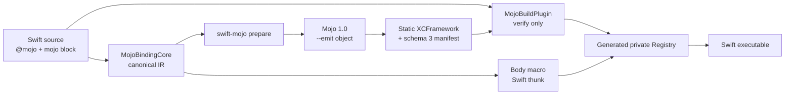
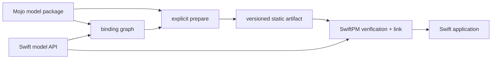
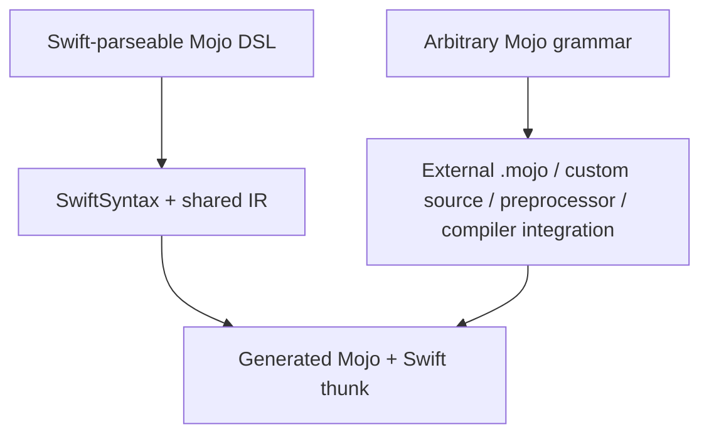

# swift-mojo

`swift-mojo` は、**MojoをSwiftのネイティブな実装言語として感じられるようにする**ための実験的Swift Packageです。SwiftがAPIとアプリケーション構造を所有し、Mojoがcompute/system実装を担います。生成されるC ABIはprivate plumbingであり、日常のSwift APIには現れません。

P1では、次の構文が実際にMojo 1.0でコンパイルされ、静的リンクされた実装を呼び出します。

```swift
import Mojo

@mojo
func add(_ a: Int32, _ b: Int32) -> Int32 {
    mojo {
        return a + b
    }
}
```

ただし、これは任意のMojo文法を埋め込めるという意味ではありません。現在のDSLは、2つの `Int32` 引数を加算して `Int32` を返す式だけを意図的に受理します。未対応syntaxはSwift fallbackへ切り替えず、macroまたはprepare時のdiagnosticになります。

## What works now



- `@attached(body)` macroが元のDSL bodyを、binding IDを使うSwift thunkへ置換します。
- 同じversioned IRがmacroとsource scannerの両方で使われます。
- `swift-mojo prepare` がMojo source、object、static archive、XCFramework、manifestを生成します。
- build pluginはMojo compilerを起動せず、source graph、target、ABI、XCFramework全体のSHA-256を検証します。
- Mojo artifactは最終実行ファイルへ静的リンクされます。実行時のabsolute path、`dlopen`、Mojo dylib探索はありません。
- prepareはsource、implementation、generation pipeline、compiler version、target、artifact digestが一致すると生成物を再利用します。
- prepare/initはoutput単位のinterprocess lockを保持し、cache確認からdirectory commitまでを直列化します。
- compiler subprocessは専用process groupで実行し、300秒のdeadline後はTERM、KILL、reapを順に行います。

## P1 setup

P1はmacOS 14以降のarm64 targetを1つ持つSwift Packageを前提にします。`swift-mojo` CLIは、このrepositoryのexecutable productをビルドしてPATHへ置くか、絶対pathで呼び出してください。CLIの配布方法はまだproduction仕様ではありません。

### 1. Bootstrap the generated directory

対象packageに `Package.swift` と `Sources/<Target>` を作った後、binary targetをmanifestへ追加する前に実行します。

```bash
swift-mojo init --package-root /path/to/MyPackage --target MyTarget
```

`init` はSwiftPMがpackage graphを読める最小XCFrameworkを作ります。再実行は既存のprepare済みartifactを上書きしません。管理外または壊れた出力directoryも置換しません。

### 2. Wire Package.swift

```swift
// swift-tools-version: 6.2
import PackageDescription

let package = Package(
    name: "MyPackage",
    platforms: [.macOS(.v14)],
    dependencies: [
        .package(
            url: "https://github.com/1amageek/swift-mojo.git",
            branch: "main"
        ),
    ],
    targets: [
        .binaryTarget(
            name: "GeneratedMojoABI",
            path: "Generated/MyTarget/GeneratedMojoABI.xcframework"
        ),
        .target(
            name: "MyTarget",
            dependencies: [
                .product(name: "Mojo", package: "swift-mojo"),
                "GeneratedMojoABI",
            ],
            plugins: [
                .plugin(name: "MojoBuildPlugin", package: "swift-mojo"),
            ]
        ),
    ]
)
```

P1の生成C module名は固定なので、1 packageにつきMojo対応targetは1つです。複数targetと複数platform sliceは次段階のartifact-set設計で扱います。

### 3. Write the Swift API and Mojo implementation DSL

```swift
import Mojo

@mojo
func add(_ a: Int32, _ b: Int32) -> Int32 {
    mojo {
        return a + b
    }
}
```

### 4. Prepare with the real Mojo compiler

```bash
SWIFT_MOJO_EXECUTABLE=/absolute/path/to/mojo \
swift-mojo prepare --package-root /path/to/MyPackage --target MyTarget
```

`SWIFT_MOJO_EXECUTABLE` を省略した場合は `PATH` の `mojo` を探します。plugin sandbox内でcompilerをdownloadまたは実行することはありません。

P1の `+` はSwiftと同じchecked additionです。`Int32` overflowはMojo dispatcherへ入る前にtrapします。また、prepare scannerとSwift compilerのactive branchを曖昧にしないため、`@mojo` declarationを `#if` の中へ置くことはP1では明示的なerrorです。

### 5. Commit and build

`Generated/MyTarget` はcommit対象です。SwiftPMのlocal binary targetはpackage graph読込時点でXCFrameworkの実体を必要とするため、ignoreするとfresh cloneが解決不能になります。source変更後は `prepare` を再実行して、manifestとartifactの差分を一緒にreviewします。

通常のXcode/SwiftPM buildではpluginがSwift source、manifest、XCFramework rootとその全regular file/directoryを入力として監視し、次を拒否します。

- manifestまたはXCFrameworkの欠落。
- source変更後の古いartifact。
- target triple/CPUの不一致。
- archive、header、module map、Info.plistの改変。
- ABI/schema/binding graphの不一致。

完全なconsumer例は [`Examples/ExternalMojo`](Examples/ExternalMojo) にあります。

## Components

| Component | Responsibility |
|---|---|
| `Mojo` | `@mojo` だけを公開するSwift-facing module |
| `MojoMacros` | bodyを共有IRで検証し、静的Registry callへ置換 |
| `MojoBindingCore` | SwiftSyntax scan、P1 DSL semantics、canonical binding/source graph |
| `MojoCompilerCore` | Mojo executable探索、version取得、target-aware object生成 |
| `MojoArtifactCore` | init、prepare、transaction、manifest、tree digest、verify、Registry生成 |
| `swift-mojo` | `init` / `prepare` / `verify` command adapter |
| `MojoBuildPlugin` | build時の検証commandだけを構成。Mojo compileは行わない |

旧 `@mojo(symbol:library:)`、dynamic loader、shared-library registryはP1の静的設計と競合するため公開面・targetともに残していません。

## Mojo model packages

LLMのような実用規模の実装は、すべてをinline DSLへ書くのではなく、Mojo source packageを含む独立したSwift Packageとして配布することを目標にします。`swift-mojo` 自体はmodel frameworkやmodel catalogにはならず、各model packageがSwift API、Mojo実装、prepared artifactの対応関係を所有します。

```text
LlamaMojo/
├── Package.swift
├── Sources/LlamaMojo/            # Public Swift model/session API
├── Mojo/LlamaMojoModel/
│   ├── __init__.mojo             # Mojo package boundary
│   ├── Model.mojo
│   └── Kernels.mojo
├── Generated/LlamaMojo/
│   ├── GeneratedMojoABI.xcframework
│   └── MojoArtifact.json
└── Tests/
```



役割は次のように分離します。

| Layer | Responsibility |
|---|---|
| `swift-mojo` | source graph、ABI lowering、compiler orchestration、artifact preparation、build verification、runtime bridge |
| model Swift Package | Swift公開API、model/session lifecycle、Mojo source package、model固有tests、prepared artifacts |
| application | model選択、weight location、generation policy、UI、product state |

`.mojo` sourceはauthoring inputであり、runtime resourceとしてapplication bundleへコピーする対象ではありません。Mojoのprecompiled `.mojoc` はcompiler versionへ厳密に依存し、それ自体はSwiftからlinkできるnative artifactではないため、公開配布境界には使いません。Apple platformのSwift consumerが取得する実行artifactはXCFrameworkとcompatibility manifestです。将来の非Apple platformは、そのplatformでSwiftPMが実際にlink可能なartifact adapterを別に設計します。

model weightsはcode artifactから分離します。通常のweightsをSwiftPM resourceやGit repositoryへ含めず、immutable revision/digestで識別した外部storageとcacheからmodel packageのSwift APIが解決します。小さなtest fixtureだけは例外です。

この構成はplanned contractです。現在のP1はSwift sourceから `Bindings.mojo` を生成するだけで、external `.mojo` directory、`.mojoc`、model weightsをprepare/verify入力として扱いません。また、固定module名により1 packageにつきMojo対応targetは1つです。実装順序とacceptance条件は [Roadmap](docs/ROADMAP.md) と [ADR-0002](docs/ADR-0002-MODEL-SWIFT-PACKAGE.md) に記載します。

## Syntax boundary

Swift function body macroは元bodyを置換できますが、元bodyはSwift parserが受理できる必要があります。`mojo { return a + b }` はSwift call-expressionとしてparse可能なので、狭いDSLとして扱えます。任意のMojo grammarはSwift grammarの部分集合ではないため、通常のmacroだけでは成立しません。



今後はDSLの意味論を段階的に増やす一方、実用規模のfull Mojo実装にはexternal Mojo source packageを第一のsurfaceとして追加します。それでもarbitrary Mojo syntaxをSwift function bodyへ直接埋め込む必要が立証された場合だけ、独自source preprocessingまたはcompiler integrationを評価します。

## Current P1 contract

| Concern | Supported now |
|---|---|
| Platform | arm64 macOS 14+ |
| Package layout | one Mojo-enabled target per package |
| Declaration | non-generic、non-`async`、non-throwing function |
| Signature | exactly `(Int32, Int32) -> Int32` |
| DSL | exactly one `mojo { return lhs + rhs }` block; operand order may be reversed |
| Artifact | static `GeneratedMojoABI.xcframework` + schema 3 manifest |
| Build | committed artifact、plugin verification、no build-time Mojo compiler |
| Runtime | nonthrowing direct call; overflowとinvariant mismatchはfake valueを返さずtrap |
| Conditional compilation | `@mojo` declarationを `#if` 内へ置くことは未対応として拒否 |

`x86_64` を含むgeneric universal archiveは意図的に失敗します。P1 archiveは `ARCHS=arm64` を明示してください。

## Development status

2026-08-20にこのmachineで確認した状態です。

| Item | Observed status |
|---|---|
| Xcode | Xcode 27.0, build `27A5237l` |
| Xcode default Swift | Apple Swift 6.4 (`swiftlang-6.4.0.30.4`, swift-driver `1.168.6`) |
| Snapshot used by shell | `swift-6.4.x-DEVELOPMENT-SNAPSHOT-2026-08-14-a`, compiler commit `424cae54c1a10da` |
| swift-syntax | matching revision `swift-6.4.x-DEVELOPMENT-SNAPSHOT-2026-08-14-a` |
| Mojo | Mojo `1.0.0 (ed45d567)` through an isolated executable wrapper |
| Global Mojo | not present on shell `PATH` |
| Real result | inline `add(20, 22)` returned `42` |
| Packaging | arm64 Debug Xcode archive succeeded; copied executable still returned `42` |
| Link inspection | four fixed ABI symbols defined in Mach-O; no Mojo dylib dependency |
| Failure evidence | stale source、wrong target、missing manifest/artifact、corrupt archive/headerを拒否 |
| Automated tests | binding、macro、compiler、artifact、plugin integrationの23件を `xcodebuild test` で検証 |
| Current hardening | generation identity、leaf input tracking、checked overflow、conditional rejection、interprocess lock、process-group timeoutを実装。追加8 testsを含む現行treeは未実行 |

このrepositoryのshellでは `TOOLCHAINS` がsnapshotを指すため、Xcode build/testは `env -u TOOLCHAINS xcodebuild ...` でXcode default toolchainを選びました。Swift 6.3の `@c` には依存していません。将来のreverse callbackで検討するときは、その時点のlocal compilerとaccepted public specificationを別途gateします。

real Mojo acceptanceは通常testから独立して明示的に有効化します。無効時はSwift Testing上でdisabled testとして可視化されます。

```bash
SWIFT_MOJO_REAL_ACCEPTANCE=1 \
SWIFT_MOJO_EXECUTABLE=/absolute/path/to/mojo \
env -u TOOLCHAINS xcodebuild test \
  -scheme swift-mojo-Package \
  -destination 'platform=macOS,arch=arm64'
```

このhardening後のtest/buildはまだ実行していないため、上表の23 testsと実Mojo `42` は直前baselineの履歴であり、現行treeの再検証結果ではありません。

Cold Release archiveはSwiftSyntaxのhost-side compileがボトルネックになり、このmachineで行った2回の120秒制限付き再検証では完了しませんでした。機能エラーは観測していませんが、完了した検証としては扱いません。P1のarchive/relocation acceptanceは、同じgenerated registryと実Mojo artifactを使うarm64 Debug archiveで確認しています。

## Non-goals

- SwiftUI、Metal view integration、rendering lifecycleを提供すること。
- Swift全体をMojoへ変換すること。
- 任意のMojo textを検証せず生成sourceへ通すこと。
- C ABI、raw pointer、artifact pathを通常のSwift APIにすること。
- build中にMojo toolchainをinstallまたはnetwork取得すること。
- 未対応の型、error、async、ownership、GPUをcopy、zero、Swift fallbackで成功扱いすること。
- P1の単一arm64 sliceをproduction distributionの完成形とみなすこと。

## Documentation

- [Requirements](docs/REQUIREMENTS.md)
- [Design](docs/DESIGN.md)
- [Philosophy](docs/PHILOSOPHY.md)
- [Roadmap](docs/ROADMAP.md)
- [ADR-0001: Offline prepare and static artifacts](docs/ADR-0001-STATIC-PREPARE-PIPELINE.md)
- [ADR-0002: Mojo models as Swift packages](docs/ADR-0002-MODEL-SWIFT-PACKAGE.md)

## Public references

- [SE-0415: Function Body Macros](https://github.com/swiftlang/swift-evolution/blob/main/proposals/0415-function-body-macros.md)
- [SwiftPM: Writing a build tool plugin](https://docs.swift.org/swiftpm/documentation/packagemanagerdocs/writingbuildtoolplugin/)
- [Mojo: `@export`](https://mojolang.org/docs/reference/decorators/export/)
- [Mojo: Modules and packages](https://mojolang.org/docs/manual/packages/)
- [Mojo: compilation targets](https://mojolang.org/docs/tools/compilation/)
- [SE-0495: C compatible functions and enums](https://github.com/swiftlang/swift-evolution/blob/main/proposals/0495-cdecl.md)
