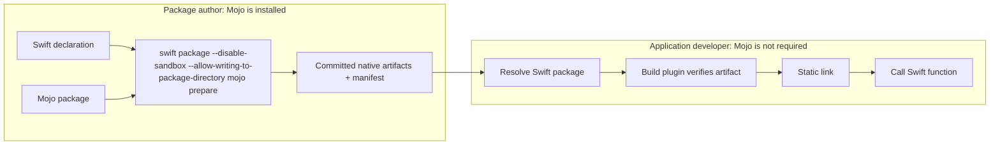
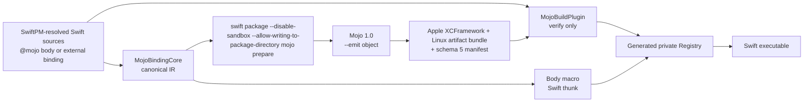
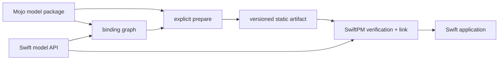
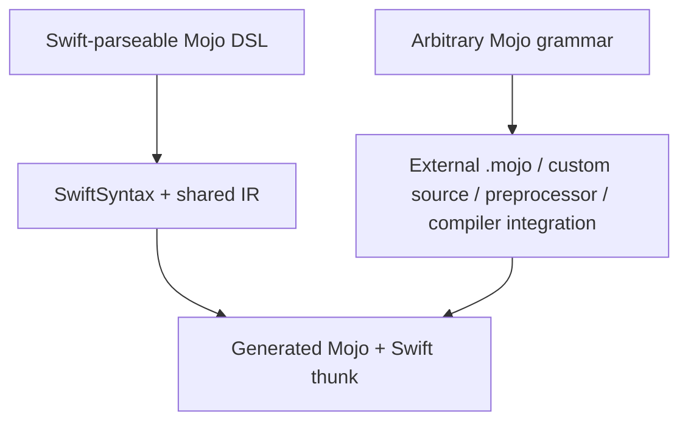

# 🔥 swift-mojo

`swift-mojo` is an experimental bridge for implementing a Swift function in Mojo and shipping the compiled implementation as part of a Swift package. Swift owns the public API and application structure; Mojo owns the compute implementation. Generated C symbols, headers, binding IDs, and artifact paths stay private.

> **Current status:** the macOS scalar, borrowed-buffer, mutable-output, synchronous session, and session-owned Float32-buffer paths are verified through real Mojo compile, static link, and runtime execution. The session path includes typed capability negotiation, factory-domain isolation, child-before-parent ownership, exactly-once shutdown, concurrent-use rejection, and separate Swift-side and Mojo-side Address Sanitizer runs. Schema 5 also generates and verifies a SwiftPM `staticLibrary` artifact bundle from a real Mojo `aarch64-unknown-linux-gnu` cross-compile. Native Jetson link/run, Metal/CUDA buffer implementations, async execution, tensors, model inference, allocation/copy measurement, and dedicated sanitizer coverage for the standalone borrowed-buffer families remain pending.

## Start with a Swift function

The package author writes the API in Swift and marks the implementation with `@mojo`:

```swift
import Mojo

@mojo
public func add(_ a: Int32, _ b: Int32) -> Int32 {
    return a + b
}
```

After the package author prepares and commits the native artifact, an application calls the function as ordinary Swift:

```swift
import ModelMath

let value = add(20, 22)
print(value) // 42
```

```text
Package author                          Application developer

@mojo Swift source
        |
        v
swift package --disable-sandbox --allow-writing-to-package-directory mojo prepare
        |
        v
committed native artifacts   -------> import ModelMath
                                        add(20, 22)

Mojo compiler required                 Mojo compiler not required
```

The inline body above is intentionally small today: it accepts the validated scalar expression supported by the current `(Int32, Int32) -> Int32` bridge. The body is not executed as Swift. The macro replaces it with a call to the prepared Mojo artifact, and unsupported bodies fail instead of falling back to Swift.

For full Mojo source, multiple files, or package-level organization, keep the implementation in an external Mojo package as shown below. Immutable input, caller-owned mutable-output `Float`, synchronous opaque sessions, and session-owned Float32 buffers with synchronous host transfers are available for that external form. MAX-backed Metal/CUDA allocation and device synchronization, tensors, async execution, GPU runtime adapters, and LLM inference remain future work.

## A complete example

The following example exposes `add` as a Swift API while keeping its implementation in a Mojo package.

```text
ModelMath/
├── Package.swift
├── Sources/ModelMath/
│   └── ModelMath.swift
├── Mojo/MathModel/
│   └── __init__.mojo
├── Generated/ModelMath/       created by prepare, then committed
└── SwiftMojo.json
```

### 1. Declare the Swift API

```swift
import Mojo

@mojo(package: "MathModel", function: "add")
public func add(_ a: Int32, _ b: Int32) -> Int32
```

The declaration is the public Swift surface. Callers do not import a C module or use pointers.

### 2. Implement it in Mojo

```mojo
# Mojo/MathModel/__init__.mojo

def add(a: Int32, b: Int32) -> Int32:
    return a + b
```

The package author may organize the implementation across additional files under `Mojo/MathModel`. Every regular source file becomes part of the verified input graph.

### 3. Declare the compiler and target contract

```json
{
  "schemaVersion": 1,
  "targets": {
    "ModelMath": {
      "compilerVersion": "Mojo 1.0.0 (ed45d567)",
      "mojoPackages": ["MathModel"],
      "slices": [
        {
          "triple": "arm64-apple-macosx14.0",
          "cpu": "generic"
        },
        {
          "triple": "x86_64-apple-macosx14.0",
          "cpu": "x86-64"
        }
      ]
    }
  }
}
```

This configuration pins the authoring compiler and the native slices that must be present in a releasable artifact. The required `Package.swift` binary-target and plugin declarations are shown in [Package setup](#package-setup).

### 4. Prepare the native artifact

```bash
SWIFT_MOJO_EXECUTABLE=/absolute/path/to/mojo \
swift package --disable-sandbox --allow-writing-to-package-directory mojo prepare --target ModelMath

swift package --allow-writing-to-package-directory mojo release --target ModelMath
```

`prepare` compiles the Mojo package for every configured target and creates the committed native artifact set: an XCFramework for Apple slices and a SwiftPM static-library artifact bundle for Linux slices. `release` does not rebuild or repair anything; it verifies that the Swift declaration, Mojo sources, compiler version, target slices, generated source map, every binary interface/tree digest, and `Package.swift` wiring still agree.

### 5. Call it from a Swift application

```swift
import ModelMath

@main
enum Application {
    static func main() {
        print(add(20, 22))
    }
}
```

Output:

```text
42
```

The consumer uses a normal Swift package dependency. It does not run `prepare`, install Mojo, or know about the generated ABI.

## Borrow a contiguous Float buffer

The first non-scalar vertical slice keeps the public API in Swift while borrowing an `Array<Float>` only for the duration of a synchronous Mojo call:

```swift
import Mojo

@mojo(package: "MathModel", function: "sum")
public func sum(_ values: [Float]) throws -> Float

let total = try sum([1, 2, 3, 4]) // 10.0
```

```mojo
# Mojo/MathModel/__init__.mojo
from std.memory import Pointer

def sum(
    values: Pointer[Float32, ImmUntrackedOrigin],
    count: UInt64,
) -> Float32:
    var result = Float32(0)
    for index in range(Int(count)):
        result += values[unsafe_offset=index]
    return result
```

The generated bridge borrows the array storage and lowers the call to `const float * + uint64_t count -> float`. It does not allocate an intermediate array or use an out-result buffer. ABI, input-graph, and complete binding membership are checked once through a thread-safe immutable validation cache; repeated calls retain only an inlinable binding-family guard, the scoped borrow, and one C ABI call. The pointer cannot escape the call, Mojo does not free it, and an empty input is rejected as `MojoInvocationError.emptyBorrowedBuffer`. No raw pointer appears in the package's public function declaration. Allocation and copy behavior still require benchmark evidence before this path is described as verified zero-copy.

## Mutate a caller-owned Float buffer

The next vertical slice lets Mojo write into Swift-owned storage without transferring ownership across the ABI:

```swift
import Mojo

@mojo(package: "MathModel", function: "scale")
public func scale(_ input: [Float], into output: inout [Float]) throws

var output = [Float](repeating: 0, count: 3)
try scale([1, 2, 3], into: &output) // [2, 4, 6]
```

```mojo
# Mojo/MathModel/__init__.mojo
from std.memory import Pointer

def scale(
    input: Pointer[Float32, ImmUntrackedOrigin],
    input_count: UInt64,
    output: Pointer[Float32, MutUntrackedOrigin],
    output_count: UInt64,
) -> Int32:
    if output_count < input_count:
        return 7
    for index in range(Int(input_count)):
        output[unsafe_offset=index] = input[unsafe_offset=index] * 2
    return 0
```

The generated Swift Registry nests `withUnsafeBufferPointer` and `withUnsafeMutableBufferPointer`, so both pointers exist only for one synchronous dispatcher call. The C boundary is `const float * + input count + float * + output count -> int32_t status`. Status `0` is success; every nonzero status becomes `MojoInvocationError.invocationFailed` and cannot be mistaken for a successful mutation. Empty input and output buffers are rejected independently before entering Mojo. Swift remains the owner of both arrays, and Mojo must not retain or free either pointer.

## Keep Mojo-owned state across calls

A model package can create native state once, reuse it for synchronous calls, and shut it down through a Swift owner:

```swift
import Mojo

@mojo(
    package: "ModelRuntime",
    function: "create_session",
    shutdown: "shutdown_session"
)
public func openSession(
    _ requirements: MojoSessionRequirements
) throws -> MojoSessionOwner

@mojo(
    package: "ModelRuntime",
    function: "create_buffer",
    shutdown: "destroy_buffer",
    copyFromHost: "copy_from_host",
    copyToHost: "copy_to_host",
    synchronize: "synchronize",
    sessionFactory: "openSession"
)
public func makeBuffer(
    _ session: MojoSessionOwner,
    elementCount: UInt64,
    memoryKind: MojoBufferMemoryKind
) throws -> MojoFloat32BufferOwner

@mojo(
    package: "ModelRuntime",
    function: "run",
    sessionFactory: "openSession"
)
public func run(
    _ session: MojoSessionOwner,
    _ input: [Float],
    into output: inout [Float]
) throws

let session = try openSession(
    MojoSessionRequirements(
        device: .cpu,
        requiredCapabilities: [
            .synchronousInvocation,
            .hostAccessibleMemory,
            .float32,
        ]
    )
)
var output = [Float](repeating: 0, count: 3)
try run(session, [1, 2, 3], into: &output)
let buffer = try makeBuffer(session, elementCount: 4096, memoryKind: .host)
try buffer.copy(from: [Float](repeating: 1, count: 4096))
var copied = [Float](repeating: 0, count: 4096)
try buffer.copy(into: &copied)
try buffer.shutdown()
try session.shutdown()
```

The generated C ABI creates an opaque session and session-owned buffer handles, passes them only inside scoped synchronous invocations, and routes destruction to each factory's paired shutdown function. Each buffer factory also declares `copyFromHost`, `copyToHost`, and `synchronize` operations. Generated Mojo calls `synchronize` after every successful transfer and before returning, so a Swift array pointer never escapes its borrow scope even when the device copy itself is enqueued asynchronously. Swift never exposes raw pointers to application code. The owner enforces exact element counts, factory-domain isolation, one active invocation at a time, typed use-after-shutdown/busy/active-resource failures, idempotent explicit shutdown, and exactly-once child-before-parent deallocation with a `deinit` fallback.

This is a generic CPU-capable ownership bridge, not an LLM API by itself. The model package still defines the Mojo session layout, model loading, weights, tokenization, and inference methods. Current static artifacts must be link-closed against target system libraries; `prepare` rejects unresolved `AsyncRT_*`, `KGEN_CompilerRT_*`, and `MGP_RT_*` dependencies instead of allowing a later consumer link failure. A future MAX, GPU, or async runtime must be introduced as an explicit versioned adapter rather than an implicit dynamic dependency.

For an isolated accelerator worker, `runtime-prepare` creates a separate schema-1
dependency receipt from a compiled object and explicitly supplied dynamic
libraries. The receipt binds the object digest, target identity, library digests,
architecture, install names/SONAMEs, exact symbol providers, transitive dynamic
closure, and observed system dependencies. `runtime-verify` reconstructs that
receipt from the current files and rejects missing, extra, ambiguous, unreachable,
or modified dependencies. This receipt does not weaken the link-closed static
artifact policy and does not by itself claim that a worker linked or executed.
See `docs/ADR-0010-ACCELERATOR-RUNTIME-RECEIPTS.md`.

`runtime-bundle-prepare` consumes a verified receipt, links one executable, and
atomically commits an exact `bin/` + `lib/` deployment tree. Apple executables
use only `@executable_path/../lib`; Linux executables use only
`$ORIGIN/../lib` and the target's fixed ELF interpreter. A fresh
`runtime-bundle-verify` rejects extra files, non-executable workers, changed
digests, ambient install names, incomplete runtime imports, or loader metadata
that differs from the manifest. Bundle creation is local deployment tooling; it
does not grant redistribution rights for third-party runtime libraries. See
`docs/ADR-0011-ISOLATED-RUNTIME-BUNDLES.md`.

Downstream launchers import the read-only `MojoRuntime` product and call a
`MojoRuntimeBundleVerifying` implementation before accepting or spawning a
relocated bundle. `FileSystemMojoRuntimeBundleVerifier` returns only immutable
verified identity, target, executable, library, and loader metadata; it does
not expose source paths, mutate the bundle, or launch accelerator code. See
`docs/ADR-0012-PUBLIC-RUNTIME-VERIFICATION.md`.

## Author and consumer experience



| Role | Works with | Runs Mojo compiler? | Normal command |
|---|---|---:|---|
| Package author | Swift bindings, `.mojo` sources, target configuration, generated artifact | Yes, during explicit `prepare` | `swift package --disable-sandbox --allow-writing-to-package-directory mojo prepare --target <Target>` |
| CI/release verifier | Committed sources, manifest, native artifact set, package wiring | No | `swift package --allow-writing-to-package-directory mojo release --target <Target>` |
| Application developer | Public Swift API and a normal Swift package dependency | No | Build in Xcode or with SwiftPM |

## Where an LLM package fits

The intended production use case is a separate package such as `LlamaMojo`, not model code built into `swift-mojo` itself:

```text
LlamaMojo package
├── Sources/LlamaMojo/        Swift Model and Session API
├── Mojo/LlamaMojoModel/      model and kernel implementation
├── Generated/LlamaMojo/      prepared native slices
├── SwiftMojo.json            compiler and target contract
└── Tests/                    model-specific acceptance
```

`swift-mojo` provides the language and artifact bridge plus a generic synchronous session owner. The model package owns tensor/model semantics, weight compatibility, tokenizer behavior, inference tests, and its Mojo create/use/shutdown implementations. The application owns model selection, weight location, generation policy, and UI.

That model architecture is not yet implemented end to end. The borrowed `Float` slices prove synchronous non-owning data paths, while the opaque session slice proves Mojo-created state surviving across calls with exactly-once destruction. Model weights, KV caches, logits, owned device tensors, async execution, and GPU runtime adapters still require later ABI families.

## How it works internally



- The `@attached(body)` macro replaces the original body with a Swift thunk that uses a binding ID.
- The macro and source scanner use the same versioned IR.
- The command and build plugins obtain the target's exact Swift source inventory from SwiftPM's resolved `sourceModule.sourceFiles`. The core never reconstructs that inventory by scanning `Sources/<Target>`, so custom `path:`, `sources:`, and `exclude:` declarations have the same meaning during prepare, inspect, build verification, and release verification.
- The source scanner accepts only package-owned, regular, non-symbolic Swift files and rejects parser diagnostics before extracting bindings, so external mutable bytes or malformed Swift cannot produce a release-valid input graph.
- `swift package --disable-sandbox --allow-writing-to-package-directory mojo prepare` generates canonical Mojo source, a source map, target slices, Apple static frameworks inside an XCFramework, Linux static-library artifact-bundle variants, and a schema-5 manifest.
- Preparation inspects every compiled object before archiving. Compiler-runtime symbols that are not distributed by `swift-mojo` fail with a typed error; they are never silently converted into a Mojo dynamic-library dependency.
- The build plugin does not invoke the Mojo compiler. It verifies the complete input graph, configured slice set, ABI, adapter metadata, and SHA-256 digest of every regular file in every prepared native artifact. Hidden files participate in each tree digest, and symbolic links are rejected.
- The Mojo artifact is linked statically into the final executable. Runtime lookup does not depend on absolute paths, `dlopen`, or Mojo dynamic-library discovery.
- External Mojo packages are real compiler inputs: generated entry code imports their declared functions, preparation exposes only declared packages through an isolated `-I` root, and every regular package file participates in the input graph. Package-internal symbolic links are rejected so compiler-visible bytes cannot escape that graph.
- Preparation reuses generated output only when the Swift bindings, external Mojo packages, generation pipeline, pinned compiler version, all target slices, source map, and artifact digest match.
- Initialization, preparation, build verification, and release verification share an interprocess lock for each output. Verification cannot observe a prepare transaction between its manifest, source-map, and XCFramework reads.
- Preparation re-reads Swift and external Mojo inputs before commit, so edits that race compilation cannot publish a mixed source/artifact snapshot.
- Compiler subprocesses run in a dedicated process group. After a 300-second deadline, the process owner performs TERM, KILL, and reap in sequence.

## Package setup

Authoring commands are exposed through a SwiftPM command plugin. SwiftPM builds the internal `swift-mojo` executable automatically; package authors do not need to install that executable on `PATH`.

The plugin owns both package-mutating commands (`init` and `prepare`) and read-only commands under one `mojo` verb. SwiftPM permissions are declared for the whole plugin rather than per subcommand, so every invocation must include `--allow-writing-to-package-directory`, including `inspect`, `doctor`, and `release`. The command still performs only the operation selected by the subcommand; in particular, `release` remains read-only for package-owned files.

`prepare` and `doctor` also launch the separately installed Mojo toolchain. That toolchain reads its standard library outside the Swift package, and SwiftPM does not offer a directory-read permission for command plugins. Those two commands therefore require `--disable-sandbox`; `init`, `inspect`, and `release` keep the plugin sandbox enabled. Run authoring commands only with a compiler installation you trust.

### 1. Bootstrap the generated directory

After creating the SwiftPM target and its source files in the consuming package, run `init` before adding the binary target to the manifest. Conventional `Sources/<Target>` and custom SwiftPM target paths are both supported:

```bash
swift package --allow-writing-to-package-directory mojo init --target MyTarget
```

`init` creates every bootstrap artifact required by the configured adapter set so SwiftPM can load the package graph, then prints platform-conditioned `Package.swift` wiring. Running it again does not overwrite a prepared artifact. It also refuses to replace an unmanaged or incomplete output directory.

### 2. Wire Package.swift

```swift
// swift-tools-version: 6.2
import PackageDescription

let package = Package(
    name: "MyPackage",
    platforms: [.macOS(.v15)],
    products: [
        .library(name: "MyTarget", targets: ["MyTarget"]),
    ],
    dependencies: [
        .package(
            url: "https://github.com/1amageek/swift-mojo.git",
            exact: "0.2.1"
        ),
    ],
    targets: [
        .binaryTarget(
            name: "SwiftMojo_MyTarget_ABI",
            path: "Generated/MyTarget/SwiftMojo_MyTarget_ABI.xcframework"
        ),
        .target(
            name: "MyTarget",
            dependencies: [
                .product(name: "Mojo", package: "swift-mojo"),
                "SwiftMojo_MyTarget_ABI",
            ],
            plugins: [
                .plugin(name: "MojoBuildPlugin", package: "swift-mojo"),
            ]
        ),
    ]
)
```

The generated module, archive, and C symbols are derived from the Swift target identity. Common ASCII identifiers stay readable; a target name containing `-` receives its full target digest in the module/archive component so names such as `Model-Core` and `Model_Core` cannot normalize to the same binary identity. This prevents collisions when a package graph links more than one Mojo-enabled target.

Released consumers should use the stable semantic-version requirement shown above; `0.2.1` is the current usable release. A consumer intentionally evaluating an unreleased commit may instead pin its full Git object ID. Release verification rejects moving branches and symbolic or abbreviated revisions, and semantic-version requirements must be syntactically valid. The remote acceptance gates additionally prove that SwiftPM's `Package.resolved` version and revision match the advertised release.

### 3. Pin the authoring contract

Add `SwiftMojo.json` at the package root. It is the release contract for the Mojo compiler, external package inputs, and required native slices:

```json
{
  "schemaVersion": 1,
  "targets": {
    "MyTarget": {
      "compilerVersion": "Mojo 1.0.0 (ed45d567)",
      "mojoPackages": [],
      "slices": [
        {
          "triple": "arm64-apple-macosx14.0",
          "cpu": "generic"
        },
        {
          "triple": "x86_64-apple-macosx14.0",
          "cpu": "x86-64"
        }
      ]
    }
  }
}
```

Schema 1 is closed: unknown root, target, or slice keys are rejected instead of being ignored. Slices for different architectures of the same Apple platform and variant are compiled independently, merged into one universal archive, and wrapped in a target-scoped static framework before XCFramework packaging. The manifest still records and verifies every compiler target separately.

When Linux slices are present, `init`/`prepare` also create `<module>.artifactbundle` and print a `<module>_Linux` binary target. The Swift source target depends on Apple and Linux binary targets with `.when(platforms:)` conditions; both artifacts expose the same generated C module name, so source code does not branch by platform.

### 4. Write an inline implementation

```swift
import Mojo

@mojo
func add(_ a: Int32, _ b: Int32) -> Int32 {
    return a + b
}
```

The current inline subset supports checked `Int32` addition. Production implementations can live in a Mojo package instead:

```swift
@mojo(package: "MathModel", function: "add")
func add(_ a: Int32, _ b: Int32) -> Int32
```

```text
Mojo/MathModel/
├── __init__.mojo   # exports add
└── Math.mojo
```

List `MathModel` in the target's `mojoPackages` array. The generated ABI entry module imports `add` from that package; the files are not copied into the runtime bundle.

### 5. Prepare with the pinned Mojo compiler

```bash
SWIFT_MOJO_EXECUTABLE=/absolute/path/to/mojo \
swift package --disable-sandbox --allow-writing-to-package-directory mojo prepare --target MyTarget
```

When `SWIFT_MOJO_EXECUTABLE` is not set, the command searches `PATH` for `mojo`. The plugin never downloads or runs the compiler inside the build sandbox.
When a macOS authoring toolchain does not expose `llvm-ar` through `xcrun`, a
Linux slice additionally requires `SWIFT_MOJO_LLVM_AR` to name its absolute
LLVM archiver path. Linux preparation fails unless the finished archive lists
the compiled Mojo object member.

Inline `+` follows Swift-compatible checked-addition semantics. `Int32` overflow traps before entering the Mojo dispatcher. An `@mojo` declaration inside `#if` is rejected because the preparation scanner does not own the Swift compiler's active build conditions.

### 6. Inspect, validate, commit, and build

```bash
swift package --allow-writing-to-package-directory mojo inspect --target MyTarget
swift package --disable-sandbox --allow-writing-to-package-directory mojo doctor --target MyTarget
swift package --allow-writing-to-package-directory mojo release --target MyTarget
```

`inspect` renders the exact generated Mojo and binding identity without compiling. `doctor` checks Swift, Xcode, Mojo, package layout, external packages, and the pinned compiler version. `release` is read-only for package-owned files, holds the same output lock as preparation, and rejects legacy manifests, local dependencies, moving branches, symbolic or abbreviated revisions, malformed semantic versions, non-literal package requirements, a Mojo product or build plugin that does not come from the same declared package, missing binary-target wiring, compiler/slice/config drift, generated-Mojo/source-map drift, interface damage, concurrent input changes, and any source or artifact digest mismatch. Generated Mojo and its source map are re-rendered from the current input graph; matching self-declared manifest digests alone is insufficient.

`Generated/MyTarget` must be committed. SwiftPM requires a local binary target to exist while it loads the package graph, before any plugin can run. Ignoring this directory would make a fresh clone impossible to resolve. After changing the implementation, run `prepare` again and review the manifest and artifact changes together.

The current release gate intentionally accepts only literal `Package.swift` declarations for the Mojo binary target path, target dependency array, and plugin array. Computed manifest fragments fail closed because the source-only verifier cannot prove their evaluated relationship. This restriction can be removed only by replacing it with an equally deterministic PackageDescription evaluation contract.

During a normal Xcode or SwiftPM build, the plugin tracks Swift sources, `SwiftMojo.json`, external Mojo package trees, canonical generated Mojo, the source map, manifest, every native artifact root, and every regular file and directory inside those artifacts. It rejects:

- A missing manifest or required native artifact.
- An artifact that is stale relative to its source.
- A target-triple or CPU mismatch.
- Modification of the archive, header, module map, or `Info.plist`.
- An ABI, schema, or binding-graph mismatch.
- A target-specific module identity, pinned compiler, required-slice, external-package, source-map, adapter, or native-artifact metadata mismatch.

The committed [`Examples/ExternalMojo`](Examples/ExternalMojo) fixture intentionally preserves the schema-3 baseline for legacy-reader compatibility tests. Current schema-5 mixed Apple/Linux evidence is the integration fixture under `Generated/MojoBuildPluginIntegrationFixture`; `scripts/release-acceptance.sh` remains the immutable-revision Apple release workflow.

## Components

| Component | Responsibility |
|---|---|
| `Mojo` | Swift-facing module that exposes `@mojo` and typed invocation errors |
| `MojoMacros` | Validates the body with the shared IR and replaces it with a static Registry call |
| `MojoBindingCore` | SwiftSyntax scanning, P1 DSL semantics, and canonical binding/source graphs |
| `MojoCompilerCore` | Mojo executable discovery, version inspection, and target-aware object generation |
| `MojoArtifactCore` | Input graphs, source maps, artifact sets, preparation, inspection, doctor checks, build verification, and release gates |
| `MojoCommandCore` | Testable command parsing, text/JSON output, and Core orchestration |
| internal `swift-mojo` target | Private process adapter used by both plugins; it is not an executable product users install |
| `MojoCommandPlugin` | Exposes authoring commands as `swift package --allow-writing-to-package-directory mojo ...` |
| `MojoBuildPlugin` | Creates build-time verification commands; it never compiles Mojo |
| `MojoBuildPluginIntegrationFixture` | Internal schema-5 mixed-artifact consumer target that proves macro, plugin, Apple static link, and runtime behavior in the normal package graph |

The earlier `@mojo(symbol:library:)` API, dynamic loader, and shared-library registry conflicted with the P1 static design and are not retained as public APIs or package targets.

## Mojo model packages

Production-scale implementations such as LLMs should not be forced into the inline DSL. The long-term goal is to distribute them as independent Swift packages that contain a Mojo source package. `swift-mojo` does not become a model framework or model catalog; each model package owns the relationship between its Swift API, Mojo implementation, and prepared artifact.

```text
LlamaMojo/
├── Package.swift
├── Sources/LlamaMojo/            # Public Swift model/session API
├── Mojo/LlamaMojoModel/
│   ├── __init__.mojo             # Mojo package boundary
│   ├── Model.mojo
│   └── Kernels.mojo
├── Generated/LlamaMojo/
│   ├── SwiftMojo_LlamaMojo_ABI.xcframework
│   ├── Bindings.mojo
│   ├── MojoArtifact.json
│   └── MojoSourceMap.json
├── SwiftMojo.json
└── Tests/
```



Responsibilities are separated as follows:

| Layer | Responsibility |
|---|---|
| `swift-mojo` | Source graphs, ABI lowering, compiler orchestration, artifact preparation, build verification, and the runtime bridge |
| Model Swift package | Public Swift API, model/session lifecycle, Mojo source package, model-specific tests, and prepared artifacts |
| Application | Model selection, weight location, generation policy, UI, and product state |

`.mojo` source is an authoring input, not a runtime resource copied into the application bundle. A precompiled Mojo `.mojoc` file is tied to the exact compiler version and is not a native artifact that Swift can link directly, so it is not the public distribution boundary. Apple consumers receive an XCFramework; Linux consumers receive an SE-0482 static-library artifact bundle. Both are governed by one compatibility manifest.

Model weights remain separate from code artifacts. Production weights are not stored as SwiftPM resources or committed to the Git repository. The model package's Swift API resolves them from external storage and cache using an immutable revision or digest. Small test fixtures are the only exception.

The current source tree implements external source discovery, package imports, deterministic package digests, target-scoped ABI identities, universal Apple artifacts, Linux static-library artifact bundles, configuration-aware build verification, the release gate, immutable/mutable borrowed `Float` ABI slices, a synchronous opaque-session ABI, and a session-owned Float32-buffer ABI with exact-count synchronous host copies. Model weights, tensor semantics, MAX-backed Metal/CUDA allocation and synchronization, model-specific APIs, inference acceptance, and remote artifact distribution remain outside the current bridge or are still planned.

## Syntax boundary

A Swift function-body macro can replace the original body, but the Swift parser must first accept that body. The direct `return a + b` spelling is valid Swift syntax, so the shared IR can treat it as a narrow Mojo implementation subset. Arbitrary Mojo grammar is not a subset of Swift grammar and therefore cannot be implemented by a conventional macro alone.



The DSL will grow incrementally, while production-scale full Mojo implementations will use external Mojo source packages as the primary surface. A custom source preprocessor or compiler integration will be considered only if there is demonstrated demand to embed arbitrary Mojo syntax directly in a Swift function body.

## Current implemented contract

| Concern | Supported now |
|---|---|
| Platform adapter | Apple XCFramework for arm64/aarch64/x86_64 macOS/iOS; SwiftPM static-library artifact bundle for aarch64/x86_64 Linux |
| Package layout | Target-scoped static frameworks, modules, archives, symbols, and output directories |
| Declaration | File-scope, non-generic, non-`async`; scalar is nonthrowing and buffer/session signatures are throwing |
| Signature | Scalar addition, immutable/mutable host `Float` borrows, runtime-session factory/use, and session-owned Float32-buffer factory with synchronous host transfer |
| Inline DSL | Exactly one direct `return lhs + rhs`; operand order may be reversed |
| External implementation | `@mojo(package:function:)` plus `Mojo/<Package>/__init__.mojo` |
| Borrowed buffer | Non-empty contiguous `[Float]`; pointer is immutable and scoped to one synchronous call |
| Mutable output | Non-empty caller-owned `inout [Float]`; mutable pointer is scoped to the same synchronous call and nonzero Mojo status throws |
| Runtime session | Opaque Mojo-created handle with capability validation, factory-domain isolation, one synchronous lease, and exactly-once shutdown |
| Owned Float32 buffer | Session-owned opaque handle with host/device/pinned-host memory kind, capability/size/count validation, synchronous host copies, parent-shutdown exclusion, and paired idempotent destruction |
| Artifact | Adapter-specific XCFramework/artifact bundle, canonical generated Mojo, schema-5 manifest/source map, and declared compiler slices; Apple same-platform architectures share a universal static binary |
| Build | Committed artifact, plugin verification, and no build-time Mojo compiler |
| Release | Pinned compiler, configuration, all slices/adapters, inputs, source map, native metadata/interface, and local-dependency gate |
| Runtime | Every signature family shares one thread-safe immutable ABI/graph/full-membership validation cache; invocation failures are typed and session lifecycle state is protected by `Mutex` |
| Conditional compilation | An `@mojo` declaration inside `#if` is rejected |

CPU variants for the same Apple platform/architecture are not a SwiftPM selection mechanism. Configuration and preparation reject slices that collapse to the same XCFramework platform/architecture/variant identity before invoking the compiler. During a configured build, the verifier checks the complete slice set and Xcode selects the destination slice; `SWIFT_MOJO_TARGET_*` is an optional stricter destination assertion rather than a host-architecture default.

## Development status

The following state was observed on this machine on 2026-08-21:

| Item | Observed status |
|---|---|
| Xcode | Xcode 27.0, build `27A5237l` |
| Xcode default Swift | Apple Swift 6.4 (`swiftlang-6.4.0.30.4`, swift-driver `1.168.6`) |
| CI Xcode host | GitHub `xcode-27` preview image pinned by an exact Xcode 27.0 beta 4 (`27A5228h`) preflight; host executable link isolation is checked before tests run |
| Snapshot used by the shell | `swift-6.4.x-DEVELOPMENT-SNAPSHOT-2026-08-14-a`, compiler commit `424cae54c1a10da` |
| swift-syntax | Exact stable version `603.0.2`, resolved at `79e4b74a295b6eb74a8b585e3a39d29e70c1dbd1` and verified with both compiler lanes |
| Mojo | Mojo `1.0.0 (ed45d567)` through an isolated executable wrapper |
| Global Mojo | Not present on the shell `PATH` |
| Real result | Scalar, immutable/mutable buffers, owned CPU session, and session-owned host Float32 buffer compiled and ran; host round-trip copy, typed transfer/count/create/use/schema/capability/resource failures, and child-before-parent exactly-once shutdown were exercised |
| Packaging | Real Mojo produced universal arm64/x86_64 Apple artifacts and an aarch64 Linux static archive recorded by a schema-5 mixed-artifact manifest |
| Clean consumer | A relocated consumer resolved, built, linked, and ran with Mojo absent from `PATH` |
| Link inspection | The scalar-plus-buffer consumer defined exactly five target-scoped ABI symbols; there was no Mojo dynamic-library dependency |
| Failure evidence | Stale source, generated source/source-map drift, wrong target, missing state, malformed package wiring, symlinks, and corrupt archive/header/interface were rejected |
| Test evidence | Fresh `xcodebuild build-for-testing` plus three guarded complete-suite runs passed on both local Swift 6.3.1 and the pinned Swift 6.4 snapshot, with unchanged source/artifact hashes and no timeout or stale helper |
| Remote release acceptance | An immutable pushed revision passed real external-package compilation, universal static-framework and Linux artifact-bundle packaging, read-only release verification, compiler-free relocation, scalar/immutable/mutable/session execution, typed failures, and static-link inspection; the release process reruns this gate on the final tag commit |
| Legacy compatibility | The committed schema-3 example passed current plugin verification, Xcode build/link, and runtime `42` |
| Borrowed buffer change | Source, generated ABI, macro lowering, typed errors, real compile/link/runtime, and failure behavior are verified; allocation/copy counts and sanitizers remain pending |
| Mutable output change | IR, macro, generated Mojo/C/Registry, real Mojo 1.0 universal compile, static link, runtime mutation, typed status, both empty-buffer failures, immutable-revision release acceptance, symbol inspection, and no-Mojo-dylib inspection passed; allocation/copy measurement and standalone-buffer sanitizers remain pending |
| Runtime session change | IR, macro, generated Mojo/C/Registry, session/resource lifecycle tests, real Mojo 1.0 CPU session and host-buffer create/copy/use/shutdown, copy and synchronization status propagation, typed failures, ten-symbol static link, no-Mojo-dylib inspection, Swift Address Sanitizer, and Mojo Address Sanitizer passed locally; installed standalone Mojo lacks the `DeviceContext` host module, so MAX-backed Metal/CUDA and native Jetson acceptance remain pending |
| Linux artifact change | Real Mojo cross-compiled `aarch64-unknown-linux-gnu`; schema-5 artifact-bundle layout/digest/package wiring and a KGEN-free archive passed locally. Native Jetson Swift link/run remains pending |
| Multi-target change | An immutable pushed revision prepared, linked, and executed two independent Mojo-enabled targets in one consumer; both returned `42` without module or symbol collision, and the release process repeats this on the final tag commit |
| Wrapper latency | The prior `9.148 µs` versus `9.067 µs` p50 result is retained as historical evidence only. `Benchmarks/RuntimeBridge` now provides the reproducible explicit harness; it has not been rerun for the current changes |
| Historical cold build | A prior compiler-free fresh-scratch Release consumer build completed in `165` seconds; it is not current correctness or performance evidence |

The repository shell sets `TOOLCHAINS` to the snapshot, so earlier Xcode builds and tests used `env -u TOOLCHAINS xcodebuild ...` to select the default Xcode toolchain. P1 does not depend on Swift 6.3 `@c`. A future reverse-callback design must separately gate the local compiler, generated headers, ABI, and the accepted public specification at that time.

The committed integration fixture makes normal tests deterministic and compiler-free. Real compiler and relocation acceptance is a separate contributor workflow because authoring requires an installed Mojo compiler. The command below covers scalar, immutable/mutable buffer, and owned-session paths:

```bash
SWIFT_MOJO_EXECUTABLE=/absolute/path/to/mojo \
SWIFT_MOJO_CANDIDATE_URL=https://github.com/owner/swift-mojo.git \
scripts/release-acceptance.sh
```

The acceptance script uses a temporary author package, prepares it with real Mojo, then copies the released inputs and artifact into a separate consumer. The consumer build removes both `SWIFT_MOJO_EXECUTABLE` and Mojo from `PATH`; success therefore proves the distribution path rather than an author-machine runtime fallback. It does not collect performance measurements.

The local mutable-buffer acceptance exercises the public command plugin with the current checkout and a real Mojo compiler. It is a development gate, not a substitute for immutable-revision release acceptance:

```bash
SWIFT_MOJO_EXECUTABLE=/absolute/path/to/mojo \
scripts/local-mutable-buffer-acceptance.sh
```

The owned-session development gate also verifies a universal arm64/x86_64 static artifact, then executes its native slice:

```bash
SWIFT_MOJO_EXECUTABLE=/absolute/path/to/mojo \
scripts/local-session-acceptance.sh
```

The same current-checkout session path has two explicit sanitizer lanes. They
remain separate because Swift's Apple ASan runtime and Mojo's upstream LLVM ASan
runtime are different compiler-runtime families:

```bash
SWIFT_MOJO_EXECUTABLE=/absolute/path/to/mojo \
SWIFT_MOJO_SANITIZE=swift-address \
scripts/local-session-acceptance.sh

SWIFT_MOJO_EXECUTABLE=/absolute/path/to/mojo \
SWIFT_MOJO_SANITIZE=mojo-address \
scripts/local-session-acceptance.sh
```

The additional correctness entry points are:

```bash
SWIFT_MOJO_EXECUTABLE=/absolute/path/to/mojo \
SWIFT_MOJO_CANDIDATE_URL=https://github.com/owner/swift-mojo.git \
scripts/multi-target-acceptance.sh

SWIFT_MOJO_CANDIDATE_URL=https://github.com/owner/swift-mojo.git \
scripts/release-version-gate.sh <version> <tag>

SWIFT_MOJO_CANDIDATE_URL=https://github.com/owner/swift-mojo.git \
scripts/release-tag-gate.sh <version> <tag>
```

The version gate rehearses the proposed semantic-version tag in an isolated local bare Git remote before any public tag is created. A fresh `exact:` consumer must resolve the proposed version to the candidate commit, build the `Mojo` product, and run the public command plugin. The resolved package version and revision are the release-version authority; source code does not duplicate the package version. The post-tag gate repeats exact-version resolution against the public remote and verifies that the tag still equals `origin/main`.

The explicit benchmark entry points are:

```bash
Benchmarks/ColdConsumerBuild/run.sh \
    /absolute/path/to/compiler-free-consumer-package

SWIFT_MOJO_EXECUTABLE=/absolute/path/to/mojo \
Benchmarks/RuntimeBridge/run.sh
```

The runtime and cold-build benchmarks are not part of `Tests/`, release acceptance, or the normal CI workflow. They run only when explicitly requested. The runtime harness reports wrapper/direct-dispatcher p50 and p95; the cold-build harness reports a fresh-scratch consumer build time. The normal CI matrix and the scheduled/manual real-Mojo acceptance are defined separately in [Toolchain and CI contract](docs/TOOLCHAINS.md).

Historical cold Release attempts did not complete within a 120-second bound because host-side SwiftSyntax compilation dominated the build. A later explicit benchmark completed a fresh-scratch compiler-free Release build in 165 seconds. This historical result is not correctness evidence and is not reused for the current changes.

## Non-goals

- Providing SwiftUI or Metal view integration or owning the rendering lifecycle.
- Translating all Swift code into Mojo.
- Passing arbitrary, unvalidated Mojo text into generated source.
- Exposing the C ABI, raw pointers, or artifact paths as ordinary Swift APIs.
- Installing or downloading the Mojo toolchain during a build.
- Treating unsupported types, errors, async behavior, ownership, or GPU behavior as successful by copying data, returning zero, or falling back to Swift.
- Publishing remote binary artifacts or signing releases on behalf of model packages.

## Documentation

- [Requirements](docs/REQUIREMENTS.md)
- [Design](docs/DESIGN.md)
- [Philosophy](docs/PHILOSOPHY.md)
- [Roadmap](docs/ROADMAP.md)
- [Toolchain and CI contract](docs/TOOLCHAINS.md)
- [ADR-0001: Offline prepare and static artifacts](docs/ADR-0001-STATIC-PREPARE-PIPELINE.md)
- [ADR-0002: Mojo models as Swift packages](docs/ADR-0002-MODEL-SWIFT-PACKAGE.md)
- [ADR-0003: Target-scoped artifact sets and release verification](docs/ADR-0003-RELEASE-ARTIFACT-SETS.md)
- [ADR-0004: Borrowed Float buffer ABI](docs/ADR-0004-BORROWED-FLOAT-BUFFER-ABI.md)
- [ADR-0006: Scoped mutable Float buffer ABI](docs/ADR-0006-SCOPED-MUTABLE-FLOAT-BUFFER-ABI.md)
- [ADR-0005: Target-scoped static frameworks](docs/ADR-0005-TARGET-SCOPED-STATIC-FRAMEWORKS.md)
- [ADR-0007: Opaque runtime session ABI](docs/ADR-0007-OPAQUE-RUNTIME-SESSION-ABI.md)
- [ADR-0008: Non-Apple static-library artifacts](docs/ADR-0008-NON-APPLE-STATIC-LIBRARY-ARTIFACTS.md)
- [Release process](docs/RELEASING.md)
- [MIT License](LICENSE)

## Public references

- [SE-0415: Function Body Macros](https://github.com/swiftlang/swift-evolution/blob/main/proposals/0415-function-body-macros.md)
- [SwiftPM: Writing a build tool plugin](https://docs.swift.org/swiftpm/documentation/packagemanagerdocs/writingbuildtoolplugin/)
- [Mojo: `@export`](https://mojolang.org/docs/reference/decorators/export/)
- [Mojo: Modules and packages](https://mojolang.org/docs/manual/packages/)
- [Mojo: compilation targets](https://mojolang.org/docs/tools/compilation/)
- [Mojo: unsafe pointers](https://docs.modular.com/mojo/manual/pointers/unsafe-pointers/)
- [SE-0495: C compatible functions and enums](https://github.com/swiftlang/swift-evolution/blob/main/proposals/0495-cdecl.md)
