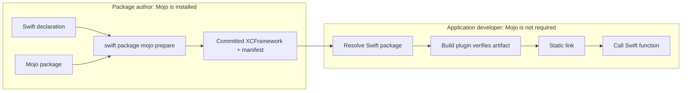
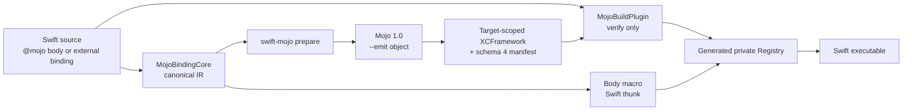
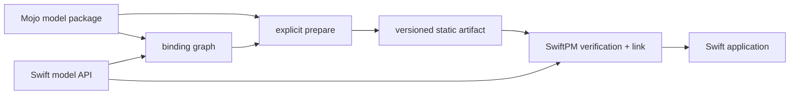
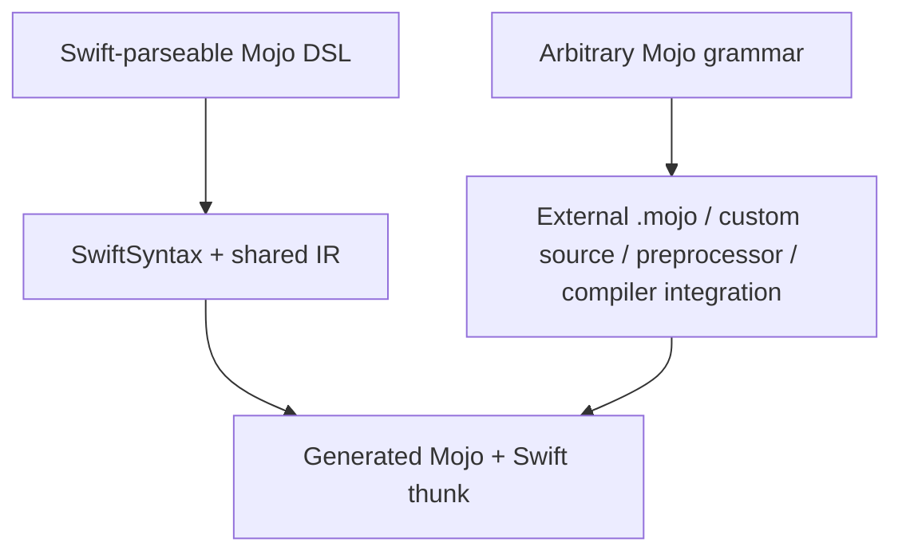

# swift-mojo

`swift-mojo` is an experimental bridge for implementing a Swift function in Mojo and shipping the compiled implementation as part of a Swift package. Swift owns the public API and application structure; Mojo owns the compute implementation. Generated C symbols, headers, binding IDs, and artifact paths stay private.

> **Current status:** the complete macOS packaging path works, but the public function contract is intentionally narrow: `(Int32, Int32) -> Int32`. This is a working scalar bridge and release-system prototype, not yet an LLM inference runtime.

## Start with a Swift function

The package author writes the API in Swift and marks the implementation with `@mojo`:

```swift
import Mojo

@mojo
public func add(_ a: Int32, _ b: Int32) -> Int32 {
    return a + b
}
```

After the package author prepares and commits the native artifact, an application calls the function as ordinary Swift:

```swift
import ModelMath

let value = add(20, 22)
print(value) // 42
```

```text
Package author                          Application developer

@mojo Swift source
        |
        v
swift package mojo prepare
        |
        v
committed static XCFramework  -------> import ModelMath
                                        add(20, 22)

Mojo compiler required                 Mojo compiler not required
```

The inline body above is intentionally small today: it accepts the validated scalar expression supported by the current `(Int32, Int32) -> Int32` bridge. The body is not executed as Swift. The macro replaces it with a call to the prepared Mojo artifact, and unsupported bodies fail instead of falling back to Swift.

For full Mojo source, multiple files, or package-level organization, keep the implementation in an external Mojo package as shown below. Buffers, tensors, model state, async execution, GPU kernels, and LLM inference remain future work.

## A complete example

The following example exposes `add` as a Swift API while keeping its implementation in a Mojo package.

```text
ModelMath/
├── Package.swift
├── Sources/ModelMath/
│   └── ModelMath.swift
├── Mojo/MathModel/
│   └── __init__.mojo
├── Generated/ModelMath/       created by prepare, then committed
└── SwiftMojo.json
```

### 1. Declare the Swift API

```swift
import Mojo

@mojo(package: "MathModel", function: "add")
public func add(_ a: Int32, _ b: Int32) -> Int32
```

The declaration is the public Swift surface. Callers do not import a C module or use pointers.

### 2. Implement it in Mojo

```mojo
# Mojo/MathModel/__init__.mojo

def add(a: Int32, b: Int32) -> Int32:
    return a + b
```

The package author may organize the implementation across additional files under `Mojo/MathModel`. Every regular source file becomes part of the verified input graph.

### 3. Declare the compiler and target contract

```json
{
  "schemaVersion": 1,
  "targets": {
    "ModelMath": {
      "compilerVersion": "Mojo 1.0.0 (ed45d567)",
      "mojoPackages": ["MathModel"],
      "slices": [
        {
          "triple": "arm64-apple-macosx14.0",
          "cpu": "generic"
        },
        {
          "triple": "x86_64-apple-macosx14.0",
          "cpu": "x86-64"
        }
      ]
    }
  }
}
```

This configuration pins the authoring compiler and the native slices that must be present in a releasable artifact. The required `Package.swift` binary-target and plugin declarations are shown in [Package setup](#package-setup).

### 4. Prepare the native artifact

```bash
SWIFT_MOJO_EXECUTABLE=/absolute/path/to/mojo \
swift package mojo prepare --target ModelMath

swift package mojo release --target ModelMath
```

`prepare` compiles the Mojo package for the configured targets and creates the committed XCFramework. `release` does not rebuild or repair anything; it verifies that the Swift declaration, Mojo sources, compiler version, target slices, generated source map, binary interface, and `Package.swift` wiring still agree.

### 5. Call it from a Swift application

```swift
import ModelMath

@main
enum Application {
    static func main() {
        print(add(20, 22))
    }
}
```

Output:

```text
42
```

The consumer uses a normal Swift package dependency. It does not run `prepare`, install Mojo, or know about the generated ABI.

## Author and consumer experience



| Role | Works with | Runs Mojo compiler? | Normal command |
|---|---|---:|---|
| Package author | Swift bindings, `.mojo` sources, target configuration, generated artifact | Yes, during explicit `prepare` | `swift package mojo prepare --target <Target>` |
| CI/release verifier | Committed sources, manifest, XCFramework, package wiring | No | `swift package mojo release --target <Target>` |
| Application developer | Public Swift API and a normal Swift package dependency | No | Build in Xcode or with SwiftPM |

## Where an LLM package fits

The intended production use case is a separate package such as `LlamaMojo`, not model code built into `swift-mojo` itself:

```text
LlamaMojo package
├── Sources/LlamaMojo/        Swift Model and Session API
├── Mojo/LlamaMojoModel/      model and kernel implementation
├── Generated/LlamaMojo/      prepared native slices
├── SwiftMojo.json            compiler and target contract
└── Tests/                    model-specific acceptance
```

`swift-mojo` would provide the language and artifact bridge. The model package would own tensor/model/session APIs, weight compatibility, tokenizer behavior, inference tests, and shutdown. The application would own model selection, weight location, generation policy, and UI.

That architecture is documented, but it is not yet implemented end to end. The next substantive work is a safe buffer/tensor and ownership ABI; without it, the current scalar bridge cannot carry model weights, KV caches, or logits.

## How it works internally



- The `@attached(body)` macro replaces the original body with a Swift thunk that uses a binding ID.
- The macro and source scanner use the same versioned IR.
- The source scanner accepts only regular non-symbolic Swift files and rejects parser diagnostics before extracting bindings, so external mutable bytes or malformed Swift cannot produce a release-valid input graph.
- `swift-mojo prepare` generates canonical Mojo source, a source map, target slices, a static XCFramework, and a schema-4 manifest.
- The build plugin does not invoke the Mojo compiler. It verifies the complete input graph, configured slice set, ABI, and SHA-256 digest of every regular file in the complete XCFramework. Hidden files participate in the digest, and symbolic links are rejected.
- The Mojo artifact is linked statically into the final executable. Runtime lookup does not depend on absolute paths, `dlopen`, or Mojo dynamic-library discovery.
- External Mojo packages are real compiler inputs: generated entry code imports their declared functions, preparation exposes only declared packages through an isolated `-I` root, and every regular package file participates in the input graph. Package-internal symbolic links are rejected so compiler-visible bytes cannot escape that graph.
- Preparation reuses generated output only when the Swift bindings, external Mojo packages, generation pipeline, pinned compiler version, all target slices, source map, and artifact digest match.
- Initialization, preparation, build verification, and release verification share an interprocess lock for each output. Verification cannot observe a prepare transaction between its manifest, source-map, and XCFramework reads.
- Preparation re-reads Swift and external Mojo inputs before commit, so edits that race compilation cannot publish a mixed source/artifact snapshot.
- Compiler subprocesses run in a dedicated process group. After a 300-second deadline, the process owner performs TERM, KILL, and reap in sequence.

## Package setup

Authoring commands are exposed through a SwiftPM command plugin. SwiftPM builds the internal `swift-mojo` executable automatically; package authors do not need to install that executable on `PATH`.

### 1. Bootstrap the generated directory

After creating `Package.swift` and `Sources/<Target>` in the consuming package, run `init` before adding the binary target to the manifest:

```bash
swift package mojo init --target MyTarget
```

`init` creates a host-architecture bootstrap XCFramework required for SwiftPM to load the package graph and prints the target-specific `Package.swift` wiring. Running it again does not overwrite a prepared artifact. It also refuses to replace an unmanaged or incomplete output directory.

### 2. Wire Package.swift

```swift
// swift-tools-version: 6.2
import PackageDescription

let package = Package(
    name: "MyPackage",
    platforms: [.macOS(.v14)],
    products: [
        .library(name: "MyTarget", targets: ["MyTarget"]),
    ],
    dependencies: [
        .package(
            url: "https://github.com/1amageek/swift-mojo.git",
            branch: "main"
        ),
    ],
    targets: [
        .binaryTarget(
            name: "SwiftMojo_MyTarget_ABI",
            path: "Generated/MyTarget/SwiftMojo_MyTarget_ABI.xcframework"
        ),
        .target(
            name: "MyTarget",
            dependencies: [
                .product(name: "Mojo", package: "swift-mojo"),
                "SwiftMojo_MyTarget_ABI",
            ],
            plugins: [
                .plugin(name: "MojoBuildPlugin", package: "swift-mojo"),
            ]
        ),
    ]
)
```

The generated module, archive, and C symbols are derived from the Swift target identity. Common ASCII identifiers stay readable; a target name containing `-` receives its full target digest in the module/archive component so names such as `Model-Core` and `Model_Core` cannot normalize to the same binary identity. This prevents collisions when a package graph links more than one Mojo-enabled target.

### 3. Pin the authoring contract

Add `SwiftMojo.json` at the package root. It is the release contract for the Mojo compiler, external package inputs, and required native slices:

```json
{
  "schemaVersion": 1,
  "targets": {
    "MyTarget": {
      "compilerVersion": "Mojo 1.0.0 (ed45d567)",
      "mojoPackages": [],
      "slices": [
        {
          "triple": "arm64-apple-macosx14.0",
          "cpu": "generic"
        },
        {
          "triple": "x86_64-apple-macosx14.0",
          "cpu": "x86-64"
        }
      ]
    }
  }
}
```

Schema 1 is closed: unknown root, target, or slice keys are rejected instead of being ignored. Slices for different architectures of the same Apple platform and variant are compiled independently and merged into one universal archive before XCFramework packaging. The manifest still records and verifies every compiler target separately.

### 4. Write an inline implementation

```swift
import Mojo

@mojo
func add(_ a: Int32, _ b: Int32) -> Int32 {
    return a + b
}
```

The current inline subset supports checked `Int32` addition. Production implementations can live in a Mojo package instead:

```swift
@mojo(package: "MathModel", function: "add")
func add(_ a: Int32, _ b: Int32) -> Int32
```

```text
Mojo/MathModel/
├── __init__.mojo   # exports add
└── Math.mojo
```

List `MathModel` in the target's `mojoPackages` array. The generated ABI entry module imports `add` from that package; the files are not copied into the runtime bundle.

### 5. Prepare with the pinned Mojo compiler

```bash
SWIFT_MOJO_EXECUTABLE=/absolute/path/to/mojo \
swift package mojo prepare --target MyTarget
```

When `SWIFT_MOJO_EXECUTABLE` is not set, the command searches `PATH` for `mojo`. The plugin never downloads or runs the compiler inside the build sandbox.

Inline `+` follows Swift-compatible checked-addition semantics. `Int32` overflow traps before entering the Mojo dispatcher. An `@mojo` declaration inside `#if` is rejected because the preparation scanner does not own the Swift compiler's active build conditions.

### 6. Inspect, validate, commit, and build

```bash
swift package mojo inspect --target MyTarget
swift package mojo doctor --target MyTarget
swift package mojo release --target MyTarget
```

`inspect` renders the exact generated Mojo and binding identity without compiling. `doctor` checks Swift, Xcode, Mojo, package layout, external packages, and the pinned compiler version. `release` is read-only for package-owned files, holds the same output lock as preparation, and rejects legacy manifests, local package dependencies, non-literal package URLs that cannot be classified, missing binary-target/dependency/plugin wiring, compiler/slice/config drift, generated-Mojo/source-map drift, interface damage, concurrent input changes, and any source or artifact digest mismatch. Generated Mojo and its source map are re-rendered from the current input graph; matching self-declared manifest digests alone is insufficient.

`Generated/MyTarget` must be committed. SwiftPM requires a local binary target to exist while it loads the package graph, before any plugin can run. Ignoring this directory would make a fresh clone impossible to resolve. After changing the implementation, run `prepare` again and review the manifest and artifact changes together.

The current release gate intentionally accepts only literal `Package.swift` declarations for the Mojo binary target path, target dependency array, and plugin array. Computed manifest fragments fail closed because the source-only verifier cannot prove their evaluated relationship. This restriction can be removed only by replacing it with an equally deterministic PackageDescription evaluation contract.

During a normal Xcode or SwiftPM build, the plugin tracks Swift sources, `SwiftMojo.json`, external Mojo package trees, canonical generated Mojo, the source map, manifest, XCFramework root, and every regular file and directory inside the XCFramework. It rejects:

- A missing manifest or XCFramework.
- An artifact that is stale relative to its source.
- A target-triple or CPU mismatch.
- Modification of the archive, header, module map, or `Info.plist`.
- An ABI, schema, or binding-graph mismatch.
- A target-specific module identity, pinned compiler, required-slice, external-package, source-map, or XCFramework metadata mismatch.

The committed [`Examples/ExternalMojo`](Examples/ExternalMojo) fixture intentionally preserves the schema-3 baseline for legacy-reader compatibility tests. Current schema-4 evidence is the universal integration fixture under `Generated/MojoBuildPluginIntegrationFixture` and the reproducible `scripts/release-acceptance.sh` workflow.

## Components

| Component | Responsibility |
|---|---|
| `Mojo` | Swift-facing module that exposes only `@mojo` |
| `MojoMacros` | Validates the body with the shared IR and replaces it with a static Registry call |
| `MojoBindingCore` | SwiftSyntax scanning, P1 DSL semantics, and canonical binding/source graphs |
| `MojoCompilerCore` | Mojo executable discovery, version inspection, and target-aware object generation |
| `MojoArtifactCore` | Input graphs, source maps, artifact sets, preparation, inspection, doctor checks, build verification, and release gates |
| `MojoCommandCore` | Testable command parsing, text/JSON output, and Core orchestration |
| `swift-mojo` | Thin process adapter for standard streams and exit status |
| `MojoCommandPlugin` | Exposes authoring commands as `swift package mojo ...` |
| `MojoBuildPlugin` | Creates build-time verification commands; it never compiles Mojo |
| `MojoBuildPluginIntegrationFixture` | Internal schema-4 consumer target that proves macro, plugin, static link, and runtime behavior in the normal package graph |

The earlier `@mojo(symbol:library:)` API, dynamic loader, and shared-library registry conflicted with the P1 static design and are not retained as public APIs or package targets.

## Mojo model packages

Production-scale implementations such as LLMs should not be forced into the inline DSL. The long-term goal is to distribute them as independent Swift packages that contain a Mojo source package. `swift-mojo` does not become a model framework or model catalog; each model package owns the relationship between its Swift API, Mojo implementation, and prepared artifact.

```text
LlamaMojo/
├── Package.swift
├── Sources/LlamaMojo/            # Public Swift model/session API
├── Mojo/LlamaMojoModel/
│   ├── __init__.mojo             # Mojo package boundary
│   ├── Model.mojo
│   └── Kernels.mojo
├── Generated/LlamaMojo/
│   ├── SwiftMojo_LlamaMojo_ABI.xcframework
│   ├── Bindings.mojo
│   ├── MojoArtifact.json
│   └── MojoSourceMap.json
├── SwiftMojo.json
└── Tests/
```



Responsibilities are separated as follows:

| Layer | Responsibility |
|---|---|
| `swift-mojo` | Source graphs, ABI lowering, compiler orchestration, artifact preparation, build verification, and the runtime bridge |
| Model Swift package | Public Swift API, model/session lifecycle, Mojo source package, model-specific tests, and prepared artifacts |
| Application | Model selection, weight location, generation policy, UI, and product state |

`.mojo` source is an authoring input, not a runtime resource copied into the application bundle. A precompiled Mojo `.mojoc` file is tied to the exact compiler version and is not a native artifact that Swift can link directly, so it is not the public distribution boundary. On Apple platforms, Swift consumers receive an XCFramework and compatibility manifest. Future non-Apple platforms require separate artifact adapters based on the linking capabilities SwiftPM actually provides for those platforms.

Model weights remain separate from code artifacts. Production weights are not stored as SwiftPM resources or committed to the Git repository. The model package's Swift API resolves them from external storage and cache using an immutable revision or digest. Small test fixtures are the only exception.

The current source tree implements and exercises external source discovery, package imports, deterministic package digests, target-scoped ABI identities, universal Apple artifacts, configuration-aware build verification, and the release gate. Model weights, model/session APIs, inference acceptance, remote artifact distribution, and non-Apple packaging remain outside this scalar bridge or are still planned.

## Syntax boundary

A Swift function-body macro can replace the original body, but the Swift parser must first accept that body. The direct `return a + b` spelling is valid Swift syntax, so the shared IR can treat it as a narrow Mojo implementation subset. Arbitrary Mojo grammar is not a subset of Swift grammar and therefore cannot be implemented by a conventional macro alone.



The DSL will grow incrementally, while production-scale full Mojo implementations will use external Mojo source packages as the primary surface. A custom source preprocessor or compiler integration will be considered only if there is demonstrated demand to embed arbitrary Mojo syntax directly in a Swift function body.

## Current implemented contract

| Concern | Supported now |
|---|---|
| Platform adapter | Apple XCFramework; arm64/aarch64/x86_64 macOS and iOS target triples are accepted by the implementation |
| Package layout | Target-scoped modules, archives, symbols, and output directories |
| Declaration | Non-generic, non-`async`, nonthrowing function |
| Signature | Exactly `(Int32, Int32) -> Int32` |
| Inline DSL | Exactly one direct `return lhs + rhs`; operand order may be reversed |
| External implementation | `@mojo(package:function:)` plus `Mojo/<Package>/__init__.mojo` |
| Artifact | Target-scoped static XCFramework, canonical generated Mojo, schema-4 manifest/source map, and one or more declared compiler slices; same-platform architectures share a universal library |
| Build | Committed artifact, plugin verification, and no build-time Mojo compiler |
| Release | Pinned compiler, configuration, all slices, inputs, source map, XCFramework metadata/interface, and local-dependency gate |
| Runtime | Nonthrowing direct call; overflow and invariant mismatches trap rather than return a fabricated value |
| Conditional compilation | An `@mojo` declaration inside `#if` is rejected |

CPU variants for the same Apple platform/architecture are not a SwiftPM selection mechanism. Configuration and preparation reject slices that collapse to the same XCFramework platform/architecture/variant identity before invoking the compiler. During a configured build, the verifier checks the complete slice set and Xcode selects the destination slice; `SWIFT_MOJO_TARGET_*` is an optional stricter destination assertion rather than a host-architecture default.

## Development status

The following state was observed on this machine on 2026-08-20:

| Item | Observed status |
|---|---|
| Xcode | Xcode 27.0, build `27A5237l` |
| Xcode default Swift | Apple Swift 6.4 (`swiftlang-6.4.0.30.4`, swift-driver `1.168.6`) |
| Snapshot used by the shell | `swift-6.4.x-DEVELOPMENT-SNAPSHOT-2026-08-14-a`, compiler commit `424cae54c1a10da` |
| swift-syntax | Matching revision `swift-6.4.x-DEVELOPMENT-SNAPSHOT-2026-08-14-a` |
| Mojo | Mojo `1.0.0 (ed45d567)` through an isolated executable wrapper |
| Global Mojo | Not present on the shell `PATH` |
| Real result | Inline and external-package `add(20, 22)` paths returned `42` |
| Packaging | Real Mojo produced arm64 and x86_64 objects that were merged into one universal static archive in a schema-4 XCFramework |
| Clean consumer | A relocated consumer resolved, built, linked, and ran with Mojo absent from `PATH` |
| Link inspection | Exactly four target-scoped ABI symbols were defined in the consumer Mach-O; there was no Mojo dynamic-library dependency |
| Failure evidence | Stale source, generated source/source-map drift, wrong target, missing state, malformed package wiring, symlinks, and corrupt archive/header/interface were rejected |
| Automated tests | All 68 tests passed in three bounded full-package `xcodebuild test` runs; the focused unit and integration groups also passed three guarded runs each |
| Release acceptance | `scripts/release-acceptance.sh` passed real external-package compilation, two-slice packaging, read-only release verification, compiler-free relocation, static link inspection, and runtime `42` |
| Legacy compatibility | The committed schema-3 example passed current plugin verification, Xcode build/link, and runtime `42` |

The repository shell sets `TOOLCHAINS` to the snapshot, so earlier Xcode builds and tests used `env -u TOOLCHAINS xcodebuild ...` to select the default Xcode toolchain. P1 does not depend on Swift 6.3 `@c`. A future reverse-callback design must separately gate the local compiler, generated headers, ABI, and the accepted public specification at that time.

The committed integration fixture makes normal tests deterministic and compiler-free. Real compiler and relocation acceptance is a separate contributor workflow because authoring requires an installed Mojo compiler:

```bash
SWIFT_MOJO_EXECUTABLE=/absolute/path/to/mojo \
SWIFT_MOJO_CLI=/absolute/path/to/built/swift-mojo \
scripts/release-acceptance.sh
```

The acceptance script uses a temporary author package, prepares it with real Mojo, then copies the released inputs and artifact into a separate consumer. The consumer build removes both `SWIFT_MOJO_EXECUTABLE` and Mojo from `PATH`; success therefore proves the distribution path rather than an author-machine runtime fallback.

Historical cold Release archive attempts did not complete within a 120-second bound because host-side SwiftSyntax compilation dominated the build. That configuration has not been re-measured and is not reported as passing. Release integrity and relocation are instead covered by the schema-4 release command, universal static artifact, normal Xcode test graph, and compiler-free consumer acceptance above.

## Non-goals

- Providing SwiftUI or Metal view integration or owning the rendering lifecycle.
- Translating all Swift code into Mojo.
- Passing arbitrary, unvalidated Mojo text into generated source.
- Exposing the C ABI, raw pointers, or artifact paths as ordinary Swift APIs.
- Installing or downloading the Mojo toolchain during a build.
- Treating unsupported types, errors, async behavior, ownership, or GPU behavior as successful by copying data, returning zero, or falling back to Swift.
- Publishing remote binary artifacts or signing releases on behalf of model packages.

## Documentation

- [Requirements](docs/REQUIREMENTS.md)
- [Design](docs/DESIGN.md)
- [Philosophy](docs/PHILOSOPHY.md)
- [Roadmap](docs/ROADMAP.md)
- [ADR-0001: Offline prepare and static artifacts](docs/ADR-0001-STATIC-PREPARE-PIPELINE.md)
- [ADR-0002: Mojo models as Swift packages](docs/ADR-0002-MODEL-SWIFT-PACKAGE.md)
- [ADR-0003: Target-scoped artifact sets and release verification](docs/ADR-0003-RELEASE-ARTIFACT-SETS.md)

## Public references

- [SE-0415: Function Body Macros](https://github.com/swiftlang/swift-evolution/blob/main/proposals/0415-function-body-macros.md)
- [SwiftPM: Writing a build tool plugin](https://docs.swift.org/swiftpm/documentation/packagemanagerdocs/writingbuildtoolplugin/)
- [Mojo: `@export`](https://mojolang.org/docs/reference/decorators/export/)
- [Mojo: Modules and packages](https://mojolang.org/docs/manual/packages/)
- [Mojo: compilation targets](https://mojolang.org/docs/tools/compilation/)
- [SE-0495: C compatible functions and enums](https://github.com/swiftlang/swift-evolution/blob/main/proposals/0495-cdecl.md)
