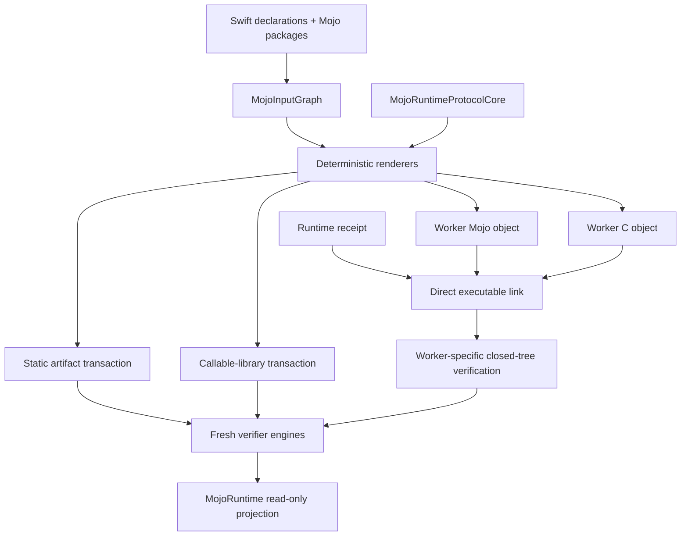

# MojoArtifactCore

## Direct opaque resources

Generate direct opaque factory/operation C ABI entry points, typed macro wrappers and factory-provenance checks from one binding graph. Every status passes through declared synchronization; failed partial creation is destroyed only after completion. These signatures are direct-only and worker publication rejects them explicitly. Artifact family identity includes this generation contract.
The [Mojo ownership contract](../Mojo/DESIGN.md#direct-opaque-resources) owns lifecycle and admission guarantees.


## Scoped direct buffer contract (2026-09-12)

Direct borrowed Float32/Float64 signatures use `borrowing Span<Float/Double>`
and `inout MutableSpan<Float/Double>`. BindingCore validates these exact Swift
ownership forms and includes them in canonical binding identity. Array signatures
are replaced, without a compatibility dispatcher. Scalar/factory identities are
unchanged. ArtifactCore emits scoped pointer/count calls from these views; C ABI
payload layout remains typed pointer plus UInt64 element count. The generated
registry must not allocate, resize or materialize buffer payloads. Empty-buffer
and explicit Mojo-status failures retain their existing behavior. Regenerate
prepared artifacts and check actual macro-to-native execution before completion.


## Resource-binding generation delta (target design, 2026-09-12)

[ProtocolCore](../MojoRuntimeProtocolCore/DESIGN.md#resource-invocation-protocol-target-design-2026-09-12)
owns the shared-input wire schema. Extend the existing binding IR/scanner,
generated Mojo/C ABI and worker manifest together with generic fixed-width
argument/result schemas and readonly buffer layout/capability requirements.
Both generated sides derive identifiers and bounds from one graph; never let
consumer code hand-maintain a second wire or ABI layout.
Replace the current worker contract directly. The existing
executionContractDigest incorporates the protocol schema and generated artifacts;
no numeric protocol revision or duplicate identity field is needed. Static/callable artifacts remain outside this change.
The generated endpoint validates views, scopes import lifetime and waits for
the operation's defined read completion before sending terminal results.
Runtime validates the resulting closed manifest. Tests must reject independent
mutation of schema, bounds, capability, ABI and generated endpoint; regenerate
real native workers and prove non-model typed invocation before consumer use.


## Purpose and Scope

`MojoArtifactCore` is the package module that converts canonical binding inputs
into verified native artifacts. Its parent is [`DESIGN.md`](../../DESIGN.md).
It has no child component designs.

This design covers static artifacts, accelerator runtime receipts, executable
runtime bundles, callable runtime-library bundles, and the implemented W1/W2
direct-linked persistent worker bundle selected by
[ADR-0015](../../docs/ADR-0015-DIRECT-LINKED-PERSISTENT-WORKERS.md).

## Responsibilities and Boundaries

The module owns `MojoInputGraph`, deterministic renderers and pipeline identity,
compiler inputs, native link/inspection policy, closed manifests, managed output
transactions, and fresh artifact verification. In ADR-0015 W1 it renders the
Mojo ABI and C worker dispatch/main from one input graph. In W2 it compiles,
direct-links, packages, and verifies both objects as an executable bundle.

It does not own public process launch, IPC lifetime, application attempts,
model/training semantics, checkpoints, budgets, telemetry, device selection, or
hardware acceptance. It never treats a backend name as artifact identity.

## Related Designs

| Design | Relationship | Contract Used | Summary | Cautions |
|---|---|---|---|---|
| [`Swift Mojo`](../../DESIGN.md) | parent | Package artifact and identity boundary | Defines the system-level authoring, distribution, and evidence contracts. | Static and runtime-dependent adapters remain distinct. |
| [`MojoRuntime`](../MojoRuntime/DESIGN.md) | used by | Closed manifests and package-scoped verifier engines | Projects fresh verification through a public read-only API. | Public verification cannot construct, mutate, load, or launch artifacts. |
| [`MojoRuntimeWorker`](../MojoRuntimeWorker/DESIGN.md) | used by | Private-copy verifier engine | Revalidates W3 private attempt staging before spawn. | ArtifactCore never owns the running process or public lifecycle. |
| [`MojoRuntimeProtocolCore`](../MojoRuntimeProtocolCore/DESIGN.md) | depends on | Protocol constants, payload schemas, validation, C renderer, and Swift codec identity | Generates the worker C endpoint and binds the shared schema digest. | The protocol module owns no files, process, or session state. |
| [`MojoPOSIXSupport`](../MojoPOSIXSupport/DESIGN.md) | depends on | Package-scoped process and descriptor primitives | Supports compiler, linker, inspector, and transaction tooling. | The current spawn closes fd 3 and is not an ADR-0015 launcher. |
| [ADR-0010](../../docs/ADR-0010-ACCELERATOR-RUNTIME-RECEIPTS.md) | coordinates with | Exact runtime closure receipt | Binds target objects to their declared runtime libraries. | Receipt verification is not execution evidence. |
| [ADR-0011](../../docs/ADR-0011-ISOLATED-RUNTIME-BUNDLES.md) | coordinates with | Direct executable link and exact runtime closure | Supplies the executable deployment primitive used by worker bundles. | ADR-0015 adds a distinct closed worker manifest/tree. |
| [ADR-0013](../../docs/ADR-0013-CALLABLE-RUNTIME-LIBRARY-BUNDLES.md) | coordinates with | Callable-library packaging | Retains a separate verified library adapter. | It is not the persistent-worker implementation. |
| [ADR-0015](../../docs/ADR-0015-DIRECT-LINKED-PERSISTENT-WORKERS.md) | implements | Worker schema/protocol/lifecycle design | Defines W1 rendering and W2 bundle/verification requirements. | No `dlopen`/`dlsym`/`dlclose` worker path is permitted. |

## Architecture



## Contracts and Invariants

- `MojoInputGraph` is the sole semantic input for binding order, identifiers,
  external packages, generated Mojo ABI, generated worker dispatch, and source
  mapping.
- Renderer or packaging changes invalidate the generation-pipeline digest.
- Static artifacts remain link-closed and reject undeclared accelerator/runtime
  symbol families.
- Runtime-dependent artifacts reproduce one verified ADR-0010 target closure;
  no ambient library path is admitted.
- Managed transactions publish only a completely staged and reverified tree and
  never replace an unmanaged directory.
- `RuntimeWorkerBundle.json` schema 1 is distinct from runtime-bundle schema 1 and
  runtime-library-bundle schema 3. Unknown/missing fields and unexpected files
  fail closed.
- The worker contains its generated Mojo and C objects by direct link.
  A callable primary library and dynamic symbol lookup are absent.
- Apple and NVIDIA worker artifacts share one semantic input identity but have
  independent target/compiler/object/runtime/executable closure records.
- W1 computes the `executionContractDigest` from protocol/ABI/graph/bindings,
  target/compiler, digest-free Mojo generated inputs, and receipt closure before
  C rendering. It embeds only that non-circular value in the worker, then binds
  it to generated C worker source/object and post-link runtime-bundle/executable digests in
  `RuntimeWorkerBundle.json`; manifest/executable digests never participate in
  the embedded digest.
- Public authoring and verification values carry no launcher, file mutation,
  raw symbol, raw handle, application operation, or hardware-success semantics.

## Runtime Flows

```text
canonical input graph + protocol-core schema
  -> render Mojo ABI + source map + C worker endpoint
  -> compile exact target objects
  -> reproduce exact runtime receipt
  -> direct-link both objects and declared runtime closure
  -> inspect final imports, exports, target, loader root, and tree
  -> write closed worker manifest
  -> re-read inputs and verify staging
  -> atomic managed commit
```

The module does not execute the committed worker. Runtime framing and session
lifecycle occur inside the generated executable and public
`MojoRuntimeWorker`; consuming packages receive only that generic typed client.

## State, Ownership, and Lifecycle

Input graphs, manifests, inspections, and verification results are immutable
values. A `MojoOutputTransaction` owns one staging directory and output lock for
one operation. Compiler/linker child processes are bounded tool operations and
are not persistent worker attempts. Published artifacts are immutable inputs to
fresh verification.

## Failure, Concurrency, and Constraints

Every untrusted path is standardized and constrained to its managed tree;
symlinks, unexpected entries, digest drift, graph drift, target mismatch,
closure drift, and renderer drift fail explicitly. Output transactions serialize
per destination. Worker protocol payload limits are authoring inputs constrained
by protocol-v1 hard limits and verified before allocation; application budgets
are not copied into artifact identity.

## Verification and Change Impact

Artifact tests own W1 graph/render/source-map mutation and W2 manifest,
managed-transaction
rollback, object/link/closure inspection, exact layout, relocation, and target
identity evidence. ADR-0015 implementation additionally requires two-object
direct-link evidence, no dynamic symbol-loader surface, closed protocol metadata,
Apple/NVIDIA semantic-parity fixtures, and hard failure when any generated side
drifts.

Changes to input identity, renderer versions, manifests, runtime closure policy,
or worker protocol require rechecking `MojoBindingCore`, `MojoCompilerCore`,
`MojoRuntime`, `MojoRuntimeWorker`, command projections, package integration
fixtures, and the root design. Actual hardware behavior remains downstream
evidence.

### Resource binding authoring and native call boundary

The resource binding is a worker operation token factory, distinct from the
synchronous static-call function signatures. Its Swift declaration takes one
`MojoRuntimeWorker` and returns `MojoRuntimeWorkerOperation` with `throws`.
The binding attribute supplies external package/function/sessionFactory plus
literal `argumentTypes`, `inputTypes`, `inputRanks`, `resultTypes`, `outputTypes`.
The parser builds ProtocolCore's resource signature; the binding graph,
implementation digest, worker manifest and verified projection retain it.
No consumer-authored byte offsets or native struct layouts are accepted.

Generation emits one C ABI entry per resource binding, adapting it to the external Mojo function:
session handle, typed scalar arguments, then for each input a readonly typed
pointer plus dimensions/strides pointers, then scalar result pointers and typed
output pointer/capacity/actual-count-pointer triples. Input rank comes from the
binding signature. The generated C declaration passes typed pointers directly,
without a consumer-maintained pointer table. Argument/result byte lengths are
checked before access. Packed scalars are decoded bytewise into aligned locals;
result scalars are encoded only after status zero and validated output counts.
The worker validates mappings, rank, extent and alignment before calling this
internal ABI and retains all input/output storage through return. Generated code
owns canonical scalar decoding and result encoding. User Mojo owns computation and
must join all readers/writers before returning either success or failure.
The generated native adapter is implemented and qualified on Mac by
`scripts/resource-native-adapter-test.sh`: an actual C consumer links the generated
Mojo library, creates/destroys a session, round-trips all eleven scalar types
including signed extrema/NaN/signed zero, reads strided UInt16 input, and verifies
failure, invalid lengths, output-count overflow and result-byte canaries.
The worker socket endpoint and public operation factory remain unconnected;
this native-call evidence does not establish IPC, GPU or public API performance.
Existing Float32 worker invocation is not evidence for that integration.

## Transfer completion on failure

A generated host/resource transfer always calls its declared `synchronize` after
the transfer function returns, including nonzero transfer status. The foreign
synchronizer must stop all readers/writers before returning on every status.
Only then may Swift end the host view and resource lease. The original transfer
status takes precedence; when the transfer succeeds, synchronization status is
returned. This preserves the operation's primary failure without skipping
completion. The local-session acceptance fixture leaves a pending marker on
both failing transfer directions; a subsequent operation rejects undrained
state, so skipping completion is observable through the public API.
