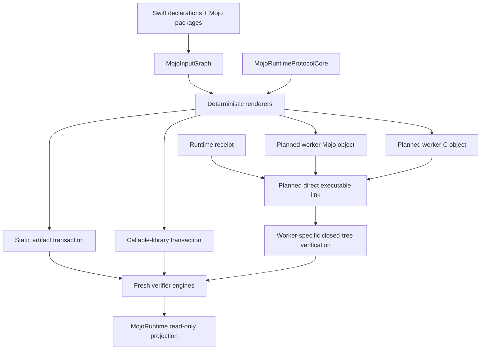

# MojoArtifactCore

## Purpose and Scope

`MojoArtifactCore` is the package module that converts canonical binding inputs
into verified native artifacts. Its parent is [`DESIGN.md`](../../DESIGN.md).
It has no child component designs.

This design covers static artifacts, accelerator runtime receipts, executable
runtime bundles, callable runtime-library bundles, and the planned
direct-linked persistent worker bundle selected by
[ADR-0015](../../docs/ADR-0015-DIRECT-LINKED-PERSISTENT-WORKERS.md).

## Responsibilities and Boundaries

The module owns `MojoInputGraph`, deterministic renderers and pipeline identity,
compiler inputs, native link/inspection policy, closed manifests, managed output
transactions, and fresh artifact verification. For the ADR-0015 W1 boundary it
will generate the Mojo ABI and C worker dispatch/main from one input graph and
directly link both objects into an executable bundle.

It does not own public process launch, IPC lifetime, application attempts,
model/training semantics, checkpoints, budgets, telemetry, device selection, or
hardware acceptance. It never treats a backend name as artifact identity.

## Related Designs

| Design | Relationship | Contract Used | Summary | Cautions |
|---|---|---|---|---|
| [`Swift Mojo`](../../DESIGN.md) | parent | Package artifact and identity boundary | Defines the system-level authoring, distribution, and evidence contracts. | Static and runtime-dependent adapters remain distinct. |
| [`MojoRuntime`](../MojoRuntime/DESIGN.md) | used by | Closed manifests and package-scoped verifier engines | Projects fresh verification through a public read-only API. | Public verification cannot construct, mutate, load, or launch artifacts. |
| [`MojoRuntimeProtocolCore`](../MojoRuntimeProtocolCore/DESIGN.md) | depends on | Protocol constants, payload schemas, validation, C renderer, and Swift codec identity | Generates the worker C endpoint and binds the shared schema digest. | The protocol module owns no files, process, or session state. |
| [`MojoPOSIXSupport`](../MojoPOSIXSupport/DESIGN.md) | depends on | Package-scoped process and descriptor primitives | Supports compiler, linker, inspector, and transaction tooling. | The current spawn closes fd 3 and is not an ADR-0015 launcher. |
| [ADR-0010](../../docs/ADR-0010-ACCELERATOR-RUNTIME-RECEIPTS.md) | coordinates with | Exact runtime closure receipt | Binds target objects to their declared runtime libraries. | Receipt verification is not execution evidence. |
| [ADR-0011](../../docs/ADR-0011-ISOLATED-RUNTIME-BUNDLES.md) | coordinates with | Direct executable link and exact runtime closure | Supplies the executable deployment primitive used by worker bundles. | ADR-0015 adds a distinct closed worker manifest/tree. |
| [ADR-0013](../../docs/ADR-0013-CALLABLE-RUNTIME-LIBRARY-BUNDLES.md) | coordinates with | Callable-library packaging | Retains a separate verified library adapter. | It is not the persistent-worker implementation. |
| [ADR-0015](../../docs/ADR-0015-DIRECT-LINKED-PERSISTENT-WORKERS.md) | implements | Worker schema/protocol/lifecycle design | Defines W1 generation and verification requirements. | No `dlopen`/`dlsym`/`dlclose` worker path is permitted. |

## Architecture



## Contracts and Invariants

- `MojoInputGraph` is the sole semantic input for binding order, identifiers,
  external packages, generated Mojo ABI, generated worker dispatch, and source
  mapping.
- Renderer or packaging changes invalidate the generation-pipeline digest.
- Static artifacts remain link-closed and reject undeclared accelerator/runtime
  symbol families.
- Runtime-dependent artifacts reproduce one verified ADR-0010 target closure;
  no ambient library path is admitted.
- Managed transactions publish only a completely staged and reverified tree and
  never replace an unmanaged directory.
- `RuntimeWorkerBundle.json` schema 1 is distinct from runtime-bundle schema 1 and
  runtime-library-bundle schema 3. Unknown/missing fields and unexpected files
  fail closed.
- The planned worker contains its generated Mojo and C objects by direct link.
  A callable primary library and dynamic symbol lookup are absent.
- Apple and NVIDIA worker artifacts share one semantic input identity but have
  independent target/compiler/object/runtime/executable closure records.
- W1 computes the `executionContractDigest` from protocol/ABI/graph/bindings,
  target/compiler, digest-free Mojo generated inputs, and receipt closure before
  C rendering. It embeds only that non-circular value in the worker, then binds
  it to generated C worker source/object and post-link runtime-bundle/executable digests in
  `RuntimeWorkerBundle.json`; manifest/executable digests never participate in
  the embedded digest.
- Public authoring and verification values carry no launcher, file mutation,
  raw symbol, raw handle, application operation, or hardware-success semantics.

## Runtime Flows

```text
canonical input graph + protocol-core schema
  -> render Mojo ABI + source map + C worker endpoint
  -> compile exact target objects
  -> reproduce exact runtime receipt
  -> direct-link both objects and declared runtime closure
  -> inspect final imports, exports, target, loader root, and tree
  -> write closed worker manifest
  -> re-read inputs and verify staging
  -> atomic managed commit
```

The module does not execute the committed worker. Runtime framing and session
lifecycle occur inside the generated executable; application supervision is a
consumer responsibility.

## State, Ownership, and Lifecycle

Input graphs, manifests, inspections, and verification results are immutable
values. A `MojoOutputTransaction` owns one staging directory and output lock for
one operation. Compiler/linker child processes are bounded tool operations and
are not persistent worker attempts. Published artifacts are immutable inputs to
fresh verification.

## Failure, Concurrency, and Constraints

Every untrusted path is standardized and constrained to its managed tree;
symlinks, unexpected entries, digest drift, graph drift, target mismatch,
closure drift, and renderer drift fail explicitly. Output transactions serialize
per destination. Worker protocol payload limits are authoring inputs constrained
by protocol-v1 hard limits and verified before allocation; application budgets
are not copied into artifact identity.

## Verification and Change Impact

Artifact tests own graph/render/source-map/manifest mutation, managed-transaction
rollback, object/link/closure inspection, exact layout, relocation, and target
identity evidence. ADR-0015 implementation additionally requires two-object
direct-link evidence, no dynamic symbol-loader surface, closed protocol metadata,
Apple/NVIDIA semantic-parity fixtures, and hard failure when any generated side
drifts.

Changes to input identity, renderer versions, manifests, runtime closure policy,
or worker protocol require rechecking `MojoBindingCore`, `MojoCompilerCore`,
`MojoRuntime`, command projections, package integration fixtures, and the root
design. Actual hardware behavior remains downstream evidence.
