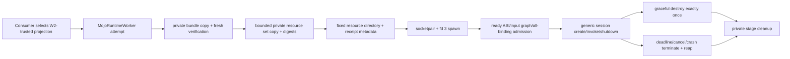

# MojoRuntimeWorker

## Resource Invocation Revision (2026-09-12)

### Authority, scope and current findings

This is the target invocation design. Input ownership is implemented through
`MojoBufferSource` and `MojoReadOnlyBuffer`; the session still invokes v1 Float32
operations until the subsequent worker migration. Native input qualification is
owned by [WorkerPOSIX](../MojoRuntimeWorkerPOSIX/DESIGN.md).
It supersedes the Float32-only invocation and invocation-input lifetime rules
for the next worker protocol. Static synchronous calls in Mojo are unchanged.
This module owns public data/lifetime/performance contracts; ProtocolCore owns
wire representation; [WorkerPOSIX](../MojoRuntimeWorkerPOSIX/DESIGN.md) owns native import.

| Current implementation | Consequence | Required delta |
|---|---|---|
| Session.invoke accepts/returns [Float] | Producer materialization is required | Typed immutable views and bounded values |
| Transport.execute borrows the Array for socket writes | No second Swift tensor there, but payload is transferred | Separate control from shared input |
| AttemptActor.finishExchange clears pendingInput before terminalize | Valid for copied input, unsafe if applied to shared input | Retain source independently through reader completion |
| Terminalizer.cleanup drops its structured lifetime outcome | External source release cannot use cleanup failure alone | Return reaped/group-confirmed outcome |
| One in-flight request and resident session | Bounded work and ordering | Preserve; no hidden queue |
| InputResources stages verified files per attempt | Appropriate persistent-resource admission | Keep separate from invocation buffers |
| Renderer.mainSource allocates receive/send buffers at maximum wire payload once | Shared inputs must not preserve input-sized receive staging by accident | Bound v2 receive storage by control/explicit-copy capacity, separately from mapped bytes |

### Proposed public API contracts

The invocation/result/metrics names below describe target APIs; the input owner
APIs identified above are implemented. Generated signatures
must compile against the pinned Swift/Mojo toolchains before implementation promotion.

| Surface | Meaning |
|---|---|
| Session.invoke(operation, arguments, inputs, deadline) | One verified operation; absolute monotonic deadline includes admission, I/O, execution and result acceptance |
| MojoRuntimeWorkerOperation | Opaque token derived from the verified binding and argument/result schemas |
| MojoInvocationArguments | Generated fixed-width scalar/record values; bounded canonical encoding, not Codable/native Swift memory layout |
| MojoReadOnlyBuffer | Immutable region backed by a retained producer read lease |
| MojoBufferView | Buffer plus element type, byte offset, dimensions and byte strides |
| MojoInvocationResult | Bounded generated values and owned host output buffers with exact types/counts |
| MojoTransferRequirements | Explicit shared-input requirement or explicit copied-input selection; no silent fallback |
| MojoInvocationMetrics | Stage durations, control/payload/copy bytes, allocation counts and selected route |

Initial value types are fixed-width signed/unsigned 8/16/32/64-bit integers and
IEEE Float16/32/64. Bools/enums have generated explicit encodings. Each binding
declares accepted types, rank and argument/output capacities. Unsupported types
fail before dispatch. This revision does not add shared writable outputs,
arbitrary object graphs, remote networking or cross-process device pointers.
Bounded host input remains usable through explicit copying. Migrated workers
replace the Float32-only API; no compatibility overload or protocol downgrade.

View validation checks rank/count limits, dimension/stride count agreement,
endianness, element alignment, positive strides for nonempty dimensions and
overflow-safe extent:
offset + sum((dimension[i]-1)*stride[i]) + elementByteWidth <= regionByteCount.
Empty dimensions are accepted only when declared by the binding; no last-element
formula is evaluated for them. Rank-zero means one scalar. Readonly overlapping
views are allowed. Unsupported layout fails rather than being silently repacked.
These checks establish memory safety, not application semantics.

The bridge assigns no meaning to calibration, sample rate, image channels,
tensor operators, model weights, thresholds or output coordinates.

Input ownership is defined by the child [Input](Input/DESIGN.md).
It owns host-source borrowing and admitted storage retention; native eligibility
is supplied by WorkerPOSIX. Invocation, wire layout and reader completion remain
module/ProtocolCore responsibilities.

### Ownership and execution

```text
producer grants immutable lease
 -> attempt retains lease before transferring a handle
 -> worker imports readonly input
 -> Mojo executes and synchronizes ALL input readers/output writers
 -> worker closes invocation mappings and handles
 -> Swift validates terminal response
 -> source lease released outside locks
```

Storage lifetime and content stability are separate: the producer adapter
guarantees no mutation, reuse, unmap or destruction until the last read lease
ends. A duplicated descriptor alone does not guarantee stable contents.
Retain the original producer owner; do not duplicate its checkout accounting.

Generated ABI borrows validated base/extent/layout only during invocation.
Input pointers and handles cannot escape into persistent session state.
Success AND operation failure imply all asynchronous readers/writers have
finished; GPU enqueue or a model execution API return alone is insufficient.
If synchronization cannot be established, no terminal response may authorize
input reuse: terminate the worker instead. Start with one terminal response,
not separate early-release ACKs or a new completion-event API.

| Resource | Owner | Release |
|---|---|---|
| Input lease | Producer, retained independently by attempt | Before dispatch, accepted terminal result, or confirmed worker lifetime end |
| Sender duplicated handle | Admitted native buffer, borrowed by transport | Last buffer release after all attempt readers end |
| Receiver mapping/handle | Worker invocation | All readers complete, then unmap/close |
| Persistent compute/device buffers | User Mojo session | Graceful destruction or confirmed process death |
| Result storage | Swift result | Ordinary owned-value lifetime |
| Unconfirmed reader lifetime | Cleanup record | Actual termination proof, never elapsed timeout |

Reuse the attempt actor, cancellation gate and terminalizer. Finishing local I/O
or clearing pending protocol state cannot release the shared source.
Cancellation/deadline stops admission, wakes and joins local I/O, terminates the
process group, confirms disappearance, reaps the exact child, then releases input.
Preserve primary and ordered cleanup errors.

If termination cannot be proven, an internal cleanup record retains the input
beyond facade/error destruction. Return an explicit unconfirmed-cleanup error
and reject new attempts on that worker owner. Worker value copies share this
lifetime guard. The record self-retains until bounded observations eventually
prove termination; caller cancellation cannot cancel this retention obligation.
Reserve capacity before dispatch: one failed attempt with manifest-bounded input
count/bytes per worker owner, no new buffer acquisition or retries in the cleanup
record. Callers creating multiple workers own their aggregate worker bound.
This exception must be observable as retained bytes and closed admission.
Tests must drop every caller reference while cleanup is indeterminate, then
prove no source reuse and exactly-once release after confirmed termination.

Verified native workers are trusted code, not a sandbox. Shared-input readers
may not escape the owned process group or invocation. Persistent access needs a
separate owned-resource operation and is not authorized by this borrowed API.
The qualified binding/runtime must also prove that process teardown ends any
device DMA reads of imported storage. Process disappearance alone is not generic
GPU completion evidence. An adapter lacking that guarantee cannot admit direct
device reads of shared storage; it must use an explicitly declared worker-owned
staging transfer whose source reads obey the invocation/process lifetime.

### Performance invariants and acceptance

| Invariant | Evidence required |
|---|---|
| Shared input sends zero input payload bytes | Separate control, rights and payload counters |
| No input-sized bridge allocation, copy, conversion or hashing | Instrument Swift AND generated endpoint; input-size sweep |
| Metadata cost depends on argument count/rank | Same no-op worker over increasing input sizes |
| Sessions/compute intermediates remain resident | Warm-call allocation/session counters |
| No waiting input queue | Concurrent invocation fails busy before transfer |
| Outputs allocated only within admitted bounds | Oversize rejected before allocation; caller-retained outputs counted separately |
| Mapping per invocation in this revision | Measure map/unmap and page faults; no speculative mapping cache |
| Host sharing is separate from GPU transfer | Never infer device zero-copy from host transport counters |

Consumer supplies a positive bridge-overhead budget and workload bounds for
qualification, distinct from a cancellation timeout. Compare the SAME warmed
operation directly inside the worker and through the public client. Use
correlated per-call intervals, not subtraction/addition of independent p95s.
Report p50/p95/p99, samples, byte counts, page-fault conditions, system load and
toolchain. Qualify both native hosts with non-model readonly identity/checksum
and strided numerical fixtures. If import costs dominate the supplied budget,
optimize this owner before asking consumers to bypass it. No transport is called
fast solely because it sends zero payload bytes.

### Implementation and proof ownership

| Sprint | Owner and completion evidence |
|---|---|
| V1 | ProtocolCore: all types/layouts, C/Swift differential wire fixtures, malformed/overflow rejection, schema identity |
| V2 | WorkerPOSIX/POSIXSupport: actual storage identity, readonly access, descriptor truncation/partial-transfer/cleanup |
| V3 | Worker: success/failure, cancellation at every stage, asynchronous reader completion, crash, concurrent shutdown, unconfirmed lifetime |
| V4 | ArtifactCore/Runtime: generate/verify v2 schema and ABI; altered or v1 workers rejected before factory |
| V5 | Public-client integration: native macOS/Linux generic numerical parity, copied path, shared byte/allocation/latency gates |
| V6 | Consumers: their own input/output semantics and complete application latency |

V1-V5 must pass together before consumer promotion. Partial callable branches
require INCOMPLETE_IMPLEMENTATION markers and explicit failure. No backend
fallback may convert an unqualified path into success.

Existing test owners are Tests/MojoRuntimeProtocolCoreTests,
Tests/MojoPOSIXSupportTests, Tests/MojoRuntimeWorkerTests,
Tests/MojoArtifactCoreTests and Tests/MojoRuntimeTests; real public-client
fixtures belong to Acceptance/RuntimeWorker. Tests added for native ingress
belong to the MojoRuntimeWorkerPOSIXTests target. Extend these owners,
not an application-only shadow transport suite.


> Target revision: [Resource invocation](#resource-invocation-revision-2026-09-12).
> The revision is designed, not implemented; baseline descriptions below remain current code facts.

## Purpose and Scope

`MojoRuntimeWorker` is the public SwiftPM product that owns W3, the
generic client and lifecycle boundary for ADR-0015 direct-linked workers. Its
parent is [`DESIGN.md`](../../DESIGN.md); its input ownership child is
[Input](Input/DESIGN.md).

It consumes the trusted immutable worker projection produced by the read-only
[`MojoRuntime`](../MojoRuntime/DESIGN.md) verifier. It does not author or verify
an original artifact, expose a general process launcher, or define model,
training, device-selection, budget, telemetry, checkpoint, or safety semantics.

The RT.3-C boundary adds a scoped `withAttempt` operation and an asynchronous
`MojoRuntimeWorkerSession` protocol. The attempt actor is the sole owner of
protocol phase, request sequence, active session provenance, and terminal
state. The blocking POSIX exchange is performed by a bounded detached
operation and is never run on the actor executor. A session facade is usable
only while its attempt is live; an escaped value observes a typed
closed-attempt failure.

An attempt may also receive a bounded set of typed immutable input resources.
Each resource has an opaque identifier, a source file URL, an exact byte count,
and a SHA-256 identity selected by the consuming package. W3 privately stages
and verifies every resource before spawn. The child receives one fixed private
resource directory and the set's count, aggregate byte count, and aggregate
SHA-256 through fixed environment keys. Resource identifiers become filenames
inside that directory; W3 does not interpret their meaning. A resource-bearing
attempt also exposes the verified staged bundle's `lib` directory under the
fixed `SWIFT_MOJO_RUNTIME_LIBRARY_DIRECTORY` key so model-specific worker code
can configure its runtime closure without ambient SDK state.

## Responsibilities and Boundaries

This product owns one verified attempt at a time: private bundle copy and fresh
verification, socketpair creation, child fd-3 mapping, process-group spawn,
bounded protocol-v1 I/O, startup identity admission, generic session creation,
verified Float32 binding invocation, graceful shutdown, deadline/cancellation
termination, process-group reap, bounded input-resource admission, and deletion
of its private attempt staging.

Its public contract accepts only a W2-trusted worker projection and binding
records originating from that projection. It exposes typed worker/session values
and bounded payload/results. It does not expose paths, PIDs, file descriptors,
signals, wait statuses, raw headers/frames/codecs, executable arguments,
arbitrary environment mutation, private staged paths, or arbitrary binding
identifiers. The caller may supply only a typed resource set with a bounded
count and aggregate-byte limit; each resource carries an opaque identifier,
source file URL, exact byte count, and SHA-256 identity. The consumer must supply explicit positive count and aggregate-byte limits for
each resource set. W3 enforces these bounds without a model-derived default.

The consuming package owns which verified artifact is allowed, the mapping from
domain operations to verified binding records, attempt policy, budgets,
telemetry interpretation, checkpoint commit/rollback, and acceptance evidence.

The public construction and scoped execution surface is:

```swift
let worker = try MojoRuntimeWorker(verification: verification)
let factory = try worker.sessionFactory(for: verifiedFactoryBinding)
let operation = try worker.float32Operation(for: verifiedOperationBinding)
let inputResources = try MojoRuntimeWorkerInputResources(
    resources: [
        try MojoRuntimeWorkerInputResource(
            identifier: try MojoRuntimeWorkerInputResourceID("model-a"),
            fileURL: modelURL,
            expectedByteCount: modelByteCount,
            expectedSHA256: modelSHA256
        )
    ],
    limits: .default
)
let timeouts = try MojoRuntimeWorkerTimeouts(
    startup: .seconds(5),
    sessionCreation: .seconds(5),
    gracefulShutdown: .seconds(5),
    terminationGracePeriod: .seconds(1),
    forcedCleanup: .seconds(5)
)

let result = try await worker.withAttempt(
    sessionFactory: factory,
    requirements: requirements,
    inputResources: inputResources,
    timeouts: timeouts
) { session in
    try await session.invoke(
        operation,
        input: input,
        outputElementCount: 1,
        timeout: .seconds(1)
    )
}
```

The returned token values have no public initializer or raw binding identifier
property. W3 validates their full binding record and worker-bundle provenance
again at the package-internal execution boundary.

`MojoRuntimeWorkerInputResourceID` is a validated opaque ASCII filename
identifier. It rejects empty values, `.`/`..`, path separators, NUL, and every
character outside letters, digits, `_`, `-`, and `.`. The identifier is not a
model role or binding identifier. `MojoRuntimeWorkerInputResource` carries one
regular, non-symbolic-link source file, an exact positive byte count, and a
canonical lowercase SHA-256. `MojoRuntimeWorkerInputResourceLimits` supplies a
positive maximum resource count and aggregate byte count for one attempt. The
consumer owns their concrete values. W3 validates positivity and overflow-safe
aggregate arithmetic and does not assign resource roles or default budgets.
`MojoRuntimeWorkerInputResources` rejects an empty set, duplicate identifiers,
count/aggregate-byte overflow, and values above those limits. Its aggregate
SHA-256 is the SHA-256 of the canonical sorted descriptor stream
`[idByteCount(UInt32 LE), idUTF8, byteCount(UInt64 LE), sha256Bytes]` for every
resource. This makes the set identity deterministic without giving W3 model
knowledge. A nil set preserves the resource-free empty child environment. The
consuming package owns the allowed resource and binding tuple; W3 owns only
immutable admission and lifetime.

The fixed child resource contract is:

```text
SWIFT_MOJO_INPUT_RESOURCE_DIRECTORY=<private attempt>/input-resources
SWIFT_MOJO_INPUT_RESOURCE_COUNT=<set.count>
SWIFT_MOJO_INPUT_RESOURCE_BYTES=<set.aggregateByteCount>
SWIFT_MOJO_INPUT_RESOURCE_SHA256=<set.aggregateSHA256>
SWIFT_MOJO_RUNTIME_LIBRARY_DIRECTORY=<private bundle>/lib
```

The directory contains exactly one read-only regular file named by each
resource ID. The resource directory and every file are created before spawn,
and all five keys are generated by W3. A nil set produces an empty child
environment. The previous single-resource key and single-resource API are not
part of this contract.

`MojoRuntimeWorkerTimeouts` is caller-supplied lifecycle policy. It contains
positive bounds for startup, session creation, graceful shutdown, termination
grace, and forced cleanup. W3 consumes each duration once to form a
`ContinuousClock` absolute deadline for that phase; it does not reinterpret
these values as a model or training budget. `MojoRuntimeWorker.withAttempt`
owns one process and one session for the duration of its nonescaping
asynchronous body. It performs startup, generic session creation, body
execution, graceful session/worker shutdown, and final reap/stage cleanup.
Cancellation is connected to the detached admission task before staging begins;
startup polling observes it within a bounded 50 millisecond slice and admission
rolls back any process or private stage before returning the typed cancellation.
`MojoRuntimeWorkerSession` exposes capabilities, asynchronous shutdown state,
bounded invocation, and explicit asynchronous shutdown. Its concrete facade is
internal and stores only the attempt actor. An explicit shutdown never
hard-terminates an in-flight exchange; it returns `operationInProgress` until
the current call has completed. Scope finalization owns the separate
cancel/join/hard-terminalization path. `MojoRuntimeWorkerSession.invoke`
accepts only the opaque operation token
created by the same worker projection, a caller-supplied output element count,
and a positive per-invocation timeout. Its result is an owned bounded `[Float]`;
input is borrowed directly for the synchronous write phase and is never copied
into a second tensor buffer by W3.

## Related Designs

| Design | Relationship | Contract Used | Summary | Cautions |
|---|---|---|---|---|
| [`Swift Mojo`](../../DESIGN.md) | parent | Package ownership and public product boundary | Places W3 after artifact generation and read-only verification. | Generic execution is not device or product qualification. |
| [`MojoRuntime`](../MojoRuntime/DESIGN.md) | depends on | Trusted immutable worker projection | Supplies the only artifact value W3 can stage and execute. | W3 must freshly verify its private copy before spawn. |
| [`MojoRuntimeProtocolCore`](../MojoRuntimeProtocolCore/DESIGN.md) | depends on | Protocol-v1 Swift codec/types and closed schema | Encodes and validates bounded fd-3 traffic. | Protocol types are implementation details, not re-exported. |
| [`MojoPOSIXSupport`](../MojoPOSIXSupport/DESIGN.md) | depends on | Package-scoped worker socket/spawn/I/O/signal/wait primitives | Implements Darwin/glibc process portability below W3. | POSIX values never cross the public product boundary. |
| [`MojoArtifactCore`](../MojoArtifactCore/DESIGN.md) | coordinates with | Private-copy verifier engine | Revalidates the staged closed tree. | W3 cannot mutate or repair an invalid bundle. |
| [ADR-0015](../../docs/ADR-0015-DIRECT-LINKED-PERSISTENT-WORKERS.md) | implements | W3 generic client and lifecycle | Fixes protocol, TOCTOU, cancellation, and evidence semantics. | No callable-library or application-process loading path is allowed. |

## Architecture



The public dependency direction is:

```text
Manas/Kuyu domain policy
    -> MojoRuntimeWorker typed attempt/session operations
        -> MojoRuntimeProtocolCore codec
        -> MojoPOSIXSupport / CMojoPOSIXSupport
```

The attempt-internal dependency direction is:

```text
MojoRuntimeWorker.withAttempt
    -> MojoRuntimeWorkerAttemptActor
        -> MojoRuntimeWorkerCancellationGate (Mutex + wakeup)
        -> MojoRuntimeWorkerTransport (bounded detached exchange)
        -> MojoRuntimeProtocolCore segmented prefix codec
        -> MojoRuntimeWorkerTerminalizer
            -> close / non-reaping child observation / TERM / KILL
            -> bounded final group observation / exact child reap
            -> private stage removal
```

The lower layers never import the consuming package and W3 never interprets a
binding as a model, optimizer, checkpoint, Metal, CUDA, or Jetson operation.

## Contracts and Invariants

- Attempt creation accepts only the immutable worker projection returned by the
  W2 worker verifier; there is no arbitrary executable or raw-path initializer.
- W3 copies the complete verified tree into a private attempt directory,
  verifies that copy, and spawns only the relative executable fixed by the
  projection. A changed, extra, missing, linked, or non-private entry fails
  before process or session creation as applicable.
- A resource set is accepted only when its opaque identifiers are unique safe
  filenames, its count and aggregate byte count satisfy the selected limits,
  and its canonical aggregate SHA-256 is internally consistent. The consumer must
  explicitly supply the selected positive limits for the resource set. Each
  member must be a typed regular non-symlink file with an exact positive byte
  count and SHA-256. W3 copies every member into the private
  `input-resources/<identifier>` directory using bounded chunks under the
  startup deadline, verifies each copied byte count and digest, makes every
  file read-only, and spawns only after the complete set passes. A failure on
  any member, including the second or later member, rolls back the complete
  private stage and produces no process.
- W3 supplies either an empty environment or exactly five internally generated
  entries for a resource-bearing attempt:
  `SWIFT_MOJO_INPUT_RESOURCE_DIRECTORY` names the private directory,
  `SWIFT_MOJO_INPUT_RESOURCE_COUNT` and
  `SWIFT_MOJO_INPUT_RESOURCE_BYTES` report the admitted set, and
  `SWIFT_MOJO_INPUT_RESOURCE_SHA256` reports its canonical aggregate identity;
  `SWIFT_MOJO_RUNTIME_LIBRARY_DIRECTORY` names the verified staged bundle's
  `lib` directory. No public API selects an environment key or private path.
  W3 assigns no vendor meaning to the library directory or resource IDs;
  model-specific worker code owns its fixed runtime library names and resource
  lookup. Protocol-v1, factory ABI, binding identity, and the W2 worker-bundle
  layout remain unchanged.
- The child protocol endpoint is exactly fd 3. Standard output and error are
  bounded diagnostics and never protocol channels.
- W3 compares `ready` protocol/ABI/input-graph/all-binding/target fields and
  `executionContractDigest` with the W2 projection before `createSession`.
  Mismatch produces zero session-factory and invocation calls.
- One attempt owns one process, at most one live session, one in-flight request,
  monotonically increasing request IDs, and receive/send storage bounded by the
  verified manifest ceiling.
- `MojoRuntimeWorkerAttemptActor` is the only mutable authority for phase,
  request sequence, next request identifier, factory provenance, active session
  nonce, and terminal state. A second public call cannot allocate an identifier
  or issue a frame while another exchange is in flight.
- A `MojoSessionRequirements` value is encoded into the closed
  `createSession` payload and the returned `MojoSessionCapabilities` is decoded
  and checked against those requirements before the session is exposed. W3
  never constructs or owns a raw `MojoSessionOwner`.
- Public invocation accepts a verified binding value from the same projection
  and bounded Float32 input. Binding provenance, element-count multiplication,
  payload size, response pairing, status, and trailing bytes are validated.
- Graceful shutdown stops admission, resolves the in-flight operation, destroys
  session/device handles exactly once in the worker, receives both shutdown
  acknowledgements, closes transport, reaps the child, and cleans staging.
- Cooperative cancellation between calls uses graceful shutdown. Cancellation
  or a hard deadline during a call, protocol failure, EOF, signal, or crash
  terminates and reaps the process group, rejects partial output, relies on OS
  resource reclamation, and never claims user-space destructors ran.
- The direct child remains unreaped while any process-group signal can still be
  issued. This preserves the child PID as the process-group identity and
  prevents a reused numeric PID/PGID from receiving a late TERM or KILL. The
  terminalizer observes exit without consuming it, completes every required
  group signal and bounded liveness check, and then reaps the exact child once.
- Process-group liveness has `alive`, `gone`, and `indeterminate` outcomes.
  Platform enumeration has a fixed work ceiling; an inspection error or ceiling
  hit is not treated as absence and retains the private stage with a typed
  cleanup failure.
- A failed or terminated worker is never reused. A later attempt starts with a
  new private stage, process, protocol sequence, and session.
- Application budget values and runtime telemetry remain generic payload or
  result data selected and interpreted by the consuming package; W3 does not
  guess limits or turn evidence into success.
- `MojoRuntimeWorkerTimeouts` and the per-invocation timeout are lifecycle
  bounds only. Each is validated as positive and finite by its owner, converted
  once to a monotonic absolute deadline, and never echoed by the worker or
  treated as a domain budget.

### Attempt state machine

```text
starting --ready--> idle --create--> live --invoke--> live
   |                  |             |                  |
   +--failure-------->+             +--cancel/timeout-+--> terminal
                                      |
                                      +--shutdownSession--> closing
                                                              |
                                      shutdownWorker <---------+
                                                              |
                                                         terminal
```

The actor marks an exchange as in-flight before it suspends for the detached
transport operation. It commits a response only after the complete frame and,
for a successful invocation, the complete result body have been accepted. A
response is checked against the same absolute deadline again on the actor
before commit, so executor scheduling delay cannot admit a late session,
invocation, or shutdown acknowledgement. A cancel observed after a complete,
on-time response commit cannot replace the result.
Cancellation between calls enters the same graceful closing path as normal
scope exit. Cancellation, timeout, protocol error, EOF, crash, or partial
result during an exchange enters terminal hard cleanup and never returns a
partial output.

An error thrown by the scoped body remains a caller-owned value even when its
dynamic type is `MojoRuntimeWorkerError`. Successful cleanup rethrows that exact
value. Failed cleanup returns its type/description snapshot together with the
ordered cleanup failures; a concurrent escaped invocation cannot replace the
body's primary outcome while scope finalization joins it.

### Segmented protocol exchange

Protocol headers and bounded payload prefixes are read exactly as separate
segments. `MojoRuntimeProtocolCore` owns the per-kind prefix width and shape
validation; W3 supplies only the declared body segment. Invocation input is
written through an `UnsafeRawBufferPointer` scoped to the caller's array borrow.
An invocation result allocates one `[Float]` after its checked count is known and
reads the body directly into its mutable storage. No full tensor frame `Data`
is materialized on this path.

The cancellation gate's `Mutex` contains only cancellation state and a
best-effort wakeup signal. It is never held across I/O, `await`, diagnostics,
or callbacks. The wakeup descriptor is drained before cancellation is
classified, so a coalesced signal cannot be mistaken for a protocol frame.

## Runtime Flows

### Start and invoke

```text
trusted W2 projection
  -> create private attempt directory
  -> copy complete worker bundle
  -> fresh closed-tree verification
  -> optionally copy and verify the complete bounded immutable input-resource set
     beside the bundle
  -> socketpair + spawn verified executable with child endpoint at fd 3
  -> receive and admit ready
  -> create one session
  -> invoke verified binding serially with bounded frames
  -> return typed bounded result
```

### Termination

```text
between-call cancel or normal close
  -> shutdownSession -> sessionShutdown
  -> shutdownWorker -> workerShutdown
  -> close + observe without reap
  -> final bounded group observation -> exact reap
  -> remove private stage only when group disappearance was conclusive

in-flight deadline / protocol failure / EOF / crash
  -> observe child without reap -> bounded process-group escalation
  -> final bounded group observation -> exact child reap
  -> reject partial result
  -> remove private stage only when group disappearance was conclusive
  -> next attempt independently verifies and starts clean
```

## State, Ownership, and Lifecycle

| State | Owner | Lifetime | Terminal rule |
|---|---|---|---|
| Trusted worker projection | caller, borrowed by attempt creation | Selection through private-copy verification | Never mutated or treated as execution evidence |
| Private staged bundle | W3 attempt | Before spawn through terminal cleanup | Removed after child reap; never exposed publicly |
| Private staged input-resource set | W3 attempt | Complete verified copy before spawn through terminal cleanup | Private `input-resources/<identifier>` directory, read-only regular files, visible only through fixed metadata/directory keys, and removed with the attempt stage |
| Verified staged runtime-library directory | W3 attempt | Private bundle verification through terminal cleanup | Visible only through the fixed private directory key; model-specific worker code selects library names and the directory is removed with the attempt stage |
| Parent protocol descriptor and child PID/process group | W3 attempt | Successful spawn through final group signal and exact reap | Child remains unreaped until no later group signal is possible; closed/signaled/reaped exactly once by W3 |
| Protocol sequence and bounded buffers | W3 attempt isolation | Ready through terminal frame/close | Never shared across attempts |
| Worker session lease | generated worker, represented by W3 typed session | `sessionCreated` through graceful shutdown or process death | Graceful destroy exactly once; hard death relies on OS reclamation |
| Domain policy/evidence | consuming package | Product-defined | Never stored or interpreted by W3 |

Ordered I/O, cancellation, and terminal transitions require one isolated W3
attempt owner. No blocking POSIX call or external callback executes while a
memory-only mutex is held. Public session values contain no transport,
filesystem, process, descriptor, or raw binding state and cannot reopen a
closed attempt.

## Failure, Concurrency, and Constraints

Artifact/projection mismatch, private-stage failure, unsupported platform,
socket/spawn failure, malformed or oversized frames, preflight mismatch,
invalid binding provenance, busy use, timeout, cancellation, worker failure,
shutdown contradiction, session capability mismatch, wakeup creation failure,
signal failure, reap failure, and cleanup failure are distinct typed errors.
Input-resource identifier, duplicate, count-limit, aggregate-byte-limit,
missing, non-regular/symbolic-link, byte-count, digest, directory,
copy/permission, mutation, timeout, and cancellation failures are also distinct
typed admission errors and never fall back to a source path.
Primary and cleanup failures are preserved together in actual cleanup order. A
failed cleanup does not make a process, descriptor, or stage look successfully
reclaimed.

The terminalizer has one claim gate and two explicit modes. A graceful close
first completes `shutdownSession` and `shutdownWorker`, closes the protocol
descriptor, drains diagnostics, and observes the worker's normal exit without
reaping it through the graceful absolute deadline. Only if that normal exit or
group exit is incomplete does it signal the process group with TERM, wait
through the bounded escalation interval, and then use KILL. A hard
terminalization (in-flight cancellation/deadline, protocol error, EOF, crash,
or partial output) closes the protocol descriptor and starts that escalation
immediately. Both modes retain the unreaped leader PID as the process-group
identity until every possible signal has been issued, use bounded tri-state
group inspection, and reap the exact child only after the final bounded group
observation, when no later group signal can be issued. A live or indeterminate
final group observation retains staging; any indeterminate observation also
prevents later disappearance from authorizing stage removal. Diagnostics and
wakeup descriptors are closed independently, and private staging is removed
only after both child reap and conclusive group disappearance. The mode split
prevents a worker that has already acknowledged graceful teardown but has not
yet called `exit(0)` from being turned into an artificial signal failure.
Cleanup is explicit and does not depend on a destructor.

Only one request may be in flight. Concurrent public calls are serialized or
rejected by the attempt owner; they cannot produce duplicate request IDs or
parallel frame reads. Every timeout is caller-supplied policy consumed by W3,
bounded, and enforced without returning a successful empty result.

## Verification and Change Impact

Focused tests must prove trusted-projection-only construction, private copy and
reverification, absence of public path/PID/fd/raw-frame surfaces, fd-3 mapping,
fragmented reads/writes, segmented prefix decoding, every malformed/oversized
frame, ready mismatch with zero session calls, generic requirements/capabilities
transfer, same-projection binding provenance, one-in-flight actor ordering,
monotonic deadline and cancellation wakeup, graceful exactly-once destruction,
forced in-flight termination/reap, no signal after child reap, bounded
tri-state group inspection, partial-output rejection, cleanup-failure
composition, application survival, and clean next-attempt recovery.

Resource-focused tests must prove identifier/duplicate/explicit-limit admission, exact
size/digest admission, rejection of a missing, linked, non-regular, changed,
cancelled, or late member, second-member failure rollback, five-fixed-key-only
spawn, staged resource-directory identity and aggregate metadata, read-only
private files, zero spawn on admission failure, resource removal on graceful
and hard cleanup, resource-required factory failure when omitted, and an empty
environment for an existing resource-free worker.

Real worker acceptance must execute the same client on macOS and native Linux;
each result proves only its actual target. Changes require rechecking ADR-0015,
the protocol core, artifact/verifier projection, both POSIX layers, root design,
and downstream compile fixtures demonstrating that Manas/Kuyu need no
filesystem, POSIX, raw-handle, or raw-protocol dependency.
