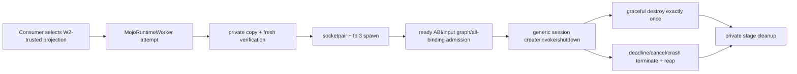

# MojoRuntimeWorker

## Purpose and Scope

`MojoRuntimeWorker` is the planned public SwiftPM product that owns W3, the
generic client and lifecycle boundary for ADR-0015 direct-linked workers. Its
parent is [`DESIGN.md`](../../DESIGN.md); it has no child component designs.

It consumes the trusted immutable worker projection produced by the read-only
[`MojoRuntime`](../MojoRuntime/DESIGN.md) verifier. It does not author or verify
an original artifact, expose a general process launcher, or define model,
training, device-selection, budget, telemetry, checkpoint, or safety semantics.

## Responsibilities and Boundaries

This product owns one verified attempt at a time: private bundle copy and fresh
verification, socketpair creation, child fd-3 mapping, process-group spawn,
bounded protocol-v1 I/O, startup identity admission, generic session creation,
verified Float32 binding invocation, graceful shutdown, deadline/cancellation
termination, process-group reap, and deletion of its private attempt staging.

Its public contract accepts only a W2-trusted worker projection and binding
records originating from that projection. It exposes typed worker/session values
and bounded payload/results. It does not expose paths, PIDs, file descriptors,
signals, wait statuses, raw headers/frames/codecs, executable arguments,
environment mutation, or arbitrary binding identifiers.

The consuming package owns which verified artifact is allowed, the mapping from
domain operations to verified binding records, attempt policy, budgets,
telemetry interpretation, checkpoint commit/rollback, and acceptance evidence.

## Related Designs

| Design | Relationship | Contract Used | Summary | Cautions |
|---|---|---|---|---|
| [`Swift Mojo`](../../DESIGN.md) | parent | Package ownership and public product boundary | Places W3 after artifact generation and read-only verification. | Generic execution is not device or product qualification. |
| [`MojoRuntime`](../MojoRuntime/DESIGN.md) | depends on | Trusted immutable worker projection | Supplies the only artifact value W3 can stage and execute. | W3 must freshly verify its private copy before spawn. |
| [`MojoRuntimeProtocolCore`](../MojoRuntimeProtocolCore/DESIGN.md) | depends on | Protocol-v1 Swift codec/types and closed schema | Encodes and validates bounded fd-3 traffic. | Protocol types are implementation details, not re-exported. |
| [`MojoPOSIXSupport`](../MojoPOSIXSupport/DESIGN.md) | depends on | Package-scoped worker socket/spawn/I/O/signal/wait primitives | Implements Darwin/glibc process portability below W3. | POSIX values never cross the public product boundary. |
| [`MojoArtifactCore`](../MojoArtifactCore/DESIGN.md) | coordinates with | Private-copy verifier engine | Revalidates the staged closed tree. | W3 cannot mutate or repair an invalid bundle. |
| [ADR-0015](../../docs/ADR-0015-DIRECT-LINKED-PERSISTENT-WORKERS.md) | implements | W3 generic client and lifecycle | Fixes protocol, TOCTOU, cancellation, and evidence semantics. | No callable-library or application-process loading path is allowed. |

## Architecture



The public dependency direction is:

```text
Manas/Kuyu domain policy
    -> MojoRuntimeWorker typed attempt/session operations
        -> MojoRuntimeProtocolCore codec
        -> MojoPOSIXSupport / CMojoPOSIXSupport
```

The lower layers never import the consuming package and W3 never interprets a
binding as a model, optimizer, checkpoint, Metal, CUDA, or Jetson operation.

## Contracts and Invariants

- Attempt creation accepts only the immutable worker projection returned by the
  W2 worker verifier; there is no arbitrary executable or raw-path initializer.
- W3 copies the complete verified tree into a private attempt directory,
  verifies that copy, and spawns only the relative executable fixed by the
  projection. A changed, extra, missing, linked, or non-private entry fails
  before process or session creation as applicable.
- The child protocol endpoint is exactly fd 3. Standard output and error are
  bounded diagnostics and never protocol channels.
- W3 compares `ready` protocol/ABI/input-graph/all-binding/target fields and
  `executionContractDigest` with the W2 projection before `createSession`.
  Mismatch produces zero session-factory and invocation calls.
- One attempt owns one process, at most one live session, one in-flight request,
  monotonically increasing request IDs, and receive/send storage bounded by the
  verified manifest ceiling.
- Public invocation accepts a verified binding value from the same projection
  and bounded Float32 input. Binding provenance, element-count multiplication,
  payload size, response pairing, status, and trailing bytes are validated.
- Graceful shutdown stops admission, resolves the in-flight operation, destroys
  session/device handles exactly once in the worker, receives both shutdown
  acknowledgements, closes transport, reaps the child, and cleans staging.
- Cooperative cancellation between calls uses graceful shutdown. Cancellation
  or a hard deadline during a call, protocol failure, EOF, signal, or crash
  terminates and reaps the process group, rejects partial output, relies on OS
  resource reclamation, and never claims user-space destructors ran.
- A failed or terminated worker is never reused. A later attempt starts with a
  new private stage, process, protocol sequence, and session.
- Application budget values and runtime telemetry remain generic payload or
  result data selected and interpreted by the consuming package; W3 does not
  guess limits or turn evidence into success.

## Runtime Flows

### Start and invoke

```text
trusted W2 projection
  -> create private attempt directory
  -> copy complete worker bundle
  -> fresh closed-tree verification
  -> socketpair + spawn verified executable with child endpoint at fd 3
  -> receive and admit ready
  -> create one session
  -> invoke verified binding serially with bounded frames
  -> return typed bounded result
```

### Termination

```text
between-call cancel or normal close
  -> shutdownSession -> sessionShutdown
  -> shutdownWorker -> workerShutdown
  -> close + reap + remove private stage

in-flight deadline / protocol failure / EOF / crash
  -> terminate process group -> bounded escalation -> reap
  -> reject partial result -> remove private stage
  -> next attempt independently verifies and starts clean
```

## State, Ownership, and Lifecycle

| State | Owner | Lifetime | Terminal rule |
|---|---|---|---|
| Trusted worker projection | caller, borrowed by attempt creation | Selection through private-copy verification | Never mutated or treated as execution evidence |
| Private staged bundle | W3 attempt | Before spawn through terminal cleanup | Removed after child reap; never exposed publicly |
| Parent protocol descriptor and child PID/process group | W3 attempt | Successful spawn through reap | Closed/signaled/reaped exactly once by W3 |
| Protocol sequence and bounded buffers | W3 attempt isolation | Ready through terminal frame/close | Never shared across attempts |
| Worker session lease | generated worker, represented by W3 typed session | `sessionCreated` through graceful shutdown or process death | Graceful destroy exactly once; hard death relies on OS reclamation |
| Domain policy/evidence | consuming package | Product-defined | Never stored or interpreted by W3 |

Ordered I/O, cancellation, and terminal transitions require one isolated W3
attempt owner. No blocking POSIX call or external callback executes while a
memory-only mutex is held. Public session values cannot outlive or detach from
their attempt owner.

## Failure, Concurrency, and Constraints

Artifact/projection mismatch, private-stage failure, unsupported platform,
socket/spawn failure, malformed or oversized frames, preflight mismatch,
invalid binding provenance, busy use, timeout, cancellation, worker failure,
shutdown contradiction, signal failure, reap failure, and cleanup failure are
distinct typed errors. Primary and cleanup failures are preserved together.

Only one request may be in flight. Concurrent public calls are serialized or
rejected by the attempt owner; they cannot produce duplicate request IDs or
parallel frame reads. Every timeout is caller-supplied policy consumed by W3,
bounded, and enforced without returning a successful empty result.

## Verification and Change Impact

Focused tests must prove trusted-projection-only construction, private copy and
reverification, absence of public path/PID/fd/raw-frame surfaces, fd-3 mapping,
fragmented reads/writes, every malformed/oversized frame, ready mismatch with
zero session calls, verified-binding provenance, one-in-flight ordering,
graceful exactly-once destruction, cooperative cancellation, forced in-flight
termination/reap, partial-output rejection, cleanup-failure composition,
application survival, and clean next-attempt recovery.

Real worker acceptance must execute the same client on macOS and native Linux;
each result proves only its actual target. Changes require rechecking ADR-0015,
the protocol core, artifact/verifier projection, both POSIX layers, root design,
and downstream compile fixtures demonstrating that Manas/Kuyu need no
filesystem, POSIX, raw-handle, or raw-protocol dependency.
