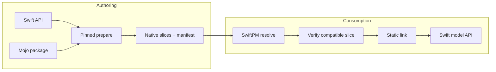

# ADR-0002: Mojo models as Swift packages

- Status: Proposed
- Date: 2026-08-20
- Scope: Post-P1 model authoring and distribution

## Implementation status

ADR-0003 through ADR-0008 implement and verify the bridge substrate for real external packages、target-scoped static frameworks、arm64/x86_64 universal Apple artifacts、Linux static-library artifact bundles、compiler pins、build/release verification、compiler-free relocated consumption、two-target linking、borrowed/mutable `Float` slices、and a generic synchronous session/resource owner. This ADR remains Proposed because model-specific session semantics、weights compatibility、real inference、remote binary artifacts、and model-level failure behavior are not complete.

## Context

`swift-mojo` の主要な実用候補は、Mojoで実装したLLMやcompute modelをSwift applicationから利用することです。model実装は複数module、kernel、model/session stateを持つため、Swift-parseableなinline DSLだけへ収めることは現実的ではありません。一方、Swift consumerはmodelを通常のSwift Package dependencyとして追加し、Mojo compilerやC ABIを意識せず利用できる必要があります。

次の4つはlifecycleと配布要件が異なります。

| Artifact | Built/selected by | Consumed by | Lifetime |
|---|---|---|---|
| Swift model API | model author | application source | package version |
| Mojo source package | model author | `swift package --disable-sandbox --allow-writing-to-package-directory mojo prepare` | source revision |
| native ABI artifact | prepare/release workflow | Swift linker/process | release/platform slice |
| model weights | application/model resolver | model session | model revision/cache policy |

このdecisionの起点となったschema-3 baselineは `Sources/<Target>/**/*.swift` だけをscanし、fixed C moduleを生成していました。ADR-0003のschema-4 sourceはexternal `.mojo` packageをinput graph、cache、plugin verification、artifact generationへ含め、generated identityをtarget scopeへ分離しました。ADR-0008のschema 5はそのidentityをApple/Linux native artifact adapterへ拡張しています。model distribution全体のacceptanceは引き続き本ADRの未完了範囲です。

## Decision

model実装は、`swift-mojo` repositoryへ組み込むのではなく、modelごとの独立したSwift Packageとして表します。

```text
<ModelPackage>/
├── Package.swift
├── Sources/<ModelTarget>/
├── Mojo/<MojoPackage>/
│   ├── __init__.mojo
│   └── *.mojo
├── Generated/<ModelTarget>/
│   ├── <GeneratedModule>.xcframework
│   ├── <GeneratedModule>.artifactbundle
│   ├── Bindings.mojo
│   ├── MojoSourceMap.json
│   └── MojoArtifact.json
├── SwiftMojo.json
└── Tests/<ModelTarget>Tests/
```

責務は次の通りです。

1. model packageはSwift公開API、model/session lifecycle、Mojo source package、model固有testsを所有する。
2. `swift-mojo` はsource graph、binding lowering、compiler orchestration、ABI、artifact preparation、verification、runtime bridgeを所有する。
3. applicationはweights location、generation policy、UI、product stateを所有する。
4. Mojo sourceはpackage-root相対のauthoring inputであり、SwiftPM runtime resourceとしてbundleへコピーしない。
5. model authorはpinned Mojo compilerで明示 `prepare` を実行する。
6. released model packageはtarget-specific native artifactとmanifestを提供し、consumerの通常build/runtimeはMojo compilerを必要としない。
7. Swift bindings、Mojo sources、dependency identities、compiler、target/features、generated ABI、native artifactを1つのversioned compatibility envelopeで検証する。
8. production weightsはSwift source package、XCFramework、Git repositoryから分離し、immutable revision/digestを持つresolver inputとして扱う。
9. Apple platformはXCFramework adapterを使う。非Apple platformはSwiftPMの実在するlink/package capabilityに合わせた別adapterを持ち、XCFramework互換を仮定しない。



## Mojo precompiled source

Mojo packageは `__init__.mojo` を持つmodule directoryです。Mojoのprecompiled `.mojoc` はexact compiler versionへ依存し、import後にtarget-specific codeへmaterializeされます。このため、`.mojoc` はauthor-side cacheまたはpinned intermediateには使用できますが、次の役割には使いません。

- SwiftPM binary target。
- compiler-version-independentなpublic source distribution。
- Swiftから直接invokeできるruntime artifact。

public execution boundaryはprepared native artifact、semantic compatibility boundaryはmanifestです。

## Weights policy

通常のLLM weightsはSwiftPM resourceにしません。理由はrepository/package sizeだけでなく、code version、model revision、quantization、device capability、cache evictionのlifecycleが異なるためです。

- public model load APIはURL、revision、digest、またはresolverを受け取る。
- load前にweight format、revision/digest、model ABI compatibilityを検証する。
- Hugging Face由来のhost cacheは `~/.cache/huggingface/hub/` に統一する。
- project-local model directoryと `~/Documents` はmodel cacheに使わない。
- small deterministic fixtureだけをtestsのresourceとして許可する。

## Consequences

### Positive

- Swift consumerはmodelを通常のlibrary productとしてimportできる。
- model authorとconsumerのtoolchain責務を分離できる。
- modelごとにAPI、artifact、weights compatibilityをversioningできる。
- `swift-mojo` coreをmodel catalog、tokenizer collection、download managerへ拡張せずに保てる。
- arbitrary Mojo implementationをinline Swift grammarへ押し込めない。

### Negative

- external Mojo packageを含むinput graphとmanifest schemaを維持するcostが増える。
- model/targetごとに衝突しないbinary module namingをrelease互換性として維持する必要がある。
- supported platform/CPU/acceleratorごとのnative artifactをreleaseする必要がある。
- sourceとbinary artifactのrepository size、remote distribution、signing policyを決める必要がある。
- model sourceの変更とartifact更新を同じreview/release transactionで管理する必要がある。

## Alternatives considered

### Put model implementations in `swift-mojo`

Rejected. interop substrateとmodel catalogのrelease cadence、dependencies、ownershipを結合し、core consumerへ不要なartifactを配布します。

### Copy `.mojo` files as SwiftPM resources

Rejected as the execution design. resource copyはruntime bundleへの配置であり、Mojo compilation、native link、source/artifact identityを成立させません。source inspection用のopt-in copyが将来必要になっても、prepare inputとは別の責務です。

### Compile Mojo in every consumer build

Rejected as the default. compiler discovery、sandbox、build latency、reproducibility、offline consumptionを悪化させます。explicit local development modeが将来追加されても、released packageのprepared-artifact pathを置き換えません。

### Distribute only `.mojoc`

Rejected. exact compiler versionに依存し、SwiftPMが直接linkできるnative artifactではありません。

### Bundle production weights in the Swift Package

Rejected. code/artifact releaseとweight revision/cache lifecycleを結合し、package resolutionを大容量asset distributionへ変えてしまいます。

## Acceptance gates

このADRをAcceptedへ変更するには、少なくとも次を実証します。

1. external Mojo package内の全sourceとdependency identityがdeterministic graphへ入る。
2. source、Swift binding、manifest、header/archiveの単独改変をconsumer buildが拒否する。
3. pinned author environmentが複数platform sliceを再現可能にprepareする。
4. clean consumer environmentがMojo compilerなしでpackageをresolve、build、link、runする。
5. 2つ以上のmodel/targetを同じpackage graphへ追加してmodule/artifact collisionが起きない。
6. compatible test weightsで実推論し、wrong revision/digest/format/sliceをtyped failureとして拒否する。
7. runtime relocation、ownership、shutdown、error/cancellation behaviorをmodel APIの契約どおり検証する。

## References

- [Mojo: Modules and packages](https://mojolang.org/docs/manual/packages/)
- [SwiftPM: Writing a build tool plugin](https://docs.swift.org/swiftpm/documentation/packagemanagerdocs/writingbuildtoolplugin/)
- [SwiftPM: PackageDescription](https://docs.swift.org/package-manager/PackageDescription/PackageDescription.html)
- [ADR-0001](ADR-0001-STATIC-PREPARE-PIPELINE.md)
