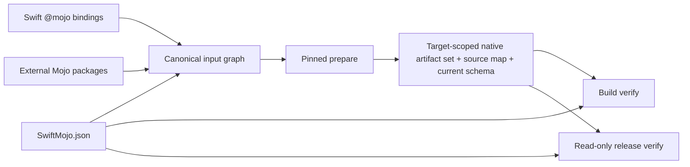

# ADR-0003: Target-scoped artifact sets and release verification

- Status: Accepted; schema-4 packaging extended by ADR-0008
- Date: 2026-08-20
- Scope: Target-scoped authoring and release contract; schema 4 is the historical Apple-only form

## Context

schema-3 P1は1つのfixed C module、1つのarm64 macOS archive、Swift sourceだけのgraphでした。この形では、external Mojo model package、複数Swift target、複数platform slice、pinned compiler、release前の完全性を同時に表現できません。

構造やmanifest fieldが存在するだけではrelease proofになりません。author inputからconsumer linkまで、同じidentity envelopeを実行経路上で照合する必要があります。

## Decision

1. package rootのclosed-schema `SwiftMojo.json` がtargetごとのcompiler version、external Mojo packages、required target slicesを所有し、unknown keyを拒否する。
2. inline bindingはdirect Swift bodyを使い、full Mojoは `@mojo(package:function:)` で `Mojo/<Package>` へ接続する。
3. `MojoInputGraph` はparser diagnosticのないSwift binding graphとexternal package内全regular fileのrelative path/content digestを合成し、package内部のsymbolic linkを拒否する。
4. generated entry moduleはexternal functionをimportし、Mojo compilerへ宣言済みpackageだけをsymlinkしたstaging import rootを `-I` で渡す。packageの実parentや未宣言の兄弟packageはcompiler search pathへ公開しない。
5. module、archive、artifact、C symbol prefixはSwift target identityから決定し、複数targetのlink collisionを防ぐ。hyphenを含むtargetはfull target digestをmodule/archive componentへ含め、underscore正規化との衝突を避ける。
6. schema-4 manifestはinput graph、canonical generated Mojo、source map、compiler、全slice、各archive、hidden fileを含むXCFramework treeを1つのcompatibility envelopeへ入れる。artifact treeの任意symbolic linkは外部可変byteを参照し得るため拒否する。versioned macOS frameworkに必要な標準relative linkだけは、固定path・固定destination・tree内解決を検証し、link record自体をdigestへ含める。verifyはgenerated Mojo/source mapをcurrent rendererから再構成し、manifestの自己申告digestだけを信頼しない。ADR-0008はこの同じidentity envelopeをschema 5のadapter-specific Apple/Linux artifact setへ拡張する。
   同じApple platform/variantに属する異なるarchitecture sliceは個別compile/archive後にuniversal static framework binaryへ統合し、XCFrameworkにはgroupごとに1 target-scoped frameworkだけを登録する。manifestはcompiler sliceを個別に保持し、verifierはgroup framework binaryのexact architecture集合と照合する。詳細なmulti-target packaging decisionはADR-0005が所有する。
7. `MojoBuildPlugin` はSwift/config/Mojo/source-map/manifest/artifactをinputとして `verify` だけを実行する。
8. `swift package --allow-writing-to-package-directory mojo release` はpackage-owned outputを書き換えず、current schema、compiler pin、全required slices、target identity、source/package graph、source map、XCFramework metadata/interface/tree、local/moving-branch dependency absence、literal remote package requirement、binary target、Mojo product、binary dependency、同一package由来のbuild plugin wiringを検証する。
9. schema 3は既存artifactの通常build verificationだけを許可し、release gateでは拒否する。
10. remote upload、signing、tag creationはこのcommandの責務に含めない。

## Responsibility boundary

| Owner | Responsibility |
|---|---|
| `MojoBindingCore` | inline/external binding semantics and Swift source locations |
| `MojoCompilerCore` | executable discovery、version、target/accelerator/import arguments、bounded process ownership |
| `MojoArtifactCore` | input graph、source map、artifact set、manifest、doctor/inspect、build/release verification |
| `MojoCommandCore` | command parsing and text/JSON projection |
| Command Plugin | package-author convenience and package-directory permission |
| Build Plugin | build command planning and complete input declaration |
| model package | model/session API、Mojo implementation、prepared artifact、model tests |
| application/model resolver | weights、revision/digest、generation policy、UI |

## Failure contract

- config、compiler、source、package、source map、slice、interface、artifactの不一致を別のtyped errorとして保持する。
- normal buildもconfigを入力に含め、declared slice setとcompiler pinを照合する。destination assertionは `SWIFT_MOJO_TARGET_*` が明示された場合に追加する。
- release verificationはrepairやprepareを行わない。
- unsupported platform、missing package、unknown macro argumentsはfallbackせず失敗する。

## Compatibility

schema-3 artifactはtarget identityとsource mapを持たないため、current releaseとして承認できません。一方、既存consumer exampleの移行を壊さないため、known legacy generation digestとfixed symbolsを通常build verifier/Registryが読み取る期間を設けます。schema-4 Apple-only artifactもbuild compatibilityのため読み取れますが、新しい `prepare` とrelease gateはADR-0008のschema 5 artifact setを要求します。legacy read pathの削除はsupported consumer migrationを確認した後に別途判断します。

## Acceptance gates

source implementationだけでは完了としません。次をbounded executionで確認します。

1. direct inline macro、prepare、static link、runtime value、overflow failure。
2. real external Mojo package import、source change cache invalidation、compiler diagnostic source remap。
3. arm64/x86_64またはmacOS/iOSの2 slice XCFramework prepareとdestination selection。
4. 2つのMojo-enabled Swift targetを同じconsumerへlinkし、module/C symbol collisionがない。
5. config、compiler、Swift source、Mojo source、source map、manifest、header、module map、Info.plist、各archiveの単独改変がbuild/releaseを失敗させる。
6. clean consumerがMojo compilerなしでresolve/build/link/runする。
7. Command Pluginのinit/prepare/inspect/doctor/releaseとJSON failure contract。

Current evidence:

- Gate 1はdirect inline integration target、real Mojo execution、overflow failure testsで完了。
- Gate 2はreal external package importとsource invalidationまで完了。real compiler diagnostic source-remap acceptanceは未完了。
- Gate 3はarm64/x86_64 universal XCFrameworkで完了。
- Gate 4はimmutable remote revisionから2つのtarget-scoped static frameworkをprepareし、同一consumerでlink/runして両方の `42` を確認済み。
- Gate 5のartifact mutation経路とpackage-product/plugin provenance testsは再実行済み。
- Gate 6はrelocated compiler-free consumerで完了。
- Gate 7のcommand unit tests、immutable remote revisionからのpublic `swift package mojo` authoring/release workflow、and two-target workflowは実行済み。exact-tag gateはrelease tagがまだ存在しないため未実行。

## References

- [ADR-0001](ADR-0001-STATIC-PREPARE-PIPELINE.md)
- [ADR-0002](ADR-0002-MODEL-SWIFT-PACKAGE.md)
- [ADR-0005](ADR-0005-TARGET-SCOPED-STATIC-FRAMEWORKS.md)
- [ADR-0008](ADR-0008-NON-APPLE-STATIC-LIBRARY-ARTIFACTS.md)
- [Mojo modules and packages](https://mojolang.org/docs/manual/packages/)
- [Mojo compilation targets](https://mojolang.org/docs/tools/compilation/)
