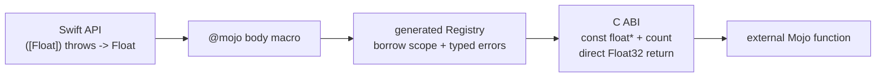

# ADR-0004: Synchronous borrowed Float buffer ABI

- Status: Runtime verified; allocation/copy and sanitizer evidence pending
- Date: 2026-08-20
- Scope: First non-scalar ABI vertical slice

## Context

The verified scalar bridge cannot carry model activations, weights, or logits. The first extension must prove that Swift-owned contiguous storage can cross the generated C ABI without exposing pointers in the public Swift API or introducing an owner whose release contract is not yet defined.

The first slice is deliberately narrower than a tensor abstraction. It accepts one non-empty Swift `[Float]`, synchronously borrows its contiguous storage, and returns one `Float`. Full Mojo source remains in an external package.



## Decision

1. The public declaration is external-only:

   ```swift
   @mojo(package: "MathModel", function: "sum")
   func sum(_ values: [Float]) throws -> Float
   ```

2. Inline buffer bodies are rejected. Arbitrary buffer algorithms belong in a `.mojo` package until a typed Swift-parseable DSL is designed.
3. The generated internal C boundary is:

   ```c
   float <target_prefix>_call_f32_buffer_f32(
       uint64_t binding_id,
       const float *values,
       uint64_t count
   );
   ```

4. The generated Registry uses `Array.withUnsafeBufferPointer`. The Swift `Array` remains the owner, and the pointer is valid only inside that synchronous closure.
5. Empty input is rejected. ABI v1 does not assign ambiguous semantics to a null pointer with zero count.
6. Mojo receives `Pointer[Float32, ImmUntrackedOrigin]`. It may read exactly `count` elements and must not mutate, retain, return, or free the storage.
7. The dispatcher returns `Float32` directly. There is no out-result storage or status branch in the repeated compute path.
8. ABI version, input graph, and every prepared binding are validated once by a thread-safe immutable Registry cache. Buffer validity remains a per-call `MojoInvocationError`; a Mojo/C unwind never crosses the ABI.
9. The buffer dispatcher is additive. Scalar binding identity and the scalar-only four-symbol interface remain unchanged.
10. The C header, symbol name, binding ID, and pointer handling remain generated implementation details.

## Ownership and lifetime

| Value | Owner | Borrow/lifetime | Mutation | Release |
|---|---|---|---|---|
| Swift `[Float]` storage | caller's `Array` | retained through `withUnsafeBufferPointer` | immutable through the bridge | Swift ARC/value lifetime |
| C/Mojo input pointer | no owner | one synchronous dispatcher call | forbidden | never freed by Mojo |
| count | value | one call | immutable | none |
| result value | Swift caller | returned by value | immutable | value lifetime |
| static artifact | process image | process lifetime | immutable | loader/process |

The implementation does not materialize an intermediate array. This is necessary for a zero-copy data path, but it is not sufficient evidence to claim verified zero-copy behavior. Allocation and copy counts must be measured before that claim is promoted.

## Failure contract

| Condition | Swift result |
|---|---|
| ABI version differs | `incompatibleStaticABI(expected:actual:)` |
| input graph differs | `inputGraphMismatch(expected:actual:)` |
| binding is absent | `bindingUnavailable(bindingID:)` |
| input is empty | `emptyBorrowedBuffer` |

Scalar calls keep their established nonthrowing invariant-trap contract. The new throwing surface does not silently convert a bridge failure to `0` or an empty result.

## Alternatives considered

| Alternative | Decision |
|---|---|
| Copy `[Float]` into bridge-owned memory | Rejected for the repeated model-compute path and because it would hide ownership cost |
| Publish `UnsafeBufferPointer<Float>` | Deferred; it exposes lifetime-sensitive API before a general borrow abstraction is defined |
| Return an owned Mojo buffer | Deferred until allocator identity, exactly-once destruction, Sendable behavior, and failure cleanup are designed |
| Encode a tensor descriptor immediately | Deferred; shape, stride, dtype, device, and owner versioning need a separate ABI record |
| Reuse the scalar dispatcher | Rejected; pointer/count has a different ABI signature and ownership contract |

## Compatibility

`MojoBinding` stores a signature family, but the existing scalar ABI key, scalar generator versions, canonical scalar record, and scalar pipeline digest remain unchanged. Buffer source、Registry、and C ABI versions are tracked as a signature-family pipeline extension, so a buffer artifact cannot be reused after its lowering changes without invalidating scalar-only artifacts. ABI version stays `1` because the dispatcher is optional and additive; an artifact exports only the signature-family dispatchers used by its binding graph.

## Acceptance gates

The implementation is not Verified until all of the following are executed:

1. bounded `xcodebuild test` for focused macro、binding、artifact、command、and integration suites;
2. real Mojo compilation of the generated pointer entry point;
3. universal arm64/x86_64 packaging and read-only release verification;
4. compiler-free relocated consumer execution producing scalar `42` and buffer sum `10.0`;
5. empty-buffer typed failure coverage and direct-return ABI inspection;
6. final Mach-O inspection showing the additive buffer symbol and no Mojo dynamic dependency;
7. allocation/copy measurement before describing the path as verified zero-copy;
8. supported sanitizer runs for pointer bounds and lifetime failures.

Gates 1 through 6 are complete on macOS with Mojo `1.0.0 (ed45d567)`. The immutable remote revision produced scalar `42`、buffer sum `10.0`、the typed empty-buffer failure、five expected bridge symbols、and no Mojo dynamic dependency. A same-executable Release latency benchmark measured `0.893%` median wrapper overhead against the direct dispatcher for work above 1 µs. Gate 7 remains incomplete because allocation/copy counts were not observed, and gate 8 remains incomplete.

## References

- [Mojo unsafe pointers](https://docs.modular.com/mojo/manual/pointers/unsafe-pointers/)
- [Mojo `@export`](https://docs.modular.com/mojo/manual/decorators/export)
- [ADR-0003](ADR-0003-RELEASE-ARTIFACT-SETS.md)
