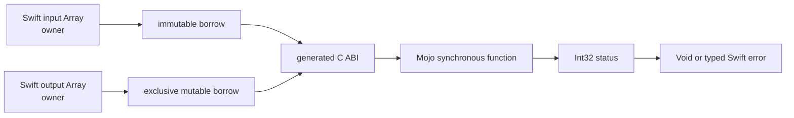

# ADR-0006: Scoped mutable Float buffer ABI

- Status: Accepted; immutable-revision universal runtime verified
- Date: 2026-08-21
- Scope: Caller-owned synchronous mutable-output vertical slice

## Context

The immutable borrowed-buffer ABI can reduce Swift-owned input into one scalar, but general compute code also needs to update caller-provided buffers. Introducing a device allocator, tensor owner, or long-lived session before their lifetime and shutdown contracts exist would conflate two different responsibilities.

This slice therefore proves mutation without ownership transfer. Swift owns both arrays, Mojo receives scoped pointers for one synchronous call, and an explicit status value carries recoverable algorithm failure back across the C ABI.



## Decision

1. The public declaration is external-only:

   ```swift
   @mojo(package: "MathModel", function: "scale")
   func scale(_ input: [Float], into output: inout [Float]) throws
   ```

2. The generated internal C boundary is:

   ```c
   int32_t <target_prefix>_call_f32_buffer_f32_buffer_i32(
       uint64_t binding_id,
       const float *input,
       uint64_t input_count,
       float *output,
       uint64_t output_count
   );
   ```

3. The generated Registry nests `withUnsafeBufferPointer` and `withUnsafeMutableBufferPointer`. Both borrows end before the Swift call returns or throws.
4. Input and output must both be non-empty. They have distinct typed errors and are rejected before the C dispatcher is called.
5. Mojo receives `Pointer[Float32, ImmUntrackedOrigin]` for input and `Pointer[Float32, MutUntrackedOrigin]` for output. It may mutate only initialized output elements within `output_count`.
6. Mojo must not retain, return, asynchronously use, deinitialize, or free either pointer.
7. Mojo returns `Int32`. Status `0` means success; every nonzero status becomes `MojoInvocationError.invocationFailed(bindingID:status:)`.
8. A nonzero status does not imply rollback. The output contents after failure are unspecified and callers must not consume them as a successful result.
9. ABI/input-graph/full-membership validation uses the existing thread-safe immutable Registry cache. Per-call work retains the family guard, two scoped borrows, one dispatcher call, and status handling.
10. This slice does not define device allocation, tensor ownership, transfer, aliasing across operations, asynchronous execution, session state, or shutdown. Those require a separate owner/lease ABI.

## Ownership and lifetime

| Value | Owner | Lifetime at bridge | Access | Release |
|---|---|---|---|---|
| input `[Float]` | Swift caller | nested synchronous borrow | Mojo reads within `input_count` | Swift value lifetime |
| output `inout [Float]` | Swift caller | same nested synchronous borrow | Mojo mutates within `output_count` | Swift value lifetime |
| C/Mojo pointers | no owner | one dispatcher call | scoped immutable/mutable access | never freed by Mojo |
| status | returned value | one call | immutable | none |
| static artifact | process image | process lifetime | immutable | loader/process |

## Failure contract

| Condition | Swift result | Output contract |
|---|---|---|
| ABI version differs | `incompatibleStaticABI(expected:actual:)` | dispatcher not called |
| input graph differs | `inputGraphMismatch(expected:actual:)` | dispatcher not called |
| binding is absent | `bindingUnavailable(bindingID:)` | dispatcher not called |
| input is empty | `emptyBorrowedBuffer` | dispatcher not called |
| output is empty | `emptyMutableBuffer` | dispatcher not called |
| Mojo status is nonzero | `invocationFailed(bindingID:status:)` | contents unspecified |
| Mojo status is zero | returns `Void` | mutation is the successful result |

No exception or Swift error crosses the C boundary. The status value is preserved rather than converted to a fabricated output.

## Compatibility

The mutable dispatcher is an additive signature family under static ABI version `1`. Artifacts export only the dispatchers required by their binding graph. Mutable-source, Registry, and C-ABI generation versions contribute to the signature-family pipeline digest, so changing this lowering invalidates affected artifacts without changing the established scalar-only binding identity.

## Alternatives considered

| Alternative | Decision |
|---|---|
| Return a newly allocated Mojo buffer | Deferred until allocator identity and exactly-once destruction are designed |
| Publish raw Swift pointer parameters | Rejected because lifetime-sensitive implementation details would become public API |
| Treat output as the same immutable borrowed signature | Rejected because mutation, exclusivity, failure, and ABI layout are different contracts |
| Require equal input/output lengths in Swift | Rejected because shape validation is algorithm-specific; Mojo reports it through status |
| Roll back output on nonzero status | Rejected for this slice because it would require a hidden copy or a transactional owner |
| Introduce a device/tensor handle now | Deferred to the capability/session phase; a scoped host borrow does not prove device lifetime |

## Acceptance evidence

The implementation passed:

1. bounded package-wide `xcodebuild test`, including IR, macro, generated source/header/Registry, cache identity, and typed-error tests;
2. real Mojo `1.0.0 (ed45d567)` arm64 and x86_64 object generation through the public command plugin;
3. immutable-revision universal static XCFramework link into a relocated temporary Swift consumer;
4. runtime mutation from `[1, 2, 3]` to `[2, 4, 6]`;
5. nonzero Mojo status `7` mapped to the typed Swift error;
6. distinct empty-input and empty-output failures;
7. final Mach-O inspection showing four required bridge symbols and no Mojo dynamic dependency.

The following gates remain separate and must not be inferred from this decision:

- allocation and copy counts;
- standalone borrowed/mutable-buffer sanitizer runs;
- native Linux compilation and runtime;
- downstream device-buffer execution.

## References

- [ADR-0004](ADR-0004-BORROWED-FLOAT-BUFFER-ABI.md)
- [Requirements](REQUIREMENTS.md)
- [Roadmap](ROADMAP.md)
