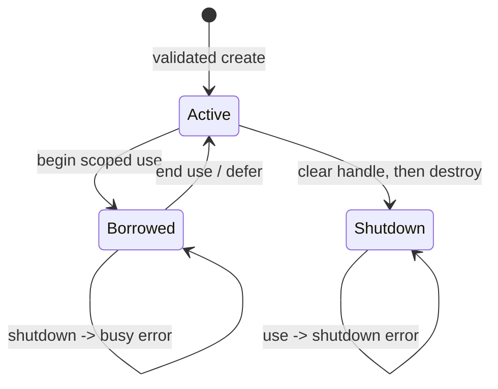

# ADR-0007: Opaque runtime session ABI

- Status: Accepted; CPU session/resource/transfer reference acceptance passed
- Date: 2026-08-21
- Scope: Synchronous session creation, use, owned Float32 resources, host transfer, capability negotiation, and shutdown

## Context

The caller-owned mutable-buffer ABI proves scoped host-memory mutation, but it
cannot represent model state, device contexts, command queues, compiled kernels,
or allocations whose lifetime spans calls. Those resources need one owner and an
explicit shutdown contract. Encoding a pointer as an integer, exposing a Mojo
pointer to application code, or assuming that a compiler accelerator target also
provides a runtime device would make the boundary unsound.

The exact pinned Mojo 1.0 toolchain can compile an allocated Mojo value behind
`OpaquePointer[MutUntrackedOrigin]`, recover it with `unsafe_bitcast`, and destroy
it with `unsafe_deinit_pointee`. Mojo's standard allocator path introduces KGEN
compiler-runtime symbols whose available implementation is a dynamic library in
the pinned environment. The CPU acceptance fixture therefore calls system
`malloc`/`free` through `external_call`, checks the integer address for zero before
constructing a non-null Mojo pointer, and retains Mojo-side initialization and
destruction ownership without adding a Mojo/KGEN dynamic dependency. This is an
artifact portability choice, not permission to expose integer handles across the
Swift/C boundary.

The base Mojo installation does not provide the host `DeviceContext` API used by
the separate MAX runtime. This ADR therefore establishes the generic ownership
ABI first and does not claim GPU runtime readiness.

## Confirmed current facts

| Layer | Current fact |
|---|---|
| Swift API | `@mojo` supports scalar, immutable host-buffer, and caller-owned mutable host-buffer signatures. |
| Generated registry | It validates static ABI, full input graph, and binding membership once, then performs synchronous dispatch. |
| Artifact identity | Target name and full input graph are stable, separately available identities. |
| Mojo ownership | The pinned compiler accepts opaque-pointer use and destruction; the CPU fixture validates libc allocation failure as an address before creating the non-null pointer, while the public C ABI remains `void *`. |
| Static runtime closure | Preparation inspects each object and rejects unresolved `KGEN_CompilerRT_*` symbols because no compatible compiler runtime is distributed by this package. |
| GPU runtime | Accelerator compilation targets exist, but a base Mojo installation alone does not prove a usable Metal or CUDA runtime context. |

## Decision

### Public Swift API

The generic runtime module owns only device requirements, capability records,
session lifetime, and the private handle borrow. Model-specific tokenizers,
weights, state layout, and execution policy remain in model packages.

```swift
@mojo(
    package: "SessionModel",
    function: "create_session",
    shutdown: "shutdown_session"
)
public func openSession(
    _ requirements: MojoSessionRequirements
) throws -> MojoSessionOwner

@mojo(
    package: "SessionModel",
    function: "create_buffer",
    shutdown: "destroy_buffer",
    copyFromHost: "copy_from_host",
    copyToHost: "copy_to_host",
    synchronize: "synchronize",
    sessionFactory: "openSession"
)
public func makeBuffer(
    _ session: MojoSessionOwner,
    elementCount: UInt64,
    memoryKind: MojoBufferMemoryKind
) throws -> MojoFloat32BufferOwner

@mojo(
    package: "SessionModel",
    function: "scale",
    sessionFactory: "openSession"
)
public func scale(
    _ session: MojoSessionOwner,
    _ input: [Float],
    into output: inout [Float]
) throws
```

`MojoSession` is the public behavioral protocol. `MojoSessionOwner` is the one
generic concrete owner returned by generated factories. Its raw handle and
initializer are SPI for generated registries, not application API.

`MojoFloat32BufferOwner` retains its parent session resource record and exposes
only exact-count synchronous `copy(from:)`, `copy(into:)`, and `shutdown()`.
Every factory declares a synchronization function. Generated Mojo invokes it
after a successful copy and propagates a nonzero copy or synchronization status.
This keeps Swift array pointers inside their unsafe-buffer closures even when the
underlying device transfer is enqueued asynchronously.

The owner has these invariants:

- exactly one non-null Mojo-created handle while active;
- immutable capability and artifact-domain records;
- all mutable lifecycle state protected by one `Mutex<State>`;
- no external call, event emission, I/O, or deallocation while the mutex is held;
- a synchronous handle lease increments the active-borrow count before exposing
  the handle and decrements it in `defer`;
- this ABI family permits at most one active lease per session and rejects a
  concurrent use attempt with a typed busy error;
- shutdown during an active borrow fails with a typed busy error;
- successful shutdown clears ownership before calling the non-throwing Mojo
  destroy function, so concurrent shutdown calls cannot double-destroy;
- use after shutdown fails with a typed lifecycle error;
- `deinit` performs the same exactly-once destroy as a fallback, while callers
  remain responsible for explicit shutdown.



### Session domain

A handle created by one factory must never reach another factory's dispatcher,
including a different session type in the same generated artifact. Every
session-bound binding names its Swift factory binding with `sessionFactory`. The
source graph rejects a missing factory or a factory from a different external
package. The generated registry derives a 64-bit domain identifier from this
versioned canonical record:

```text
swift-mojo-session-domain-v1
| target identity
| full input graph digest
| factory binding ID
```

The full input graph covers binding semantics and declared external package
content. The factory binding ID separates multiple opaque session types within one
artifact. Each session-bound call compares the owner's domain before borrowing
the handle. A mismatch is a typed error and does not cross the C ABI.

### Capability contract

`MojoSessionRequirements` carries an exact device kind, device ordinal, and
required capability bits. Creation returns an independently populated
`MojoSessionCapabilities` record. The generated registry accepts a session only
when:

- the response schema is exactly supported;
- the returned handle is non-null;
- the returned device kind is known and equals the requested device;
- the returned ordinal equals the requested ordinal;
- the available capability set is a superset of the required set.

There is no implicit CPU, Metal, CUDA, or HIP fallback. Unknown available bits are
preserved for forward inspection, but cannot satisfy a known required bit unless
that bit is present.

### Versioned flat C ABI

The first session ABI family uses primitive fields instead of sharing a Swift or
Mojo struct layout across C. The logical request and response records both have
schema version 1.

```c
int32_t <prefix>_create_session_v1(
    uint64_t binding_id,
    uint32_t request_schema,
    uint32_t requested_device,
    uint32_t requested_ordinal,
    uint64_t required_capabilities,
    void **session_out,
    uint32_t *response_schema_out,
    uint32_t *actual_device_out,
    uint32_t *actual_ordinal_out,
    uint64_t *available_capabilities_out
);

void <prefix>_shutdown_session_v1(
    uint64_t binding_id,
    void *session
);

int32_t <prefix>_create_f32_buffer_v1(
    uint64_t binding_id,
    void *session,
    uint64_t element_count,
    uint32_t memory_kind,
    void **buffer_out
);

void <prefix>_shutdown_f32_buffer_v1(
    uint64_t binding_id,
    void *session,
    void *buffer
);

int32_t <prefix>_copy_host_to_f32_buffer_v1(
    uint64_t binding_id,
    void *session,
    void *buffer,
    const float *source,
    uint64_t element_count
);

int32_t <prefix>_copy_f32_buffer_to_host_v1(
    uint64_t binding_id,
    void *session,
    void *buffer,
    float *destination,
    uint64_t element_count
);

int32_t <prefix>_call_session_f32_buffer_f32_buffer_i32_v1(
    uint64_t binding_id,
    void *session,
    const float *input,
    uint64_t input_count,
    float *output,
    uint64_t output_count
);
```

The create implementation must return status zero only after fully initializing
all response fields. A nonzero status is failure. If any failure path nevertheless
returns a non-null handle, or if post-create validation rejects an otherwise
successful response, the registry invokes the paired shutdown binding exactly
once before throwing. Shutdown is total and non-throwing for every valid handle
created by its paired factory.

Session use remains synchronous in this ABI family. Pointers and the opaque handle
must not be stored by the dispatcher beyond the call. Async work, events, and
cancellation require a later ABI family with an explicit completion owner.

### Static runtime dependency boundary

The P1 artifact is a static, compiler-free consumer boundary. It may reference
target system libraries resolved by the final Apple link, but it must not acquire
an undeclared dependency on a Mojo compiler installation. `prepare` normalizes
Mach-O symbol spelling and rejects every unresolved `KGEN_CompilerRT_*` symbol
with `MojoArtifactError.unsupportedMojoRuntimeSymbols` before creating the
archive. This policy participates in the generation-pipeline digest.

The project does not emulate compiler-runtime allocation, diagnostics, async, or
device behavior. Supporting such symbols requires an explicit runtime adapter
with its own version, target slices, ownership contract, licensing review, and
runtime acceptance. The absence of a known prefix is not evidence that arbitrary
MAX/GPU code is supported; consumer link/run and dependency inspection remain
release gates.

## Responsibility and lifetime matrix

| State | Creator | Owner | Lifetime | Isolation | Failure contract |
|---|---|---|---|---|---|
| Requirements | Application/model package | Swift value | One create attempt | Immutable | No fallback |
| Native session resource | External Mojo package | `MojoSessionOwner` | Create success through shutdown/deinit | `Mutex<State>` guards handle lifecycle | Create/status/response failures throw |
| Raw handle lease | Generated registry | Synchronous call stack | One dispatcher call | At most one borrow under the same mutex | Busy, shutdown, and domain mismatch throw |
| Owned Float32 resource | External Mojo package | `MojoFloat32BufferOwner` through the session registry | Create success through child shutdown/deinit | Same parent mutex and lease as session use | Capability/size/count/status/shutdown failures throw |
| Input/output buffers | Swift caller | Swift arrays | Nested unsafe-buffer closures | Exclusive `inout` for output | Empty/status failures throw; failed output is unspecified |
| Device capability record | External Mojo create response | Session owner | Session lifetime | Immutable | Exact device/ordinal and required-set validation |

## Rejected alternatives

| Alternative | Reason |
|---|---|
| Encode the pointer as `UInt64` | Loses pointer provenance and creates an unnecessary unsafe round trip. |
| Let generated registries expose raw handles | Application code could retain, mix, or destroy handles outside the owning artifact. |
| Hold the mutex across compute or destroy | External code could block, re-enter, or deadlock while lifecycle state is locked. |
| Close while calls are active | Requires blocking coordination or use-after-free risk; this synchronous family reports busy instead. |
| Infer GPU availability from `--target-accelerator` | Compiler target support does not establish an installed host runtime or a usable physical device. |
| Put Kuyu/Manas policy in the session owner | Violates the generic bridge and conscious/unconscious responsibility boundaries. |

## Verification gates

Implementation is complete only after all of these pass:

1. Binding and macro tests cover exact accepted signatures and reject malformed
   factory metadata, missing destroy/copy pair, wrong ownership surface, and inline bodies.
2. Owner tests cover exactly-once explicit shutdown, deinit fallback, use after
   shutdown, domain mismatch, and re-entrant/concurrent shutdown while borrowed.
3. Artifact tests inspect the generated Mojo, C header, and Swift registry for the
   versioned create/use/copy/shutdown family and cleanup on validation failure.
4. A real pinned-Mojo acceptance fixture allocates a Mojo session, uses it across
   at least one later call, round-trips an owned buffer through the generated copy
   ABI, destroys it once, rejects use after shutdown in Swift, and leaves no Mojo
   dynamic-library dependency in the final executable.
5. GPU capability is reported only by a separately verified MAX/device adapter on
   the exact Apple Silicon or Jetson deployment. The CPU reference fixture is not
   evidence of Metal or CUDA execution.

## Verification result

On 2026-08-21 the pinned Mojo 1.0 compiler built and ran the local CPU fixture.
The fixture created a factor-bearing session, produced `[2, 4, 6]` from
`[1, 2, 3]`, round-tripped `[4, 3, 2, 1]` through an owned host buffer, returned
typed count/copy/synchronization/use/create/schema failures, rejected use after shutdown,
tolerated idempotent shutdown, exported all ten session bridge symbols,
and linked with no Mojo or KGEN dynamic dependency. A separate preparation test
proves the unsupported compiler-runtime dependency is rejected before archiving.
Owner tests separately cover reentrant and concurrent use/shutdown rejection. The
same real-Mojo lifecycle and transfer fixture passed once with the Swift consumer
instrumented by Apple's Swift Address Sanitizer and once with Mojo objects
instrumented by Mojo's upstream LLVM Address Sanitizer contract. The Mojo lane
verifies the exact `__asan_version_mismatch_check_*` runtime symbol before linking.
Linux ARM64 native execution, MAX-backed Metal/CUDA device buffers, and DMA
synchronization remain outside this acceptance result.
