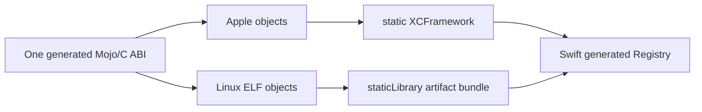

# ADR-0008: Non-Apple static-library artifacts

- Status: Implemented and cross-package verified; native Jetson acceptance pending
- Date: 2026-08-21
- Scope: Linux ARM64 distribution of the generated C ABI

## Context

The Apple adapter packages target objects as static frameworks inside an
XCFramework. XCFramework is not a Linux distribution format. A runtime `dlopen`,
an unsafe linker flag, or requiring the Mojo compiler in a consumer build would
violate the static, compiler-free consumption contract.

SE-0482 is implemented in Swift 6.2 and adds `staticLibrary` artifacts to SwiftPM
artifact bundles for non-Apple platforms. Each variant carries a static archive,
supported target triples, header paths, and a module map. The proposal restricts
portable binary dependencies to a C interface whose unresolved dependencies are
provided by the C standard library/runtime. This matches swift-mojo's generated
C ABI and the link-closed Mojo policy.

The pinned Mojo 1.0 compiler was probed with
`aarch64-unknown-linux-gnu`. It emitted an ARM64 ELF relocatable object for the
opaque CPU session fixture. Its only undefined symbols were `malloc` and `free`;
no `KGEN_CompilerRT_*` symbol was present. This proves cross-compilation, not
native Jetson linking or execution.

## Decision

Prepared output may contain two independent native artifact adapters:

| Destination | Artifact | SwiftPM binary target |
|---|---|---|
| Apple | `<module>.xcframework` with static frameworks | `<module>` |
| Linux | `<module>.artifactbundle` with `staticLibrary` variants | `<module>_Linux` |

The Linux artifact's module map declares the same generated C module name as the
Apple artifact. A Swift source target depends on the two binary targets with
platform conditions, so its generated registry imports one stable module name on
both platforms.



Manifest schema 5 records every artifact independently with adapter kind,
relative name, and canonical tree digest. Each compiler slice records its target,
adapter-specific library identifier, and archive digest; the verifier resolves
that slice to exactly one artifact from its target triple and adapter. The
aggregate artifact digest is derived from the sorted artifact records; it is not
a substitute for validating every tree.

Linux variants use the exact configured target triple as `supportedTriples`.
Two Linux compiler slices that collapse to the same target triple are rejected,
because SwiftPM cannot select them by CPU or accelerator string. A deployment
requiring CUDA therefore prepares one Linux slice whose Mojo object contains the
CPU host entry points and the selected accelerator code for that deployment.

The artifact bundle contains only:

```text
<module>.artifactbundle/
├── info.json
├── include/
│   ├── <module>.h
│   └── module.modulemap
└── variants/<variant-id>/lib<module>.a
```

The preparer and verifier treat the bundle as a managed, canonical tree. They
validate the exact `staticLibrary` JSON shape, artifact identifier, archive path,
supported triple, header path, module-map path, archive digest, and complete tree
digest. Symbol inspection continues to reject KGEN compiler-runtime dependencies.
On a macOS authoring host, Linux ELF objects are archived with `llvm-ar` rather
than BSD `ar`: BSD `ranlib` can warn about a non-Mach-O member, return success,
and emit an archive containing only its symbol table. Preparation also lists the
finished archive and requires the compiled object member before committing any
artifact or manifest. `SWIFT_MOJO_LLVM_AR` may pin an absolute LLVM archiver
when the active Xcode toolchain does not expose `llvm-ar` through `xcrun`.

## Package contract

A mixed Apple/Linux package uses literal target declarations:

```swift
.binaryTarget(
    name: "SwiftMojo_Model_ABI",
    path: "Generated/Model/SwiftMojo_Model_ABI.xcframework"
),
.binaryTarget(
    name: "SwiftMojo_Model_ABI_Linux",
    path: "Generated/Model/SwiftMojo_Model_ABI.artifactbundle"
),
.target(
    name: "Model",
    dependencies: [
        .target(
            name: "SwiftMojo_Model_ABI",
            condition: .when(platforms: [.macOS, .iOS])
        ),
        .target(
            name: "SwiftMojo_Model_ABI_Linux",
            condition: .when(platforms: [.linux])
        ),
    ],
    plugins: [
        .plugin(name: "MojoBuildPlugin", package: "swift-mojo"),
    ]
)
```

Apple-only schema-4 artifacts remain build-verifiable for compatibility. A new
release must use schema 5. There is no silent selection between incompatible
runtime devices inside either artifact.

## Verification gates

1. Layout tests encode and validate exact SE-0482 metadata and corruption paths.
   **Passed.**
2. A real Mojo cross-compile produces an ARM64 ELF archive with no KGEN symbols.
   **Passed for `aarch64-unknown-linux-gnu`.**
3. Package-manifest verification requires exact platform-conditioned binary
   dependencies for every prepared adapter. **Passed in the schema-5 mixed
   integration fixture; the macOS destination imports and links the Apple
   artifact while SwiftPM accepts the Linux artifact-bundle target.**
4. A Linux ARM64 Swift 6.2+ consumer imports the generated module, statically
   links the archive, and runs create/use/shutdown without the Mojo compiler.
5. Native Jetson acceptance records OS, Swift, Mojo, CUDA, GPU, artifact digest,
   runtime capabilities, symbols, dynamic dependencies, success paths, and typed
   failure paths. Cross-compilation on macOS is not gate 4 or 5 evidence.

## References

- [SE-0482: Binary Static Library Dependencies](https://github.com/swiftlang/swift-evolution/blob/main/proposals/0482-swiftpm-static-library-binary-target-non-apple-platforms.md)
