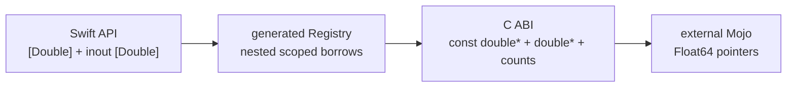

# ADR-0009: Synchronous borrowed mutable Float64 buffer ABI

- Status: Runtime verified on macOS CPU
- Date: 2026-08-21
- Scope: Deterministic scientific-compute reference execution

## Context

The existing borrowed mutable buffer family preserves Swift ownership and
supports synchronous Mojo computation over `Float32`. Deterministic physics
reference executors require `Float64` end to end; converting to `Float32` at the
bridge would change the numeric contract and could hide backend divergence.

The bridge must remain additive. Existing scalar, Float32, session, and
session-owned resource binding identities cannot change.



## Decision

1. The public binding signature is external-only:

   ```swift
   @mojo(package: "Dynamics", function: "execute")
   func execute(_ input: [Double], into output: inout [Double]) throws
   ```

2. The generated C dispatcher is additive:

   ```c
   int32_t <target_prefix>_call_f64_buffer_f64_buffer_i32(
       uint64_t binding_id,
       const double *input,
       uint64_t input_count,
       double *output,
       uint64_t output_count
   );
   ```

3. The generated Registry nests `withUnsafeBufferPointer` and
   `withUnsafeMutableBufferPointer`. Neither pointer may escape the synchronous
   dispatcher call.
4. Mojo receives `Pointer[Float64, ImmUntrackedOrigin]` and
   `Pointer[Float64, MutUntrackedOrigin]` with their exact element counts.
5. Status zero is success. Every nonzero status becomes
   `MojoInvocationError.invocationFailed`.
6. Empty input and output fail independently before Mojo execution.
7. The Float64 signature family has its own conditional generation-pipeline
   identity. Existing signature-family pipeline digests remain unchanged.
8. Static ABI version 1 remains valid because the dispatcher is optional and
   additive; artifacts export only the dispatchers required by their binding
   graph.

## Ownership and failure contract

| Value | Owner | Lifetime | Failure |
|---|---|---|---|
| input storage | Swift caller | complete synchronous call | empty input is typed failure |
| output storage | Swift caller | complete synchronous call | empty output is typed failure |
| borrowed pointers | no owner | nested borrow closures only | never retained or freed by Mojo |
| Mojo result | status value | one call | nonzero status is typed failure |
| native artifact | process image | process lifetime | ABI, graph, and membership mismatch fail before dispatch |

## Acceptance

The local mutable-buffer acceptance compiles one artifact containing Float32
and Float64 dispatchers with Mojo 1.0.0, statically links it into a Swift
consumer, executes both numeric paths, checks typed nonzero and empty-buffer
failures, inspects all expected bridge symbols, and rejects a Mojo dynamic
dependency.

This decision verifies the synchronous macOS CPU bridge. It does not establish
session-owned Float64 buffers, async execution, downstream accelerator
execution, or allocation/copy performance.
