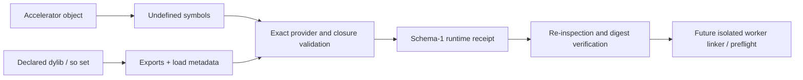

# ADR-0010: Accelerator runtime dependency receipts

- Status: Receipt preparation and verification implemented; native Linux
  acceptance pending
- Date: 2026-08-21
- Scope: Explicit dynamic runtime dependencies for isolated accelerator workers

## Context

The link-closed CPU artifact adapter accepts target system dependencies and
rejects unresolved `AsyncRT_*`, `KGEN_CompilerRT_*`, and `MGP_RT_*` symbols.
Weakening that policy would move a deterministic prepare error into a later
consumer link or launch failure. It would also make the result depend on ambient
library search paths.

Some accelerator objects intentionally require dynamic runtime libraries. SwiftPM's
portable static-library artifact format does not describe a dynamic runtime
closure or its loader policy. Accelerator execution therefore belongs in an
isolated worker adapter with a separate versioned dependency receipt.

## Decision

`runtime-prepare` derives a schema-1 receipt from one compiled object and an
explicit set of runtime libraries. It records:

| Field | Contract |
|---|---|
| Object | Exact SHA-256, validated architecture, and target triple/CPU/accelerator identity |
| Library | Filename, SHA-256, architecture, Mach-O install name or ELF SONAME |
| Direct symbols | Exact object symbols provided by exactly one declared library |
| Dynamic closure | Mach-O load commands or ELF `NEEDED` entries |
| System boundary | Exact observed platform dependencies; non-system dependencies must be declared |
| Receipt identity | Canonical SHA-256 over every field above |

The preparer rejects:

- an object with no declared runtime symbols;
- a known runtime symbol with no provider;
- a symbol with multiple providers;
- a non-system transitive dependency outside the declared library set;
- a declared library unreachable from the direct symbol providers;
- a target architecture mismatch;
- a symlink, non-regular file, duplicate path, or duplicate filename;
- a receipt destination that aliases the object or a runtime library;
- an object or library that changes during inspection.

`runtime-verify` reads the receipt, re-inspects every input, reconstructs the
canonical receipt, and requires exact equality. It does not trust path names or
the receipt's claims by themselves.

The existing CPU `prepare` path remains link-closed and continues to reject the
runtime symbol families. A receipt does not authorize those symbols in a static
artifact.

## Platform inspection

| Platform | Architecture | Exports | Dynamic dependencies |
|---|---|---|---|
| Apple | `lipo -archs` | `dyld_info -exports` | `otool -L` |
| Linux | `llvm-readelf --file-header` | `llvm-nm --dynamic --defined-only --extern-only` | `llvm-readelf --dynamic` |

Cross-inspecting Linux libraries from macOS may pin absolute
`SWIFT_MOJO_LLVM_NM` and `SWIFT_MOJO_LLVM_READELF` tool paths. Native Linux uses
the target's `nm` and `readelf` defaults. Vendor driver libraries are not
silently classified as operating-system dependencies; a deployment must declare
an exact system-library name and validate device/driver capability separately.
Apple system dependencies must be canonical absolute paths under the platform
system roots. Linux system dependencies must be bare SONAMEs; path-based names
are treated as undeclared runtime libraries even when their basename is allowed.

## Current evidence

The implementation and package tests cover Apple and Linux metadata parsing,
exact closure success, missing and duplicate providers, undeclared transitive
dependencies, and mutation rejection. A real arm64 accelerator-runtime object was
inspected against four declared libraries:

- `libAsyncRTMojoBindings.dylib`;
- `libAsyncRTRuntimeGlobals.dylib`;
- `libKGENCompilerRTShared.dylib`;
- `libMSupportGlobals.dylib`.

The resulting receipt resolved 15 direct runtime symbols and verified after a
fresh re-inspection. Omitting a transitive library failed before worker linking.
This evidence proves the receipt layer. It does not prove accelerator kernel
execution, runtime redistribution rights, worker-relative loading, or native
Linux behavior.

## Next gates

The bundle layout, relative loader contract, macOS link, final Mach-O
inspection, and clean-environment device-context execution are implemented by
ADR-0011. Remaining gates are:

1. Execute a generic accelerator fixture through the verified runtime closure
   on a supported host.
2. Prepare and verify the receipt natively on Linux ARM64, link the worker,
   inspect ELF dependencies/RPATH, and execute success and failure paths.

Concrete kernels, device performance, and hardware qualification belong to the
consuming package.
