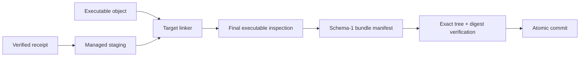

# ADR-0011: Isolated accelerator runtime bundles

- Status: macOS bundle link, verification, and device-context execution
  implemented; native Linux and compute-kernel acceptance pending
- Date: 2026-08-21
- Scope: receipt-bound executable deployment for accelerator workers

## Context

ADR-0010 proves the identity and transitive closure of an accelerator object and
its dynamic runtime libraries. A receipt alone does not prove that a final
executable links those exact libraries, uses a worker-relative loader path, or
remains independent of an ambient Modular installation.

The link-closed CPU artifact remains unchanged. Accelerator deployment is a
separate attempt-owned process boundary.

## Decision

`runtime-bundle-prepare` re-verifies the source receipt, copies exactly its
declared libraries into a managed staging directory, links one executable, and
commits the bundle atomically only after final inspection succeeds.

```text
<bundle>/
  .swift-mojo-generated
  RuntimeReceipt.json
  RuntimeBundle.json
  bin/<worker>
  lib/<declared runtime closure>
```

No additional root, `bin/`, or `lib/` entry is accepted. The output may replace
only a directory carrying the exact swift-mojo ownership marker. Object,
library, and receipt inputs may not reside below the output directory.



## Loader contract

| Platform | Packaged library identity | Executable search path | Program interpreter |
|---|---|---|---|
| Apple | `@rpath/<filename>` | `@executable_path/../lib` only | Platform Mach-O loader |
| Linux ARM64 | bare SONAME equal to filename | `$ORIGIN/../lib` only | `/lib/ld-linux-aarch64.so.1` |
| Linux x86_64 | bare SONAME equal to filename | `$ORIGIN/../lib` only | `/lib64/ld-linux-x86-64.so.2` |

The object digest is checked immediately before and after linking. The final
executable must be a regular executable file of the receipt target architecture.
Its unresolved runtime symbols are passed through the receipt preparer again;
the required symbol set, unique providers, library metadata, transitive closure,
and system boundary must match the source receipt. Its direct non-system load
commands must equal every declared runtime library exactly.

`RuntimeBundle.json` binds the receipt identity, target, executable path and
digest, every library path and digest, loader search path, direct system
dependencies, and Linux interpreter. `runtime-bundle-verify` performs the same
checks from the deployed tree without trusting source paths or executing the
worker.

## Failure and ownership contract

- unmarked output directories are never overwritten;
- a changed object or copied library fails before commit;
- an incomplete or extra runtime dependency fails final inspection;
- extra bundle files, symlinks, non-executable workers, path-based loader names,
  and alternate RPATH/RUNPATH entries fail verification;
- failed staging is removed, while the prior managed bundle remains intact;
- bundle verification never launches accelerator code.

The bundle is a local deployment artifact. This implementation does not assert
redistribution permission for any third-party runtime, does not
sign/notarize a worker, and does not establish artifact authenticity against a
malicious publisher. Release policy must add the applicable licensing,
signature, and provenance gates.

## Current evidence

A real arm64 accelerator-runtime object and the four-library receipt from ADR-0010 were
linked into bundle identity
`38075467012f877bb5ea23daf3d4639aa175b478bfaca898706bd33e1ff72e77`.
The final executable digest is
`887bf2531f0531494fff2282b27121385a35e8faff78d692820bd2918bfe4786`.
Fresh verification found only the four declared `@rpath` libraries and the
single `@executable_path/../lib` search root. With the process environment
reduced to system paths and temporary home settings, the relocated worker
reported a usable local accelerator.

This proves local macOS link, exact-loader preflight, dynamic runtime loading,
and real device-context creation. It does not prove accelerator compute,
device-buffer transfer/synchronization, cancellation, worker protocol behavior,
signing, redistribution, or native Linux behavior.

## Next gates

1. Add a generic worker request/result and one-attempt lifecycle fixture without
   loading the accelerator runtime into the application process.
2. Add device-owned buffer, synchronization, cancellation, and ordered shutdown
   semantics only through a versioned generic worker ABI.
3. Execute a target-neutral accelerator fixture in the bundle.
4. Reproduce receipt, bundle, ELF interpreter/RUNPATH, link, and execution on
   native Linux ARM64.

Product worker protocols, concrete kernels, and hardware qualification remain
downstream responsibilities.
