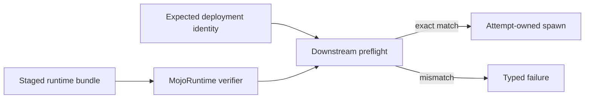

# ADR-0012: Public read-only runtime bundle verification

- Status: implemented and real-bundle verified on macOS
- Date: 2026-08-21
- Scope: downstream launcher preflight for ADR-0011 bundles

## Context

ADR-0011 implements exact bundle construction and fresh CLI verification. A
downstream launcher must repeat that verification after staging and before
`spawn`. Calling a package command as a subprocess would weaken typed error
handling and couple runtime supervision to authoring tooling. Exposing the
internal manifest or builder would instead give downstream code unnecessary
construction and mutation authority.

## Decision

The `MojoRuntime` library product exposes a small read-only surface:

```text
MojoRuntimeBundleVerifying
  -> MojoRuntimeBundleVerification
       target
       bundle + receipt digests
       relative executable + digest
       relative libraries + digests
       loader root + interpreter + system boundary
```

`FileSystemMojoRuntimeBundleVerifier` delegates to the same verification engine
as `runtime-bundle-verify`. It re-reads the managed tree, receipt, manifest,
file digests, runtime symbol closure, target architecture, final imports,
RPATH/RUNPATH, and ELF interpreter. It never executes the worker.

The public result contains no authoring source path and grants no write or
launch capability. Downstream code may compare it with an independently pinned
expected identity, then hand the verified root and relative executable to its
process-staging boundary.



## Error contract

| Error | Meaning |
|---|---|
| `invalidBundle` | The bundle, receipt, closure, digest, or loader contract is invalid |
| `inspectionFailed` | Required local Mach-O/ELF inspection could not complete |
| `unsupportedTarget` | The receipt target has no supported verification policy |

No failure is converted to a successful empty result, and no CPU or ambient
runtime fallback is selected.

## Evidence

The public product was built and its focused tests passed. Its concrete verifier
then inspected a real relocated accelerator-runtime bundle
`38075467012f877bb5ea23daf3d4639aa175b478bfaca898706bd33e1ff72e77`
through the public API. The opt-in test completed fresh verification in 1.48
seconds and returned the expected executable and four-library closure.

This proves downstream-readable macOS preflight. It does not prove staging
race resistance, worker protocol behavior, compute,
cancellation, signing, redistribution permission, or native Linux behavior.

ADR-0015 adds a distinct read-only worker verifier and immutable
`RuntimeWorkerBundle.json` projection. It composes this executable verification
but cannot be confused with either the generic executable result or ADR-0013's
callable-library result. It adds no public launcher, transport, loader, or raw
handle authority.

## Execution composition

This read-only verifier never owns process state. A separately designed
non-worker executable consumer must preserve the relative executable/library
layout and reverify its own immutable staging before launch.

ADR-0015 worker execution has a narrower composition: the public
`MojoRuntimeWorker` product is the only owner of private worker staging,
verification-to-spawn, fd-3 transport, and process/session lifecycle. Its staged
root also contains the worker manifest, whose digest binds this runtime bundle
and receipt; W3 requires the compiled `ready` identity to match the worker
projection before `createSession`. Consuming packages retain artifact
allowlisting, binding mapping, attempt policy, budgets, telemetry, checkpoints,
and product evidence without receiving filesystem, POSIX, or raw protocol
authority.
