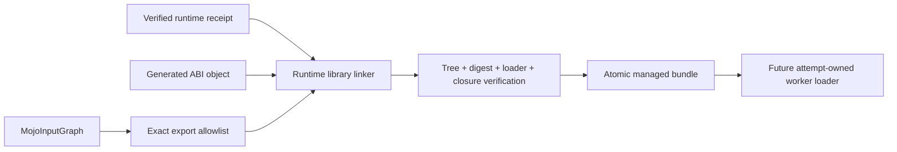

# ADR-0013: Callable accelerator runtime library bundles

- Status: macOS link, relocation, verification, and C invocation implemented
- Date: 2026-08-22
- Scope: generated C ABI objects that require an explicit accelerator runtime closure

## Context

The default `swift-mojo` artifact is statically linked and rejects unresolved
Mojo/MAX runtime symbols. ADR-0010 records an exact runtime dependency closure,
while ADR-0011 packages that closure with an executable worker. A persistent
Mojo device session additionally needs a callable generated ABI inside the
isolated worker. A receipt alone is insufficient, and restoring the removed
application-level dynamic symbol registry would weaken ownership, target, and
loader guarantees.

## Decision

`MojoRuntimeLibraryBundleBuilder` consumes a verified receipt and builds one
managed callable library bundle:

```text
<bundle>/
  .swift-mojo-generated
  RuntimeReceipt.json
  RuntimeLibraryBundle.json
  include/<module>.h
  include/module.modulemap
  lib/<primary dylib or shared library>
  lib/<exact runtime closure>
```

The primary library exports only the C symbols derived from the same
`MojoInputGraph` and artifact identity that render the Mojo bridge and header.
Manual extra exports are hidden at link time.

| Platform | Primary identity | Runtime search path |
|---|---|---|
| Apple | `@rpath/<filename>` | `@loader_path` only |
| Linux | bare SONAME equal to filename | `$ORIGIN` only |

The builder checks the object digest before and after link, stages only receipt
libraries, writes the generated interface, verifies final Mach-O/ELF metadata,
and atomically commits only a fully verified tree. The verifier re-derives the
runtime receipt from the linked primary library and packaged closure rather
than trusting the manifest.



## Failure and ownership contract

- output never replaces an unmanaged directory;
- input object or runtime libraries may not reside inside output;
- changed object, dependency, primary library, header, or module map fails;
- extra files, symlinks, export drift, alternate loader roots, install-name or
  SONAME drift, and undeclared dependencies fail;
- verification does not load code or create a session;
- the public `MojoRuntimeLibraryBundleVerifying` API returns immutable metadata
  only and does not expose authoring paths or mutation/loading authority.

This adapter is intended for an isolated attempt-owned worker. It does not make
dynamic loading part of application code and does not alter the default static
consumer artifact.

## Evidence

The focused `MojoArtifactCoreTests` lane links an arm64 macOS fixture object
against a separately packaged runtime dylib, relocates the complete managed
bundle, verifies it again, and executes the exported function through
`dlopen`/`dlsym` with an empty environment. The call transforms `41` to `42`.
The same fixture rejects modifications to the primary library, runtime library,
header, and unexpected tree entries. A separate renderer test proves that all
14 currently supported generated ABI exports exactly equal the linker allowlist.
The public runtime projection and typed missing-bundle failure also pass.

This proves the packaging and local macOS loader contract. It does not prove a
real Mojo object with MAX dependencies, Metal compute, device buffers,
synchronization, cancellation, signing, redistribution rights, Linux runtime,
or Jetson CUDA execution.

## Next gate

1. Build the real generated session ABI object with the Metal accelerator
   implementation and produce this bundle from the normal prepare graph.
2. Add a typed loader and exactly-once session lifecycle inside the isolated
   Kuyu attempt worker, keeping loading out of the application process.
3. Differentially compare the Metal result with the CPU reference and current
   MLX execution path, including failure and shutdown races.
4. Reproduce link, verification, relocation, and execution on Jetson AGX Orin
   before qualifying CUDA.
