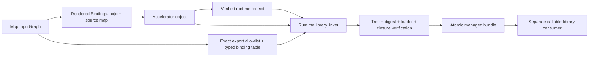

# ADR-0013: Callable accelerator runtime library bundles

> Current authority: [ADR-0016](ADR-0016-DIRECT-SWIFT-MOJO-EXECUTION.md).
> The active migration uses direct Swift–Mojo calls; isolation is consumer-owned.

- Status: generated-source transaction, macOS link, relocation, verification, and C invocation implemented
- Date: 2026-08-22
- Scope: generated C ABI objects that require an explicit accelerator runtime closure

## Context

The default `swift-mojo` artifact is statically linked and rejects unresolved
optional runtime symbols. ADR-0010 records an exact runtime dependency closure,
while ADR-0011 packages that closure with an executable worker. Some isolated
tools additionally need a separately callable generated ABI. A receipt alone is
insufficient, and restoring the removed application-level dynamic symbol
registry would weaken ownership, target, and loader guarantees.

ADR-0015 subsequently selected a smaller persistent-worker design: generate its
C dispatch/main from the same `MojoInputGraph` and directly link it with the Mojo
object into the executable. Therefore this callable bundle remains an
independently verified packaging adapter and is not loaded by the persistent
worker.

## Decision

`MojoRuntimeLibraryArtifactPreparer` owns the complete source-to-bundle
transaction. It renders the exact `MojoInputGraph`, compiles that generated
source for exactly one explicit accelerator target, prepares a runtime receipt,
and delegates linking and tree construction to
`MojoRuntimeLibraryBundleBuilder`:

```text
<bundle>/
  .swift-mojo-generated
  RuntimeReceipt.json
  RuntimeLibraryBundle.json
  include/<module>.h
  include/module.modulemap
  lib/<primary dylib or shared library>
  lib/<exact runtime closure>
```

The schema-3 manifest binds the compiler version, input-graph digest and numeric
identifier, generated-source digest, source-map digest, and a typed binding table.
Each binding record carries the generated binding ID, Swift function name,
signature, and any session-factory relationship. The primary library exports
only the C symbols derived from the same `MojoInputGraph` and artifact identity
that render the Mojo bridge and header. Manual extra exports are hidden at link
time.

| Platform | Primary identity | Runtime search path |
|---|---|---|
| Apple | `@rpath/<filename>` | `@loader_path` only |
| Linux | bare SONAME equal to filename | `$ORIGIN` only |

The builder checks the object digest before and after link, stages only receipt
libraries, writes the generated interface, verifies final Mach-O/ELF metadata,
and atomically commits only a fully verified tree. The verifier re-derives the
runtime receipt from the linked primary library and packaged closure rather
than trusting the manifest.



## Failure and ownership contract

- output never replaces an unmanaged directory;
- input object or runtime libraries may not reside inside output;
- changed object, dependency, primary library, header, or module map fails;
- a compiler-version mismatch or Swift-source change before commit fails without
  publishing a partial bundle;
- extra files, symlinks, export drift, alternate loader roots, install-name or
  SONAME drift, and undeclared dependencies fail;
- missing, duplicated, malformed, or ambiguous binding records and unresolved
  session-factory relationships fail;
- verification does not load code or create a session;
- the public `MojoRuntimeLibraryBundleVerifying` API returns immutable metadata
  only and does not expose authoring paths or mutation/loading authority.

This adapter may be used only by a separately designed isolated callable-library
consumer. It does not make dynamic loading part of application code, does not
alter the default static consumer artifact, and is not the ADR-0015 persistent
worker path.

## Evidence

The focused `MojoArtifactCoreTests` lane feeds the preparer an input graph,
observes the exact rendered source in the injected compiler, links its arm64
macOS object against a separately packaged runtime dylib, relocates the complete
managed bundle, verifies it again, and executes the exported function through
`dlopen`/`dlsym` with an empty environment. The call transforms `41` to `42`.
Another test mutates the Swift declaration during compilation and proves the
transaction fails before any bundle is published.
The same fixture rejects modifications to the primary library, runtime library,
header, and unexpected tree entries. A separate renderer test proves that all
14 currently supported generated ABI exports exactly equal the linker allowlist.
The public runtime projection and typed missing-bundle failure also pass.

This proves the packaging and local macOS loader contract. It does not prove a
real Mojo accelerator implementation, device buffers, synchronization,
cancellation, signing, redistribution rights, or native Linux runtime.

## Next gate

1. Use `runtime-library-prepare` to build a real generated session ABI for a
   consumer that specifically requires the callable adapter and verify its
   schema-3 bundle.
2. Reproduce link, verification, relocation, and callable invocation on native
   Linux ARM64.

Persistent session lifecycle, bounded IPC, graceful/hard shutdown, and
Apple/NVIDIA worker parity are exclusively ADR-0015 gates and do not extend this
adapter.

Concrete product workers, kernels, device policy, and hardware qualification
belong to consuming packages.
