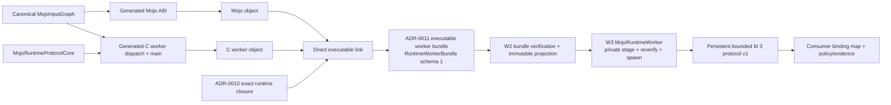

# ADR-0015: Direct-linked persistent accelerator workers

- Status: Accepted; W1 protocol/render, W2 bundle/verification, and W3 public
  session/lifecycle implemented; actual macOS and native Linux host execution
  receipts pending
- Date: 2026-08-30
- Scope: Generated attempt-owned executable workers for runtime-dependent Mojo
  bindings

## Context

The default static artifact remains the correct adapter when the generated Mojo
object is link-closed. Accelerator objects that use the MAX accelerator runtime
have real unresolved `AsyncRT_*`, `KGEN_CompilerRT_*`, and `MGP_RT_*` imports,
so ADR-0010 and ADR-0011 package an explicit target runtime closure instead of
weakening the static-artifact policy.

ADR-0013 proves that a generated C ABI can also be packaged as a callable
runtime library. Loading that library in a persistent worker would, however,
add a second path lookup, a `dlsym` signature boundary, and `dlclose` ordering to
the session lifetime. A generated worker already knows the complete
`MojoInputGraph`; it can link the same generated Mojo object and a generated C
dispatch/main object directly into the ADR-0011 executable.

This decision selects that direct-linked executable as the only
`swift-mojo` persistent-worker design. ADR-0013 remains a separately verified
callable-library packaging adapter, but it is not an input to this worker and is
not an application loading API.

## Decision

### Ownership boundary

| Owner | Responsibility | Does not own |
|---|---|---|
| W1: protocol and render (`MojoRuntimeProtocolCore` + `MojoArtifactCore`) | Own protocol-v1 constants/codecs and render the Mojo ABI plus C worker endpoint from one immutable input graph | Bundle publication, process launch, application attempts, model operations, budgets, telemetry |
| W2: bundle and verification (`MojoArtifactCore` + CLI + `MojoRuntime`) | Compile, direct-link, package, inspect, and transactionally verify the exact worker bundle; expose only fresh read-only public verification and immutable projection | Staging a running attempt, launch, IPC, session creation, application policy |
| W3: public `MojoRuntimeWorker` product | Accept a W2-trusted worker projection and a bounded typed immutable input-resource set, enforce explicit consumer-selected count and aggregate-byte limits, create and reverify private attempt staging, map a socketpair endpoint to child fd 3, spawn one process with either an empty environment or fixed resource-directory/count/aggregate-identity and staged-runtime-library-directory keys, perform bounded protocol I/O, expose generic create/invoke/shutdown, and terminate/reap/remove staging on timeout, cancellation, or crash | Artifact/resource selection policy, vendor runtime library names, resource identifier meaning, model operation meaning, budgets, telemetry interpretation, checkpoint commit, target qualification |
| Generated worker executable | Protocol-v1 frame loop, generated binding dispatch, one session, and runtime-side graceful teardown | Checkpoint policy, retry, product safety, target selection |
| Consuming package | Select an allowed verified artifact and input-resource identities and explicit limits, map domain operations to verified bindings, and own the binding/resource tuple, resource identifier meaning, model-specific runtime library/resource lookup, attempt policy, budgets, telemetry interpretation, checkpoint commit, and evidence admission | Private staging, private resource/runtime-directory paths, environment keys, POSIX, file descriptors, raw frames/codecs, process signaling/reaping, raw Mojo symbols |

W1 and W2 expose no public launcher. `MojoRuntimeProtocolCore` is an internal
package target with no library product. It is the single semantic authority used
by W1 and W3; the generated C endpoint and Swift codec/types therefore share one
constant/payload definition. W3 is the sole public runtime-execution product,
but it is not an arbitrary executable launcher: it accepts only the trusted
worker projection created by W2, hides staging/POSIX/protocol state, and exposes
the closed generic worker operations. The consuming package remains the domain
policy and evidence owner.



The worker link contains both objects directly. The worker route never produces
or loads a primary callable dylib/shared library and never calls `dlopen`,
`dlsym`, or `dlclose`.

### Worker bundle schema 1

`RuntimeWorkerBundle.json` is a worker-specific schema and is not an alias for the
schema-1 `RuntimeBundle.json` or schema-3 `RuntimeLibraryBundle.json`. The exact
managed tree is:

```text
<bundle>/
  .swift-mojo-generated
  RuntimeReceipt.json
  RuntimeBundle.json
  RuntimeWorkerBundle.json
  bin/<worker>
  lib/<exact target runtime closure>
```

`RuntimeBundle.json` remains the nested ADR-0011 executable/loader/runtime-closure
record so its proven link and final-inspection contract is composed rather than
duplicated. `RuntimeWorkerBundle.json` is the sole execution contract and binds
the canonical digest of `RuntimeBundle.json` plus `RuntimeReceipt.json`; it adds
semantic identity, generated inputs, protocol, and bindings. The worker builder
uses ADR-0011 link and final-closure inspection primitives, then verifies the
worker-specific tree as one transaction. The existing generic runtime-bundle
verifier is not treated as accepting the additional manifest; the worker
verifier composes its lower-level content checks under the worker layout.

Schema 1 contains these closed records; unknown and missing keys fail:

| Record | Required fields |
|---|---|
| `semanticIdentity` | worker ABI version, protocol version, source-graph digest and identifier, input-graph digest and identifier, generation-pipeline digest, and the complete sorted binding table |
| `generatedInputs` | generated Mojo source digest, generated C worker source digest, source-map digest, Mojo object digest, C worker object digest, and compiler version |
| `protocol` | version `1`, descriptor `3`, fixed header size, byte order, maximum payload bytes, maximum in-flight requests, and exact message-kind table |
| `runtimeBundle` | ADR-0011 manifest digest, receipt digest, relative executable and digest, libraries and digests, loader root, system boundary, and interpreter |
| `targetClosure` | target triple, CPU, accelerator compile target, artifact identity, and target-closure digest |
| `executionContractDigest` | canonical digest of protocol record, worker ABI version, input-graph digest/identifier, complete binding table, target triple/CPU/accelerator compile identity, compiler identity, source-map digest, digest-free generated Mojo source/object identities, receipt digest, and declared runtime-closure records; it excludes generated C worker source/object, target-closure, executable, and worker/runtime manifest digests |

W1 computes `executionContractDigest` before rendering the C worker and embeds
it in that generated source. After compile/link, `RuntimeWorkerBundle.json` binds that
pre-link digest to the post-link `RuntimeBundle.json`, executable digest, and
receipt digest, as well as the separately recorded generated C worker
source/object digests. The worker manifest and W2 verifier recompute the
pre-render digest from their closed records. The Mojo source/object can
participate because neither contains this digest. A generated C worker
source/object, executable, target-closure, or manifest digest is never part of
the embedded digest, avoiding a circular identity.

`maximumFramePayloadBytes` is a positive authoring configuration recorded in
both target bundles and constrained by the implementation's protocol-v1 hard
ceiling. W1 must reject a value above that ceiling before rendering or
allocation. Protocol v1 permits exactly one in-flight request, so receive and
send storage can be allocated once from the verified limit. Changing either
limit changes the protocol record and bundle identity; it is not a runtime echo
from the application.

The `semanticIdentity` is identical for Apple and NVIDIA artifacts generated
from the same canonical input graph and ABI/protocol versions. Compiler outputs,
generated target symbols, object/executable digests, target triple, CPU,
accelerator compile target, runtime libraries, and loader metadata belong to the
separate `targetClosure`. A runtime-reported MAX backend name is target evidence
only. It is not semantic identity, target selection, or proof of kernel
execution.

### Protocol v1

The worker reads and writes one full-duplex byte stream at file descriptor 3.
Standard output and standard error are diagnostics only and must never carry
protocol frames. Every frame starts with this fixed 32-byte little-endian
header:

| Offset | Type | Field | Rule |
|---:|---|---|---|
| 0 | `UInt32` | magic | little-endian ASCII `SMW1` |
| 4 | `UInt16` | protocol version | exactly `1` |
| 6 | `UInt16` | message kind | present in the manifest's closed kind table |
| 8 | `UInt64` | request identifier | zero for unsolicited startup `ready`; otherwise nonzero and paired exactly |
| 16 | `UInt64` | payload byte count | no greater than the verified maximum |
| 24 | `UInt64` | reserved | zero |

Partial reads and writes are normal stream behavior and continue until the
declared frame completes. EOF in a header or payload, an invalid magic/version,
unknown kind, nonzero reserved field, non-monotonic identifier,
oversized payload, response identifier mismatch, trailing response bytes, or a
second in-flight request is a terminal protocol failure. Length is checked
before allocation or decode.

Protocol v1 has this closed message-kind table:

| Message | Contract |
|---|---|
| `ready` | First worker frame, request ID zero. Carries the compiled `executionContractDigest`, ABI/input-graph identity, complete binding-table digest, protocol limits, and target compile identity. It never carries a worker/runtime manifest or executable digest. W3 admits no later request until every expected value matches the W2 projection. |
| `createSession` | First consumer request after admitted `ready`; carries the generated session configuration payload and succeeds at most once. |
| `sessionCreated` | Pairs the create request and carries the generated session capability/result payload. |
| `invokeFloat32` | Carries the protocol-core Float32 invocation payload and generated operation binding ID; valid only for the live session. |
| `invocationResult` | Pairs one invocation and carries its generated status and bounded Float32 result payload. |
| `shutdownSession` | Stops new invocations and requests graceful session/device teardown. |
| `sessionShutdown` | Pairs session shutdown after all live session/device handles were destroyed exactly once. |
| `shutdownWorker` | Consumer request valid after session shutdown and with no invocation in flight. |
| `workerShutdown` | Final paired acknowledgement; worker then closes fd 3 and exits zero. |
| `failure` | Pairs the triggering request, or uses request ID zero for startup failure, and carries one closed typed failure code plus bounded diagnostic bytes before terminal close. |

Wire constants and Float32 payload layouts come from
`MojoRuntimeProtocolCore`, which renders the C endpoint and provides W3 with the
Swift codec/types; binding IDs and payload membership are generated from
the same sorted binding table, and their canonical digest is part of
`semanticIdentity`. The protocol does not
name models, optimizers, checkpoints, Apple Metal, CUDA, Jetson, or any product
operation. W3 owns frame transport and generic session lifecycle. A consuming
package maps its typed operations to W2-verified binding IDs and owns its budgets
and telemetry interpretation.

### Preflight and TOCTOU boundary

The generated worker publishes `ready` only after checking its compiled protocol
version, ABI version, input-graph identifier, and every binding record. W3
compares that identity with the freshly verified W2 projection before sending
`createSession`. Any worker-side inconsistency or projection mismatch terminates
with zero session invocations.

Direct linking removes the callable-library lookup race, symbol-signature cast,
and unload ordering entirely. W2 still cannot make a filesystem path immutable
or launch it atomically. Therefore W3 copies the W2-selected bundle to an
attempt-owned directory that is not writable by other principals, freshly
verifies that private copy, spawns only its verified relative executable, and
requires the compiled preflight response before session creation. The public W3
surface does not expose that directory, executable path, PID, descriptor, or raw
frame. This closes accidental staging mutation within the declared trust
boundary. Signing and resistance to a malicious publisher remain release-policy
concerns, as in ADR-0011 and ADR-0012.

### Lifecycle

One process owns one attempt and at most one Mojo session. It remains alive
across bounded calls so model update and high-frequency control paths do not
launch a process per operation.

```text
spawn -> preflight -> create once -> invoke serially -> graceful shutdown
                                      |                 -> destroy exactly once
                                      +-> hard deadline/crash -> kill process group
                                                                  -> OS reclaim
                                                                  -> next clean attempt
```

- A cooperative cancellation observed by W3 between calls follows graceful shutdown;
  live session/device handles are destroyed exactly once before the success
  acknowledgement and normal exit.
- A hard deadline during a call, protocol corruption, EOF, signal termination,
  or worker crash cannot promise that user-space destructors ran. W3
  terminates and reaps the process group, relies on the OS process boundary for
  resource reclamation, keeps the application alive, rejects partial output,
  and starts the next attempt from independently admitted state.
- A hard-failed worker is never reused. A next-attempt fixture must prove clean
  session creation without stale handles or protocol identifiers.
- Checkpoint durability and commit/rollback are consuming-package semantics;
  worker process exit is not evidence that a checkpoint was committed.

## Rejected alternatives

| Alternative | Reason |
|---|---|
| Put MAX runtime symbols in the static XCFramework/archive | The inspected accelerator objects are not link-closed and the current static policy correctly rejects them. |
| ADR-0013 library plus worker `dlopen`/`dlsym` | Adds path TOCTOU, raw signature casts, and unload ordering that direct linking removes. |
| Load accelerator code in the application process | Reverses the process-isolation boundary and lets a runtime crash terminate the application. |
| Give W1/W2 launch authority | Artifact construction and read-only verification must not retain attempt/process state or become code-loading APIs. |
| Let every consuming package implement staging/POSIX/fd-3 transport | Duplicates the security and lifecycle boundary and leaks filesystem, descriptor, and process semantics into Manas/Kuyu. W3 owns this once as a typed generic client. |
| Python MAX runtime | Adds a second runtime/packaging authority and is outside the Swift/Mojo artifact contract. |
| Backend name in semantic identity | A backend string is runtime evidence and can differ without changing model/training semantics. |

## Evidence required for implementation

| Invariant | Falsifiable evidence |
|---|---|
| One input graph owns both generated sides | Mutating the graph, Mojo output, C worker output, source map, pipeline version, or any binding independently makes preparation/verification fail. |
| Direct-linked worker | Final Mach-O/ELF imports reproduce the receipt closure; executable symbols and source scans contain no `dlopen`, `dlsym`, or `dlclose`; no primary callable library exists in the tree. |
| Fail-fast preflight | Protocol/ABI/input-graph/each-binding mutation produces a typed terminal failure and records zero session-factory invocations. |
| Shared wire authority | Protocol-core tests prove exact C/Swift encodings for the fixed header, every closed frame kind, Float32 payload, malformed field, and schema digest; the Swift codec and generated worker fixture exchange the same bytes. |
| Non-circular startup identity | Worker manifest recomputation binds the pre-link `executionContractDigest` to post-link runtime-bundle/executable digests; `ready` reports only the compiled pre-link digest and graph/binding/target fields. |
| Bounded framing | Fragmented header/payload succeeds; oversized, truncated, unknown, reordered, duplicate-in-flight, and trailing-byte fixtures fail before unbounded allocation or dispatch. |
| Graceful lifecycle | Repeated normal, error, and cooperative-cancel paths observe one create and exactly one session/device destruction. |
| Hard lifecycle | In-flight forced kill proves application survival, process-group reap/OS reclamation boundary, rejection of partial output, and a clean next attempt; it does not assert destructor invocation. |
| Read-only W2 | Public construction, mutation, loading, launcher, raw handle, and raw symbol surfaces are absent; manifest/file mutation fails fresh verification. |
| Generic W3 client | Only a W2-trusted worker projection can create an attempt; a resource set requires unique safe identifiers, explicit positive consumer-selected count and aggregate-byte limits, regular non-symlink sources, exact per-resource byte counts/SHA-256 values, and a canonical aggregate SHA-256. W3 stages each member below a fixed private directory and reports only fixed directory/count/aggregate-identity environment keys. The public surface exposes no arbitrary executable/environment, private staging/resource path, PID, descriptor, raw frame, codec, signal, or wait status. Bundle or resource mutation fails revalidation before spawn/session. |
| W3 lifecycle | Fragmented I/O and cancellation/deadline races preserve one in-flight request, terminate and reap the complete process group once, reject partial output, and allow one clean next attempt. |
| Downstream boundary | Manas/Kuyu fixtures compile and execute through typed W3 operations without importing POSIX support, accessing worker files, or constructing protocol frames; they retain artifact allowlisting, verified binding mapping, budgets, telemetry, checkpoints, and acceptance policy. |
| Cross-target identity | Apple and NVIDIA bundles have equal semantic identity and distinct target closures; each is compiled, linked, inspected, relocated, and protocol-executed on its actual host. |
| Evidence boundary | Actual target receipts record observed MAX backend and device/kernel evidence separately; neither bundle verification nor a backend string alone is accepted as execution evidence. |

## Consequences

W1 and W2 implement the internal `MojoRuntimeProtocolCore` target, its Swift
codec/types and generated C endpoint, the worker renderer, two-object executable
link, closed worker builder/verifier and CLI, and the read-only W2 projection.
W3 provides the public `MojoRuntimeWorker` product and uses a distinct
package-internal POSIX worker-spawn ABI that preserves a socketpair endpoint as
child descriptor 3 without changing the compiler-tool spawn contract. W1/W2
remain launcher-free; W3 hides staging, POSIX, raw framing, and process lifecycle
behind generic typed operations. Actual host receipts remain separate evidence
for macOS and native Linux execution. ADR-0013 fixtures remain valid evidence
for that separate callable adapter but cannot satisfy any ADR-0015 worker gate.
