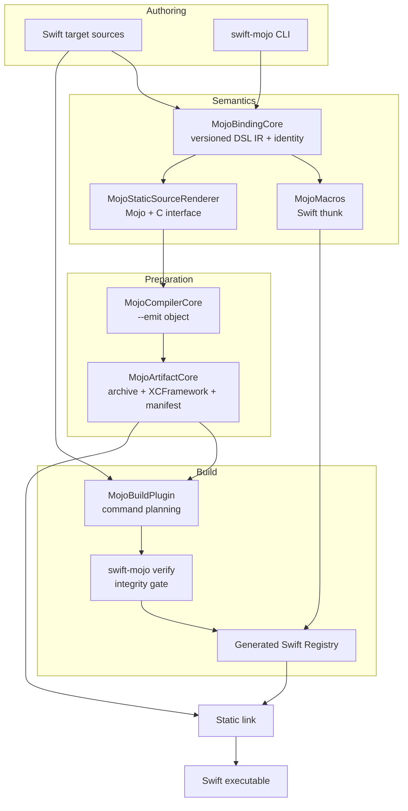
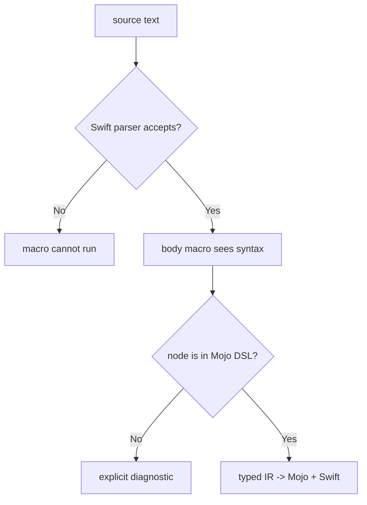
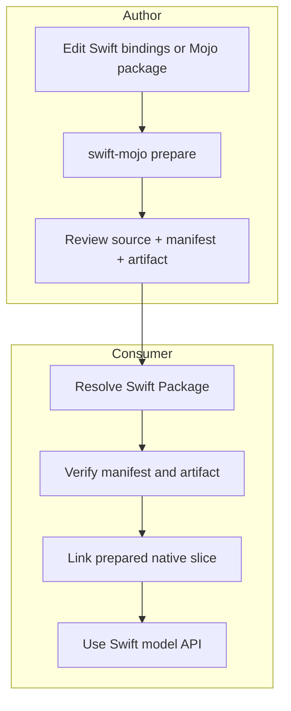

# Design

## 1. Design target

利用者が設計する最終surfaceを先に固定します。

```swift
@mojo
func add(_ a: Int32, _ b: Int32) -> Int32 {
    mojo {
        return a + b
    }
}
```

このsourceの意味は「Swift関数の公開契約を保ち、bodyのcompute semanticsをMojoで実装する」です。C ABI、binding ID、generated module、artifact pathは利用者が手で同期しません。

P1ではこのsurfaceを実装済みですが、DSL semanticsは `(Int32, Int32) -> Int32` の加算だけです。構文の見た目と対応言語範囲を混同しません。

## 2. Confirmed current facts

| Fact | Evidence in repository |
|---|---|
| `@mojo` is an argument-free body macro | `Sources/Mojo/MojoMacro.swift`、macro expansion tests |
| Macro and scanner share one IR | `MojoBindingCore` is used by `MojoMacros` and `MojoArtifactCore` |
| Original DSL body is replaced | `MojoBodyMacro` emits only a Registry invocation |
| Real Mojo emits the implementation object | `MojoCompiler.compileObject` and real Mojo 1.0 acceptance |
| Runtime uses static linking | generated XCFramework binary target and final Mach-O symbol inspection |
| Plugin does not compile Mojo | plugin invokes only `swift-mojo verify` |
| Build rejects stale/missing/corrupt state | verifier unit tests、plugin integration、CLI failure matrix。hardening後の再実行はpending |
| No dynamic legacy path remains | package graph has no loader/shared-library target |
| External Mojo packages are not current inputs | `MojoPackageLayout.sourceURLs()` collects only `.swift`; preparer renders one generated `Bindings.mojo`; plugin watches Swift sources and prepared output |

## 3. Architecture and responsibilities



| Owner | Generates/holds | Consumed by | Failure contract |
|---|---|---|---|
| `Mojo` | public macro declaration | application source | unsupported use becomes macro diagnostic |
| `MojoBindingCore` | ephemeral binding/source graph values | macro、prepare、verify | typed parse/semantic error |
| `MojoMacros` | expanded Swift body | Swift compiler | expansion failure; no fallback body |
| `MojoCompilerCore` | Mojo version and object | preparer | typed locate/launch/status/timeout/no-output failure; process-group cleanup |
| `MojoArtifactCore` | generated directory and schema 3 manifest | source control、plugin | interprocess-locked transaction; unmanaged path refused |
| `swift-mojo` | CLI diagnostics and exit status | developer/CI | nonzero on any failed operation |
| `MojoBuildPlugin` | verifier command | SwiftPM/Xcode | missing required inputs or verifier failure stops build |
| generated Registry | internal direct-call thunk | expanded Swift body | invariant mismatch traps |

## 4. End-to-end flows

### 4.1 Prepare flow

```text
Sources/<Target>/**/*.swift
  -> SwiftParser
  -> recursively collect argument-free @mojo functions
  -> validate P1 signature and mojo block
  -> sort canonical binding records
  -> source graph SHA-256 + 63-bit runtime identifier
  -> acquire output-scoped interprocess lock
  -> compare generation pipeline identity and complete cache envelope
  -> render allowlisted Mojo source
  -> mojo build --emit object --target-triple ... --target-cpu ...
  -> ar static archive
  -> xcodebuild -create-xcframework
  -> canonical XCFramework tree SHA-256
  -> schema 3 manifest
  -> staged directory swap
  -> release output lock
```

Rendererは元のforeign textをpassthroughしません。`MojoBinding.Operation` のallowlistからMojo expressionを生成します。P1では `addForward` と `addReversed` だけです。

### 4.2 Build flow

```text
SwiftPM loads committed binary target
  -> plugin declares Swift files + manifest + XCFramework root and descendants as required inputs
  -> swift-mojo verify
       schema / ABI
       target triple + CPU
       full source graph + binding records
       exactly one expected static archive
       full XCFramework tree digest
  -> generate SwiftMojoBindings.generated.swift in plugin work directory
  -> macro-expanded source compiles against generated Registry
  -> static archive links into final executable
```

manifestが欠落するとSwiftPMのrequired input checkで停止します。存在するが不正な場合はverifierが停止します。古いgenerated Registryだけを再利用して成功する経路を作りません。

### 4.3 Runtime flow

```text
add(20, 22)
  -> macro-generated call(bindingID, lhs, rhs)
  -> Swift-compatible checked Int32 overflow guard
  -> static ABI version check
  -> source graph identifier check
  -> prepared binding set + artifact membership check
  -> swift_mojo_call_i32_i32_i32
  -> Mojo implementation
  -> 42
```

P1 runtimeにはloader、cache、mutable state、pointer ownershipがありません。static artifactはprocess imageのlifetimeに従います。

## 5. Why a normal macro is sufficient only for a subset

SE-0415のbody macroは、元bodyを受け取り、生成bodyへ全面置換できます。元bodyは意味的に正しいSwiftでなくてもよい一方、Swift grammarとしてparseできなければmacroへ到達しません。

`mojo { return a + b }` は、Swift parserから見るとtrailing closure付きcall expressionです。このためP1は通常のbody macroで成立します。



任意のMojo syntaxを同じ `.swift` bodyへ直接書く最終形は、Swift grammarとの共通部分を越えた時点でmacro単体では不可能です。

## 6. Syntax strategy comparison

| Strategy | Swift parser | IDE/source map | Build integration | P1 decision |
|---|---|---|---|---|
| external `.mojo` | 制約なし | file単位で良好 | package source graphとentry-module生成が必要 | model package workflowとしてPlanned |
| `@mojoSource("...")` literal | Swift stringとしてparse | string内補完が弱い | scanner + source mapが必要 | bootstrap案として評価済み、公開せず |
| Swift-parseable `mojo {}` DSL | Swift grammarの部分集合 | SwiftSyntax rangeを維持可能 | shared IRでmacro/generator同期 | P1採用 |
| `.swiftmojo` custom source | 独自parser可能 | editor supportが必要 | derived Swift + Mojoを生成 | full syntax候補 |
| driver preprocessor | 任意syntaxへ拡張可能 | indexing/build invocationが難しい | Xcode/SwiftPM wrapperが必要 | Research |
| Swift compiler integration | 最高の統合余地 | upstream supportなら最良 | release追従costが高い | demand実証後だけ検討 |

P1では文字列段階を経ず、実現可能な最小DSLを直接実装しました。今後も、Swift-parseable subsetで十分なsyntaxは共有IRを拡張し、full Mojoだけを別source/preprocessor層へ分離します。

## 7. Shared IR and identity

`MojoBinding` は次を保持します。

- function nameと2つのlocal parameter name。
- allowlisted operation。
- ABI digest: name + `(Int32,Int32)->Int32`。
- implementation digest: ABI + operation。
- ABI keyから導出した63-bit binding ID。

`MojoSourceGraph` はbindingをID順へsortし、versioned canonical records全体からfull SHA-256とruntime identifierを作ります。

artifact cacheはsource graphだけでなく、binding IR、Mojo/C renderer、static ABI、artifact packaging、Registry rendererそれぞれのversionを合成したgeneration pipeline digestを保持します。生成責務を変更するときは、そのownerに隣接するversionを更新し、古いmanifestをcache hitとして扱いません。

```text
same formatting, same semantics  -> same identity
same ABI, changed implementation -> same binding ID, new implementation/source graph digest
same name/signature twice        -> duplicate binding failure
hash collision at runtime ID     -> duplicate failure or full build-time digest mismatch
```

人がSwift名、Mojo名、C symbol、cache keyを別々に同期する設計は採用しません。

## 8. Artifact and ABI design

### 8.1 Stable dispatcher

関数ごとのC symbolをSwift sourceへ生成せず、P1 ABIは4つの固定symbolだけを持ちます。binding増減でC module interfaceが変わらないため、SwiftPM binary targetのmodule shapeを安定させられます。

dispatcherのunknown ID branchはC ABI上のtotal functionとして値を返しますが、generated Swift Registryはmembershipを確認してからだけ呼びます。build verifierと、`-Ounchecked` でも除去されないruntime guardを通らないIDはSwift成功値として到達できません。

### 8.2 Integrity envelope

```text
Swift source full digest
  + binding ABI/implementation digests
  + Mojo compiler version
  + target triple/CPU
  + ABI/schema version
  + XCFramework canonical tree digest
```

schema 3のtree digestはarchiveだけでなく、header、module map、Info.plistも対象にします。absolute path、mtime、filesystem enumeration orderは含めません。pluginはartifact rootだけでなく既存の全regular fileとdirectoryをbuild inputへ登録するため、内容の上書きとtree entryの増減の双方がverify commandをinvalidateします。

### 8.3 Static linking choice

P1はdynamic loadingを使いません。理由は次です。

- executable移設後もartifact path/rpath探索を不要にする。
- load、symbol cast、library owner lifetimeをpublic call pathから消す。
- Xcode/SwiftPMのbinary targetとしてlink-timeにarchitectureを検証する。
- build verification後のnonthrowing Swift functionを可能にする。

代償として、artifactをprepareしてcommitするworkflow、platform sliceごとの生成、binary target module名管理が必要です。

## 9. State, ownership, lifetime, and isolation

| State | Creator | Owner | Lifetime | Isolation | Failure |
|---|---|---|---|---|---|
| `MojoBinding` / graph | macro/CLI/verifier | stack value | one expansion/command | immutable `Sendable` | typed semantic error |
| output access lease | preparer/initializer | `MojoOutputTransaction` | cache check through commit | OS-level interprocess file lock | lock/scope failure is typed |
| staging output | preparer/initializer | `MojoOutputTransaction` | one transaction | exclusive output lease | cleanup/restore error is preserved |
| generated directory | CLI | package/source control | until next explicit prepare | lock + versioned marker + directory replacement | unmanaged/incomplete output refused |
| manifest | preparer | generated directory | artifact version | immutable `Codable` value | schema/content mismatch |
| plugin Registry source | verifier | SwiftPM plugin work dir | one build graph | build system ownership | command failure stops compile |
| static artifact | linker/process | executable image | process lifetime | immutable code/data | link failure or invariant trap |

P1 runtimeに共有可変stateはありません。一方、generated directoryは複数CLI processから到達できる外部可変stateなので、cache readからcommitまでoutput path由来のinterprocess lockで保護します。process-localなunchecked Sendable、actor、Mutexでfilesystem transactionの排他を代替しません。将来async operation、callback ownerを追加するときはruntime stateに別の明示isolationを設計します。

## 10. Error contract

| Boundary | Success | Failure |
|---|---|---|
| macro | generated thunk | source-located macro diagnostic |
| scanner | versioned graph | typed unsupported syntax/signature/duplicate/no-binding error |
| compiler | produced object + diagnostic | locate/launch/status/timeout/UTF-8/no-output error; descendants reaped |
| transaction | complete managed directory | lock/scope/primary error; cleanup/restore failureも保持 |
| verifier | generated Registry | missing/invalid/stale/target/digest error |
| runtime | `Int32` result | verified invariant mismatch traps |

P1 runtimeで `throws` にしないのは、toolchain/artifact failureをprepare/build gateへ移した静的設計だからです。将来、Mojo計算自体が失敗可能になれば、status/out-value ABIとtyped Swift errorを追加します。

## 11. Public API, implementation, and tests

| Public/developer surface | Concrete implementation | Behavioral evidence |
|---|---|---|
| `@mojo` | `MojoBodyMacro` + `MojoBinding` | exact expansion、argument rejection、unsupported DSL tests |
| `swift-mojo init` | `MojoArtifactInitializer` + transaction | preserve prepared、reject unmanaged/incomplete tests |
| `swift-mojo prepare` | source graph + pipeline identity + renderer + compiler + packager | cache invalidation/lock tests、gated real Mojo acceptance |
| build plugin | leaf/directory inputs + `verify` | success `42`、wrong target、stale、missing/corrupt nested input integration |
| static artifact | XCFramework + generated Registry | corrupt archive/header tests、Mach-O symbol/dylib inspection |
| relocation | static executable | archive copy outside build location returns `42` |

## 12. Target and packaging behavior

P1 targetは `arm64-apple-macosx14.0` / `generic` です。plugin environmentでtargetをoverrideできますが、manifestと一致しなければ失敗します。

generic macOS archiveは通常x86_64 sliceも要求するため、P1 artifactでは失敗します。arm64 archiveは `ARCHS=arm64 ONLY_ACTIVE_ARCH=YES` を明示して成功確認しています。universal archiveにはx86_64 Mojo objectを生成し、複数sliceのXCFrameworkとslice-aware manifestを作る必要があります。

`Generated/<Target>` はsource-controlled inputです。SwiftPMはlocal binary targetをpackage graph読込時に必要とするため、pluginだけで空のbinary target pathを後から作ることはできません。`init` が最初のbootstrapを担います。

## 13. Mojo model package distribution

### 13.1 Terminology and ownership

「Mojo model packageをSwift Packageへ含める」は、異なる4つのartifactを混同しないことから始めます。

| Term | Owner | Purpose | Runtime shipping |
|---|---|---|---|
| Swift model package | model author | SwiftPM product、公開API、versioning | Yes |
| Mojo source package | model author | modulesとcompute implementation | No; authoring input |
| prepared native artifact | model package release | SwiftからlinkするABI implementation | Yes |
| model weights | application/model distribution | learned parameters | Separate asset |

`swift-mojo` はこれらを保持するmodel repositoryではなく、Mojo sourceとSwift bindingからprepared artifactを生成・検証するtoolingを提供します。model-specific API、tokenizer contract、session execution、KV cacheは各model packageが所有し、samplingや停止条件などのgeneration policyとproduct stateはapplicationが所有します。

### 13.2 Target package layout

```text
<ModelPackage>/
├── Package.swift
├── Sources/<ModelTarget>/
│   ├── Model.swift
│   └── Session.swift
├── Mojo/<MojoPackageName>/
│   ├── __init__.mojo
│   ├── Model.mojo
│   └── Kernels.mojo
├── Generated/<ModelTarget>/
│   ├── <GeneratedModule>.xcframework
│   └── MojoArtifact.json
└── Tests/<ModelTarget>Tests/
```

Mojo sourceはSwift target resourceではなく、package-root相対のprepare inputです。SwiftPM resourceにするとapplication bundleへsourceをコピーする意味になり、compile/link ownerが曖昧になります。通常consumerはMojo sourceやcompilerへruntime accessしません。

### 13.3 Author and consumer flows



author環境はpinned Mojo compilerを使います。consumer buildはMojo compilerをinstall、download、実行せず、prepared native sliceを検証してlinkします。source distributionが必要でも、このconsumer contractは変えません。

### 13.4 Compilation and identity

Mojo package directoryは `__init__.mojo` を持ちます。prepareはgenerated ABI entry moduleからそのpackageをimportし、Swift binding graphへexportされたoperationだけをnative objectへmaterializeします。

future model manifest/source graphは少なくとも次をidentityへ含めます。

- Mojo package内の全regular source fileのrelative path、length、content。
- package name、entry module、exported binding mapping。
- imported source packageまたはprecompiled dependencyのidentity。
- Swift binding graphとgenerated ABI/lowering version。
- exact Mojo compiler identity、target triple、CPU、accelerator features。
- native artifact tree digestとsupported slices。

Mojoのprecompiled `.mojoc` はexact compiler versionへ依存し、import後にnative codeへmaterializeされる中間形式です。したがってcache inputにはなり得ますが、SwiftPM binary targetやstable public distribution artifactの代わりにはしません。

### 13.5 Weights boundary

LLM weightsはSwiftPM source packageやXCFrameworkへ同梱しません。model packageのSwift APIはURL、revision、digest、または注入されたresolverからweightsを取得し、load前にidentityとformat compatibilityを検証します。Hugging Face由来のhost-side cacheは `~/.cache/huggingface/hub/` を使い、project-local model directoryや `~/Documents` へ複製しません。app sandboxなど異なるstorage policyはmodel packageではなく明示的なresolverが所有します。

小さなdeterministic test fixtureだけはresourceへ含められますが、production weightsと同じ成功証拠にはしません。

### 13.6 Current gap

このsectionはplanned architectureです。P1の `MojoPackageLayout`、`MojoSourceGraph`、`MojoArtifactPreparer`、`MojoBuildPlugin` はexternal Mojo source packageを認識しません。必要な変更は次です。

1. targetごとのmodel/source manifestと衝突しないgenerated module identity。
2. Swift bindingsとexternal Mojo sourceを結合するversioned source graph。
3. Mojo package importを持つgenerated ABI entry module。
4. source filesとdependency identityを監視するprepare/cache/verify contract。
5. platform/accelerator sliceを持つartifact setとconsumer compatibility diagnostic。
6. model package author workflowとcompiler-free consumer acceptance test。

Apple platformではXCFrameworkをnative artifact adapterとして継続できます。SwiftPMのbinary targetがApple platform向けである現行制約のもと、Linux等をXCFrameworkまたは同一manifest spellingで扱えるとは仮定しません。各platform adapterはlink方法、artifact layout、consumer verificationを実証してからsupported sliceへ追加します。

## 14. `@c`, callbacks, and platform frameworks

P1の方向はSwiftから、MojoがC ABIでexportした静的symbolを呼ぶため、Swift `@c` は不要です。

```text
P1: Swift -> generated C ABI -> Mojo
Future callback: Mojo -> generated C ABI -> Swift export
```

callbackを追加するときは、その時点のSwift compiler capability、generated header、context ownership、actor hop、shutdown、reentryを別gateで検証します。

MetalやSwiftUIのAPI形状は、Swift-facing wrapperと低レイヤー実装を分離する参考になります。ただし、このpackageはSwiftUI view modifier、render loop、Metal resource lifecycleを所有しません。GPU対応時も公開するのはcompute invocation、buffer ownership、capability、synchronizationまでです。

## 15. Invariants

1. Swift利用コードはraw C symbol、pointer、artifact pathを指定しない。
2. macroはI/Oやcompiler起動を行わない。
3. prepareだけがMojo compilerとpackage sourceの生成物を扱う。
4. pluginはverificationだけを行う。
5. macroとgeneratorは1つのversioned IRを共有する。
6. unsupported syntax/type/platform/capabilityは明示的に失敗する。
7. committed artifactとcurrent sourceが一致しないbuildは成功しない。
8. full digestはruntime IDより上位のcorrectness contractである。
9. copy、ownership transfer、async completion、GPU synchronizationは将来も明示する。
10. 実Mojo compile、link、run、failure behaviorを確認するまでfeature completeとしない。
11. `@mojo` の `+` はchecked `Int32` additionであり、overflow時にdispatcherを呼ばない。
12. P1 scannerはactive build conditionを所有しないため、conditional compilation内のdeclarationを受理しない。
13. model packageのMojo source、Swift binding、manifest、native artifactのidentityが一致しないconsumer buildは成功しない。
14. production model weightsをcode artifactへ暗黙に同梱せず、weight identityとstorage ownerをSwift APIで明示する。

## 16. Open decisions

- 複数Mojo targetを支えるgenerated module namingとartifact set。
- arm64/x86_64/Linux等のslice-aware manifestとdistribution。
- compiler executable identityをversion以外にも含めるcache policy。
- generated source inspection commandとSwift rangeへ戻るMojo diagnostic map。
- DSL type checkerをSwiftSyntax-onlyで保つ範囲。
- external `.mojo` とinline DSLを同じgraphへ統合するsource model。
- model/source manifestのformat、package dependency lock、generated module naming。
- local committed XCFrameworkからremote artifact distributionへ移行するrelease policy。
- runtime-dependent Mojo standard libraryを使う際のinitialization ABI。
- buffer/error/async/GPU envelope。
- full Mojo grammarに対するcustom source、preprocessor、upstream compiler integrationの選択。

## 17. References

- [SE-0415: Function Body Macros](https://github.com/swiftlang/swift-evolution/blob/main/proposals/0415-function-body-macros.md)
- [SwiftPM: Writing a build tool plugin](https://docs.swift.org/swiftpm/documentation/packagemanagerdocs/writingbuildtoolplugin/)
- [Mojo: `@export`](https://mojolang.org/docs/reference/decorators/export/)
- [Mojo: Modules and packages](https://mojolang.org/docs/manual/packages/)
- [Mojo: compilation targets](https://mojolang.org/docs/tools/compilation/)
- [ADR-0001](ADR-0001-STATIC-PREPARE-PIPELINE.md)
- [ADR-0002](ADR-0002-MODEL-SWIFT-PACKAGE.md)
