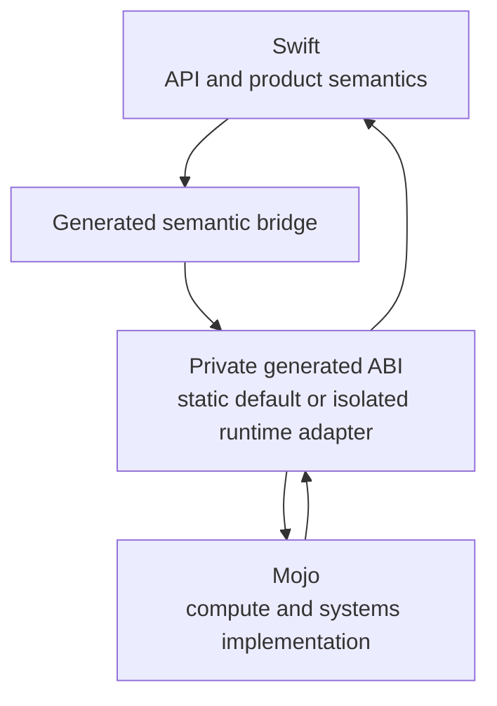
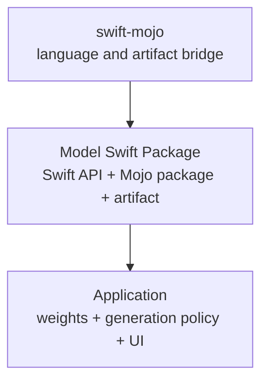

# Philosophy

## Mojo should feel like a native implementation language for Swift

このプロジェクトの中心命題は、Mojoを「Swiftから呼べる別言語」に留めないことです。利用者が設計するのはSwift APIであり、Mojoはその実装を担います。



## 1. Swift owns product semantics

Swift側が所有します。

- 公開function/methodと利用者向けの型。
- package/module境界とドキュメント。
- アプリケーション状態、actor isolation、task cancellation。
- typed error、buffer owner、device capabilityを表すSwift wrapper。
- SwiftUIを含むUIやアプリケーションlifecycle。

Mojo側の都合で利用者にraw pointer、C symbol、artifact path、compiler flagを要求しません。

## 2. Mojo owns compute semantics

Mojo側が所有します。

- compute kernel、SIMD、layout-sensitive processing。
- CPU/GPU targetへのlowering。
- Swift API契約を満たす低レイヤー実装。

Swiftらしい見た目のためにperformance semanticsを隠しません。device capability、copy、synchronizationがAPI判断に影響する場合は、高水準のSwift型として明示します。

## 3. C ABI is generated plumbing

C ABIは監査可能な相互運用境界ですが、製品APIではありません。

```text
Application code sees:
  Swift functions, values, errors, async, ownership

Generated layers see:
  binding IDs, fixed-width records, C exports, artifact manifests
```

P1では固定C dispatcherを持つ静的XCFrameworkへ閉じ込めます。application targetはlinkのためgenerated binary moduleへ依存しますが、そのmoduleはstable public APIではありません。人がheaderやsymbolを編集して機能を追加する設計にはしません。

accelerator runtimeが静的artifactへ閉じない場合も、application-level registryへ戻しません。runtime-linked ABIはexact receipt、generated export allowlist、relative loader rootを持つmanaged library bundleとして構築し、isolated worker境界でのみ利用します。worker側のloaderとsession lifecycleが実装されるまでは、bundleの存在をGPU実行成功として扱いません。

## 4. One source of semantics

macroとMojo generatorが別々にbodyを解釈すると、同じSwift sourceから違う実装が生成されます。したがって、構文、型、operation、identityはversioned IRへ一度だけloweringします。

```text
Swift syntax
  -> one checked IR
      -> Swift thunk
      -> Mojo source
      -> manifest identity
      -> cache identity
```

人がSwift名、Mojo名、C名を複数箇所で同期することも避けます。

## 5. Preparation is explicit; builds are trustworthy

Mojo compileは明示的な `prepare` で行います。通常buildはartifactを検証してlinkするだけです。

この分離により、次を実現します。

- Xcode build sandbox内でtoolchainを探したりinstallしたりしない。
- compiler/version/target/artifactの変更をsource controlでreviewする。
- fresh cloneでもbinary targetが解決できる。
- stale generated codeを黙って使わない。
- 重いMojo compileと軽いbuild verificationを別のcache policyにする。

生成物をcommitすることは妥協ではなく、現在のSwiftPM binary target graphに対する明示的な配布契約です。将来remote artifact bundleへ移行しても、sourceとartifactの検証関係は維持します。

## 6. Progressive truth over magical demos

最終構文に似たstubより、狭くても実装経路が閉じた段階を優先します。

- P1は最終spellingを使うが、加算だけを受理する。
- 未対応nodeはdiagnosticにする。
- 実Mojo compilerが生成した値だけを成功証拠にする。
- static link、archive、relocation、failure behaviorを検証する。
- 対応範囲を広げる前にIRとABIをversioningする。

「compileした」「型がある」「fixtureがある」だけで実装完了とはしません。

## 7. Ownership is language semantics

interopは型変換だけでは完成しません。誰が確保し、保持し、解放し、どのexecutor/deviceから触れるかもbridgeの意味です。

- borrowはscopeで表す。
- ownership transferはowner/handleで表す。
- copyは暗黙にしない。
- callback contextはshutdown後の呼び出しを拒否する。
- async completionとGPU eventもlifetimeの一部として扱う。
- zero-copyは測定で証明する。

P1をscalar-onlyにしたのは、この所有権設計を省略したままbuffer APIを公開しないためでもあります。最初のborrowed `Float` sliceは、Swift `Array` owner、同期closure lifetime、immutable pointer、typed failureを同時に定義したため追加できます。owned tensorやasync borrowは同じ基準を満たすまで追加しません。

## 8. Developer experience is part of correctness

ネイティブ実装言語らしさは構文だけで成立しません。

良い日常経路:

```text
write Swift-shaped API
  -> run prepare when implementation changes
  -> review generated manifest/artifact
  -> use normal Xcode build
  -> receive actionable diagnostic if stale
```

必要な体験:

- 1つのpackage-root/target commandでsourceを発見する。
- `init` を安全に再実行できる。
- `Prepared` と `Reused` が分かる。
- missing/stale/corrupt/target mismatchを区別する。
- generated Mojo、manifest、compiler、targetをinspectできる。
- build resultがabsolute pathやdeveloper machineのruntime installへ依存しない。

## 9. The abstraction remains inspectable

C ABIを日常APIから隠すことと、デバッグ不能にすることは違います。次はopt-inで観測可能にします。

- generated Mojo source。
- generated C header/module map。
- binding and source graph digests。
- compiler version and target。
- XCFramework tree digest。
- macro expansionとgenerated Registry。
- 将来のcopy/allocation/host-device transfer。

隠蔽は情報を消すことではなく、利用者が毎回管理する責務から外すことです。

## 10. Scope discipline

このlibraryが所有する境界は、Swift function contractからMojo compute implementationを安全に呼ぶところまでです。

```text
In scope:
  syntax, lowering, compiler integration, ABI, artifact, invocation,
  types, ownership, errors, async, compute-device synchronization

Out of scope:
  UI views, rendering-framework modifiers, render loops, scene lifecycle,
  application navigation and product state
```

Platform frameworkのAPIは「低レイヤー実装をSwift APIへ自然に見せる」先例として参考にしますが、そのframework surfaceをこのpackageへ持ち込みません。

## 11. Model implementations are Swift products, not runtime internals

`swift-mojo` はLLM model frameworkそのものではなく、model実装をSwift productとして成立させるinterop substrateです。実用的なmodelは独立したSwift Packageが所有します。



この分離により、次を守ります。

- model固有のtokenizer、session、KV cache、capability契約をcoreへ持ち込まない。
- model packageの利用者はMojo compiler、C header、symbol、artifact pathを操作しない。
- model authorだけが明示 `prepare` を行い、consumerは通常のSwiftPM/Xcode buildを使う。
- Mojo source packageとprepared native artifactをmanifestで結び、どちらか一方だけが更新された状態を拒否する。
- model weightsはcode/artifactのversioningから分離し、immutable revision/digestを持つ外部assetとして解決する。

Mojo sourceをSwiftPM resourceとしてruntime bundleへ入れることは、この責務を満たしません。sourceはprepare時の入力であり、consumer runtimeがcompilerを起動する設計にはしません。precompiled Mojo sourceがcompiler cacheとして有用でも、public Swift distribution boundaryは検証済みnative artifactです。
