# Release process

No semantic-version release has been tagged at this document's last update. A candidate receives its exact `SwiftMojoVersion.current` before the source and test gates run, but it is not a release until every gate below has evidence from the same commit and the final tag checks pass.

## Release invariants

```mermaid
flowchart LR
    V["Set exact version"] --> S["Source and package gates"]
    S --> T["Bounded tests"]
    T --> P["Commit and push candidate"]
    P --> A["Immutable-revision Mojo acceptance"]
    A --> M["Two-target correctness evidence"]
    M --> F["Candidate version/release gate"]
    F --> G["Create and push tag"]
    G --> E["Exact-version resolution<br/>and tag == origin/main"]
```



| Gate | Required evidence |
|---|---|
| Dependency graph | Root `Package.swift` has no `.package(path:)` or other local package dependency |
| CI supply chain | GitHub Actions use full commit pins, checkout credentials are not persisted, and the Swiftly installer signer/notarization are verified before installation |
| License | Root `LICENSE` is present and matches the intended release terms |
| Public surface | `swift package --allow-writing-to-package-directory mojo ...` is the documented author command; the internal executable is not a product |
| Version | `SwiftMojoVersion.current` is exactly the release version and has no `-dev` suffix |
| Generated state | bindings、Mojo source、source map、manifest、header、XCFramework、and pipeline identity agree |
| Tests | Focused suites and the complete package suite pass through bounded `xcodebuild test` |
| Real compiler | Updated `scripts/release-acceptance.sh` compiles and runs scalar, immutable-buffer, mutable-buffer, owned-session lifecycle, and typed failure paths from a custom SwiftPM `path`/`sources`/`exclude` layout |
| Sanitizers | The current-checkout universal session/resource/host-transfer fixture passes separate `swift-address` and `mojo-address` lanes; the Mojo lane verifies its required ASan runtime version symbol before link |
| Multiple targets | `scripts/multi-target-acceptance.sh` links two Mojo-enabled targets with two symbol prefixes |
| Git state | Candidate is committed, pushed, and `origin/main` points to the candidate |
| Tag | Annotated semantic-version tag points to exactly `origin/main` |

Performance is not part of the correctness or release-acceptance suites. Run `Benchmarks/RuntimeBridge/run.sh`, `Benchmarks/ColdConsumerBuild/run.sh`, or the manual runtime benchmark workflow only when explicitly collecting performance evidence. Retain the environment and measurement output without converting scheduler noise into a correctness threshold.

## Candidate procedure

1. Choose the semantic version and replace the development version in `Sources/MojoCommandCore/SwiftMojoVersion.swift`.
2. Replace branch-based dependency examples with the intended semantic-version requirement only when that tag will be created in the same release operation.
3. Confirm the root manifest contains no local package reference, every `revision:` is a full Git object ID, and `Package.resolved` pins that exact object.
4. Run the focused and full test matrices with explicit timeouts.
5. Commit and push the candidate revision, then run the public command-plugin acceptance against that immutable revision. The scripts verify both the advertised remote object and SwiftPM's resolved pin:

   ```bash
   SWIFT_MOJO_EXECUTABLE=/absolute/path/to/mojo \
   SWIFT_MOJO_CANDIDATE_URL=https://github.com/owner/swift-mojo.git \
   scripts/release-acceptance.sh

   SWIFT_MOJO_EXECUTABLE=/absolute/path/to/mojo \
   SWIFT_MOJO_CANDIDATE_URL=https://github.com/owner/swift-mojo.git \
   scripts/multi-target-acceptance.sh
   ```

   The scheduled/manual real-Mojo workflow also runs the current-checkout universal session gate:

   ```bash
   SWIFT_MOJO_EXECUTABLE=/absolute/path/to/mojo \
   scripts/local-session-acceptance.sh

   SWIFT_MOJO_EXECUTABLE=/absolute/path/to/mojo \
   SWIFT_MOJO_SANITIZE=swift-address \
   scripts/local-session-acceptance.sh

   SWIFT_MOJO_EXECUTABLE=/absolute/path/to/mojo \
   SWIFT_MOJO_SANITIZE=mojo-address \
   scripts/local-session-acceptance.sh
   ```

6. Review `git diff`, generated artifact changes, ADR status, and every `FIXME(INCOMPLETE_IMPLEMENTATION)` marker. The intentional bootstrap marker must remain unreachable as a prepared artifact.
7. If acceptance requires a fix, create and push a new candidate commit and repeat the invalidated gates. Do not reuse evidence from the previous revision.
8. Fetch `origin`, then run the final version/tag preflight. It builds and invokes the public command plugin from the candidate source in an isolated scratch directory:

   ```bash
   SWIFT_MOJO_CANDIDATE_URL=https://github.com/owner/swift-mojo.git \
   scripts/release-version-gate.sh <version> <tag>
   ```

9. Create and push the annotated tag.
10. Prove that a fresh package resolves the public command plugin through the exact semantic version rather than a local path、branch、or revision override:

    ```bash
    SWIFT_MOJO_CANDIDATE_URL=https://github.com/owner/swift-mojo.git \
    scripts/release-tag-gate.sh <version> <tag>
    ```

11. The tag gate also verifies the following equality explicitly:

    ```bash
    git rev-list -1 <tag>
    git rev-parse origin/main
    ```

    The two object IDs must match.

## Failure policy

A timeout, skipped architecture, compiler fallback, stale generated file, dirty candidate, local dependency, or unexecuted acceptance gate is not a release pass. Fix the cause, create a new candidate commit, and rerun only the invalidated gates plus all downstream gates. Do not move an already published release tag.
