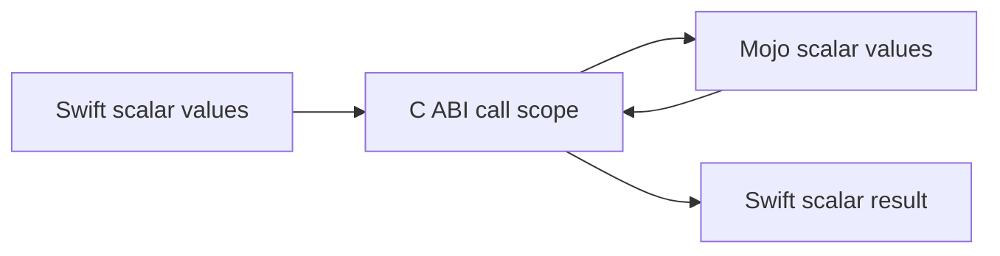
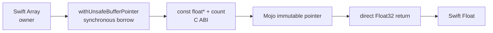

# Requirements

## 1. Scope and status

この文書は、`swift-mojo` が担う言語bridge、生成tooling、artifact検証の要件を定義します。SwiftUI、画面描画、Metal view lifecycleはscope外です。

| State | Meaning |
|---|---|
| Verified | 実装、成功経路、関連する失敗経路を実際に実行済み |
| Implemented | 呼び出し可能な実装はあるが、対象環境での全acceptanceは未実行 |
| Planned | 次段階の設計対象。呼び出し可能なAPIは公開しない |
| Research | upstream capabilityまたは方式選定の実証が必要 |

schema-3 P1はarm64 macOS向けscalar経路のhistorical baselineです。current schema-4 scalar bridgeはdirect inline body、external Mojo package、target-scoped artifact set、source map、arm64/x86_64 universal packaging、release verification、compiler-free relocated consumerまで実行検証済みです。external-only `([Float]) throws -> Float` のborrowed buffer vertical sliceは実装済みですが、変更後のreal-Mojo acceptanceは未実行です。owned buffer、tensor、async、GPU、model inferenceはまだ公開契約に含みません。

## 2. Functional requirements

| ID | Requirement | State | Acceptance condition |
|---|---|---|---|
| F-001 | Swift関数にMojo実装を記述する | Verified | `@mojo func ... { return ... }` がmacro、Mojo、ABIを通って実値を返す |
| F-002 | macroとgeneratorが同じ意味を解釈する | Verified | 両者が1つのversioned binding IRとcanonical identityを使う |
| F-003 | Mojoをbuild外で準備する | Verified | `prepare` がreal Mojo `--emit object` からXCFrameworkを生成する |
| F-004 | build時にartifactを検証する | Verified | pluginがsource、target、schema、ABI、generation pipeline、binding、tree digestを照合する |
| F-005 | artifactを静的にinvokeする | Verified | final Mach-OにABI symbolsが定義され、Mojo dylibへ依存しない |
| F-006 | incremental prepareを提供する | Implemented | generation pipelineを含む完全一致時だけartifact/manifestを書き換えず `Reused` を返す |
| F-007 | package setupを支援する | Verified | `init` とpackage-layout modeがbootstrap、source discovery、非破壊再実行を提供する |
| F-008 | 失敗を成功値へ丸めない | Verified | stale、missing、corrupt、wrong target、unsupported syntax、overflowを明示的に拒否する |
| F-009 | DSLを段階的に拡張する | Planned | 各syntax nodeに型・ownership・Mojo loweringを定義してから受理する |
| F-010 | external Mojo source packageを提供する | Verified | package source、Swift bindings、prepared artifactが同じinput graph/ABI identityを使う |
| F-011 | MojoからSwiftへcallbackする | Research | callback context、isolation、shutdown、compiler capabilityをtarget上で検証する |
| F-012 | Mojo modelをSwift Packageとして配布する | Planned | Swift API、Mojo source package、prepared native artifact、manifestを1つのversioned productとしてconsumerが解決できる |
| F-013 | arbitrary Mojo syntaxをSwift bodyへ埋め込む方式を決定する | Research | external packageで満たせない需要を立証し、custom source/preprocessor/compiler integrationを比較実証する |
| F-014 | release package integrationを検証する | Verified | release gateがtarget-scoped binary target path、source-target dependency、build plugin、local dependency absenceをSwiftSyntaxから確認する |
| F-015 | contiguous `Float` inputを同期borrowしてMojoへ渡す | Implemented | macro、IR、generated C/Mojo ABI、typed Swift error、artifact test、real-Mojo acceptance workflowが同じ `([Float]) throws -> Float` 契約を使う。updated workflowの実行はpending |

## 3. Current scalar contract

```swift
@mojo
func add(_ a: Int32, _ b: Int32) -> Int32 {
    return a + b
}
```

| Concern | P1 requirement |
|---|---|
| Macro spelling | inline `@mojo` or external `@mojo(package:function:)` string literals |
| Declaration | file-scope Swift function declaration; methods/local functions are rejected until enclosing identity is modeled |
| Parameters | exactly two `Int32` values with local names |
| Result | `Int32` |
| Effects | non-`async`、non-throwing |
| Generics | rejected |
| Body | inlineはexactly one direct `return`; external bindingはbodyなし |
| Expression | addition of the two parameters; either operand order |
| Arithmetic semantics | Swift-compatible checked `Int32` addition; overflow traps before dispatch |
| Name | portable C identifier; same ABI identity in one target must be unique |
| Conditional compilation | an `@mojo` declaration inside `#if` is rejected in P1 |
| Platform | Apple XCFramework adapter for arm64/aarch64/x86_64 macOS/iOS triples |
| Package | target-derived module/archive/C symbols prevent cross-target collision |

未知のattribute argument、body shape、type、effect、expressionはcompile/prepare errorです。Swift implementationへのfallback、zero、空artifactを成功扱いしません。

### 3.1 Borrowed Float vertical slice

```swift
@mojo(package: "MathModel", function: "sum")
func sum(_ values: [Float]) throws -> Float
```

| Concern | Current requirement |
|---|---|
| Form | external `package/function` binding only |
| Input | exactly one non-empty `[Float]` |
| Result | `Float` |
| Effects | synchronous、untyped `throws`、non-`async` |
| Swift owner | caller's `Array`; retained for the full call closure |
| Mojo access | immutable pointer + exact element count; no escape/free/mutation |
| Failure | public `MojoInvocationError`; no fabricated numeric result |
| Verification state | implementation and test workflow exist; real compiler/link/runtime rerun pending |

## 4. Non-functional requirements

| ID | Requirement | P1 verification |
|---|---|---|
| N-001 | Determinism | sourceとbindingをsortし、canonical recordとSHA-256を使う |
| N-002 | One source of truth | macro、renderer、manifestが `MojoBindingCore` を共有する |
| N-003 | No build-time toolchain mutation | pluginはverifyだけを実行し、Mojoをinstall/compileしない |
| N-004 | Hermetic tool discovery | prepareはabsolute overrideまたは `PATH` だけを使う |
| N-005 | Relocatability | runtime path lookupなし。archiveから移設した実行ファイルで検証 |
| N-006 | Artifact integrity | XCFramework全regular fileのpath、length、contentをcanonical hashする |
| N-007 | Explicit target | target triple/CPUをmanifest、compiler arguments、verifierで一致させる |
| N-008 | Incremental correctness | manifest、XCFramework root、全descendant regular file/directoryをplugin inputとして宣言する |
| N-009 | Transaction safety | output単位のinterprocess lock、typed access lease、versioned marker、staging、backup/restoreを使う |
| N-010 | Reviewable generated state | `Generated/<Target>` をcommitし、sourceとartifactを同じreviewで更新する |
| N-011 | Observable failures | command、status、diagnostic、expected/actual digest/targetを保持する |
| N-012 | Bounded verification | production/automated subprocessを専用process groupで実行し、deadline、TERM、KILL、reapを所有する |
| N-013 | Compiler-free consumption | released model packageの通常consumer build/runtimeはMojo compilerのinstall、download、起動を要求しない |
| N-014 | Destination selection | configured buildは全slice envelopeを検証しXcodeへ選択を委ねる。明示 `SWIFT_MOJO_TARGET_*` がある場合だけexact destination assertionを追加する |
| N-015 | Snapshot consistency | prepareはcommit直前、build verifyはRegistry生成直前、releaseはoutput lock保持中の終了直前に入力identityを再読し、操作中の変更を拒否する |

## 5. Syntax and compiler constraints

Swift function body macroは元bodyを参照して全面置換できます。ただし元bodyはSwift grammarとして構文的に正しい必要があります。意味的なSwift type-checkはmacro置換前のDSL bodyには要求されません。

```text
Swift parser
  -> @mojo body macro sees original syntax
    -> MojoBinding IR validates supported semantics
      -> generated Swift thunk is type-checked
```

したがって、Swiftとしてparseできるdirect body subsetは通常macroで実現できますが、任意のMojo grammarは実現できません。未対応nodeをsource textとしてそのままMojoへ流さず、full Mojoはexternal packageとして扱います。

## 6. Static ABI requirements

### 6.1 Current ABI

ABI versionは `1`、current manifest schemaは `4` です。schema 3は既存prepared artifactのbuild verificationだけを暫定的に許可し、release verificationでは拒否します。

```c
uint32_t <target_prefix>_static_abi_version(void);
uint64_t <target_prefix>_input_graph_identifier(void);
uint32_t <target_prefix>_has_binding(uint64_t binding_id);
int32_t <target_prefix>_call_i32_i32_i32(
    uint64_t binding_id,
    int32_t lhs,
    int32_t rhs
);
float <target_prefix>_call_f32_buffer_f32(
    uint64_t binding_id,
    const float *values,
    uint64_t count
);
```

dispatcher symbolはartifactに含まれるsignature familyだけをheader/objectへ生成します。scalar symbolを含む既存artifactのidentityは維持し、buffer dispatcherはadditive ABIとして追加します。

呼び出し順序は次を満たします。

```text
generated Swift Registry first access
  -> ABI version guard once
  -> input graph identifier guard once
  -> validate every prepared binding once
generated Swift thunk on each call
  -> inlinable signature-family binding guard
  -> fixed dispatcher
  -> Mojo Int32 implementation
```

- build verifierはfull SHA-256 source graphとmanifest binding recordsを比較します。
- runtimeの63-bit IDはdispatch用であり、full digest検証の代替ではありません。
- invariant違反はtrapし、dispatcherのunsupported branchが返す値をSwift成功値として観測させません。
- P1 DSLはruntime初期化を必要としないscalar arithmeticだけを生成します。Mojo standard-library runtimeへ依存する機能を追加する前に初期化契約をABIへ追加します。
- generated C moduleは実装detailであり、stable public APIではありません。
- buffer dispatcherは同期的に `Float32` を直接返します。ABI/input graph/artifact membershipはRegistryのthread-safe immutable cacheで一度だけ検証し、empty bufferはpointerを渡す前にSwiftで拒否します。

### 6.2 Manifest schema 4

manifestは次を保持します。

- schema versionとABI version。
- binding IR、Mojo/C renderer、artifact packaging、Registry rendererを合成したgeneration pipeline digest。
- Mojo compiler version。
- target-derived module/archive/symbol identity。
- compiler pinと全target triple/CPU/accelerator slices。
- full Swift binding graphとexternal Mojo package graphのSHA-256/runtime identifier。
- canonical generated Mojo digestと、Swift declarationへ戻るsource map digest。verifyはcurrent rendererから両方を再生成して完全一致を要求する。
- XCFramework canonical tree SHA-256。
- binding ID、function name、ABI digest、implementation digest、external package digests、slice archive digests。

XCFramework tree digestはhidden fileを除くregular fileをrelative path順に並べ、path length、path bytes、content length、content bytesをhashします。absolute pathは含めません。

## 7. Type requirements

| Swift surface | C boundary | Mojo side | State |
|---|---|---|---|
| two `Int32` inputs, `Int32` result | fixed-width scalar dispatcher | `Int32` with Swift-side checked overflow gate | Implemented |
| other fixed-width integers | matching fixed-width scalar | matching scalar | Planned |
| `Float` / `Double` | `float` / `double` | `Float32` / `Float64` | Planned |
| `Bool` | normalized `uint8_t` | explicit conversion | Planned |
| `String` | UTF-8 pointer + byte count | borrowed view | Planned |
| non-empty `[Float]` input, `Float` result | `const float *` + `uint64_t` -> `float` | `Pointer[Float32, ImmUntrackedOrigin]` + count -> `Float32` | Implemented; real acceptance and copy-count proof pending |
| other contiguous/owned buffer | pointer + count or owner record | borrowed/owned span | Planned |
| optional scalar | tag + payload | explicit optional record | Planned |
| Swift struct | generated versioned C record | generated ABI record | Research |
| class/actor/existential | opaque owned handle | opaque pointer | Research |

Swift `Int` とMojo `Int` をABI-identicalと仮定しません。型を追加するときはSwift surface、ABI layout、Mojo type、failure、ownership、alignmentを同時にversioningします。

## 8. Error requirements

```text
source diagnostic
prepare/toolchain error
artifact transaction error
build verification error
runtime invariant violation
future Mojo invocation status
future ownership/device error
```

- macro/scanner/compiler/verifier errorを単一のgeneric failureへ潰しません。
- P1のchecked `Int32` additionがoverflowした場合はdispatcherを呼ばずtrapします。
- compiler nonzero statusとdiagnosticを保持します。
- compiler/tool subprocessがdeadlineを超えた場合はprocess groupを終了・回収し、typed timeoutとして報告します。
- prepare/initのoutput lock取得・scope mismatchはtyped transaction failureとして報告します。
- successful processがobjectを生成しなければfailureです。
- manifest missing/invalid、schema/ABI mismatch、source/binding mismatch、target mismatch、tree digest mismatchを区別します。
- scalar public functionはnonthrowingです。prepare/buildで検証された静的artifactだけをlinkし、runtime mismatchはprogram invariant violationとしてtrapします。
- borrowed buffer public functionは `throws` です。ABI version、input graph、binding membershipはRegistryの初回検証結果として保持し、empty bufferは呼び出しごとに `MojoInvocationError` として報告します。現在のdirect-return ABIはMojo implementation error channelを持ちません。
- 将来のMojo計算errorはC boundaryをunwindせず、status + initialized out value + owned diagnostic handleで表します。

## 9. Ownership and lifetime requirements

P1 scalar callはpointer、buffer、handle、共有可変runtime stateを持ちません。borrowed `Float` vertical sliceはSwift `Array` storageを同期call中だけimmutable pointerとして貸し出し、Mojoは保持・解放・変更しません。





current borrowed-buffer contract:

- inputはnon-emptyでなければならない。nullとemptyをABI v1で同義にしない。
- Swift ownerはcall完了まで生存し、pointerはclosure外、Mojo global、async workへescapeしない。
- Mojo側はinputをdeinitialize、free、mutateしない。
- resultはC ABIから `Float32` valueとして直接返し、out storageを作らない。
- source/API上のpointer隠蔽は実装済みだが、allocation/copy countの計測前にzero-copy verifiedとは呼ばない。

steady-state borrowed-buffer bridgeのperformance budget:

| Metric | Budget |
|---|---|
| input bytes copied by the bridge | `0` |
| bridge-attributable heap allocations | `0` per call after Registry initialization |
| dispatcher crossings | exactly `1` per successful call |
| ABI/graph/membership C calls | `0` per steady-state call; all occur in one thread-safe Registry initialization |
| wrapper latency for Mojo work taking at least 1 µs | median overhead at most `5%` versus a direct generated C dispatcher call in the same Release executable |

sub-microsecond kernelはabsolute nanoseconds、p50/p95、入力size、host、toolchainを記録し、測定前にlatency passを主張しない。

将来要件:

- borrowed pointerは同期call scope外へescapeしない。
- retained memoryはowner handleとexactly-once destructorを持つ。
- Mojo allocated bufferはownerとviewを分離する。
- Sendable境界をまたぐowner retentionと同期を明示する。
- zero-copyの主張はallocation/copy countまたはbenchmarkで検証する。

## 10. Async and concurrency requirements

- synchronous ABI callでSwift executorを無期限にblockしない。
- async workはoperation handle、completion、cancellation、releaseを分離する。
- continuationのdouble resume、lost completion、cancel/complete raceを防ぐ。
- callbackはlock critical section外で行う。
- ordered I/O lifecycleはactor、短いin-memory stateは `Mutex` を使う。
- `AsyncStream` を公開するownerは `shutdown()` でcontinuationをfinishする。
- Native/WASM/Embeddedで同じ論理状態のisolation契約を弱めない。

## 11. GPU requirements

| Concern | Requirement |
|---|---|
| Capability | backend、device、accelerator targetを明示する |
| Artifact | host triple、CPU、accelerator、featuresをcache identityへ含める |
| Buffer | host/device/shared owner、range、alignment、deallocatorを型で表す |
| Synchronization | stream/queue/event dependencyを明示し、暗黙同期しない |
| Transfer | upload/download copyを観測可能にする |
| Error | unsupported backend、compile failure、device lossをtyped failureにする |
| Validation | CPU referenceとのdifferential testとtarget device testを行う |

GPU bridgeはこのlibraryの将来scopeですが、SwiftUI shader modifierやview lifecycleはscope外です。

## 12. Model package requirements

| ID | Requirement | State | Acceptance condition |
|---|---|---|---|
| MP-001 | model実装を独立したSwift Packageとして表す | Planned | packageがSwift library product、Mojo source package、prepared artifact、manifestを所有する |
| MP-002 | external Mojo sourceをgraphへ含める | Verified | package内の全regular file path/contentがcache/verify digestへ入り、symbolic linkと未宣言の兄弟package importを拒否する。package dependency lock identityはplanned |
| MP-003 | Mojo packageからABI entry moduleを生成する | Verified | generated entryがpackageをimportし、declared bindingsだけをexportする |
| MP-004 | modelごとにartifact identityを分離する | Implemented | target-derived module/archive/symbol identityで衝突を防ぎ、two-target acceptance workflowを提供する。workflow実行はpending |
| MP-005 | authorとconsumer toolchainを分離する | Verified | author prepareはpinned Mojo compilerを使い、consumer buildはprepared sliceだけを検証・linkする |
| MP-006 | weightsをcode distributionから分離する | Planned | public load APIがlocation/revision/digest/resolverを受け、production weightsをSwiftPM resourceへ暗黙に含めない |
| MP-007 | model compatibilityを検証する | Planned | model API/ABI、weight format/revision、compiler、platform/accelerator sliceの不一致をtyped failureにする |
| MP-008 | end-to-end consumer acceptanceを持つ | Planned | clean consumerがMojo compilerなしでresolve/build/link/load/inferし、stale/corrupt/wrong-slice failureを確認する |

目標layout:

```text
Swift model package
  -> Sources/<ModelTarget>       public Swift API
  -> Mojo/<MojoPackage>         authoring source package
  -> Generated/<ModelTarget>    native artifact + manifest
  -> Tests                      API/ABI/model acceptance
```

- Mojo package directoryは `__init__.mojo` を持つ。
- `.mojo` はprepare inputであり、runtime resourceとしてbundleへコピーしない。
- `.mojoc` はexact compiler versionに依存する中間/cache形式として扱い、SwiftPM native binary targetやstable release artifactとは扱わない。
- production weightsはrepository、XCFramework、SwiftPM resourceから分離する。Hugging Face由来のhost cacheは `~/.cache/huggingface/hub/` を使用する。
- 小さなtest fixtureだけはbounded resourceとして許可し、production model acceptanceと区別する。
- model/session execution、tokenizer contract、KV cacheはmodel packageの責務であり、`swift-mojo` coreへmodel固有APIを追加しない。sampling、停止条件、prompt flowなどのgeneration policyはapplicationが所有する。
- Apple platformではXCFrameworkを使う。非Apple platformはSwiftPMの実在するlink/package capabilityに対応する別adapterを要求し、XCFramework互換を仮定しない。

MP-002、MP-003、MP-005はreal Mojo external packageとcompiler-free clean consumerのscalar acceptanceまで完了しています。MP-004のtarget-derived identityと同一consumerへ2 targetをlinkするacceptance workflowは実装済みですが、workflowは未実行です。MP-008が要求するmodel load/inferとfailure matrixは未完了であり、model/session API、weights、実推論、remote distributionを含むMP-001/006〜008は各model packageと後続Phaseの責務です。

## 13. Developer experience requirements

- 最小利用コードからC symbol、path、header、compiler commandを隠す。
- `init` は何を `Package.swift` に追加するかを表示する。
- `init` 再実行でprepare済みartifactを破壊しない。
- `prepare` は重い作業をcacheし、`Prepared` と `Reused` を区別する。
- source変更時のbuild failureは、次の操作として `swift package --disable-sandbox --allow-writing-to-package-directory mojo prepare --target <Swift target>` を示す。
- generated Mojo、manifest、compiler version、target、digestをinspection可能にする。
- `swift package --allow-writing-to-package-directory mojo` command pluginでauthorがstandalone executableのPATHを管理しなくてよい。
- textとmachine-readable JSONで同じsuccess/failure契約を公開する。
- XcodeとCLIで同じsource graph/manifest contractを使う。
- clean cloneでbinary target pathが存在するよう生成artifactをcommitする。
- model authorは1つのtarget-scoped commandでSwift bindings、Mojo package、artifact setをprepareできる。
- release verifierは `Package.swift` のbinary target path、target dependency、declared remote package由来のMojo product、同一package由来の `MojoBuildPlugin` wiringをartifact identityと照合し、local dependencyとmoving branchを拒否する。
- model consumerは通常のSwift Package dependencyとして追加し、Mojo compilerなしでSwift APIだけをimportできる。
- source/artifact/weight/slice mismatchのdiagnosticは、authorが `prepare` すべきか、consumerがcompatible release/weightを選ぶべきかを区別する。

## 14. Toolchain and security requirements

- commandはshell stringではなくexecutable pathとargument arrayで実行する。
- `SWIFT_MOJO_EXECUTABLE` はabsolute executable pathだけを受理する。
- target/cpuは許可したASCIIだけを受理する。
- pluginはpackage sourceを書き換えず、plugin work directoryにRegistryを生成する。
- prepareだけがversioned markerを持つgenerated output directoryを置換できる。
- artifact/manifest/sourceの不一致をsilent repairしない。repairは明示 `prepare` で行う。
- Swift `@c` はP1の依存ではない。reverse callback採用時にlocal compiler、header生成、ABI、lifetimeを再検証する。

## 15. Explicit non-goals for the current release tooling

- arbitrary Mojo grammar in a `.swift` file。
- non-Apple native artifact adapter、Linux、WASM、Embedded slices。
- owned/error-payload buffer、async、callback、String、tensor、GPU APIs。
- remote artifact upload、signing、registry publication。
- SwiftUI、Metal rendering、application lifecycle integration。
