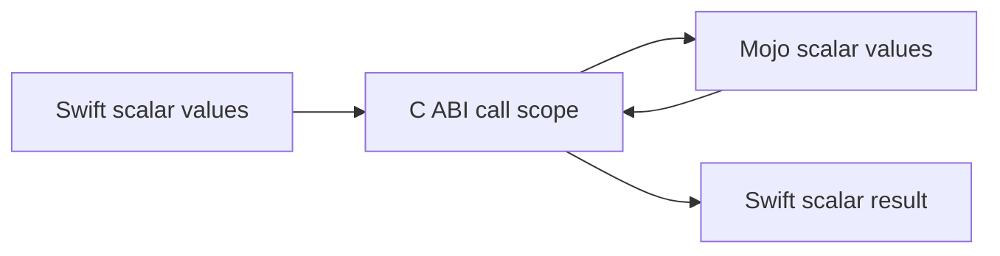
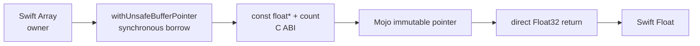
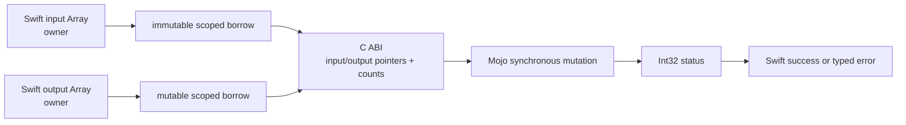
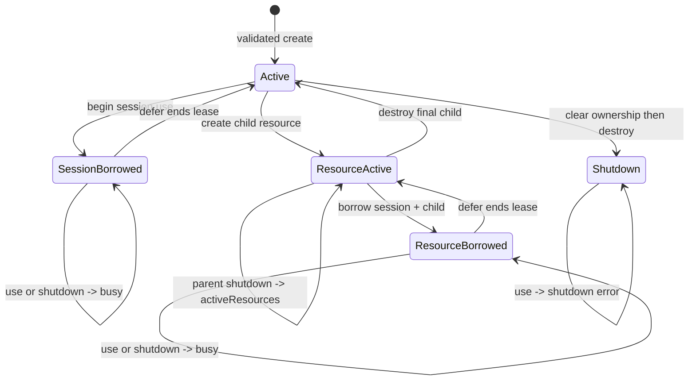

# Requirements

## 1. Scope and status

この文書は、`swift-mojo` が担う言語bridge、生成tooling、artifact検証の要件を定義します。UI、画面描画、vendor framework lifecycleはscope外です。

| State | Meaning |
|---|---|
| Verified | 実装、成功経路、関連する失敗経路を実際に実行済み |
| Implemented | 呼び出し可能な実装はあるが、対象環境での全acceptanceは未実行 |
| Planned | 次段階の設計対象。呼び出し可能なAPIは公開しない |
| Research | upstream capabilityまたは方式選定の実証が必要 |

schema-3 P1はarm64 macOS向けscalar経路、schema 4はApple単一artifactのhistorical baselineです。current schema 5 bridgeはdirect inline body、external Mojo package、source map、arm64/x86_64 universal XCFramework、Linux `staticLibrary` artifact bundle、release/build verification、compiler-free relocated Apple consumerまで実装しています。external-only `([Float]) throws -> Float`、`([Float], inout [Float]) throws -> Void`、Mojo-created stateを跨ぐsynchronous opaque session、およびsession-owned `MojoFloat32BufferOwner` のcreate/copy/shutdownをreal Mojo compile、static link、runtime behaviorまで検証しました。session/resource/host-transfer経路はSwift側とMojo側を分離したAddress Sanitizerでも実行済みです。Linux ARM64はreal Mojo cross-compile、ELF archive、SwiftPM package graph、artifact verification、undefined-symbol inspectionに加え、clean native Swift 6.2.4 consumerでplugin verification、static link、scalar invoke、opaque session create/use/shutdownまで検証済みです。Linux owned-buffer transfer、allocation/copy count、standalone borrowed-buffer familyの専用sanitizer、tensor、asyncは未完了です。Concrete device implementations、model inference、and hardware qualification are downstream responsibilities.

## 2. Functional requirements

| ID | Requirement | State | Acceptance condition |
|---|---|---|---|
| F-001 | Swift関数にMojo実装を記述する | Verified | `@mojo func ... { return ... }` がmacro、Mojo、ABIを通って実値を返す |
| F-002 | macroとgeneratorが同じ意味を解釈する | Verified | 両者が1つのversioned binding IRとcanonical identityを使う |
| F-003 | Mojoをbuild外で準備する | Verified | `prepare` がreal Mojo `--emit object` からApple XCFrameworkとLinux static-library artifact bundleを生成する |
| F-004 | build時にartifactを検証する | Verified | pluginがsource、target、schema、ABI、generation pipeline、binding、tree digestを照合する |
| F-005 | artifactを静的にinvokeする | Verified | final Mach-OにABI symbolsが定義され、Mojo dylibへ依存しない |
| F-006 | incremental prepareを提供する | Implemented | generation pipelineを含む完全一致時だけartifact/manifestを書き換えず `Reused` を返す |
| F-007 | package setupを支援する | Verified | `init` とpackage-layout modeがbootstrap、SwiftPM-resolved source inventory、非破壊再実行を提供する |
| F-008 | 失敗を成功値へ丸めない | Verified | stale、missing、corrupt、wrong target、unsupported syntax、overflowを明示的に拒否する |
| F-009 | DSLを段階的に拡張する | Planned | 各syntax nodeに型・ownership・Mojo loweringを定義してから受理する |
| F-010 | external Mojo source packageを提供する | Verified | package source、Swift bindings、prepared artifactが同じinput graph/ABI identityを使う |
| F-011 | MojoからSwiftへcallbackする | Research | callback context、isolation、shutdown、compiler capabilityをtarget上で検証する |
| F-012 | Mojo modelをSwift Packageとして配布する | Planned | Swift API、Mojo source package、prepared native artifact、manifestを1つのversioned productとしてconsumerが解決できる |
| F-013 | arbitrary Mojo syntaxをSwift bodyへ埋め込む方式を決定する | Research | external packageで満たせない需要を立証し、custom source/preprocessor/compiler integrationを比較実証する |
| F-014 | release package integrationを検証する | Verified | release gateがtarget-scoped binary target path、source-target dependency、build plugin、local dependency absenceをSwiftSyntaxから確認する |
| F-015 | contiguous `Float` inputを同期borrowしてMojoへ渡す | Verified | macro、IR、generated C/Mojo ABI、typed Swift error、real Mojo compile、compiler-free runtime、empty-input failureが同じ `([Float]) throws -> Float` 契約を使う。zero-copy claimには別途allocation/copy measurementを要求する |
| F-016 | Swift-owned `Float` outputを同期mutable borrowしてMojoに更新させる | Verified on local arm64 | `([Float], inout [Float]) throws -> Void` がscoped immutable/mutable borrow、generated status ABI、real Mojo mutation、nonzero status、empty-input/output failureを同じ契約で実行する。immutable-revision universal release acceptance、allocation/copy、sanitizerは別gateとする |
| F-017 | Mojo-created runtime stateをtyped sessionとして所有する | Verified on universal macOS and native Linux ARM64 | factory/use/shutdown macro、versioned flat C ABI、exact device/capability validation、factory-domain isolation、single synchronous lease、typed busy/shutdown failure、post-create cleanup、exactly-once destruction、real Mojo runtime、static link、no Mojo dynamic dependencyを同じ契約で実行する。Linuxはgeneric CPU create/use/shutdown subset、macOSはbuffer transferを含む完全fixtureを検証し、asyncとconcrete device runtimeはdownstream gateとする |
| F-018 | static artifactのMojo runtime dependencyを明示する | Verified | prepareがobjectのundefined symbolをarchive前に検査し、同梱しない `AsyncRT_*`、`KGEN_CompilerRT_*`、`MGP_RT_*` をtargetとsymbol一覧を持つtyped errorで拒否する。将来runtimeはversioned adapterとして追加する |
| F-019 | session-owned Float32 bufferをtyped ownerとして保持する | Verified for host memory on local universal macOS | resource factory macro、paired create/destroy/host-copy/synchronize C ABI、capability/size/count validation、synchronous round-trip transfer、parent-before-child shutdown rejection、typed copy/synchronize/status/missing-handle failure、idempotent child shutdown、exactly-once child-before-parent destruction、Swift/Mojo両Address Sanitizer laneを実行する。Concrete allocation and native-device synchronization belong to downstream adapters |
| F-020 | Linux ARM64 native artifactをcompiler-freeに配布する | Verified for generic static CPU session | schema 5 manifest、SE-0482 static-library artifact bundle、platform-conditioned binary target wiring、real Mojo aarch64 ELF cross-compile、KGEN-free archive、clean native Linux ARM64 Swift consumerのplugin verification/static link/scalar invoke/session create-use-shutdown/no-Mojo-dylibを検証する |
| F-021 | accelerator runtime dependencyをworker用receiptとして固定する | Implemented on macOS; native Linux acceptance pending | object/library SHA-256、target、architecture、install name/SONAME、exact symbol provider、Mach-O/ELF dynamic closure、system dependencyをschema 1へ記録し、全入力を再inspectionして一致を検証する。static artifactのreject policyは維持する |
| F-022 | receiptからambient searchのないworker bundleを構築する | Implemented on macOS; native Linux acceptance pending | managed transactionでexact `bin/` + `lib/` treeを作り、object digestをlink前後に確認し、Apple `@executable_path/../lib` / Linux `$ORIGIN/../lib`、ELF interpreter、executable bit、final imports、全file digestを再検証する |
| F-023 | downstream launcherがbundleをspawn前にfresh verificationできる | Implemented and verified on macOS | public `MojoRuntimeBundleVerifying` はread-only verificationを行い、bundle/receipt digest、target、relative executable、library closure、loader metadataのみをimmutable valueとして返す。検証APIはbundleを変更または実行せず、downstream stagingはbridge acceptanceに含めない |

## 3. Current scalar contract

```swift
@mojo
func add(_ a: Int32, _ b: Int32) -> Int32 {
    return a + b
}
```

| Concern | P1 requirement |
|---|---|
| Macro spelling | inline `@mojo` or external `@mojo(package:function:)` string literals |
| Declaration | file-scope Swift function declaration; methods/local functions are rejected until enclosing identity is modeled |
| Parameters | exactly two `Int32` values with local names |
| Result | `Int32` |
| Effects | non-`async`、non-throwing |
| Generics | rejected |
| Body | inlineはexactly one direct `return`; external bindingはbodyなし |
| Expression | addition of the two parameters; either operand order |
| Arithmetic semantics | Swift-compatible checked `Int32` addition; overflow traps before dispatch |
| Name | portable C identifier; same ABI identity in one target must be unique |
| Conditional compilation | an `@mojo` declaration inside `#if` is rejected in P1 |
| Platform | Apple XCFramework adapter for arm64/aarch64/x86_64 macOS/iOS triples; Linux static-library artifact-bundle adapter for aarch64/x86_64 triples |
| Package | target-derived static framework/module/archive/C symbols prevent cross-target collision |

未知のattribute argument、body shape、type、effect、expressionはcompile/prepare errorです。Swift implementationへのfallback、zero、空artifactを成功扱いしません。

### 3.1 Borrowed Float vertical slice

```swift
@mojo(package: "MathModel", function: "sum")
func sum(_ values: [Float]) throws -> Float
```

| Concern | Current requirement |
|---|---|
| Form | external `package/function` binding only |
| Input | exactly one non-empty `[Float]` |
| Result | `Float` |
| Effects | synchronous、untyped `throws`、non-`async` |
| Swift owner | caller's `Array`; retained for the full call closure |
| Mojo access | immutable pointer + exact element count; no escape/free/mutation |
| Failure | public `MojoInvocationError`; no fabricated numeric result |
| Verification state | real compiler、static framework link、compiler-free runtime、typed empty-input failure verified; allocation/copy and sanitizer evidence pending |

### 3.2 Caller-owned mutable Float output vertical slice

```swift
@mojo(package: "MathModel", function: "scale")
func scale(_ input: [Float], into output: inout [Float]) throws
```

| Concern | Current requirement |
|---|---|
| Form | external `package/function` binding only |
| Input | exactly one non-empty immutable `[Float]` |
| Output | exactly one non-empty caller-owned `inout [Float]` |
| Result | `Void`; mutation is observable only through the caller-owned output |
| Effects | synchronous、untyped `throws`、non-`async` |
| Swift owner | caller retains both arrays for the complete nested borrow scope |
| Mojo access | immutable input pointer/count plus mutable output pointer/count; no escape/free |
| Status | Mojo returns `Int32`; `0` succeeds and every nonzero value throws `invocationFailed(bindingID:status:)` |
| Verification state | real Mojo 1.0 universal compile、static link、runtime mutation、typed status、empty-input/output、immutable-revision release、Mach-O symbol/no-dylib inspection verified; allocation/copy and standalone-buffer sanitizer evidence pending |

### 3.3 Opaque runtime session vertical slice

```swift
@mojo(
    package: "SessionModel",
    function: "create_session",
    shutdown: "shutdown_session"
)
func openSession(
    _ requirements: MojoSessionRequirements
) throws -> MojoSessionOwner

@mojo(
    package: "SessionModel",
    function: "create_buffer",
    shutdown: "destroy_buffer",
    copyFromHost: "copy_from_host",
    copyToHost: "copy_to_host",
    synchronize: "synchronize",
    sessionFactory: "openSession"
)
func makeBuffer(
    _ session: MojoSessionOwner,
    elementCount: UInt64,
    memoryKind: MojoBufferMemoryKind
) throws -> MojoFloat32BufferOwner

@mojo(
    package: "SessionModel",
    function: "scale",
    sessionFactory: "openSession"
)
func scale(
    _ session: MojoSessionOwner,
    _ input: [Float],
    into output: inout [Float]
) throws
```

| Concern | Current requirement |
|---|---|
| Factory | external package binding with exact `shutdown` pair; one `MojoSessionRequirements` input and `MojoSessionOwner` result |
| Use | external package binding naming its Swift `sessionFactory`; owner + immutable/mutable `Float` borrows |
| Ownership | Mojo creates and destroys the session and child buffers; Swift owns typed opaque tokens and never interprets their pointees |
| Transfer | Buffer factories declare host-to-buffer, buffer-to-host, and synchronize functions; exact element count is checked before the scoped resource borrow, generated Mojo synchronizes after each successful copy, and nonzero copy/sync status is typed failure |
| Capability | response schema, device kind, ordinal, and required capability superset are validated without fallback |
| Isolation | one `Mutex<State>` guards the session, child-resource registry, and one synchronous lease; external calls and destruction occur outside the lock |
| Identity | target identity + full input graph + factory binding ID form the session domain; mismatched sessions fail before C dispatch |
| Failure | invalid response, missing session/resource handle, requirement or element-count mismatch, nonzero create/use/transfer status, active child resources, busy, shutdown, and domain mismatch are typed errors |
| Verification state | real Mojo 1.0 universal macOS create/use/buffer-create/round-trip-copy/buffer-shutdown/session-shutdown、cleanup、typed copy/synchronize/count failures、concurrent/reentrant busy、static link、Mach-O no-Mojo-dylib、Swift Address Sanitizer、Mojo Address Sanitizer verified locally; clean native Linux ARM64 verifies generic session create/use/shutdown and no-Mojo-dylib, while Linux owned-buffer transfer and concrete device execution remain downstream gates |

## 4. Non-functional requirements

| ID | Requirement | P1 verification |
|---|---|---|
| N-001 | Determinism | sourceとbindingをsortし、canonical recordとSHA-256を使う |
| N-002 | One source of truth | macro、renderer、manifestが `MojoBindingCore` を共有する |
| N-003 | No build-time toolchain mutation | pluginはverifyだけを実行し、Mojoをinstall/compileしない |
| N-004 | Hermetic tool discovery | prepareはabsolute overrideまたは `PATH` だけを使う |
| N-005 | Relocatability | runtime path lookupなし。artifactから移設した実行ファイルで検証 |
| N-006 | Artifact integrity | 全XCFramework/artifact-bundle treeのregular file path、length、contentをartifactごとにcanonical hashし、schema 5 aggregate digestも照合する |
| N-007 | Explicit target | target triple/CPUをmanifest、compiler arguments、verifierで一致させる |
| N-008 | Incremental correctness | manifest、全native artifact root、全descendant regular file/directoryをplugin inputとして宣言する |
| N-009 | Transaction safety | output単位のinterprocess lock、typed access lease、versioned marker、staging、backup/restoreを使う |
| N-010 | Reviewable generated state | `Generated/<Target>` をcommitし、sourceとartifactを同じreviewで更新する |
| N-011 | Observable failures | command、status、diagnostic、expected/actual digest/targetを保持する |
| N-012 | Bounded verification | production/automated subprocessを専用process groupで実行し、deadline、TERM、KILL、reapを所有する |
| N-013 | Compiler-free consumption | released model packageの通常consumer build/runtimeはMojo compilerのinstall、download、起動を要求しない |
| N-014 | Destination selection | configured buildは全slice envelopeを検証しXcodeへ選択を委ねる。明示 `SWIFT_MOJO_TARGET_*` がある場合だけexact destination assertionを追加する |
| N-015 | Snapshot consistency | prepareはcommit直前、build verifyはRegistry生成直前、releaseはoutput lock保持中の終了直前に入力identityを再読し、操作中の変更を拒否する |
| N-016 | SwiftPM source ownership | Command/Build Pluginが `sourceModule.sourceFiles` からexact inventoryを渡し、coreは `Sources/<Target>` を再走査しない。`path:` / `sources:` / `exclude:` と同じ解決結果を全commandで使う |
| N-017 | Immutable dependency proof | package release versionをsource codeへ複製せず、releaseの `revision:` はfull Git object ID、version requirementはvalid SemVerに限定し、remote gateはadvertised commitと `Package.resolved` のversion/revision一致を確認する |
| N-018 | Performance isolation | runtime latency、allocation/copy、cold build timeは明示実行benchmark harnessに置き、通常test、release acceptance、PR CIへwall-clock thresholdを入れない |
| N-019 | Static runtime closure | consumerがMojo compiler installationへ暗黙依存しない。known compiler-runtime namespaceはprepare時にfail closedし、final Mach-Oのlink/run/dynamic-dependency inspectionもrelease gateに残す |

## 5. Syntax and compiler constraints

Swift function body macroは元bodyを参照して全面置換できます。ただし元bodyはSwift grammarとして構文的に正しい必要があります。意味的なSwift type-checkはmacro置換前のDSL bodyには要求されません。

```text
Swift parser
  -> @mojo body macro sees original syntax
    -> MojoBinding IR validates supported semantics
      -> generated Swift thunk is type-checked
```

したがって、Swiftとしてparseできるdirect body subsetは通常macroで実現できますが、任意のMojo grammarは実現できません。未対応nodeをsource textとしてそのままMojoへ流さず、full Mojoはexternal packageとして扱います。

## 6. Static ABI requirements

### 6.1 Current ABI

ABI versionは `1`、current manifest schemaは `5` です。schema 3/4は既存prepared artifactのbuild verificationだけを暫定的に許可し、release verificationでは拒否します。

```c
uint32_t <target_prefix>_static_abi_version(void);
uint64_t <target_prefix>_input_graph_identifier(void);
uint32_t <target_prefix>_has_binding(uint64_t binding_id);
int32_t <target_prefix>_call_i32_i32_i32(
    uint64_t binding_id,
    int32_t lhs,
    int32_t rhs
);
float <target_prefix>_call_f32_buffer_f32(
    uint64_t binding_id,
    const float *values,
    uint64_t count
);
int32_t <target_prefix>_call_f32_buffer_f32_buffer_i32(
    uint64_t binding_id,
    const float *input,
    uint64_t input_count,
    float *output,
    uint64_t output_count
);
```

dispatcher symbolはartifactに含まれるsignature familyだけをheader/objectへ生成します。scalar symbolを含む既存artifactのidentityは維持し、buffer dispatcherはadditive ABIとして追加します。

呼び出し順序は次を満たします。

```text
generated Swift Registry first access
  -> ABI version guard once
  -> input graph identifier guard once
  -> validate every prepared binding once
generated Swift thunk on each call
  -> inlinable signature-family binding guard
  -> fixed dispatcher
  -> Mojo implementation
```

- build verifierはfull SHA-256 source graphとmanifest binding recordsを比較します。
- runtimeの63-bit IDはdispatch用であり、full digest検証の代替ではありません。
- invariant違反はtrapし、dispatcherのunsupported branchが返す値をSwift成功値として観測させません。
- P1 DSLはruntime初期化を必要としないscalar arithmeticだけを生成します。Mojo standard-library runtimeへ依存する機能を追加する前に初期化契約をABIへ追加します。
- generated C moduleは実装detailであり、stable public APIではありません。
- scalarと両buffer familyは同じthread-safe immutable Registry cacheでABI/input graph/artifact membershipを一度だけ検証します。immutable buffer dispatcherは同期的に `Float32` を直接返します。mutable-output dispatcherは同期的に `Int32` statusを返し、nonzeroをtyped failureへ変換します。empty bufferはpointerを渡す前にSwiftで拒否します。

### 6.2 Manifest schema 5

manifestは次を保持します。

- schema versionとABI version。
- binding IR、Mojo/C renderer、artifact packaging、Registry rendererを合成したgeneration pipeline digest。
- Mojo compiler version。
- target-derived module/archive/symbol identity。
- compiler pinと全target triple/CPU/accelerator slices。
- full Swift binding graphとexternal Mojo package graphのSHA-256/runtime identifier。
- canonical generated Mojo digestと、Swift declarationへ戻るsource map digest。verifyはcurrent rendererから両方を再生成して完全一致を要求する。
- adapter kind、relative artifact name、各XCFramework/artifact-bundle canonical tree SHA-256、およびsorted artifact recordsのaggregate digest。
- binding ID、function name、ABI digest、implementation digest、external package digests、slice archive digests。

各artifact tree digestはhidden fileを除くregular fileをrelative path順に並べ、path length、path bytes、content length、content bytesをhashします。absolute pathは含めません。schema 5 verifierはmanifestに記録された全adapterと、configured sliceから要求されるadapter集合を双方向に照合します。schema 4 Apple artifactはbuild compatibilityのため読めますが、新しいreleaseはschema 5を要求します。

## 7. Type requirements

| Swift surface | C boundary | Mojo side | State |
|---|---|---|---|
| two `Int32` inputs, `Int32` result | fixed-width scalar dispatcher | `Int32` with Swift-side checked overflow gate | Implemented |
| other fixed-width integers | matching fixed-width scalar | matching scalar | Planned |
| `Float` / `Double` | `float` / `double` | `Float32` / `Float64` | Planned |
| `Bool` | normalized `uint8_t` | explicit conversion | Planned |
| `String` | UTF-8 pointer + byte count | borrowed view | Planned |
| non-empty `[Float]` input, `Float` result | `const float *` + `uint64_t` -> `float` | `Pointer[Float32, ImmUntrackedOrigin]` + count -> `Float32` | Real compile/link/runtime verified; allocation/copy and sanitizer proof pending |
| non-empty `[Float]` input, mutable `inout [Float]` output, `Void` result | immutable pointer/count + mutable pointer/count -> `int32_t` status | `ImmUntrackedOrigin` input + `MutUntrackedOrigin` output -> `Int32` | Real universal compile/link/runtime/status/failure and immutable-revision release verified; allocation/copy and standalone-buffer sanitizer proof pending |
| `MojoFloat32BufferOwner` | session + element count + memory kind -> owned `void *`; paired destroy and synchronous host-copy/synchronize functions | session-owned opaque Float32 storage | Host allocation、exact-count round-trip copy、copy/synchronize failure、Swift/Mojo Address Sanitizer verified; device/pinned-host capability representation implemented; concrete allocation and synchronization belong downstream |
| other contiguous/device-owned buffer | pointer + count or owner record | borrowed/owned span | Planned |
| optional scalar | tag + payload | explicit optional record | Planned |
| Swift struct | generated versioned C record | generated ABI record | Research |
| `MojoSessionOwner` | versioned factory/use/resource/shutdown functions with `void *` | `OpaquePointer[MutUntrackedOrigin]` | Real universal macOS create/use/child-resource/shutdown and clean native Linux ARM64 create/use/shutdown verified; Linux child resources、GPU、async remain pending |
| other class/actor/existential | opaque owned handle | opaque pointer | Research |

Swift `Int` とMojo `Int` をABI-identicalと仮定しません。型を追加するときはSwift surface、ABI layout、Mojo type、failure、ownership、alignmentを同時にversioningします。

## 8. Error requirements

```text
source diagnostic
prepare/toolchain error
artifact transaction error
build verification error
runtime invariant violation
Mojo invocation status
future ownership/device error
```

- macro/scanner/compiler/verifier errorを単一のgeneric failureへ潰しません。
- P1のchecked `Int32` additionがoverflowした場合はdispatcherを呼ばずtrapします。
- compiler nonzero statusとdiagnosticを保持します。
- compiler/tool subprocessがdeadlineを超えた場合はprocess groupを終了・回収し、typed timeoutとして報告します。
- prepare/initのoutput lock取得・scope mismatchはtyped transaction failureとして報告します。
- successful processがobjectを生成しなければfailureです。
- objectが同梱されない `AsyncRT_*`、`KGEN_CompilerRT_*`、`MGP_RT_*` を要求する場合はarchive前にtarget/symbolを保持したtyped failureとし、private runtimeを模倣またはdynamic fallbackしません。
- manifest missing/invalid、schema/ABI mismatch、source/binding mismatch、target mismatch、tree digest mismatchを区別します。
- scalar public functionはnonthrowingです。prepare/buildで検証された静的artifactだけをlinkし、runtime mismatchはprogram invariant violationとしてtrapします。
- buffer public functionは `throws` です。ABI version、input graph、binding membershipはRegistryの初回検証結果として保持し、empty bufferは呼び出しごとに `MojoInvocationError` として報告します。immutable direct-return ABIはMojo implementation error channelを持ちません。
- mutable-output ABIのMojo計算errorはC boundaryをunwindせず `Int32` statusで返し、`0` 以外をbinding IDとstatusを保持した `MojoInvocationError.invocationFailed` にします。diagnostic payloadが必要な将来familyはinitialized out value + owned diagnostic handleを別途versioningします。
- session factory/use ABIもC boundaryをunwindしません。nonzero status、invalid response schema/device、missing handle、capability mismatchは`MojoInvocationError`、factory-domain mismatch、active lease競合、shutdown後利用は`MojoSessionError`として失敗します。createがhandleを返した後に失敗する全経路はpaired shutdownを呼んでからthrowします。

## 9. Ownership and lifetime requirements

P1 scalar callはpointer、buffer、handle、共有可変runtime stateを持ちません。immutable borrowed `Float` sliceはSwift `Array` storageを同期call中だけimmutable pointerとして貸し出します。mutable-output sliceも両bufferのownerをSwiftに残し、同じ同期call中だけoutputのmutable pointerを貸し出します。Mojoはどちらも保持・解放しません。





current borrowed-buffer contract:

- inputはnon-emptyでなければならない。nullとemptyをABI v1で同義にしない。
- Swift ownerはcall完了まで生存し、pointerはclosure外、Mojo global、async workへescapeしない。
- Mojo側はinputをdeinitialize、free、mutateしない。
- resultはC ABIから `Float32` valueとして直接返し、out storageを作らない。
- source/API上のpointer隠蔽は実装済みだが、allocation/copy countの計測前にzero-copy verifiedとは呼ばない。



current mutable-output contract:

- input/outputはともにnon-emptyでなければならず、個別のtyped errorで拒否する。
- nested borrow scopeが両pointerの共通lifetimeであり、Mojoはpointerを保存、返却、非同期利用、freeしない。
- Mojoは`output_count`の範囲内だけを初期化済み`Float32` storageとして変更する。Swiftはinput/output lengthの関係を仮定せず、algorithm-specific validationをMojo statusとして受け取る。
- nonzero status時にoutputが部分更新され得る。statusはtransactional rollbackを意味しないため、呼び出し元はfailure時のoutput内容を未規定として扱う。
- caller-owned mutable borrowはdevice ownership、allocation、transfer、session lifetimeを表さない。それらは別のowner/lease ABIを必要とする。
- source/API上のpointer隠蔽は実装済みだが、allocation/copy countとsanitizerの計測前にverified zero-copy/memory-safeとは呼ばない。



current session contract:

- Mojo factoryは成功時にfully initialized non-null handleとresponse fieldsを返し、paired shutdownはそのfactoryのvalid handleに対してtotalかつnon-throwingである。
- Swift ownerはraw pointerをpublic APIへ公開せず、generated Registryだけがfactory domain照合後の同期closure内でsession/resource pairをborrowする。
- lifecycle mutationは全targetで同じ`Mutex<State>`を使う。lock内でMojo呼び出し、destroy、I/O、`await`を実行しない。
- 同一sessionの同時または再入useとborrow中shutdownはblockせずtyped `busy`として失敗する。active childがあるparent shutdownは`activeResources`で失敗する。childをexactly onceで破棄してからparent ownershipをclearし、parentをexactly onceでdestroyする。
- `deinit` destructionは明示shutdown漏れへのfallbackであり、application/model packageは決定的なresource releaseのため明示shutdownする。
- current capability recordはavailabilityの主張ではなくcreate responseである。accelerator compile targetの存在をruntime device capabilityとして扱わない。

steady-state borrowed-buffer bridgeのperformance budget:

| Metric | Budget |
|---|---|
| input bytes copied by the bridge | `0` |
| bridge-attributable heap allocations | `0` per call after Registry initialization |
| dispatcher crossings | exactly `1` per successful call |
| ABI/graph/membership C calls | `0` per steady-state call; all occur in one thread-safe Registry initialization |
| wrapper latency for Mojo work taking at least 1 µs | median overhead at most `5%` versus a direct generated C dispatcher call in the same Release executable |

sub-microsecond kernelはabsolute nanoseconds、p50/p95、入力size、host、toolchainを記録し、測定前にlatency passを主張しない。

runtime performance budgetの計測は `Benchmarks/RuntimeBridge` のRelease harnessで明示実行します。consumer cold build timeは `Benchmarks/ColdConsumerBuild` だけで計測します。通常のcorrectness tests、release acceptance、PR CIはperformanceを測定せず、CI scheduler noiseをproduct regressionとして扱いません。benchmark結果はcommit、host、Swift/Mojo version、input size、warm-up、sample/call count、dependency-cache stateなど該当する測定条件と一緒に保存します。

将来要件:

- borrowed pointerは同期call scope外へescapeしない。
- retained memoryはowner handleとexactly-once destructorを持つ。
- Mojo allocated bufferはownerとviewを分離する。
- Sendable境界をまたぐowner retentionと同期を明示する。
- zero-copyの主張はallocation/copy countまたはbenchmarkで検証する。

## 10. Async and concurrency requirements

- synchronous ABI callでSwift executorを無期限にblockしない。
- async workはoperation handle、completion、cancellation、releaseを分離する。
- continuationのdouble resume、lost completion、cancel/complete raceを防ぐ。
- callbackはlock critical section外で行う。
- ordered I/O lifecycleはactor、短いin-memory stateは `Mutex` を使う。
- `AsyncStream` を公開するownerは `shutdown()` でcontinuationをfinishする。
- Native/WASM/Embeddedで同じ論理状態のisolation契約を弱めない。

## 11. Accelerator bridge requirements

| Concern | Requirement |
|---|---|
| Capability | backend、device、accelerator targetを明示する |
| Artifact | host triple、CPU、accelerator、featuresをcache identityへ含める |
| Buffer | host/device/shared owner、range、alignment、deallocatorを型で表す |
| Synchronization | stream/queue/event dependencyを明示し、暗黙同期しない |
| Transfer | upload/download copyを観測可能にする |
| Error | unsupported backend、compile failure、device lossをtyped failureにする |
| Validation | generic conformance fixtureをCPU referenceと比較する |

Generic accelerator ownership and synchronization contracts are future bridge scope. Concrete backend implementation, target-device performance, UI integration, and hardware qualification are downstream scope.

## 12. Model package requirements

| ID | Requirement | State | Acceptance condition |
|---|---|---|---|
| MP-001 | model実装を独立したSwift Packageとして表す | Planned | packageがSwift library product、Mojo source package、prepared artifact、manifestを所有する |
| MP-002 | external Mojo sourceをgraphへ含める | Verified | package内の全regular file path/contentがcache/verify digestへ入り、symbolic linkと未宣言の兄弟package importを拒否する。package dependency lock identityはplanned |
| MP-003 | Mojo packageからABI entry moduleを生成する | Verified | generated entryがpackageをimportし、declared bindingsだけをexportする |
| MP-004 | modelごとにartifact identityを分離する | Verified | target-derived framework/module/archive/symbol identityを持つ2 targetをimmutable remote revisionからprepareし、同一consumerでlink/runして両方の `42` を確認する |
| MP-005 | authorとconsumer toolchainを分離する | Verified | author prepareはpinned Mojo compilerを使い、consumer buildはprepared sliceだけを検証・linkする |
| MP-006 | weightsをcode distributionから分離する | Planned | public load APIがlocation/revision/digest/resolverを受け、production weightsをSwiftPM resourceへ暗黙に含めない |
| MP-007 | model compatibilityを検証する | Planned | model API/ABI、weight format/revision、compiler、platform/accelerator sliceの不一致をtyped failureにする |
| MP-008 | end-to-end consumer acceptanceを持つ | Planned | clean consumerがMojo compilerなしでresolve/build/link/load/inferし、stale/corrupt/wrong-slice failureを確認する |

目標layout:

```text
Swift model package
  -> Sources/<ModelTarget>       public Swift API
  -> Mojo/<MojoPackage>         authoring source package
  -> Generated/<ModelTarget>    native artifact + manifest
  -> Tests                      API/ABI/model acceptance
```

- Mojo package directoryは `__init__.mojo` を持つ。
- `.mojo` はprepare inputであり、runtime resourceとしてbundleへコピーしない。
- `.mojoc` はexact compiler versionに依存する中間/cache形式として扱い、SwiftPM native binary targetやstable release artifactとは扱わない。
- production weightsのstorage、cache、identity policyはmodel packageが所有し、bridge requirementにしない。
- 小さなtest fixtureだけはbounded resourceとして許可し、production model acceptanceと区別する。
- model/session execution、tokenizer contract、KV cacheはmodel packageの責務であり、`swift-mojo` coreへmodel固有APIを追加しない。sampling、停止条件、prompt flowなどのgeneration policyはapplicationが所有する。
- Apple platformではXCFrameworkを使う。非Apple platformはSwiftPMの実在するlink/package capabilityに対応する別adapterを要求し、XCFramework互換を仮定しない。

MP-002、MP-003、MP-005はreal Mojo external packageとcompiler-free clean consumerのscalar/borrowed-buffer acceptanceまで完了しています。MP-004はimmutable remote revisionからtarget-derived identityを持つ2 targetを同一consumerへlink/runして完了しています。MP-008が要求するmodel load/inferとfailure matrixは未完了であり、model/session API、weights、実推論、remote distributionを含むMP-001/006〜008は各model packageと後続Phaseの責務です。

## 13. Developer experience requirements

- 最小利用コードからC symbol、path、header、compiler commandを隠す。
- `init` は何を `Package.swift` に追加するかを表示する。
- `init` 再実行でprepare済みartifactを破壊しない。
- `prepare` は重い作業をcacheし、`Prepared` と `Reused` を区別する。
- source変更時のbuild failureは、次の操作として `swift package --disable-sandbox --allow-writing-to-package-directory mojo prepare --target <Swift target>` を示す。
- generated Mojo、manifest、compiler version、target、digestをinspection可能にする。
- `swift package --allow-writing-to-package-directory mojo` command pluginでauthorがstandalone executableのPATHを管理しなくてよい。
- textとmachine-readable JSONで同じsuccess/failure契約を公開する。
- XcodeとCLIで同じsource graph/manifest contractを使う。
- clean cloneでbinary target pathが存在するよう生成artifactをcommitする。
- model authorは1つのtarget-scoped commandでSwift bindings、Mojo package、artifact setをprepareできる。
- release verifierは `Package.swift` のbinary target path、target dependency、declared remote package由来のMojo product、同一package由来の `MojoBuildPlugin` wiringをartifact identityと照合し、local dependency、moving branch、symbolic/abbreviated revision、invalid semantic versionを拒否する。
- model consumerは通常のSwift Package dependencyとして追加し、Mojo compilerなしでSwift APIだけをimportできる。
- source/artifact/weight/slice mismatchのdiagnosticは、authorが `prepare` すべきか、consumerがcompatible release/weightを選ぶべきかを区別する。

## 14. Toolchain and security requirements

- commandはshell stringではなくexecutable pathとargument arrayで実行する。
- `SWIFT_MOJO_EXECUTABLE` はabsolute executable pathだけを受理する。
- target/cpuは許可したASCIIだけを受理する。
- Swift source inventoryはplugin-resolved package-owned `.swift` fileだけを受理し、重複、package root外、caller-supplied public overrideを拒否する。
- pluginはpackage sourceを書き換えず、plugin work directoryにRegistryを生成する。
- prepareだけがversioned markerを持つgenerated output directoryを置換できる。
- artifact/manifest/sourceの不一致をsilent repairしない。repairは明示 `prepare` で行う。
- Swift `@c` はP1の依存ではない。reverse callback採用時にlocal compiler、header生成、ABI、lifetimeを再検証する。

## 15. Explicit non-goals for the current release tooling

- arbitrary Mojo grammar in a `.swift` file。
- WASM、Embedded native artifact adapters。
- generic owned buffer、owned diagnostic payload、async、callback、String、tensor、accelerator execution APIs。
- remote artifact upload、signing、registry publication。
- UI、rendering-framework、application lifecycle integration。
