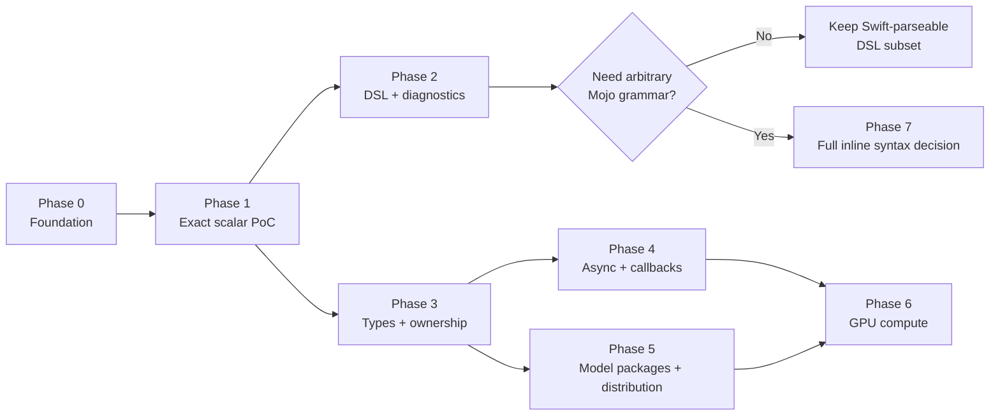
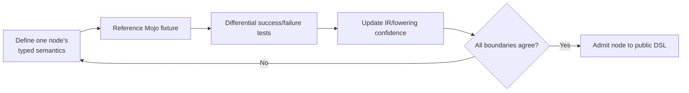
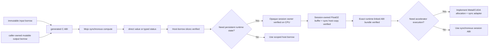
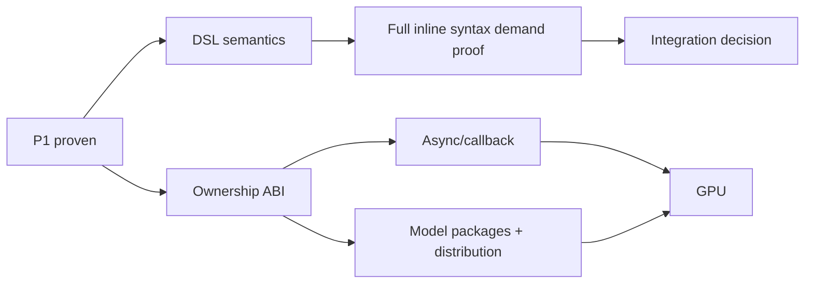

# Roadmap

## 1. Overview

各Phaseは独立した成果物とverification gateを持ちます。構文の見た目ではなく、実際のcompiler、artifact、link、runtime、failure behaviorが閉じた時点で完了とします。

| Phase | Outcome | Status |
|---|---|---|
| 0 — Foundation | 要件、責務境界、package skeleton | Complete |
| 1 — Exact-syntax scalar PoC | direct `@mojo func ... { return ... }` から実Mojo静的実行 | Complete for the macOS scalar contract |
| 2 — DSL and diagnostics | scalar DSL拡張、source-located diagnostics、inspection | Inspection verified; real diagnostic mapping and DSL expansion planned |
| 3 — Types and ownership | buffers、strings、records、error envelope | Immutable/mutable borrows、opaque session、session-owned Float32 buffer verified through real local runtime; the session/resource path also passed separate Swift/Mojo ASan lanes; Metal/CUDA execution、allocation/copy、standalone-buffer sanitizer gates remain |
| 4 — Async and callbacks | cancellation、completion、shutdown、reverse bridge | Research/Planned |
| 5 — Model packages and distribution | external Mojo packages、multiple slices/targets、remote artifacts、CI matrix | External package、universal slices、clean consumer、and two-target linking verified; model/distribution work remains |
| 6 — GPU compute | device/buffer/event/transfer contracts | Runtime receipt、exact worker bundle、and callable ABI library bundle implemented; real Mojo device kernel/session remains Research |
| 7 — Full inline Mojo syntax decision | custom input/preprocessor/compiler integration | Research |



## 2. Phase 0 — Foundation

**Estimate:** 1–2 days

**Status:** Complete

Deliverables:

- Swift Package、macro、runtime/tooling責務の初期分離。
- requirements、design、philosophy、roadmap。
- fake successを作らないerror contract。
- local Swift/Xcode/Mojo capabilityの記録。

Phase 0で作った旧dynamic PoCは、Phase 1の理想的な静的経路と競合したため最終構成には残していません。初期repositoryでありrelease済み互換性がないため、壊れたdeprecated APIとして温存しませんでした。

## 3. Phase 1 — Exact-syntax scalar PoC

**Estimate:** 1–2 weeks

**Status:** Verified locally for the current macOS `(Int32, Int32) -> Int32` contract across the Swift 6.3.1/6.4 compiler-free matrix and real Mojo 1.0 execution; immutable-revision acceptance on the candidate commit remains

Target usage:

```swift
@mojo
func add(_ a: Int32, _ b: Int32) -> Int32 {
    return a + b
}
```

### G1 — Shared semantic IR

**Artifact:** `MojoBindingCore`

**Status:** Verified

- SwiftSyntaxからP1 signature/bodyを解析。
- allowlisted operationだけをIRへ格納。
- full ABI/implementation/source graph digestとruntime IDを生成。
- formatting不変、implementation変更、unsupported expression、duplicate/no bindingを検証。

### G2 — Exact body macro

**Artifact:** inline/external `@mojo` + `MojoBodyMacro`

**Depends on:** G1

**Status:** Verified

- 元bodyをcanonical binding IDを使うSwift thunkへ置換。
- unknown macro argument、unsupported declaration/bodyを拒否。
- macro内でfile/process I/Oを行わない。

### G3 — Deterministic Mojo source generation

**Artifact:** `MojoStaticSourceRenderer`

**Depends on:** G1

**Status:** Verified

- fixed ABI version/source graph/membership/dispatcher exportsを生成。
- IR operationからMojo expressionを生成し、foreign textをpassthroughしない。
- C headerとmodule mapを固定化。
- Swift thunkはchecked `Int32` overflowをdispatcher前に拒否。
- P1 source scannerはconditional compilation内のbindingを拒否。

### G4 — Real static artifact preparation

**Artifact:** `swift package --disable-sandbox --allow-writing-to-package-directory mojo prepare`、object、archive、Apple XCFramework、Linux static-library artifact bundle

**Depends on:** G3

**Status:** Verified

- Mojo 1.0 `--emit object` を実行。
- explicit target triple/CPU。
- schema 5 manifest、target identity、canonical generated Mojo/source map digests、generation pipeline identity、adapter-specific artifact records/tree digests。
- output-scoped interprocess lock、typed lease、versioned marker、staging、backup/restore transaction。
- complete cache matchでmtimeを変えず再利用。
- subprocessはdedicated process group、deadline、TERM/KILL/reapを持つ。

### G5 — Artifact verifier

**Artifact:** `swift-mojo verify` + generated static Registry

**Depends on:** G1、G4

**Status:** Verified

- schema、ABI、compiler metadata、target、source graph、bindingsを照合。
- 全XCFramework/artifact-bundle regular fileのcanonical digestを照合。
- stale source、wrong target、corrupt archive/header、missing artifact/manifestを拒否。

### G6 — SwiftPM/Xcode build integration

**Artifact:** `MojoBuildPlugin`

**Depends on:** G2、G5

**Status:** Verified

- pluginはsource-built executableを使う通常build commandとしてverifyを実行。
- Swift sources、manifest、全native artifact rootと全descendant file/directoryをrequired inputsへ登録。
- Registryだけをplugin work directoryへ生成。
- successful fixture returns `42`; wrong target/stale/missing state stops build。
- warm buildでheader/archiveを直接改変してもverifierを再実行。

`prebuildCommand` はsourceからbuildしたexecutableをSwiftPMが拒否することを実証したため採用していません。

### G7 — Developer setup and repository workflow

**Artifact:** package-layout CLI、safe `init`、committed example

**Depends on:** G4、G6

**Status:** Implemented; latest custom-layout acceptance execution pending

- Command/Build PluginがSwiftPM-resolved source inventoryを所有し、`path:` / `sources:` / `exclude:` を全commandで一致させる。
- `Package.swift` とplugin-resolved target sourceを検証し、core独自の `Sources/<Target>` scanを持たない。
- bootstrap binary targetを生成。
- `init` 再実行でprepared artifactを保持。
- unmanaged/incomplete directoryを拒否。
- fresh cloneのSwiftPM graphを成立させるため `Generated/<Target>` をcommit対象化。

### G8 — End-to-end baseline proof

**Artifact:** acceptance evidence and executable

**Depends on:** G1–G7

**Status:** Verified on the current schema-5 mixed Apple/Linux tree for the macOS destination; native Linux execution remains a separate gate

- real Mojo `1.0.0 (ed45d567)` compile。
- Xcode build + plugin + macro + static link。
- `add(20, 22) == 42`。
- final Mach-Oに4つのfixed ABI symbols。
- Mojo dylib dependencyなし。
- real external Mojo package import、prepare、release、static execution。
- arm64 `generic` とx86_64 `x86-64` objectを1つのtarget-scoped universal static frameworkへ統合。
- release packageから別directoryへ移設したclean consumerがMojo compilerなしでbuild/link/runし `42`。
- final consumer Mach-Oにtarget-scoped ABI symbolsが4つ存在し、Mojo dylib dependencyなし。
- full package suiteとfocused unit/integration suiteをbounded `xcodebuild test` で各3回実行。test宣言数は進捗指標にせず、behavior gateを正本とする。

### G9 — Correctness and developer-experience hardening

**Artifact:** checked semantics、generation identity、incremental leaf tracking、interprocess transaction、bounded process owner、real-Mojo acceptance test

**Depends on:** G1–G8

**Status:** The compiler-free package suite passed from clean DerivedData on Swift 6.3.1 and the pinned Swift 6.4 snapshot, each with three guarded runs. Mutable-buffer/session/dual-ASan real-Mojo local acceptance and immutable-revision universal release acceptance passed. Every release candidate must repeat hosted compiler and immutable-revision gates on the final commit.

- checked `Int32` overflowとconditional compilation rejection。
- generation component versionsを合成したpipeline digestでcacheとverifyをinvalidate。
- 全native artifact内部のfile overwriteとdirectory entry変更をbuild graphへ反映。
- cache readからcommitまでをinterprocess lockで直列化。
- compiler/build subprocessをprocess group単位でtimeout、terminate、kill、reap。
- normal suite内のcommitted schema-5 mixed-artifact integration targetがplugin、macro、Apple static link、`42`をcompiler-freeに毎回検証。
- `scripts/release-acceptance.sh` がreal Mojo external package、2-slice packaging、release gate、relocation、static symbols、no-dylib、`42`を独立して検証。
- scalar/bufferの両方が同じimmutable Registry validation cacheを使い、steady-stateでABI/graph/membership C callを繰り返さない。
- caller-owned mutable-output familyはnested scoped borrowと`Int32` statusを使い、nonzero/empty failuresをtyped errorとして保持する。
- normal CIはstable/snapshotのcompiler-free matrix、real Mojoはscheduled/manual acceptance、performanceはmanual benchmark workflowへ分離する。

最新checkoutではSwift 6.3.1とpinned Swift 6.4 snapshotのfresh `xcodebuild build-for-testing`、各3回のbounded full suite、real Mojo 1.0 mutable-buffer/session acceptance、およびsession/resource経路のSwift/Mojo Address Sanitizerを実行済みです。release candidateはhost-tool link isolation、stable Swift 6.3.3、pinned Swift 6.4、immutable remote revisionのuniversal release/multi-target acceptance、version gate、tag gateを同じ最終commitから通過した場合だけreleaseになります。benchmarkはcorrectness gateではなく、明示依頼時だけ別workflowで実行します。既存commitの過去evidenceを最新変更のpassとして流用しません。

通常suite、artifact mutation、concurrent output access、bounded process ownership、real Mojo release acceptanceを実行済みです。nested fresh consumer内でSwiftSyntaxを毎回cold compileしていた旧integration testは、製品経路ではなく依存再構築が100秒を超えたため廃止しました。現在は通常package graph内のintegration fixtureと独立release acceptanceへ責務を分離しています。

Historicalなcold Release buildはSwiftSyntaxのhost-side compileがボトルネックとなり、2回の120秒制限内には完了しませんでした。後の明示的なfresh-scratch benchmarkは165秒で完了しましたが、これはcorrectness gateではありません。cold buildは `Benchmarks/ColdConsumerBuild` だけで計測し、developer-experience上の改善対象として通常testとrelease acceptanceから分離します。

## 4. Phase 2 — DSL expansion and diagnostics

**Estimate:** 3–6 weeks

**Depends on:** Phase 1

Candidate semantics:

- numeric literals and more arithmetic operators。
- immutable local bindings。
- comparison and explicit conditional expressions/statements。
- bounded loops with statically understood ownership。
- generated Mojo inspection command（implemented and executed）。
- Mojo compiler diagnosticからSwiftSyntax rangeへのsource map（line mapping implemented、real diagnostic acceptance pending）。

Verification loop:



1 loopは0.5–2日を想定します。accepted nodeのsuccess、overflow/edge、unsupported composition、diagnostic rangeが一致したときだけ収束です。時間上限だけでcompleteにはしません。

## 5. Phase 3 — Types, ownership, and errors

**Estimate:** 4–8 weeks

**Depends on:** Phase 1 ABI/artifact pipeline. It can progress in parallel with Phase 2 because external Mojo packages do not require inline DSL expansion.

**Status:** `([Float]) throws -> Float`、caller-owned mutable output、synchronous opaque session、and session-owned Float32-buffer create/synchronous host copy/shutdown are immutable-revision release-acceptance verified across IR、macro、generated Mojo/C ABI、Registry、real Mojo 1.0 universal macOS compile、static link、runtime behavior、typed failures、and Mach-O inspection. The owner model includes typed capability negotiation、exact transfer count、factory-domain isolation、one session/resource lease、active-child exclusion、and exactly-once child-before-parent destruction. The session/resource/host-transfer path also passes separate Swift-side and Mojo-side Address Sanitizer lanes. Schema-5 Linux ARM64 cross packaging is verified, while native Jetson execution、MAX-backed Metal/CUDA allocation/synchronization、allocation/copy measurement、and standalone borrowed-buffer sanitizer coverage remain pending.

Deliverables:

- fixed-width scalar matrix。
- borrowed contiguous `Float` input（first slice real-runtime verified; allocation/copy and sanitizer gates pending）。
- caller-owned mutable contiguous `Float` output（universal immutable-release verified; allocation/copy and standalone-buffer sanitizer gates pending）。
- generic borrowed/owned contiguous buffers。
- UTF-8 string views。
- versioned records。
- signature familyごとに、direct value returnまたは明示的なowned diagnostic error envelopeを設計。
- synchronous opaque owner/lease/shutdown APIとexactly-once deallocation（CPU reference verified）。
- session-owned Float32 buffer factory/owner/synchronous host-copy/synchronize/shutdown API（host real-runtime and separate Swift/Mojo Address Sanitizer lanes verified; device/pinned-host capability representation implemented）。
- Metal/CUDA buffer allocation、view、transfer、synchronization execution（pending）。

Verification:

- safe reference implementationとのdifferential tests。
- bounds、alignment、overflow、aliasing、deallocation failure tests。
- allocation/copy countとperformance budget。
- Address Sanitizer等、対象環境で利用できるsanitizer。

Completed host-borrow, session, and owned-buffer lifecycle slices, with the remaining device-execution boundary:



The immutable-input functional slice is release-runtime verified. The mutable-output slice is local-runtime verified with mutation, status `7`, distinct empty failures, four bridge symbols, and no Mojo dynamic dependency. The session/resource slice is local-runtime verified with session and host-buffer create/copy/use/shutdown, post-create cleanup, exact-count and copy/synchronization-status failures, capability/schema/status/missing-handle/active-resource failures, concurrent/reentrant busy behavior, ten bridge symbols, no Mojo/KGEN dynamic dependency, and separate Swift/Mojo Address Sanitizer execution. The runtime-linked ABI bundle now proves exact exports、closure、relative loading、relocation、tamper rejection、and one real C function invocation without ambient loader paths. It is not yet produced from the real Mojo session graph and does not establish Metal/CUDA allocation、kernel dispatch、DMA、device synchronization、GPU availability、or async completion. A zero-copy claim remains blocked until copy/allocation counts are measured; standalone borrowed/mutable buffer families retain their own sanitizer gate.

## 6. Phase 4 — Async and callbacks

**Estimate:** 4–8 weeks

**Depends on:** Phase 3

Deliverables:

- async operation handle、completion、cancel、release。
- continuation single-resume state machine。
- shutdownを持つstream/callback owner。
- optional Mojo-to-Swift callbackとcontext lifetime。
- actor/Mutex isolation matrix。
- Swift export capabilityのtoolchain gate。

Verification:

- complete/cancel、shutdown/callback、owner release/reentry races。
- Thread Sanitizer where available。
- callback actor/executor hop behavior。
- Native/WASM/Embeddedで共有状態契約を弱めないcompile/runtime matrix。

## 7. Phase 5 — Mojo model packages and multi-target distribution

**Estimate:** 6–12 weeks

**Depends on:** source-graph work may start after Phase 2; complete distribution acceptance depends on Phase 3 and may run beside Phase 4 after ABI freeze

**Status:** scalar bridge、real external package、arm64/x86_64 universal packaging、build/release verification、compiler-free clean consumer、immutable remote revisionからのtwo-target link/runtimeはverified。remote binary distribution、model inferenceはpending

Deliverables:

- `SwiftMojo.json` にcompiler pin、Mojo packages、全required slicesを宣言（implemented）。
- `Mojo/<Package>/__init__.mojo` と全moduleを同じinput graphへ統合（implemented）。
- generated ABI entry moduleからMojo packageをimportし、declared bindingsをexport（implemented for scalar and borrowed `Float` signatures）。
- model-specific Swift APIとMojo sourceとartifactを結ぶcompatibility manifest。
- multiple Mojo-enabled targets向けtarget-derived static framework/module/archive/C symbol identityとtwo-target acceptance workflow（verified）。
- arm64/x86_64 Apple and aarch64 Linux slice-aware schema-5 manifest、universal archive、XCFramework/artifact-bundle metadata gates（verified）。
- Apple XCFramework adapterとLinux SE-0482 static-library artifact-bundle adapterの分離（cross packaging verified; native Jetson pending）。
- release/cache identity including target accelerator（implemented; arbitrary target feature setはplanned）。
- remote artifact bundle or package distribution workflow。
- signed/reproducible generated artifact policy。
- SwiftPM Command Plugin、doctor/inspect、text/JSON output、compiler version diagnostics（implemented）。
- read-only release gate for config/source/package/source-map/slice/interface/artifact/local-dependency consistency（implemented）。
- model weightsをcode artifactから分離するresolver/revision/digest contract。

Verification:

- real external Mojo packageを変更するとprepare cacheとconsumer verificationがinvalidateする。
- source package、Swift binding、manifest、native artifactのいずれかを単独改変するとbuildが失敗する。
- model authorはpinned Mojo compilerでprepareでき、clean consumerはMojo compilerなしでbuild/link/runできる。
- clean clone on every supported destination。
- universal archive and relocated executable tests。
- missing/wrong slice failure。
- artifact/source/compiler compatibility matrix。
- small deterministic model fixtureでload/inference successとwrong weight revision/digest failureを確認する。

## 8. Phase 6 — GPU compute

**Estimate:** 6–12+ weeks

**Depends on:** Phase 3; async portions depend on Phase 4; packaged model acceptance depends on Phase 5

Deliverables:

- backend/device/accelerator capability model。
- explicit host/device/shared buffer ownership。
- queue/stream/event dependency model。
- transfer observability。
- accelerator-aware artifact cache。
- CPU reference path for correctness comparison。
- receipt-bound executable worker bundle（implemented）。
- receipt-bound callable ABI library bundle with exact exports and relative loader root（implemented with relocation/tamper/invocation fixture; real Mojo device session pending）。

SwiftUI shader modifiers、view rendering、scene lifecycleはこのPhaseにも含みません。

## 9. Phase 7 — Full inline Mojo syntax decision

**Estimate:** 4–12 weeks for decision and prototype

**Trigger:** Real code requires Mojo grammar outside the Swift-parseable DSL

Prototype candidates:

1. `.swiftmojo` custom source producing derived Swift and Mojo。
2. Swift compiler driver preprocessing wrapper。
3. upstream Swift parser/compiler integration proposal。
4. compiler fork only if maintenance cost is justified。

Decision criteria:

- Xcode indexing、completion、source diagnostics。
- SwiftPM compatibility and distribution。
- one source of truth and incremental build behavior。
- Swift release追従cost。
- whether Phase 5 external Mojo model packages already satisfy full-language users。

Phase 5のexternal `.mojo` packageで十分なら、inlineはSwift-parseable DSLに限定します。arbitrary inline grammarのためだけにcompiler integration costを負いません。

## 10. Critical path and bottlenecks



主critical pathは `ownership ABI -> model package distribution -> GPU-capable model runtime` です。external Mojo packageを主surfaceにする限り、DSL expansionはownership ABIの前提ではなく並行laneです。最大のbottleneckは構文生成ではなく、ownership/error/device semanticsと、model packageでの実推論・remote distributionです。scalar compiler-free consumer artifactは実証済みで、borrowed `Float` sliceは最初の実装済みproof targetです。async/callbackとdistributionはownership ABIが安定した後に並行化できます。GPU Phaseは両方の成果を統合します。arbitrary inline syntax integrationは需要の立証前にcritical pathへ入れません。
