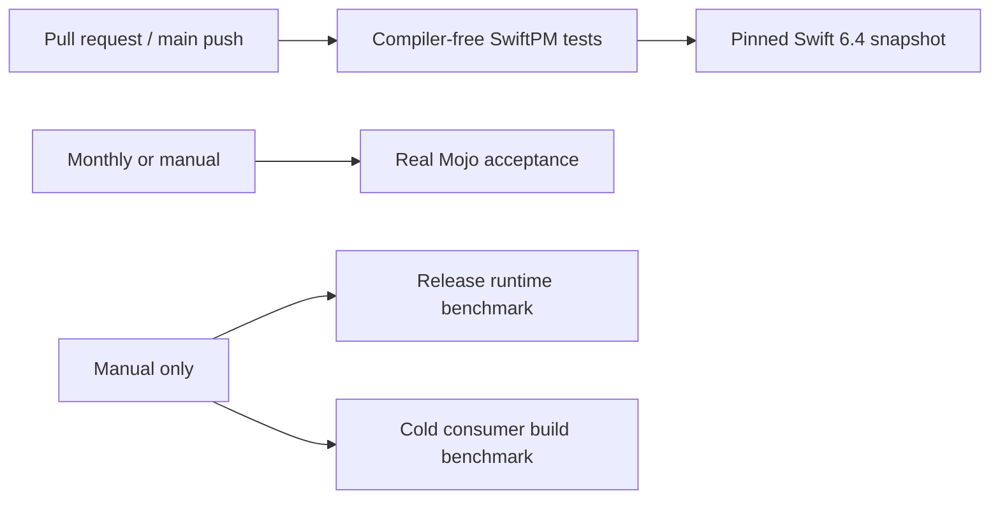

# Toolchain and CI contract

The minimum supported Swift version is **6.4**. Swift 6.3 and earlier are outside the supported surface.

## Supported development matrix

| Lane | Swift | Purpose | Release blocking |
|---|---|---|---:|
| Snapshot | `swift-6.4.x-DEVELOPMENT-SNAPSHOT-2026-09-04-a`, Xcode 27 host | Reproduce the repository's current development baseline | Yes |
| Real Mojo | Mojo version pinned per target in `SwiftMojo.json` | Compile, link, relocate, and execute prepared artifacts | Yes for a release; scheduled/manual rather than per pull request |
| Runtime benchmark | Same host/toolchain/compiler as the result record | Measure wrapper/direct-dispatcher p50 and p95 | No automatic threshold; explicit evidence review only |
| Cold-build benchmark | Explicitly selected consumer and host | Measure fresh-scratch consumer build time | Manual only; never a correctness gate |

The SwiftSyntax dependency uses the exact stable version `603.0.2`. CI also verifies that `Package.resolved` maps that version to the full Git object ID `79e4b74a295b6eb74a8b585e3a39d29e70c1dbd1`. A stable swift-mojo release cannot depend on a branch or Git revision because SwiftPM treats those requirements as unstable and rejects them from a stable-version dependency graph.

GitHub-hosted workflows pin `actions/checkout` to a full commit object ID and disable persisted checkout credentials because no workflow writes to the repository. Before installing Swiftly, compiler-free CI verifies that the downloaded package is notarized and signed by the Swift Open Source Developer ID Installer identity (`V9AUD2URP3`). The selected Swift compiler, Swift Testing runtime, and macro plugin still come from the exact matrix toolchain described above.

The generic-boundary guard scans production implementation files in `Sources`
and `Plugins`. Vendor names in acceptance fixtures, benchmark reports and design
references do not establish runtime policy and are outside this lexical guard.
Source scan errors fail the gate; the guard's positive/negative checks are in
`scripts/test-generic-boundary.sh`.

## CI ownership



The normal CI workflow does not install or execute Mojo and does not run performance measurements. It verifies committed generated artifacts through the public build plugin, macro, static link and correctness tests. The compiler lane uses SwiftPM's Swift Build engine, with the selected toolchain supplying the compiler, Swift Testing runtime and plugins together. Xcode 27.0 build 27A5252f remains the pinned SDK host on the `xcode-27` preview image.

Build and test execution are separate bounded steps. `scripts/test-public-package-boundary.sh` separately builds fresh external consumers, accepting the typed runtime products and rejecting all private POSIX declarations; each compiler command has a 300-second build deadline. This cold build is not charged to the 120-second runtime-test deadline. Test execution disables cross-test parallelism because the process/compiler fixtures share host CPU and process resources; tests still exercise their explicitly constructed concurrency. Public API compile checks consume the test-bundle path and Swift Build products supplied by SwiftPM. The test command and its compiler subprocesses inherit the same explicit `TOOLCHAINS` selection. Toolchain installation runs in the runner temporary directory so Swiftly selection does not modify the release checkout.

The previous Xcode test lane did not provide SwiftPM's test-bundle arguments and bypassed the artifact-discovery assumptions of external-consumer tests. Older Xcode/Swift Build graphs also leaked host macro objects into consumer link lists. The qualified SwiftPM/Swift Build graph owns the complete compiler and test path; compilation, linking and actual public calls remain release gates. The hosted lane targets macOS 15 but executes on the preview host, so it does not establish runtime behavior on macOS 15.

Real-Mojo acceptance runs on a repository-owned macOS runner labelled `self-hosted`, `macOS`, and `swift-mojo`. The runner must define the repository variable `SWIFT_MOJO_EXECUTABLE` as an absolute executable path. The workflow verifies the public command-plugin path, a custom SwiftPM source layout, full remote revision resolution, universal static packaging, immutable and mutable buffer execution, owned-session and owned-buffer creation/use/transfer/shutdown, typed copy and synchronization failure propagation, relocation, two target-scoped artifacts, absence of a Mojo dynamic dependency in the consumer, and separate Swift-side and Mojo-side Address Sanitizer lanes for the current-checkout session path.

The runtime benchmark workflow is `workflow_dispatch` only. Its result must be retained with the commit, host, Swift version, Mojo version, buffer size, sample count, warm-up count, calls per sample, and p50/p95 output. The cold-build harness is also explicit-only and records a fresh-scratch build of a selected compiler-free consumer. Neither benchmark is a unit test, release-acceptance step, or per-pull-request job.

## Local mutable-buffer development gate

The caller-owned mutable-output ABI has a bounded local acceptance that uses the current checkout through the public command plugin:

```bash
SWIFT_MOJO_EXECUTABLE=/absolute/path/to/mojo \
scripts/local-mutable-buffer-acceptance.sh
```

It compiles a real arm64 Mojo object, prepares and verifies the static artifact, builds a separate temporary Swift consumer, executes mutation and typed failure paths, and inspects the final Mach-O. It does not prove an immutable remote revision, the x86_64 slice, performance, sanitizers, native Linux, or device ownership. Those remain separate release and platform gates.

## Local owned-session development gate

The session gate prepares an arm64/x86_64 universal static artifact and executes the host slice through the public Swift API:

```bash
SWIFT_MOJO_EXECUTABLE=/absolute/path/to/mojo \
scripts/local-session-acceptance.sh
```

It covers capability negotiation, session-domain validation, repeated use, owned host-buffer round-trip transfer, exact-count validation, nonzero create/use/copy/synchronize status, invalid response schema, child-before-parent destruction, explicit and repeated shutdown, use after shutdown, static linking, and absence of a Mojo dynamic dependency. The normal compiler-free tests cover deterministic concurrent-borrow/shutdown behavior and deinit fallback. The same script provides two explicit sanitizer modes:

```bash
SWIFT_MOJO_EXECUTABLE=/absolute/path/to/mojo \
SWIFT_MOJO_SANITIZE=swift-address \
scripts/local-session-acceptance.sh

SWIFT_MOJO_EXECUTABLE=/absolute/path/to/mojo \
SWIFT_MOJO_SANITIZE=mojo-address \
scripts/local-session-acceptance.sh
```

`swift-address` instruments the Swift consumer with Apple's matching Swift toolchain runtime while keeping the normal Mojo object. `mojo-address` instruments the Mojo objects and links an upstream LLVM ASan dylib only after verifying the object's required `__asan_version_mismatch_check_*` symbol is exported by that runtime. The two compiler-runtime families are not mixed implicitly. These lanes do not claim accelerator execution, async, native Linux, or downstream product behavior, and they do not replace allocation/copy benchmarks for the standalone borrowed-buffer families.

## Updating the baseline

1. Select the exact Swift toolchains and an exact stable SwiftSyntax version compatible with every compiler lane.
2. Replace the root package version requirement and refresh `Package.resolved`. Record and verify both the semantic version and its full commit object ID.
3. Build test bundles with the exact Xcode host, `xcodebuild build-for-testing`, the selected `SWIFT_EXEC`, and that toolchain's matching Swift Testing module/library/plugin paths. Verify the generated link-file lists contain no `MojoMacros.o` or `swift-mojo.o` host executable product, then run both compiler-free matrix lanes with the same settings through `xcodebuild test-without-building` under the 120-second hang guard.
4. Run real-Mojo acceptance on the same committed and pushed revision.
5. Record any changed compiler or ABI assumptions in README, requirements, design, and the relevant ADR.

A declaration that parses, a package that resolves, or a compiler-free test pass does not alone prove the real Mojo path. Release readiness requires the separate real-compiler acceptance evidence from the same revision.
